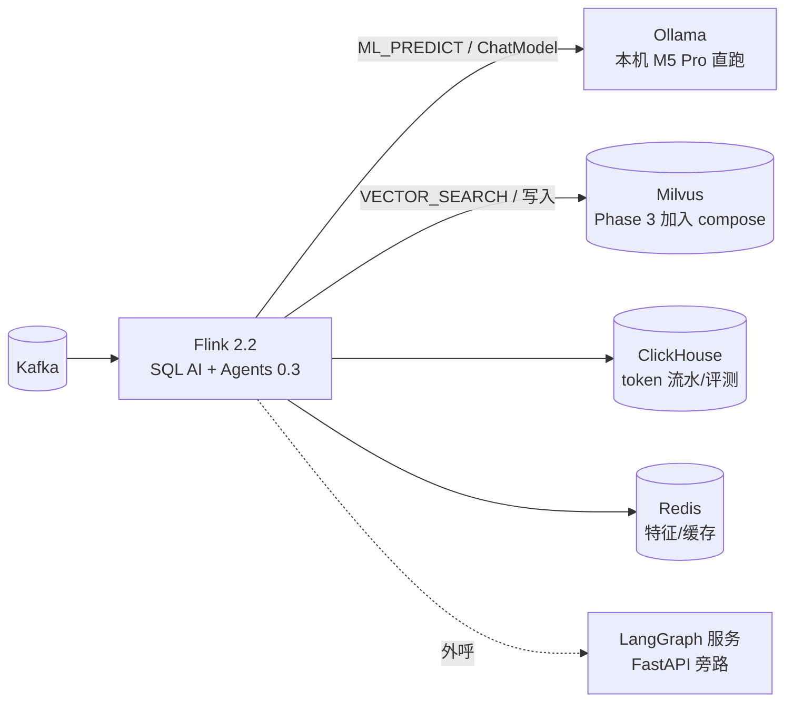

# 《Flink AI Engineering》· 事件驱动 AI 的工程学

> 本仓库的核心模块(Phase 3 主体)。全书 24 章,每章配可运行 Demo,统一跑在 docker/ 环境 + 本机 Ollama。
> 前置:Level 1–5;与 docs/05-08(SQL AI 函数)互为引用。

## 0. 全书论点(为什么 AI Agent 需要 Streaming)

当前主流 Agent 形态(Chatbot / Copilot / LangGraph 工作流)是**请求-响应式**的:人发起,Agent 响应,会话结束即休眠。但企业里最有价值的决策恰恰发生在**没有人提问的时刻**——支付失败、传感器异常、DTC 故障码上报、日志错误率陡增。要让 Agent 对这些事件"始终在线、毫秒响应、故障可恢复、动作不重不漏",需要的能力清单是:高吞吐事件摄入、事件时间语义、持久化状态、exactly-once、水平扩展——这正是 Flink 过去十年打磨的全部内核。**Streaming 不是 Agent 的加速器,而是 Agent 进入生产环境的前提条件。** 这也是 Apache 社区把 Flink Agents 立为官方子项目的根本逻辑(详见 docs/00-landscape)。

三条工程判据(全书反复使用的决策框架):

1. **触发源**是人还是事件?事件 → 进流。
2. **正确性**要求动作不重不漏吗?要 → 需要 checkpoint 语义包裹 LLM 调用与工具副作用。
3. **上下文**是会话级还是跨事件累积?累积 → 需要流式状态/记忆,而非请求内存。

## 1. 技术底座(2026-07 现状,来源见 docs/00-landscape)

| 层 | 能力 | 载体 | 成熟度 |
|---|---|---|---|
| SQL AI | `CREATE MODEL` / `ML_PREDICT`(流式 LLM 推理) | Flink 2.1+ | GA |
| SQL AI | `VECTOR_SEARCH`(流内向量检索) | Flink 2.2+ | GA |
| Agent 运行时 | 事件驱动 Agent、Action 级 exactly-once、三层记忆(Sensory/Short-Term/Long-Term+Mem0)、Agent Skills、YAML 声明式 API、跨语言 Action、Durable Execution Reconciler | Flink Agents 0.3 | **Preview**(0.4 后出 1.0) |
| 模型接入 | Ollama / OpenAI / Anthropic / Azure AI(Java 与 Python 双栈) | flink-agents-integrations-* | Preview |
| 记忆/向量 | Mem0、Elasticsearch、(本书补充:Milvus 直连方案) | Agents 集成 + 自建 | Preview/自建 |

**选型军规**:Preview 组件可进"内部平台/非核心链路",不进"资损链路";每章 Demo 都标注该能力的降级路径。

## 2. 全书目录(24 章,每章 = 教材 + Demo + 踩坑 + 面试题)

### 第 I 部 · 基础设施(为什么与是什么)

| 章 | 主题 | Demo(模块号) | 状态 |
|---|---|---|---|
| 01 | [为什么 AI Agent 需要 Streaming](./chapters/01-why-streaming.md) | [e12-01](../examples/e12-01-polling-vs-event/README.md) 轮询 vs 事件驱动延迟对照 | ✅ |
| 02 | [Streaming Event Bus:Agent 的神经系统](./chapters/02-event-bus.md) | [e12-02](../examples/e12-02-event-bus/README.md) | ✅ |
| 03 | [Streaming Inference:ML_PREDICT 深解](./chapters/03-streaming-inference.md) | [e12-03](../examples/e12-03-streaming-inference/README.md) SQL 脚本(Ollama qwen3:8b) | ✅ |
| 04 | [Streaming Embedding 与 Vector](./chapters/04-streaming-embedding-vector.md) | [e12-04](../examples/e12-04-streaming-inference-vector/README.md) SQL 脚本(Milvus) | ✅ |
| 05 | [Streaming RAG:新鲜度敏感检索管线](./chapters/05-streaming-rag.md) | e12-04/sql/05-retraction.sql(共享 e12-04 管道) | ✅ |
| 06 | [Streaming Feature:实时特征工程](./chapters/06-streaming-feature.md) | [e12-06](../examples/e12-06-streaming-feature/README.md) | ✅ |

### 第 II 部 · Agent 运行时(Flink Agents 精讲)

| 章 | 主题 | Demo | 状态 |
|---|---|---|---|
| 07 | [Streaming Agent 第一课:架构与 Java 上手](./chapters/07-agent-quickstart.md) | [e12-07](../examples/e12-07-agent-quickstart/README.md)(standalone·Preview) | ✅ |
| 08 | [Streaming Memory:三层记忆模型](./chapters/08-streaming-memory.md) | [e12-08](../examples/e12-08-streaming-memory/README.md)(standalone·Preview) | ✅ |
| 09 | [Streaming Tool Call:Durable Execution 与 Reconciler](./chapters/09-streaming-tool-call.md) | 代码示意(降级=幂等键,见章内说明) | ✅ |
| 10 | [Streaming MCP:事件驱动场景接入](./chapters/10-streaming-mcp.md) | 代码示意(无独立 Demo 理由见章内第 5 节) | ✅ |
| 11 | [Streaming Workflow:编排边界](./chapters/11-streaming-workflow.md) | YAML/代码示意 | ✅ |
| 12 | [Streaming Multi-Agent:协作拓扑](./chapters/12-streaming-multi-agent.md) | 架构模式(第 7 章骨架的多实例组合) | ✅ |
| 13 | [Flink × LangGraph:何时外呼](./chapters/13-flink-langgraph.md) | 调用骨架(复用 e11 + 用户既有 FastAPI/LangGraph 经验) | ✅ |
| 14 | [Streaming Knowledge / Graph](./chapters/14-streaming-knowledge-graph.md) | 方法论(组合 03/04/e07 已验证组件) | ✅ |

### 第 III 部 · 生产化(可观测、成本、质量)

| 章 | 主题 | Demo | 状态 |
|---|---|---|---|
| 15 | [Streaming Observability](./chapters/15-streaming-observability.md) | [e12-15](../examples/e12-15-observability/README.md) | ✅ |
| 16 | [Streaming Trace:全链路追踪](./chapters/16-streaming-trace.md) | 代码骨架(依赖企业既有 APM/OTel 体系) | ✅ |
| 17 | [Streaming Guardrail:流式护栏](./chapters/17-streaming-guardrail.md) | [e12-17](../examples/e12-17-streaming-guardrail/README.md) | ✅ |
| 18 | [Streaming Cost Control 与 Token Usage](./chapters/18-streaming-cost-control.md) | [e12-18](../examples/e12-18-streaming-cost-control/README.md) | ✅ |
| 19 | [Streaming AI Gateway 与 Model Routing](./chapters/19-streaming-ai-gateway.md) | 架构模式(对应用户 AITS 自建网关) | ✅ |
| 20 | [Streaming Embedding Cache:语义缓存](./chapters/20-streaming-embedding-cache.md) | 代码骨架(e11-C3 两级缓存扩展) | ✅ |
| 21 | [Streaming Evaluation 与 Feedback](./chapters/21-streaming-evaluation.md) | 方法论(组合 e05-C5/e02/e07 已验证组件) | ✅ |
| 22 | [Streaming Prompt:版本化与灰度](./chapters/22-streaming-prompt.md) | [e12-22](../examples/e12-22-streaming-prompt/README.md) | ✅ |
| 23 | [Streaming Online Learning 与数据管线](./chapters/23-streaming-online-learning.md) | 方法论(Flink×Ray 分工,docs/11-02 具体化) | ✅ |
| 24 | [架构收官:参考架构](./chapters/24-reference-architecture.md) | 全景 Mermaid + AIDO/AITS 映射表 + 四阶段落地路线 | ✅ |

### 参考实现底座(每章共用)

**Apple Silicon 说明**:LLM 推理全部走宿主机 Ollama(`http://host.docker.internal:11434`,OrbStack 原生支持该域名),48GB 内存建议 qwen 系 7B~14B 量化模型;Milvus 官方镜像支持 arm64,Phase 3 起加入 compose(独立 profile,按需启动)。

## 3. 交付状态(Phase 3 · v0.4.0)

- ✅ 24 章全部成文(chapters/ 目录,含每章八段式:问题/架构/代码/踩坑/最佳实践/面试题/参考)
- ✅ 零依赖 Demo × 7(e12-01/02/06/15/17/18/22,进主 Maven 构建,本地 `mvn -Plocal` 可直接跑)
- ✅ SQL 脚本 Demo × 2(e12-03/04,需本机 Ollama + Milvus profile,每份脚本均注明版本演进风险与降级路径)
- ✅ Agents Preview Demo × 2(e12-07/08,**standalone 独立 pom 不进主构建**,隔离 Preview 依赖风险)
- ✅ 第 24 章参考架构(全景 Mermaid、AIDO/AITS 映射表、可摘录的企业汇报论点、四阶段落地路线)

**沙箱限制声明**(接力协议约定的诚实边界):e12-07/08 的 Agents 依赖未做编译验证(沙箱无 Maven Central);e12-03/04 的 Ollama/Milvus 端到端链路未在沙箱内跑通(无法起容器/模型服务)。以上均已在对应 README 给出首次运行核对清单与降级路径;7 个零依赖 Demo 与全部章节内容不受影响。
