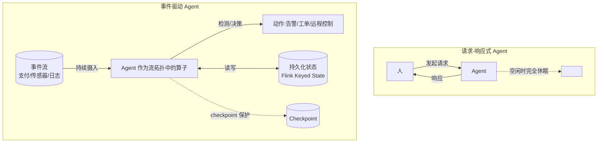

# 第 01 章 · 为什么 AI Agent 需要 Streaming

> Demo:e12-01(轮询式 vs 事件驱动的异常响应延迟对照实验,纯 DataStream,无外部依赖)· Level:L1

## 1. 问题:两种 Agent,两种世界观

今天几乎所有人接触的 AI Agent(ChatGPT、Copilot、各类 LangGraph 工作流)都是**请求-响应式**的:人发起一个请求,Agent 处理,给出响应,然后**休眠**。这个模型的隐含假设是"世界在等待被问"。但企业里真正高价值的决策,恰恰发生在**没有人提问的时刻**:

- 一笔支付在凌晨 3 点突然失败,没有人在盯着这个订单;
- 一个传感器读数在过去 10 秒内偏离基线 5 个标准差;
- 一条 DTC 故障码在车辆行驶中被上报;
- 日志错误率在过去 1 分钟内从 0.1% 陡增到 8%。

这些事件**不会等你去问**。要让 Agent 对它们"始终在线、毫秒级响应、故障可恢复、动作不重不漏",需要的能力清单是:高吞吐事件摄入、事件时间语义、持久化状态、exactly-once、水平扩展——这正是 Flink 过去十年打磨的全部内核。**结论:Streaming 不是 Agent 的性能加速器,而是 Agent 进入生产环境的前提条件。**

## 2. 架构对比



两者不是竞争关系:面向人的交互式场景(客服、Copilot)天然是请求-响应式,继续用 LangGraph/Chatbot 框架即可(ai/13 详解何时该外呼这类服务)。本书聚焦的是**事件驱动**这一半,这一半恰恰是过去 AI Agent 生态里被忽视、但企业价值最大的部分。

## 3. 三条工程判据(全书反复使用)

写任何一个"要不要上 Agent"的方案前,先回答这三个问题:

1. **触发源是人还是事件?** 事件 → 进流(本书方法论适用);人 → 走交互式框架。
2. **正确性要求动作不重不漏吗?** 要 → 需要 checkpoint 语义包裹 LLM 调用与工具副作用(ai/09 的 Durable Execution)。
3. **上下文是会话级还是跨事件累积?** 累积(如"这个用户过去 24 小时的行为模式")→ 需要流式状态/记忆(ai/08),而不是请求内存(聊天窗口的上下文长度)。

## 4. Demo:轮询 vs 事件驱动的延迟对照(e12-01)

**设计**:同一个"异常检测"需求,分别用①轮询式(每 N 秒批量查一次数据库,发现异常)②事件驱动式(数据一到即触发)实现,注入同一批异常事件,测量"异常发生"到"被检测到"的延迟分布。

**预期结果**:轮询式延迟均匀分布在 `[0, 轮询间隔]`(平均延迟=轮询间隔/2,最坏情况=整个间隔);事件驱动式延迟恒为个位数毫秒(仅算子处理耗时)。轮询间隔调得越短(如 1 秒)去逼近实时性,系统负载(重复全表扫描)越高——这是轮询模型的根本局限:**延迟与负载在轮询模型里是负相关的两难,而在事件驱动模型里两者解耦**。

```java
// e12-01 核心对比逻辑示意(完整代码见 examples/e12-01-polling-vs-event/)
// 轮询分支:定时器周期性拉取"自上次以来的新数据"并批量判断
env.addSource(new PollingSimulatorSource(intervalMs))
   .keyBy(e -> e.deviceId)
   .process(new BatchThresholdCheck())   // 每次触发时全量检查窗口内数据
   .name("polling-branch");

// 事件驱动分支:数据到达即判断,无额外延迟
env.fromSource(eventSource, watermarkStrategy, "events")
   .keyBy(e -> e.deviceId)
   .process(new ImmediateThresholdCheck())  // 每条数据来即检查
   .name("event-driven-branch");

// 两分支共享同一批注入的异常事件,分别记录 (异常发生时间, 检测到时间) 供延迟分布统计
```

## 5. 踩坑与常见误解

| 误解 | 纠正 |
|---|---|
| "轮询间隔调到 100ms 不就等于实时了" | 100ms 轮询意味着每 100ms 做一次全量/增量扫描,数据量增长后扫描本身的耗时会超过间隔,系统会自己把自己拖垮 |
| "事件驱动就是用了 Kafka" | Kafka 只是事件总线;真正的"事件驱动"要求处理逻辑本身是增量、有状态、按事件触发的(这正是 Flink 的核心能力),仅仅把轮询目标从数据库换成 Kafka topic 而不改处理模型,收益有限 |
| "Agent 加上 Streaming 就自动获得 exactly-once" | Streaming 引擎提供的是"计算状态"的 exactly-once;LLM 调用与外部动作(发短信、下工单)的 exactly-once 需要额外设计(ai/09 Durable Execution) |

## 6. 最佳实践

- 任何"是否需要引入流处理"的讨论,先用本章三条判据过一遍,避免"为了用新技术而用新技术"。
- 异常检测类需求的方案评审,要求提交方给出"轮询间隔 vs 检测延迟 vs 系统负载"的定量分析,而不是直觉判断。

## 7. 面试题

① 举一个"看起来是 Agent 需求,实际上应该走请求-响应式"的反例。② 事件驱动架构下,如何保证"没有遗漏检测"(提示:watermark 与迟到数据处理,docs/02)?③ 为什么说"上下文累积"是流式状态而非聊天窗口能解决的问题?

## 8. 参考资料

Apache Flink Agents 0.3.0 Release Announcement(事件驱动 Agent 定位陈述):https://flink.apache.org/2026/06/19/apache-flink-agents-0.3.0-release-announcement/;docs/00-landscape(AI 三层能力栈)。
