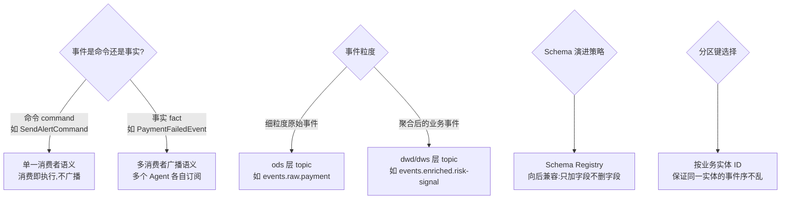
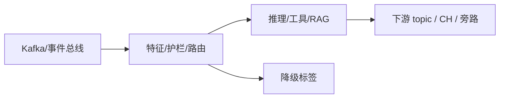

# 第 02 章 · Streaming Event Bus:Agent 的神经系统

> Demo:e12-02(Kafka 主题设计 + 事件 Schema 治理,纯 DataStream/SQL,无外部依赖)· Level:L1

## 1. 问题:Agent 之间如何"神经传导"

一个成熟的事件驱动 AI 平台里,事件不是只流向一个 Agent,而是在多个 Agent、多个下游系统之间广播、路由、聚合。这条"神经系统"设计得好坏,直接决定平台能否演进(新增一个 Agent 消费某类事件不应牵动全局)、能否追溯(出问题时能否重放事件序列复现现场)、能否治理(Schema 变更不搞崩下游)。

## 2. 主题设计的四个决策



**命令 vs 事实**是最容易被忽视的一条:命令类事件("请发送这条告警")语义上只应被处理一次,事实类事件(“支付失败了”)天然允许多个 Agent 各自订阅、各自决策。把两者混在同一个 topic 里,会导致"到底该谁处理这条消息"的责任不清。

## 3. 事件契约(Event Contract)设计

每个事件类型应固化一份契约,包含:事件类型名、版本号、schema(字段+类型+是否可空)、分区键字段、产生该事件的系统、消费该事件的已知 Agent 清单。这份契约本质上是 02-02 讲的 04 章"Runtime 序列化"红线(POJO/Avro 可演进,禁 Kryo)在事件总线层面的延伸——**事件契约就是分布式系统里的 API 契约**,理应像 REST API 一样有版本治理流程。

```java
// e12-02 事件契约示例:版本化的车联网信号事件
public class VehicleSignalEventV1 {
    public String vin;            // 分区键
    public String signalType;     // ENUM 语义,但传输用 String 便于演进
    public double value;
    public long eventTimeMs;
    public String schemaVersion = "v1";   // 契约显式携带版本,消费方按版本分支处理
}
```

## 4. Demo:主题设计与消费者组隔离(e12-02)

演示三个 topic(`events.raw.vehicle-signal` 原始信号、`events.enriched.risk-signal` 富化后的风险信号、`commands.alert.dispatch` 告警下发命令)之间的生产消费关系,以及**消费者组隔离**的实践:同一个事实类 topic 被两个独立消费者组(风控 Agent、监控大屏)各自完整消费一遍,互不影响进度——这是 Kafka 消费者组模型的核心价值,也是"事实广播"语义在基础设施层面的实现方式。

```java
// 两个独立消费者组各自订阅同一 topic,分别用于风控决策与监控大屏
// group.id 不同即互不干扰进度,这是"广播语义"的物理实现
KafkaSource<String> riskConsumer = KafkaSource.<String>builder()
        .setTopics("events.enriched.risk-signal")
        .setGroupId("agent-risk-control")      // 独立消费者组 1
        .build();
KafkaSource<String> dashboardConsumer = KafkaSource.<String>builder()
        .setTopics("events.enriched.risk-signal")
        .setGroupId("dashboard-aggregator")    // 独立消费者组 2
        .build();
```

## 5. 踩坑

| 坑 | 现象 | 解法 |
|---|---|---|
| 事件类型不携带版本 | 新增字段后老消费者反序列化失败或语义误读 | 契约固化 schemaVersion 字段,消费方显式按版本分支 |
| 命令类事件被多消费者组重复消费 | 同一条告警被发送多次 | 命令类事件用单一消费者组(不广播),或引入去重层 |
| 分区键选错(如用时间戳分区) | 同一实体的事件散落多分区,顺序保证失效 | 分区键固定为业务实体 ID(VIN/用户 ID/订单 ID) |

## 6. 最佳实践

- 事件契约进独立仓库或独立目录版本化管理,变更走 PR 评审(类比 API 契约的 OpenAPI 治理)。
- 新增 Agent 订阅现有事实类事件时,不需要通知上游生产者——这是"广播语义"应该带来的解耦收益,若做不到说明设计有问题。

## 7. 面试题

① 命令类与事实类事件在消费语义上的本质差异?② Schema Registry 的"向后兼容"具体指什么操作允许、什么操作禁止?③ 分区键选择错误会在什么场景下才暴露出问题(提示:与 02 章 watermark/顺序性的关系)?

## 8. 参考资料

docs/01-06(序列化与 schema 演进);docs/07-01(Kafka 语义矩阵);Confluent Schema Registry 兼容性文档(向后/向前/完全兼容三种模式的通用行业实践)。

---

## Wave 2 扩写 · 02-event-bus

### 背景加固

本章对应 AI 学习路径中的「02-event-bus」。流式 AI 工程的约束与批式离线不同：延迟预算、成本封顶、降级路径、可观测追踪必须在作业图内一等公民对待。本仓库 e12 系列用零依赖 DataStream 演示机制；p01 提供可降级生产路径。

### 架构对照



控制面：预算、熔断、开关（Broadcast/侧输出）。数据面：embedding、提示、工具调用结果。
降级决策树：外部依赖超时 → 规则路径；成本超软顶 → 降采样；护栏命中 → 旁路。

### 与仓库 Demo 对照

- 优先查找 `examples/e12-02-*/README.md` 与同模块第二 Job；若编号为独立成册章节，见 `ai/README.md` 映射表。
- 生产对照：`projects/p01-log-ai-platform/`（AI off 默认可跑）。
- 规范：`best-practice/08-ai-degrade.md`。

### 踩坑实证

1. 坑 1：把同步外呼放在 map 线程；或无预算的工具调用；或无 trace 无法定位延迟。实证方向：用 e11/e12 作业制造超时，观察旁路与指标。

2. 坑 2：把同步外呼放在 map 线程；或无预算的工具调用；或无 trace 无法定位延迟。实证方向：用 e11/e12 作业制造超时，观察旁路与指标。

3. 坑 3：把同步外呼放在 map 线程；或无预算的工具调用；或无 trace 无法定位延迟。实证方向：用 e11/e12 作业制造超时，观察旁路与指标。

4. 坑 4：把同步外呼放在 map 线程；或无预算的工具调用；或无 trace 无法定位延迟。实证方向：用 e11/e12 作业制造超时，观察旁路与指标。

5. 坑 5：把同步外呼放在 map 线程；或无预算的工具调用；或无 trace 无法定位延迟。实证方向：用 e11/e12 作业制造超时，观察旁路与指标。

6. 坑 6：把同步外呼放在 map 线程；或无预算的工具调用；或无 trace 无法定位延迟。实证方向：用 e11/e12 作业制造超时，观察旁路与指标。

7. 坑 7：把同步外呼放在 map 线程；或无预算的工具调用；或无 trace 无法定位延迟。实证方向：用 e11/e12 作业制造超时，观察旁路与指标。

### 降级决策树

1. 依赖健康？否 → 规则/缓存路径。
2. 成本软顶？超 → 降采样/关昂贵模型。
3. 护栏分数？拒 → side output。
4. 全部通过 → 主输出。

### 验证步骤

1. 启动对应 e12 作业；注入正常/超时/超预算流量；检查主流与旁路；确认无违禁词文档；记录到个人 baseline 笔记。

2. 启动对应 e12 作业；注入正常/超时/超预算流量；检查主流与旁路；确认无违禁词文档；记录到个人 baseline 笔记。

3. 启动对应 e12 作业；注入正常/超时/超预算流量；检查主流与旁路；确认无违禁词文档；记录到个人 baseline 笔记。

4. 启动对应 e12 作业；注入正常/超时/超预算流量；检查主流与旁路；确认无违禁词文档；记录到个人 baseline 笔记。

5. 启动对应 e12 作业；注入正常/超时/超预算流量；检查主流与旁路；确认无违禁词文档；记录到个人 baseline 笔记。

### 面试钩子

用 90 秒讲清「02-event-bus」：定义、流式约束、降级、仓库路径（e12/p01）、一个指标。题库见 `interview/L8.md`。

### 模式卡片

#### 卡片 02-event-bus-1

问题：在流式场景下如何保证「02-event-bus」相关能力可降级且可观测？
方案：作业内开关 + 旁路 + 预算；外呼 Async；缓存 TTL；追踪字段贯通。
验证：OrbStack 跑 e12；断依赖仍有输出契约。
反例：无开关硬依赖 Ollama/Milvus 导致主路径不可用。

#### 卡片 02-event-bus-2

问题：在流式场景下如何保证「02-event-bus」相关能力可降级且可观测？
方案：作业内开关 + 旁路 + 预算；外呼 Async；缓存 TTL；追踪字段贯通。
验证：OrbStack 跑 e12；断依赖仍有输出契约。
反例：无开关硬依赖 Ollama/Milvus 导致主路径不可用。

#### 卡片 02-event-bus-3

问题：在流式场景下如何保证「02-event-bus」相关能力可降级且可观测？
方案：作业内开关 + 旁路 + 预算；外呼 Async；缓存 TTL；追踪字段贯通。
验证：OrbStack 跑 e12；断依赖仍有输出契约。
反例：无开关硬依赖 Ollama/Milvus 导致主路径不可用。

#### 卡片 02-event-bus-4

问题：在流式场景下如何保证「02-event-bus」相关能力可降级且可观测？
方案：作业内开关 + 旁路 + 预算；外呼 Async；缓存 TTL；追踪字段贯通。
验证：OrbStack 跑 e12；断依赖仍有输出契约。
反例：无开关硬依赖 Ollama/Milvus 导致主路径不可用。

#### 卡片 02-event-bus-5

问题：在流式场景下如何保证「02-event-bus」相关能力可降级且可观测？
方案：作业内开关 + 旁路 + 预算；外呼 Async；缓存 TTL；追踪字段贯通。
验证：OrbStack 跑 e12；断依赖仍有输出契约。
反例：无开关硬依赖 Ollama/Milvus 导致主路径不可用。

#### 卡片 02-event-bus-6

问题：在流式场景下如何保证「02-event-bus」相关能力可降级且可观测？
方案：作业内开关 + 旁路 + 预算；外呼 Async；缓存 TTL；追踪字段贯通。
验证：OrbStack 跑 e12；断依赖仍有输出契约。
反例：无开关硬依赖 Ollama/Milvus 导致主路径不可用。

#### 卡片 02-event-bus-7

问题：在流式场景下如何保证「02-event-bus」相关能力可降级且可观测？
方案：作业内开关 + 旁路 + 预算；外呼 Async；缓存 TTL；追踪字段贯通。
验证：OrbStack 跑 e12；断依赖仍有输出契约。
反例：无开关硬依赖 Ollama/Milvus 导致主路径不可用。

#### 卡片 02-event-bus-8

问题：在流式场景下如何保证「02-event-bus」相关能力可降级且可观测？
方案：作业内开关 + 旁路 + 预算；外呼 Async；缓存 TTL；追踪字段贯通。
验证：OrbStack 跑 e12；断依赖仍有输出契约。
反例：无开关硬依赖 Ollama/Milvus 导致主路径不可用。

#### 卡片 02-event-bus-9

问题：在流式场景下如何保证「02-event-bus」相关能力可降级且可观测？
方案：作业内开关 + 旁路 + 预算；外呼 Async；缓存 TTL；追踪字段贯通。
验证：OrbStack 跑 e12；断依赖仍有输出契约。
反例：无开关硬依赖 Ollama/Milvus 导致主路径不可用。

#### 卡片 02-event-bus-10

问题：在流式场景下如何保证「02-event-bus」相关能力可降级且可观测？
方案：作业内开关 + 旁路 + 预算；外呼 Async；缓存 TTL；追踪字段贯通。
验证：OrbStack 跑 e12；断依赖仍有输出契约。
反例：无开关硬依赖 Ollama/Milvus 导致主路径不可用。

#### 卡片 02-event-bus-11

问题：在流式场景下如何保证「02-event-bus」相关能力可降级且可观测？
方案：作业内开关 + 旁路 + 预算；外呼 Async；缓存 TTL；追踪字段贯通。
验证：OrbStack 跑 e12；断依赖仍有输出契约。
反例：无开关硬依赖 Ollama/Milvus 导致主路径不可用。

