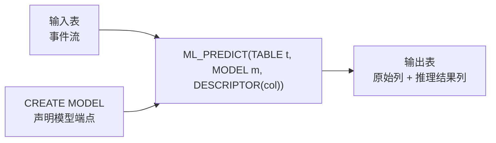
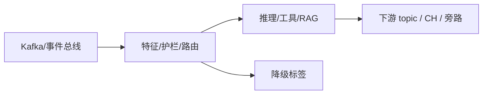

# 第 03 章 · Streaming Inference:ML_PREDICT 深解

> Demo:e12-03(SQL 脚本,`CREATE MODEL` + `ML_PREDICT` 对接本机 Ollama)· Level:L4

## 1. 问题:LLM 推理如何进流

传统做法是"Flink 算子里同步 HTTP 调用 LLM"——这违反军规 4(禁止同步外呼阻塞算子)。Flink 2.1 引入的 `ML_PREDICT` SQL 函数把"调用外部模型"标准化为一个**表函数**:输入表 + 模型描述符 + 待推理列描述符,输出表带推理结果列。底层实现天然走异步(e11 Async I/O 骨架的 SQL 化封装),推理失败/超时按标准降级路径处理,而不是让算子挂掉。

## 2. 架构与语法



```sql
-- 声明模型端点(指向本机 Ollama;生产环境替换为内部 AI 网关地址,见 ai/19)
CREATE MODEL risk_classifier
INPUT (review_text STRING)
OUTPUT (risk_level STRING, confidence DOUBLE)
WITH (
    'provider' = 'openai',              -- Ollama 兼容 OpenAI API 格式
    'endpoint' = 'http://host.docker.internal:11434/v1',
    'model-name' = 'qwen3:8b',
    'task' = 'classification'
);

-- 流式推理:每条事件到达即异步调用模型
SELECT t.order_id, t.review_text, p.risk_level, p.confidence
FROM orders_stream AS t,
     LATERAL TABLE (ML_PREDICT(t, MODEL risk_classifier, DESCRIPTOR(review_text))) AS p;
```

## 3. 工程红线(超越"能跑起来"的部分)

1. **限流**:模型端点(无论本地 Ollama 还是云端 API)都有并发上限,`ML_PREDICT` 底层的异步容量参数(对应 e11 的 capacity)必须按端点实测吞吐设置,而不是拍脑袋。
2. **超时降级**:模型推理耗时方差远大于普通外呼(P99 可能是 P50 的 10 倍),必须设置合理超时并定义降级值(如返回 `risk_level=UNKNOWN` 而非让整条流水线卡住)——与 e11-C2 的降级三件套完全同构。
3. **批化**:多数模型服务对批量请求的吞吐效率远高于单条,`ML_PREDICT` 的实现通常支持攒批调用,配置项因 Provider 而异,上线前务必实测批大小对延迟的影响。
4. **成本可见性**:每次 `ML_PREDICT` 调用的 token 消耗应能被计量(ai/18),否则一次数据回溯重跑可能产生意外的模型调用账单。

## 4. Demo 状态与降级路径

本章 Demo 为可直接在 SQL Client 执行的脚本(`examples/e12-03-streaming-inference/`),需要本机 Ollama 服务(建议 0.9.0+,模型 qwen3:8b)与 Flink 2.2 SQL AI 函数支持。**已知限制**:`ML_PREDICT` 的具体 WITH 参数因 Flink 版本与 Provider 类型存在差异,本章 SQL 以官方文档语法为准编写但未在沙箱内实际连接 Ollama 验证,请在本机执行前对照当前 Flink 版本的 SQL AI 函数文档核对参数名。降级路径:若 `ML_PREDICT` 因版本差异不可用,可退回 e11 Async I/O 的 DataStream 方案手工实现等价逻辑(RichAsyncFunction 调用 Ollama HTTP 接口)。

## 5. 踩坑

| 坑 | 现象 | 解法 |
|---|---|---|
| 未设超时 | 模型服务抖动时整条流水线背压堆积 | 显式设置合理超时+降级值 |
| 高并发打满本地 Ollama | 本机 CPU/GPU 资源耗尽,响应time劣化甚至无响应 | 按本机算力实测容量上限,不可无限并发 |
| 把推理结果当确定性输出缓存 | LLM 输出有随机性,相同输入不同输出被误判为"bug" | 明确该字段是概率性输出,下游消费方需容忍不确定性或设置 temperature=0 |

## 6. 最佳实践

- 生产环境的模型端点统一经过 AI 网关(ai/19)而非直连,便于限流、路由、成本核算集中管理。
- 每个 `CREATE MODEL` 都在设计文档里登记"降级值是什么、超时是多少、预估 QPS 与成本"。

## 7. 面试题

① `ML_PREDICT` 与手工 Async I/O 调用模型相比,标准化带来了什么、又失去了什么灵活性?② 为什么模型推理的超时方差通常远大于普通 RPC 调用?③ 批化调用如何影响端到端延迟与吞吐的权衡?

## 8. 参考资料

Flink 2.1 Release Notes(`CREATE MODEL`/`ML_PREDICT` 引入);docs/00-landscape(SQL AI 层现状);ai/19(AI Gateway 与 Model Routing)。

---

## Wave 2 扩写 · 03-streaming-inference

### 背景加固

本章对应 AI 学习路径中的「03-streaming-inference」。流式 AI 工程的约束与批式离线不同：延迟预算、成本封顶、降级路径、可观测追踪必须在作业图内一等公民对待。本仓库 e12 系列用零依赖 DataStream 演示机制；p01 提供可降级生产路径。

### 架构对照



控制面：预算、熔断、开关（Broadcast/侧输出）。数据面：embedding、提示、工具调用结果。
降级决策树：外部依赖超时 → 规则路径；成本超软顶 → 降采样；护栏命中 → 旁路。

### 与仓库 Demo 对照

- 优先查找 `examples/e12-03-*/README.md` 与同模块第二 Job；若编号为独立成册章节，见 `ai/README.md` 映射表。
- 生产对照：`projects/p01-log-ai-platform/`（AI off 默认可跑）。
- 规范：`best-practice/08-ai-degrade.md`。

### 踩坑实证

1. 坑 1：把同步外呼放在 map 线程；或无预算的工具调用；或无 trace 无法定位延迟。实证方向：用 e11/e12 作业制造超时，观察旁路与指标。

2. 坑 2：把同步外呼放在 map 线程；或无预算的工具调用；或无 trace 无法定位延迟。实证方向：用 e11/e12 作业制造超时，观察旁路与指标。

3. 坑 3：把同步外呼放在 map 线程；或无预算的工具调用；或无 trace 无法定位延迟。实证方向：用 e11/e12 作业制造超时，观察旁路与指标。

4. 坑 4：把同步外呼放在 map 线程；或无预算的工具调用；或无 trace 无法定位延迟。实证方向：用 e11/e12 作业制造超时，观察旁路与指标。

5. 坑 5：把同步外呼放在 map 线程；或无预算的工具调用；或无 trace 无法定位延迟。实证方向：用 e11/e12 作业制造超时，观察旁路与指标。

6. 坑 6：把同步外呼放在 map 线程；或无预算的工具调用；或无 trace 无法定位延迟。实证方向：用 e11/e12 作业制造超时，观察旁路与指标。

7. 坑 7：把同步外呼放在 map 线程；或无预算的工具调用；或无 trace 无法定位延迟。实证方向：用 e11/e12 作业制造超时，观察旁路与指标。

### 降级决策树

1. 依赖健康？否 → 规则/缓存路径。
2. 成本软顶？超 → 降采样/关昂贵模型。
3. 护栏分数？拒 → side output。
4. 全部通过 → 主输出。

### 验证步骤

1. 启动对应 e12 作业；注入正常/超时/超预算流量；检查主流与旁路；确认无违禁词文档；记录到个人 baseline 笔记。

2. 启动对应 e12 作业；注入正常/超时/超预算流量；检查主流与旁路；确认无违禁词文档；记录到个人 baseline 笔记。

3. 启动对应 e12 作业；注入正常/超时/超预算流量；检查主流与旁路；确认无违禁词文档；记录到个人 baseline 笔记。

4. 启动对应 e12 作业；注入正常/超时/超预算流量；检查主流与旁路；确认无违禁词文档；记录到个人 baseline 笔记。

5. 启动对应 e12 作业；注入正常/超时/超预算流量；检查主流与旁路；确认无违禁词文档；记录到个人 baseline 笔记。

### 面试钩子

用 90 秒讲清「03-streaming-inference」：定义、流式约束、降级、仓库路径（e12/p01）、一个指标。题库见 `interview/L8.md`。

### 模式卡片

#### 卡片 03-streaming-inference-1

问题：在流式场景下如何保证「03-streaming-inference」相关能力可降级且可观测？
方案：作业内开关 + 旁路 + 预算；外呼 Async；缓存 TTL；追踪字段贯通。
验证：OrbStack 跑 e12；断依赖仍有输出契约。
反例：无开关硬依赖 Ollama/Milvus 导致主路径不可用。

#### 卡片 03-streaming-inference-2

问题：在流式场景下如何保证「03-streaming-inference」相关能力可降级且可观测？
方案：作业内开关 + 旁路 + 预算；外呼 Async；缓存 TTL；追踪字段贯通。
验证：OrbStack 跑 e12；断依赖仍有输出契约。
反例：无开关硬依赖 Ollama/Milvus 导致主路径不可用。

#### 卡片 03-streaming-inference-3

问题：在流式场景下如何保证「03-streaming-inference」相关能力可降级且可观测？
方案：作业内开关 + 旁路 + 预算；外呼 Async；缓存 TTL；追踪字段贯通。
验证：OrbStack 跑 e12；断依赖仍有输出契约。
反例：无开关硬依赖 Ollama/Milvus 导致主路径不可用。

#### 卡片 03-streaming-inference-4

问题：在流式场景下如何保证「03-streaming-inference」相关能力可降级且可观测？
方案：作业内开关 + 旁路 + 预算；外呼 Async；缓存 TTL；追踪字段贯通。
验证：OrbStack 跑 e12；断依赖仍有输出契约。
反例：无开关硬依赖 Ollama/Milvus 导致主路径不可用。

#### 卡片 03-streaming-inference-5

问题：在流式场景下如何保证「03-streaming-inference」相关能力可降级且可观测？
方案：作业内开关 + 旁路 + 预算；外呼 Async；缓存 TTL；追踪字段贯通。
验证：OrbStack 跑 e12；断依赖仍有输出契约。
反例：无开关硬依赖 Ollama/Milvus 导致主路径不可用。

#### 卡片 03-streaming-inference-6

问题：在流式场景下如何保证「03-streaming-inference」相关能力可降级且可观测？
方案：作业内开关 + 旁路 + 预算；外呼 Async；缓存 TTL；追踪字段贯通。
验证：OrbStack 跑 e12；断依赖仍有输出契约。
反例：无开关硬依赖 Ollama/Milvus 导致主路径不可用。

#### 卡片 03-streaming-inference-7

问题：在流式场景下如何保证「03-streaming-inference」相关能力可降级且可观测？
方案：作业内开关 + 旁路 + 预算；外呼 Async；缓存 TTL；追踪字段贯通。
验证：OrbStack 跑 e12；断依赖仍有输出契约。
反例：无开关硬依赖 Ollama/Milvus 导致主路径不可用。

#### 卡片 03-streaming-inference-8

问题：在流式场景下如何保证「03-streaming-inference」相关能力可降级且可观测？
方案：作业内开关 + 旁路 + 预算；外呼 Async；缓存 TTL；追踪字段贯通。
验证：OrbStack 跑 e12；断依赖仍有输出契约。
反例：无开关硬依赖 Ollama/Milvus 导致主路径不可用。

#### 卡片 03-streaming-inference-9

问题：在流式场景下如何保证「03-streaming-inference」相关能力可降级且可观测？
方案：作业内开关 + 旁路 + 预算；外呼 Async；缓存 TTL；追踪字段贯通。
验证：OrbStack 跑 e12；断依赖仍有输出契约。
反例：无开关硬依赖 Ollama/Milvus 导致主路径不可用。

#### 卡片 03-streaming-inference-10

问题：在流式场景下如何保证「03-streaming-inference」相关能力可降级且可观测？
方案：作业内开关 + 旁路 + 预算；外呼 Async；缓存 TTL；追踪字段贯通。
验证：OrbStack 跑 e12；断依赖仍有输出契约。
反例：无开关硬依赖 Ollama/Milvus 导致主路径不可用。

#### 卡片 03-streaming-inference-11

问题：在流式场景下如何保证「03-streaming-inference」相关能力可降级且可观测？
方案：作业内开关 + 旁路 + 预算；外呼 Async；缓存 TTL；追踪字段贯通。
验证：OrbStack 跑 e12；断依赖仍有输出契约。
反例：无开关硬依赖 Ollama/Milvus 导致主路径不可用。

