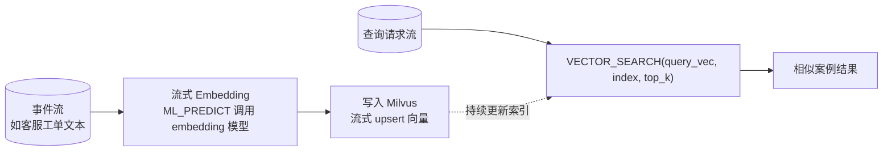

# 第 04 章 · Streaming Embedding 与 Vector:实时向量化

> Demo:e12-04(SQL 脚本,流式写入 Milvus + `VECTOR_SEARCH` 流内检索)· Level:L4

## 1. 问题:向量检索为什么要"流式"

传统 RAG 管线是"批量离线构建索引 → 应用侧查询",索引新鲜度以小时甚至天为单位。但很多场景需要"刚发生的事情立刻可被检索"——客服刚记录的一条工单、刚上报的一条故障描述,应该在秒级内就能被相似案例检索命中。这要求向量化(embedding)与索引写入本身是流式的,而不是定时批处理。

## 2. 架构



## 3. 核心 SQL(Flink 2.2+)

```sql
-- ① 流式生成向量(embedding 模型同样通过 CREATE MODEL 声明)
CREATE MODEL text_embedder
INPUT (text STRING) OUTPUT (embedding ARRAY<FLOAT>)
WITH ('provider'='openai','endpoint'='http://host.docker.internal:11434/v1',
      'model-name'='bge-m3','task'='embedding');

CREATE TABLE tickets_with_vector AS
SELECT t.*, e.embedding
FROM tickets_stream AS t,
     LATERAL TABLE (ML_PREDICT(t, MODEL text_embedder, DESCRIPTOR(text))) AS e;

-- ② 写入 Milvus(通过向量存储连接器/Catalog,具体 WITH 参数以当前版本连接器文档为准)
CREATE TABLE milvus_tickets (
    ticket_id STRING, text STRING, embedding ARRAY<FLOAT>,
    PRIMARY KEY (ticket_id) NOT ENFORCED
) WITH ('connector'='milvus', 'host'='milvus-standalone', 'port'='19530',
        'collection'='tickets', 'vector-field'='embedding');

INSERT INTO milvus_tickets SELECT ticket_id, text, embedding FROM tickets_with_vector;

-- ③ 流内向量检索:新工单一到即查最相似的历史工单
SELECT q.ticket_id, r.ticket_id AS similar_ticket, r.score
FROM tickets_with_vector AS q,
     LATERAL TABLE (VECTOR_SEARCH(milvus_tickets, DESCRIPTOR(embedding), q.embedding, 5)) AS r;
```

## 4. 工程要点

1. **embedding 模型与检索模型必须一致**:写入索引时用的 embedding 模型换了版本,历史向量与新向量不在同一语义空间,检索结果会静默劣化(不报错,只是"越来越不准")——这是向量系统最隐蔽的事故模式。
2. **向量写入是 upsert 语义**:同一实体的文本更新后,旧向量应被替换而非累加,Milvus 侧的主键设计与 e09 Paimon 主键表是同一思路的不同实现。
3. **相似度阈值需要业务校准**:`VECTOR_SEARCH` 返回 top_k 不代表"足够相似",下游必须设最低分数阈值,否则会把无关结果当作"相似案例"推给用户。

## 5. Demo 状态与降级路径

本章 SQL 需要 Milvus(`docker compose --profile ai up -d`,见 docker/Makefile `up-ai`)与本机 Ollama(embedding 模型如 bge-m3)。**已知限制**:Flink 官方 Milvus 连接器与 `VECTOR_SEARCH` 语法在 2.2 系列中仍在快速演进,本章 WITH 参数为示意性写法,以当前 Flink 版本的向量存储连接器文档为准;若连接器不可用,降级路径是用 e11 Async I/O 直接调用 Milvus Java SDK 实现等价的流式写入与检索。

## 6. 踩坑

| 坑 | 现象 | 解法 |
|---|---|---|
| 换 embedding 模型不重建索引 | 检索质量静默下降,难以定位 | 模型版本变更纳入索引重建 SOP,而非增量共存 |
| 向量维度不匹配 | 写入/检索报维度错误 | Collection schema 显式声明维度并与模型输出对齐 |
| top_k 结果不过滤分数 | 低相关结果污染下游 RAG 上下文 | 设最低相似度阈值,过滤后再拼 prompt |

## 7. 最佳实践

- 索引重建(embedding 模型升级后)走灰度:新老索引并存一段时间,验证效果后切换,而非直接覆盖。
- 向量检索结果始终携带来源与时间戳,便于下游 RAG 做新鲜度判断(ai/05 展开)。

## 8. 面试题

① 为什么说"换 embedding 模型不重建索引"是向量系统最隐蔽的事故?② 流式写入 Milvus 与批量离线构建索引相比,在一致性上有什么取舍?③ `VECTOR_SEARCH` 的 top_k 与相似度阈值分别解决什么问题?

## 9. 参考资料

docs/00-landscape(`VECTOR_SEARCH` GA 时间线);Milvus 官方文档(Collection Schema/向量索引类型);e09-lakehouse(主键表 upsert 语义的类比参照)。
