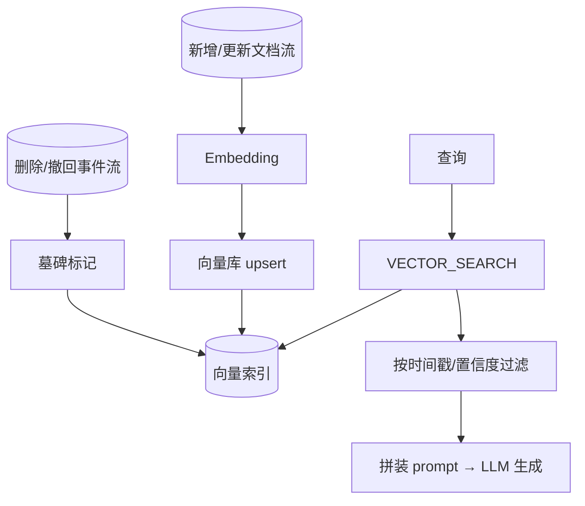
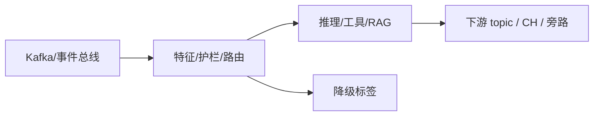

# 第 05 章 · Streaming RAG:新鲜度敏感场景的检索管线

> Demo:延续 e12-04 的索引管道,新增增量索引/失效逻辑(SQL 脚本)· Level:L5

## 1. 问题:标准 RAG 的新鲜度盲区

标准 RAG(Retrieval-Augmented Generation)管线假设知识库相对静态,批量构建一次索引可以服务很长时间。但"实时性敏感"的 RAG 场景——刚发生的事故、刚更新的政策、刚变化的库存——静态索引会让 Agent 拿着过时信息做决策。Streaming RAG 要解决三个新问题:①新文档如何增量进索引(而非全量重建);②过期/被撤回的文档如何从索引失效;③检索时如何区分"权威but可能滞后"与"新鲜but未经验证"的信息源。

## 2. 架构:增量索引与失效双通道



## 3. 核心设计:去重与失效

- **增量去重**:同一文档的多次更新不应在索引中留下多个版本("upsert by document_id",e09 主键表同款思路);
- **失效通道**:文档撤回/过期时,发一条"删除事件"进同一管道,写入端把该 ID 从向量库中物理删除或打墓碑标记(与 e07-C8 upsert-kafka 的墓碑消息语义一致);
- **时间戳过滤**:检索结果携带文档更新时间,下游 prompt 组装时可以按"最近 N 天"过滤,避免过时信息参与生成。

```sql
-- 失效通道:撤回事件触发向量库删除
CREATE TABLE doc_retraction_events (doc_id STRING, retracted_at TIMESTAMP(3))
WITH ('connector'='kafka','topic'='docs.retraction', ...);

-- 与 upsert 表联动:检索时排除已撤回文档(需应用层或连接器支持软删除标记)
SELECT k.*, r.retracted_at IS NOT NULL AS is_retracted
FROM milvus_docs k
LEFT JOIN doc_retraction_events r ON k.doc_id = r.doc_id;
```

## 4. 工程要点

1. **新鲜度 SLA 要显式定义**:不是所有 RAG 场景都需要秒级新鲜度,先问业务"检索结果允许滞后多久",再决定索引更新的架构复杂度(纯流式 vs 微批)。
2. **检索置信度与生成置信度分离**:向量相似度高不代表信息本身可信(可能是一篇过时或错误的文档排名很高),下游需要独立的可信度信号(如文档来源权威性、审核状态)。
3. **多源融合的时效性冲突**:当权威源(如官方政策库,更新慢但可信)与新鲜源(如实时聊天记录,更新快但未经核实)同时被检索到,prompt 组装策略需要明确优先级规则,而不是简单拼接。

## 5. Demo 状态

本章在 e12-04 索引管道基础上叠加"失效通道"逻辑,SQL 脚本随附于 `examples/e12-04-streaming-inference-vector/sql/05-retraction.sql`(与第 4 章共享 Milvus/Ollama 前置)。核心增量/失效逻辑本身是标准 Flink SQL(upsert + 软删除标记),不依赖 Preview API,置信度较高;向量库连接器细节仍受 04 章同样的版本演进限制。

## 6. 踩坑

| 坑 | 现象 | 解法 |
|---|---|---|
| 只做增量不做失效 | 索引只增不减,过时/错误信息永远可被检索到 | 失效通道与增量通道对等设计,缺一不可 |
| 检索排序只看向量相似度 | 高相似但低可信的结果排到前面 | 引入独立的可信度/权威性加权因子 |
| 新鲜源与权威源无优先级规则 | prompt 组装时信息冲突,LLM 生成前后矛盾的回答 | 显式定义信息源优先级与冲突处理策略 |

## 7. 最佳实践

- 每个 RAG 知识源在接入时登记"更新频率、失效机制、权威等级"三元组。
- 定期审计索引中"从未被检索命中"的文档比例,过高说明索引质量或路由策略有问题。

## 8. 面试题

① 为什么"只做增量不做失效"是 Streaming RAG 最常见的设计缺陷?② 向量相似度与信息可信度为什么必须分开建模?③ 如何设计一个"新鲜度 SLA"驱动的索引更新架构决策流程?

## 9. 参考资料

第 04 章(向量化与检索基础);e07-C8(upsert-kafka 墓碑消息语义的类比);ai/17(护栏——检索结果的内容安全过滤是 Streaming RAG 生产化的必要补充)。

---

## Wave 2 扩写 · 05-streaming-rag

### 背景加固

本章对应 AI 学习路径中的「05-streaming-rag」。流式 AI 工程的约束与批式离线不同：延迟预算、成本封顶、降级路径、可观测追踪必须在作业图内一等公民对待。本仓库 e12 系列用零依赖 DataStream 演示机制；p01 提供可降级生产路径。

### 架构对照



控制面：预算、熔断、开关（Broadcast/侧输出）。数据面：embedding、提示、工具调用结果。
降级决策树：外部依赖超时 → 规则路径；成本超软顶 → 降采样；护栏命中 → 旁路。

### 与仓库 Demo 对照

- 优先查找 `examples/e12-05-*/README.md` 与同模块第二 Job；若编号为独立成册章节，见 `ai/README.md` 映射表。
- 生产对照：`projects/p01-log-ai-platform/`（AI off 默认可跑）。
- 规范：`best-practice/08-ai-degrade.md`。

### 踩坑实证

1. 坑 1：把同步外呼放在 map 线程；或无预算的工具调用；或无 trace 无法定位延迟。实证方向：用 e11/e12 作业制造超时，观察旁路与指标。

2. 坑 2：把同步外呼放在 map 线程；或无预算的工具调用；或无 trace 无法定位延迟。实证方向：用 e11/e12 作业制造超时，观察旁路与指标。

3. 坑 3：把同步外呼放在 map 线程；或无预算的工具调用；或无 trace 无法定位延迟。实证方向：用 e11/e12 作业制造超时，观察旁路与指标。

4. 坑 4：把同步外呼放在 map 线程；或无预算的工具调用；或无 trace 无法定位延迟。实证方向：用 e11/e12 作业制造超时，观察旁路与指标。

5. 坑 5：把同步外呼放在 map 线程；或无预算的工具调用；或无 trace 无法定位延迟。实证方向：用 e11/e12 作业制造超时，观察旁路与指标。

6. 坑 6：把同步外呼放在 map 线程；或无预算的工具调用；或无 trace 无法定位延迟。实证方向：用 e11/e12 作业制造超时，观察旁路与指标。

7. 坑 7：把同步外呼放在 map 线程；或无预算的工具调用；或无 trace 无法定位延迟。实证方向：用 e11/e12 作业制造超时，观察旁路与指标。

### 降级决策树

1. 依赖健康？否 → 规则/缓存路径。
2. 成本软顶？超 → 降采样/关昂贵模型。
3. 护栏分数？拒 → side output。
4. 全部通过 → 主输出。

### 验证步骤

1. 启动对应 e12 作业；注入正常/超时/超预算流量；检查主流与旁路；确认无违禁词文档；记录到个人 baseline 笔记。

2. 启动对应 e12 作业；注入正常/超时/超预算流量；检查主流与旁路；确认无违禁词文档；记录到个人 baseline 笔记。

3. 启动对应 e12 作业；注入正常/超时/超预算流量；检查主流与旁路；确认无违禁词文档；记录到个人 baseline 笔记。

4. 启动对应 e12 作业；注入正常/超时/超预算流量；检查主流与旁路；确认无违禁词文档；记录到个人 baseline 笔记。

5. 启动对应 e12 作业；注入正常/超时/超预算流量；检查主流与旁路；确认无违禁词文档；记录到个人 baseline 笔记。

### 面试钩子

用 90 秒讲清「05-streaming-rag」：定义、流式约束、降级、仓库路径（e12/p01）、一个指标。题库见 `interview/L8.md`。

### 模式卡片

#### 卡片 05-streaming-rag-1

问题：在流式场景下如何保证「05-streaming-rag」相关能力可降级且可观测？
方案：作业内开关 + 旁路 + 预算；外呼 Async；缓存 TTL；追踪字段贯通。
验证：OrbStack 跑 e12；断依赖仍有输出契约。
反例：无开关硬依赖 Ollama/Milvus 导致主路径不可用。

#### 卡片 05-streaming-rag-2

问题：在流式场景下如何保证「05-streaming-rag」相关能力可降级且可观测？
方案：作业内开关 + 旁路 + 预算；外呼 Async；缓存 TTL；追踪字段贯通。
验证：OrbStack 跑 e12；断依赖仍有输出契约。
反例：无开关硬依赖 Ollama/Milvus 导致主路径不可用。

#### 卡片 05-streaming-rag-3

问题：在流式场景下如何保证「05-streaming-rag」相关能力可降级且可观测？
方案：作业内开关 + 旁路 + 预算；外呼 Async；缓存 TTL；追踪字段贯通。
验证：OrbStack 跑 e12；断依赖仍有输出契约。
反例：无开关硬依赖 Ollama/Milvus 导致主路径不可用。

#### 卡片 05-streaming-rag-4

问题：在流式场景下如何保证「05-streaming-rag」相关能力可降级且可观测？
方案：作业内开关 + 旁路 + 预算；外呼 Async；缓存 TTL；追踪字段贯通。
验证：OrbStack 跑 e12；断依赖仍有输出契约。
反例：无开关硬依赖 Ollama/Milvus 导致主路径不可用。

#### 卡片 05-streaming-rag-5

问题：在流式场景下如何保证「05-streaming-rag」相关能力可降级且可观测？
方案：作业内开关 + 旁路 + 预算；外呼 Async；缓存 TTL；追踪字段贯通。
验证：OrbStack 跑 e12；断依赖仍有输出契约。
反例：无开关硬依赖 Ollama/Milvus 导致主路径不可用。

#### 卡片 05-streaming-rag-6

问题：在流式场景下如何保证「05-streaming-rag」相关能力可降级且可观测？
方案：作业内开关 + 旁路 + 预算；外呼 Async；缓存 TTL；追踪字段贯通。
验证：OrbStack 跑 e12；断依赖仍有输出契约。
反例：无开关硬依赖 Ollama/Milvus 导致主路径不可用。

#### 卡片 05-streaming-rag-7

问题：在流式场景下如何保证「05-streaming-rag」相关能力可降级且可观测？
方案：作业内开关 + 旁路 + 预算；外呼 Async；缓存 TTL；追踪字段贯通。
验证：OrbStack 跑 e12；断依赖仍有输出契约。
反例：无开关硬依赖 Ollama/Milvus 导致主路径不可用。

#### 卡片 05-streaming-rag-8

问题：在流式场景下如何保证「05-streaming-rag」相关能力可降级且可观测？
方案：作业内开关 + 旁路 + 预算；外呼 Async；缓存 TTL；追踪字段贯通。
验证：OrbStack 跑 e12；断依赖仍有输出契约。
反例：无开关硬依赖 Ollama/Milvus 导致主路径不可用。

#### 卡片 05-streaming-rag-9

问题：在流式场景下如何保证「05-streaming-rag」相关能力可降级且可观测？
方案：作业内开关 + 旁路 + 预算；外呼 Async；缓存 TTL；追踪字段贯通。
验证：OrbStack 跑 e12；断依赖仍有输出契约。
反例：无开关硬依赖 Ollama/Milvus 导致主路径不可用。

#### 卡片 05-streaming-rag-10

问题：在流式场景下如何保证「05-streaming-rag」相关能力可降级且可观测？
方案：作业内开关 + 旁路 + 预算；外呼 Async；缓存 TTL；追踪字段贯通。
验证：OrbStack 跑 e12；断依赖仍有输出契约。
反例：无开关硬依赖 Ollama/Milvus 导致主路径不可用。

#### 卡片 05-streaming-rag-11

问题：在流式场景下如何保证「05-streaming-rag」相关能力可降级且可观测？
方案：作业内开关 + 旁路 + 预算；外呼 Async；缓存 TTL；追踪字段贯通。
验证：OrbStack 跑 e12；断依赖仍有输出契约。
反例：无开关硬依赖 Ollama/Milvus 导致主路径不可用。

