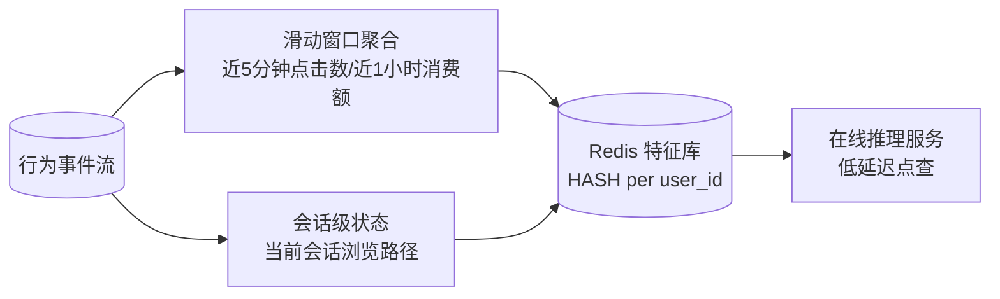
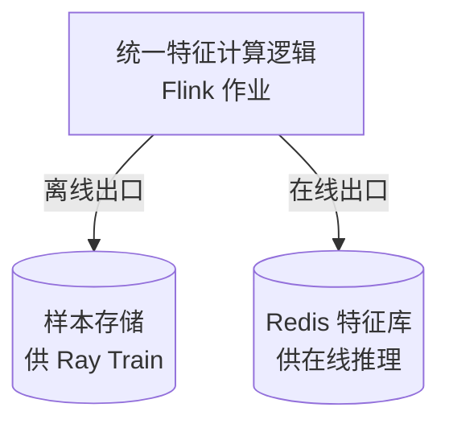
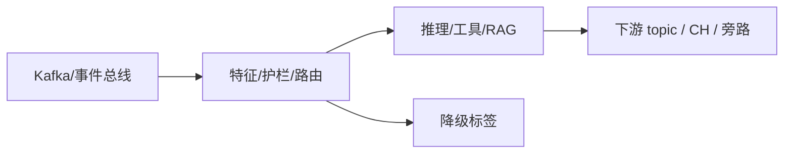

# 第 06 章 · Streaming Feature:实时特征工程与 Redis 特征库

> Demo:e12-06(完整可运行 DataStream 作业,实时特征计算 + Redis 写入,无 LLM/Preview API 依赖)· Level:L3
> 本章为案例二(实时推荐系统)的核心技术铺垫。

## 1. 问题:为什么特征需要"流式"计算

推荐、风控、个性化这类场景的模型输入(特征)如果靠离线批处理每天算一次,新用户、新行为要等到第二天才能影响模型决策——这对"千人千面""刚浏览就推荐相关商品"这类需求是不可接受的延迟。Streaming Feature 的目标是把"用户过去 5 分钟点击了什么、过去 1 小时消费了多少"这类时间敏感特征,在事件发生后毫秒到秒级内更新到特征库,供在线推理立即读取。

## 2. 架构



## 3. 核心实现:窗口特征 + 状态特征双通道

```java
// 通道一:滑动窗口统计特征(近 5 分钟点击数)——e02 滑动窗口的生产复用
events.keyBy(e -> e.userId)
      .window(SlidingEventTimeWindows.of(Duration.ofMinutes(5), Duration.ofSeconds(30)))
      .aggregate(new ClickCountAgg())
      .addSink(new RedisFeatureSink("feature:click_5m"));

// 通道二:会话级实时状态特征(当前会话浏览了哪些品类)——e03 MapState 的生产复用
events.keyBy(e -> e.userId)
      .process(new KeyedProcessFunction<String, Event, FeatureUpdate>() {
          private transient MapState<String, Integer> categoryCount;   // e03-C3 同款模式
          @Override
          public void processElement(Event e, Context ctx, Collector<FeatureUpdate> out)
                  throws Exception {
              categoryCount.put(e.category,
                      (categoryCount.contains(e.category) ? categoryCount.get(e.category) : 0) + 1);
              out.collect(new FeatureUpdate(e.userId, "session_categories", categoryCount));
          }
      })
      .addSink(new RedisFeatureSink("feature:session_category"));
```

Redis 写入沿用 e07-C7 的攒批 Pipeline 模式(jedis pipeline + Operator State 容错),避免逐条 SET 的网络往返开销。

## 4. 特征一致性:训练与推理的口径对齐

生产事故高发区不是"特征算错了",而是"离线训练用的特征计算口径,与在线推理读到的特征口径不一致"(训练/推理偏斜,training-serving skew)。解决方案:同一份特征计算逻辑,既产出训练样本(写入离线存储供 Ray Train 消费,ai/23 联动),又产出在线特征(写入 Redis 供实时推理消费)——**一套代码,两个出口**,而不是训练侧和线上侧各写一遍逻辑。



## 5. Demo 状态

本章 Demo(`examples/e12-06-streaming-feature/`)为完整可运行的 DataStream 作业,复用 e02 滑动窗口、e03 MapState、e07-C7 Redis 攒批写三项已验证模式的组合,**不依赖任何 Preview API 或外部 LLM 服务**,是本书中置信度最高的 Demo 之一,可按 `mvn -q -Plocal compile exec:java` 本地直接验证。

## 6. 踩坑

| 坑 | 现象 | 解法 |
|---|---|---|
| 训练与在线特征逻辑各写一遍 | 两处口径逐渐漂移,模型线上效果与离线评估不符 | 统一特征计算逻辑,双出口而非双实现 |
| Redis 特征无 TTL | 不活跃用户的特征永久占用内存 | 按业务定义特征保鲜期,设置 Redis TTL |
| 窗口特征与状态特征混用同一 Redis key | 更新覆盖导致特征丢失 | key 命名空间显式区分特征类型 |

## 7. 最佳实践

- 特征上线前登记《特征清单》:名称/计算逻辑/更新频率/TTL/训练-在线一致性校验方式。
- 定期做训练-在线特征分布对比(offline-online skew 监控),而不是只在效果下滑后才排查。

## 8. 面试题

① Training-Serving Skew 的根本原因是什么,如何从架构上根治?② 窗口特征与状态特征分别适合什么场景?③ 为什么 Redis 攒批写要用 Operator State 而非直接依赖 Redis 自身的持久化?

## 9. 参考资料

e02(窗口)、e03(状态)、e07-C7(Redis 攒批写)——本章是三者的生产场景组合;ai/23(样本流→训练集管线,与本章离线出口衔接)。

---

## Wave 2 扩写 · 06-streaming-feature

### 背景加固

本章对应 AI 学习路径中的「06-streaming-feature」。流式 AI 工程的约束与批式离线不同：延迟预算、成本封顶、降级路径、可观测追踪必须在作业图内一等公民对待。本仓库 e12 系列用零依赖 DataStream 演示机制；p01 提供可降级生产路径。

### 架构对照



控制面：预算、熔断、开关（Broadcast/侧输出）。数据面：embedding、提示、工具调用结果。
降级决策树：外部依赖超时 → 规则路径；成本超软顶 → 降采样；护栏命中 → 旁路。

### 与仓库 Demo 对照

- 优先查找 `examples/e12-06-*/README.md` 与同模块第二 Job；若编号为独立成册章节，见 `ai/README.md` 映射表。
- 生产对照：`projects/p01-log-ai-platform/`（AI off 默认可跑）。
- 规范：`best-practice/08-ai-degrade.md`。

### 踩坑实证

1. 坑 1：把同步外呼放在 map 线程；或无预算的工具调用；或无 trace 无法定位延迟。实证方向：用 e11/e12 作业制造超时，观察旁路与指标。

2. 坑 2：把同步外呼放在 map 线程；或无预算的工具调用；或无 trace 无法定位延迟。实证方向：用 e11/e12 作业制造超时，观察旁路与指标。

3. 坑 3：把同步外呼放在 map 线程；或无预算的工具调用；或无 trace 无法定位延迟。实证方向：用 e11/e12 作业制造超时，观察旁路与指标。

4. 坑 4：把同步外呼放在 map 线程；或无预算的工具调用；或无 trace 无法定位延迟。实证方向：用 e11/e12 作业制造超时，观察旁路与指标。

5. 坑 5：把同步外呼放在 map 线程；或无预算的工具调用；或无 trace 无法定位延迟。实证方向：用 e11/e12 作业制造超时，观察旁路与指标。

6. 坑 6：把同步外呼放在 map 线程；或无预算的工具调用；或无 trace 无法定位延迟。实证方向：用 e11/e12 作业制造超时，观察旁路与指标。

7. 坑 7：把同步外呼放在 map 线程；或无预算的工具调用；或无 trace 无法定位延迟。实证方向：用 e11/e12 作业制造超时，观察旁路与指标。

### 降级决策树

1. 依赖健康？否 → 规则/缓存路径。
2. 成本软顶？超 → 降采样/关昂贵模型。
3. 护栏分数？拒 → side output。
4. 全部通过 → 主输出。

### 验证步骤

1. 启动对应 e12 作业；注入正常/超时/超预算流量；检查主流与旁路；确认无违禁词文档；记录到个人 baseline 笔记。

2. 启动对应 e12 作业；注入正常/超时/超预算流量；检查主流与旁路；确认无违禁词文档；记录到个人 baseline 笔记。

3. 启动对应 e12 作业；注入正常/超时/超预算流量；检查主流与旁路；确认无违禁词文档；记录到个人 baseline 笔记。

4. 启动对应 e12 作业；注入正常/超时/超预算流量；检查主流与旁路；确认无违禁词文档；记录到个人 baseline 笔记。

5. 启动对应 e12 作业；注入正常/超时/超预算流量；检查主流与旁路；确认无违禁词文档；记录到个人 baseline 笔记。

### 面试钩子

用 90 秒讲清「06-streaming-feature」：定义、流式约束、降级、仓库路径（e12/p01）、一个指标。题库见 `interview/L8.md`。

### 模式卡片

#### 卡片 06-streaming-feature-1

问题：在流式场景下如何保证「06-streaming-feature」相关能力可降级且可观测？
方案：作业内开关 + 旁路 + 预算；外呼 Async；缓存 TTL；追踪字段贯通。
验证：OrbStack 跑 e12；断依赖仍有输出契约。
反例：无开关硬依赖 Ollama/Milvus 导致主路径不可用。

#### 卡片 06-streaming-feature-2

问题：在流式场景下如何保证「06-streaming-feature」相关能力可降级且可观测？
方案：作业内开关 + 旁路 + 预算；外呼 Async；缓存 TTL；追踪字段贯通。
验证：OrbStack 跑 e12；断依赖仍有输出契约。
反例：无开关硬依赖 Ollama/Milvus 导致主路径不可用。

#### 卡片 06-streaming-feature-3

问题：在流式场景下如何保证「06-streaming-feature」相关能力可降级且可观测？
方案：作业内开关 + 旁路 + 预算；外呼 Async；缓存 TTL；追踪字段贯通。
验证：OrbStack 跑 e12；断依赖仍有输出契约。
反例：无开关硬依赖 Ollama/Milvus 导致主路径不可用。

#### 卡片 06-streaming-feature-4

问题：在流式场景下如何保证「06-streaming-feature」相关能力可降级且可观测？
方案：作业内开关 + 旁路 + 预算；外呼 Async；缓存 TTL；追踪字段贯通。
验证：OrbStack 跑 e12；断依赖仍有输出契约。
反例：无开关硬依赖 Ollama/Milvus 导致主路径不可用。

#### 卡片 06-streaming-feature-5

问题：在流式场景下如何保证「06-streaming-feature」相关能力可降级且可观测？
方案：作业内开关 + 旁路 + 预算；外呼 Async；缓存 TTL；追踪字段贯通。
验证：OrbStack 跑 e12；断依赖仍有输出契约。
反例：无开关硬依赖 Ollama/Milvus 导致主路径不可用。

#### 卡片 06-streaming-feature-6

问题：在流式场景下如何保证「06-streaming-feature」相关能力可降级且可观测？
方案：作业内开关 + 旁路 + 预算；外呼 Async；缓存 TTL；追踪字段贯通。
验证：OrbStack 跑 e12；断依赖仍有输出契约。
反例：无开关硬依赖 Ollama/Milvus 导致主路径不可用。

#### 卡片 06-streaming-feature-7

问题：在流式场景下如何保证「06-streaming-feature」相关能力可降级且可观测？
方案：作业内开关 + 旁路 + 预算；外呼 Async；缓存 TTL；追踪字段贯通。
验证：OrbStack 跑 e12；断依赖仍有输出契约。
反例：无开关硬依赖 Ollama/Milvus 导致主路径不可用。

#### 卡片 06-streaming-feature-8

问题：在流式场景下如何保证「06-streaming-feature」相关能力可降级且可观测？
方案：作业内开关 + 旁路 + 预算；外呼 Async；缓存 TTL；追踪字段贯通。
验证：OrbStack 跑 e12；断依赖仍有输出契约。
反例：无开关硬依赖 Ollama/Milvus 导致主路径不可用。

#### 卡片 06-streaming-feature-9

问题：在流式场景下如何保证「06-streaming-feature」相关能力可降级且可观测？
方案：作业内开关 + 旁路 + 预算；外呼 Async；缓存 TTL；追踪字段贯通。
验证：OrbStack 跑 e12；断依赖仍有输出契约。
反例：无开关硬依赖 Ollama/Milvus 导致主路径不可用。

#### 卡片 06-streaming-feature-10

问题：在流式场景下如何保证「06-streaming-feature」相关能力可降级且可观测？
方案：作业内开关 + 旁路 + 预算；外呼 Async；缓存 TTL；追踪字段贯通。
验证：OrbStack 跑 e12；断依赖仍有输出契约。
反例：无开关硬依赖 Ollama/Milvus 导致主路径不可用。

#### 卡片 06-streaming-feature-11

问题：在流式场景下如何保证「06-streaming-feature」相关能力可降级且可观测？
方案：作业内开关 + 旁路 + 预算；外呼 Async；缓存 TTL；追踪字段贯通。
验证：OrbStack 跑 e12；断依赖仍有输出契约。
反例：无开关硬依赖 Ollama/Milvus 导致主路径不可用。

