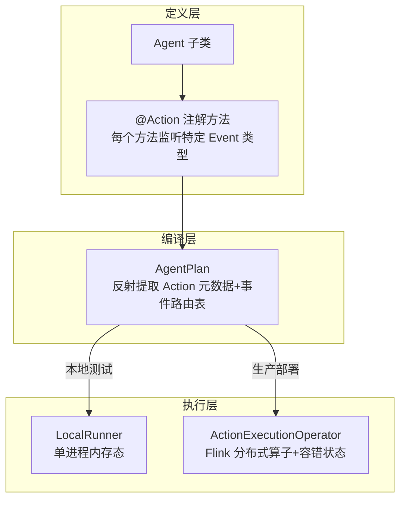
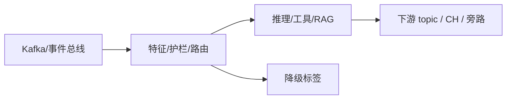

# 第 07 章 · Streaming Agent 第一课:Flink Agents 架构与 Java 快速上手

> Demo:e12-07(Java,Flink Agents 0.3 Preview API)· Level:L5
> ⚠️ Preview API 风险:本章代码依据官方 0.3 发布说明与 API 讨论整理,字段/方法签名可能随后续版本调整,以官方 nightly 文档为准。

## 1. 定位:Agent 是流拓扑里的一等公民

Flink Agents 把"一个 Agent"编译成 Flink 拓扑里的一个(或一组)算子——继承 Flink 的分布式执行、状态管理、checkpoint 容错,而不是在 Flink 之外另起一个 Agent 运行时。这是它与"LangGraph + 外部编排"路线的根本区别:**状态与计算在同一个引擎里,不需要额外的一致性桥接**。

## 2. 核心概念与执行模型



- **Agent**:业务逻辑的容器,继承 `org.apache.flink.agents.api.Agent`。
- **Action**:用 `@Action(listenEvents = {...})` 标注的方法,声明"监听哪些事件类型";一个 Agent 可以有多个 Action,通过事件驱动彼此串联,形成一个工作流。
- **Event**:内置类型包括 `InputEvent`、`OutputEvent`、`ChatRequestEvent`、`ChatResponseEvent`、`ToolRequestEvent`、`ToolResponseEvent`,也可自定义继承 `Event`。
- **RunnerContext**:Action 方法内访问状态(`getShortTermMemory()`)、发送后续事件(`sendEvent()`)、异步执行耗时操作(`executeAsync()`)的唯一入口。

## 3. 最小可运行 Agent

```java
package com.flywhl.flinklab.e12;

import org.apache.flink.agents.api.Agent;
import org.apache.flink.agents.api.Action;
import org.apache.flink.agents.api.Event;
import org.apache.flink.agents.api.InputEvent;
import org.apache.flink.agents.api.OutputEvent;
import org.apache.flink.agents.api.context.RunnerContext;

/**
 * 最小 Agent:接收车辆信号事件,判断是否超阈值,直接产出告警事件。
 * 不含 LLM 调用(第 8/9 章再引入记忆与工具调用),先把"Action + Event"骨架跑通。
 */
public class SimpleThresholdAgent extends Agent {

    @Action(listenEvents = {InputEvent.class})
    public void checkThreshold(Event event, RunnerContext ctx) throws Exception {
        InputEvent in = (InputEvent) event;
        VehicleSignal signal = (VehicleSignal) in.getInput();

        if (signal.value > signal.threshold) {
            // sendEvent 必须在 mailbox 线程内调用(单线程模型保证状态一致性)
            ctx.sendEvent(new OutputEvent(
                    "ALERT vin=%s signal=%s value=%.1f".formatted(
                            signal.vin, signal.type, signal.value)));
        }
    }

    public static class VehicleSignal {
        public String vin, type;
        public double value, threshold;
    }
}
```

```java
// 装配:把 Agent 接入 Flink 流拓扑(本地 LocalRunner 测试模式)
StreamExecutionEnvironment env = StreamExecutionEnvironment.getExecutionEnvironment();
AgentsExecutionEnvironment agentsEnv = AgentsExecutionEnvironment.getExecutionEnvironment(env);

DataStream<VehicleSignal> signals = /* 数据源,参照 common/Labs 风格自定义 */;
agentsEnv.fromDataStream(signals, SimpleThresholdAgent.class)
         .toDataStream()
         .print();

env.execute("e12-07-agent-quickstart");
```

## 4. 单线程 Mailbox 模型:为什么不能随便起线程

Flink Agents 的状态访问与事件发送**必须发生在 mailbox 线程**内——这是 Flink 算子模型本身的单线程处理保证在 Agent 层的延续(与 DataStream 算子不允许跨线程访问 KeyedState 是同一条纪律)。耗时操作(如调 LLM)通过 `ctx.executeAsync(supplier)` 提交到独立线程池,JDK 21+ 利用 Continuation 机制把"等待异步结果"这段挂起,不占用 mailbox 线程,恢复后再回到 mailbox 线程继续执行后续代码——对开发者呈现的是"看起来同步"的顺序代码风格,底层却是非阻塞的。这也是本仓库全程用 JDK 21 的技术原因之一(01-XX 环境要求 + 此处 Agents 异步机制的硬性依赖)。

```java
// 官方 API 目标形态(据 GitHub Discussion #429 整理,具体签名以当前版本为准)
@Action(listenEvents = {InputEvent.class})
public void handleWithLlm(Event event, RunnerContext ctx) throws Exception {
    String result = ctx.executeAsync(() -> callSlowLlm(prompt));  // 挂起,不阻塞 mailbox
    ctx.getShortTermMemory().set("last_result", result);           // 恢复后在 mailbox 线程执行
    ctx.sendEvent(new OutputEvent(result));
}
```

## 5. Demo 状态与降级路径

`examples/e12-07-agent-quickstart/` 提供上述最小 Agent 的完整 Maven 模块(需 `flink-agents-api`/`flink-agents-runtime` 依赖,版本对齐 0.3.0)。**已知限制**:沙箱无法访问 Maven Central 拉取 flink-agents 系列依赖,本模块**未做编译验证**;JDK 21 运行需在启动参数追加 `--add-exports=java.base/jdk.internal.vm=ALL-UNNAMED`(官方文档要求)。降级路径:若 Agents 依赖无法获取或 API 签名已变化,可用 e03-C7(Broadcast State)+ e11(Async I/O)手工搭建等价的"事件驱动决策+异步外呼"骨架,牺牲 Agents 提供的 Action 编排语法糖,保留核心的事件驱动+exactly-once语义。

## 6. 踩坑

| 坑 | 现象 | 解法 |
|---|---|---|
| 忘记追加 JVM 参数 | JDK21+ 下 Continuation 相关报错 | 按官方文档在 `config.yaml` 的 `env.java.opts.all` 追加 `--add-exports` |
| 在 executeAsync 外做状态访问 | 并发问题,状态不一致 | 状态访问/事件发送严格限定在 mailbox 线程(executeAsync 外的代码) |
| Action State Store 未显式配置 | 0.3 起无隐式默认后端,启动失败 | 显式配置 Kafka 或 Fluss 作为 action state store |

## 7. 最佳实践

- 新 Agent 一律先用 LocalRunner 单进程调试通过,再切 ActionExecutionOperator 部署到 Flink 集群。
- Action 方法保持单一职责(一个 Action 只做一件事,通过事件串联多个 Action),避免把整个业务逻辑塞进一个方法。

## 8. 面试题

① 为什么 Flink Agents 的状态访问必须限定在 mailbox 线程?② LocalRunner 与 ActionExecutionOperator 两种执行模式的适用场景?③ 0.3 版本为什么移除了"隐式默认" action state store?

## 9. 参考资料

Apache Flink Agents 0.3.0/0.2.0 Release Announcement;GitHub Discussion #429(Java 异步执行设计);apache/flink-agents 官方 Quickstart(Workflow Agent);DeepWiki apache/flink-agents 架构总览。

---

## Wave 2 扩写 · 07-agent-quickstart

### 背景加固

本章对应 AI 学习路径中的「07-agent-quickstart」。流式 AI 工程的约束与批式离线不同：延迟预算、成本封顶、降级路径、可观测追踪必须在作业图内一等公民对待。本仓库 e12 系列用零依赖 DataStream 演示机制；p01 提供可降级生产路径。

### 架构对照



控制面：预算、熔断、开关（Broadcast/侧输出）。数据面：embedding、提示、工具调用结果。
降级决策树：外部依赖超时 → 规则路径；成本超软顶 → 降采样；护栏命中 → 旁路。

### 与仓库 Demo 对照

- 优先查找 `examples/e12-07-*/README.md` 与同模块第二 Job；若编号为独立成册章节，见 `ai/README.md` 映射表。
- 生产对照：`projects/p01-log-ai-platform/`（AI off 默认可跑）。
- 规范：`best-practice/08-ai-degrade.md`。

### 踩坑实证

1. 坑 1：把同步外呼放在 map 线程；或无预算的工具调用；或无 trace 无法定位延迟。实证方向：用 e11/e12 作业制造超时，观察旁路与指标。

2. 坑 2：把同步外呼放在 map 线程；或无预算的工具调用；或无 trace 无法定位延迟。实证方向：用 e11/e12 作业制造超时，观察旁路与指标。

3. 坑 3：把同步外呼放在 map 线程；或无预算的工具调用；或无 trace 无法定位延迟。实证方向：用 e11/e12 作业制造超时，观察旁路与指标。

4. 坑 4：把同步外呼放在 map 线程；或无预算的工具调用；或无 trace 无法定位延迟。实证方向：用 e11/e12 作业制造超时，观察旁路与指标。

5. 坑 5：把同步外呼放在 map 线程；或无预算的工具调用；或无 trace 无法定位延迟。实证方向：用 e11/e12 作业制造超时，观察旁路与指标。

6. 坑 6：把同步外呼放在 map 线程；或无预算的工具调用；或无 trace 无法定位延迟。实证方向：用 e11/e12 作业制造超时，观察旁路与指标。

7. 坑 7：把同步外呼放在 map 线程；或无预算的工具调用；或无 trace 无法定位延迟。实证方向：用 e11/e12 作业制造超时，观察旁路与指标。

### 降级决策树

1. 依赖健康？否 → 规则/缓存路径。
2. 成本软顶？超 → 降采样/关昂贵模型。
3. 护栏分数？拒 → side output。
4. 全部通过 → 主输出。

### 验证步骤

1. 启动对应 e12 作业；注入正常/超时/超预算流量；检查主流与旁路；确认无违禁词文档；记录到个人 baseline 笔记。

2. 启动对应 e12 作业；注入正常/超时/超预算流量；检查主流与旁路；确认无违禁词文档；记录到个人 baseline 笔记。

3. 启动对应 e12 作业；注入正常/超时/超预算流量；检查主流与旁路；确认无违禁词文档；记录到个人 baseline 笔记。

4. 启动对应 e12 作业；注入正常/超时/超预算流量；检查主流与旁路；确认无违禁词文档；记录到个人 baseline 笔记。

5. 启动对应 e12 作业；注入正常/超时/超预算流量；检查主流与旁路；确认无违禁词文档；记录到个人 baseline 笔记。

### 面试钩子

用 90 秒讲清「07-agent-quickstart」：定义、流式约束、降级、仓库路径（e12/p01）、一个指标。题库见 `interview/L8.md`。

### 模式卡片

#### 卡片 07-agent-quickstart-1

问题：在流式场景下如何保证「07-agent-quickstart」相关能力可降级且可观测？
方案：作业内开关 + 旁路 + 预算；外呼 Async；缓存 TTL；追踪字段贯通。
验证：OrbStack 跑 e12；断依赖仍有输出契约。
反例：无开关硬依赖 Ollama/Milvus 导致主路径不可用。

#### 卡片 07-agent-quickstart-2

问题：在流式场景下如何保证「07-agent-quickstart」相关能力可降级且可观测？
方案：作业内开关 + 旁路 + 预算；外呼 Async；缓存 TTL；追踪字段贯通。
验证：OrbStack 跑 e12；断依赖仍有输出契约。
反例：无开关硬依赖 Ollama/Milvus 导致主路径不可用。

#### 卡片 07-agent-quickstart-3

问题：在流式场景下如何保证「07-agent-quickstart」相关能力可降级且可观测？
方案：作业内开关 + 旁路 + 预算；外呼 Async；缓存 TTL；追踪字段贯通。
验证：OrbStack 跑 e12；断依赖仍有输出契约。
反例：无开关硬依赖 Ollama/Milvus 导致主路径不可用。

#### 卡片 07-agent-quickstart-4

问题：在流式场景下如何保证「07-agent-quickstart」相关能力可降级且可观测？
方案：作业内开关 + 旁路 + 预算；外呼 Async；缓存 TTL；追踪字段贯通。
验证：OrbStack 跑 e12；断依赖仍有输出契约。
反例：无开关硬依赖 Ollama/Milvus 导致主路径不可用。

#### 卡片 07-agent-quickstart-5

问题：在流式场景下如何保证「07-agent-quickstart」相关能力可降级且可观测？
方案：作业内开关 + 旁路 + 预算；外呼 Async；缓存 TTL；追踪字段贯通。
验证：OrbStack 跑 e12；断依赖仍有输出契约。
反例：无开关硬依赖 Ollama/Milvus 导致主路径不可用。

#### 卡片 07-agent-quickstart-6

问题：在流式场景下如何保证「07-agent-quickstart」相关能力可降级且可观测？
方案：作业内开关 + 旁路 + 预算；外呼 Async；缓存 TTL；追踪字段贯通。
验证：OrbStack 跑 e12；断依赖仍有输出契约。
反例：无开关硬依赖 Ollama/Milvus 导致主路径不可用。

#### 卡片 07-agent-quickstart-7

问题：在流式场景下如何保证「07-agent-quickstart」相关能力可降级且可观测？
方案：作业内开关 + 旁路 + 预算；外呼 Async；缓存 TTL；追踪字段贯通。
验证：OrbStack 跑 e12；断依赖仍有输出契约。
反例：无开关硬依赖 Ollama/Milvus 导致主路径不可用。

#### 卡片 07-agent-quickstart-8

问题：在流式场景下如何保证「07-agent-quickstart」相关能力可降级且可观测？
方案：作业内开关 + 旁路 + 预算；外呼 Async；缓存 TTL；追踪字段贯通。
验证：OrbStack 跑 e12；断依赖仍有输出契约。
反例：无开关硬依赖 Ollama/Milvus 导致主路径不可用。

#### 卡片 07-agent-quickstart-9

问题：在流式场景下如何保证「07-agent-quickstart」相关能力可降级且可观测？
方案：作业内开关 + 旁路 + 预算；外呼 Async；缓存 TTL；追踪字段贯通。
验证：OrbStack 跑 e12；断依赖仍有输出契约。
反例：无开关硬依赖 Ollama/Milvus 导致主路径不可用。

#### 卡片 07-agent-quickstart-10

问题：在流式场景下如何保证「07-agent-quickstart」相关能力可降级且可观测？
方案：作业内开关 + 旁路 + 预算；外呼 Async；缓存 TTL；追踪字段贯通。
验证：OrbStack 跑 e12；断依赖仍有输出契约。
反例：无开关硬依赖 Ollama/Milvus 导致主路径不可用。

#### 卡片 07-agent-quickstart-11

问题：在流式场景下如何保证「07-agent-quickstart」相关能力可降级且可观测？
方案：作业内开关 + 旁路 + 预算；外呼 Async；缓存 TTL；追踪字段贯通。
验证：OrbStack 跑 e12；断依赖仍有输出契约。
反例：无开关硬依赖 Ollama/Milvus 导致主路径不可用。

