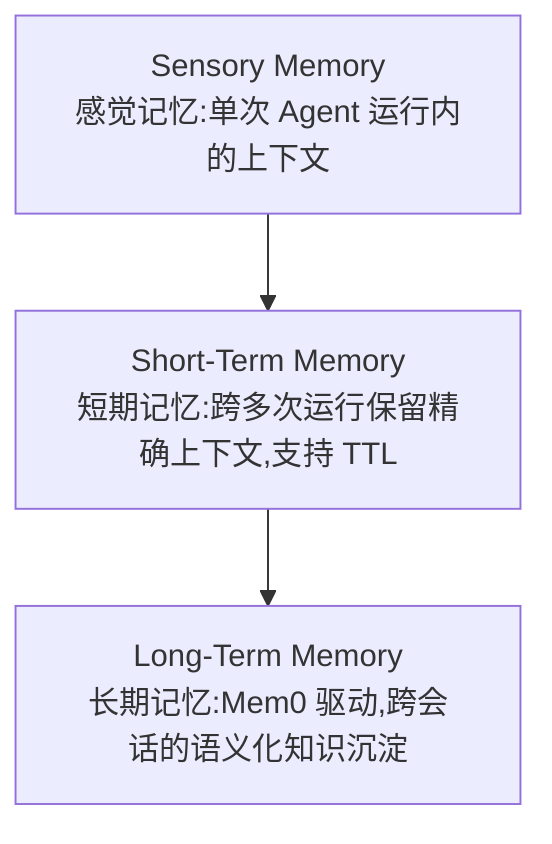

# 第 08 章 · Streaming Memory:三层记忆模型与 Mem0 长期记忆

> Demo:e12-08(Java,Flink Agents 0.3 Preview API)· Level:L5 · ⚠️ Preview API,见第 07 章说明

## 1. 问题:Agent 的"记忆"和聊天窗口的"上下文"是两回事

请求-响应式 Agent 的"记忆"通常就是把历史对话塞进 prompt(上下文窗口),窗口越长成本越高、且过窗口即遗忘。事件驱动 Agent 面对的是**持续数天/数周的实体状态**(这个用户过去一个月的行为模式、这台设备过去一年的故障历史),这类记忆必须是**持久化、可查询、独立于单次会话**的——这正是 Flink 有状态计算的强项,Flink Agents 把它系统化为三层记忆模型。

## 2. 三层记忆架构



| 层 | 生命周期 | 典型内容 | 存储载体 |
|---|---|---|---|
| Sensory | 单次 Action 执行 | 本次处理的临时中间变量 | 方法局部变量 |
| Short-Term | 跨多次 Agent 运行(同一实体) | "这个用户最近 3 次交互说了什么" | Flink Keyed State(带 TTL,0.3 新增) |
| Long-Term | 跨会话、跨时间的语义记忆 | "这个用户长期偏好什么" | Mem0(0.3 起移除了基于向量库的自建长期记忆实现,统一收敛到 Mem0 后端) |

## 3. 短期记忆:代码示例

```java
@Action(listenEvents = {InputEvent.class})
public void handleWithMemory(Event event, RunnerContext ctx) throws Exception {
    InputEvent in = (InputEvent) event;
    // 读取短期记忆(跨多次调用保留,类似 e03 ValueState 但由 Agents 框架托管)
    String history = (String) ctx.getShortTermMemory().get("recent_context");
    String prompt = buildPromptWithHistory(in, history);

    String reply = ctx.executeAsync(() -> callLlm(prompt));

    // 更新短期记忆,TTL 由框架配置管理(0.3 新增能力,对应 docs/03-05 State TTL 治理思想)
    ctx.getShortTermMemory().set("recent_context", reply);
    ctx.sendEvent(new OutputEvent(reply));
}
```

短期记忆的 TTL 语义与 docs/03-05(State TTL)完全同构——这不是巧合,Flink Agents 的记忆系统本质上就是"托管过的 Flink State + 面向 Agent 场景的便捷 API"。理解了 e03-C6 的 TTL 三元组,就理解了短期记忆的过期行为。

## 4. 长期记忆:为什么收敛到 Mem0

0.3 版本的一个重要变化:此前"基于向量库自建长期记忆"的实现被移除,统一改为 Mem0 后端。这是社区在早期实践后发现"长期记忆不只是向量检索"——它需要记忆的**提炼、去重、遗忘策略**(不是所有交互都值得永久记住,Mem0 内部有基于 LLM 的记忆整理机制),自建向量库方案难以覆盖这些语义,而 Mem0 作为专门的记忆管理层能提供这些能力。这与你此前的 mem0 工程经验直接对应:自建 mem0 集成方案里踩过的坑(记忆膨胀、重复记忆、过期记忆未清理),正是 Flink Agents 选择收敛到 Mem0 而非维护自研方案的同一组原因。

```java
// 长期记忆读写(接口示意,具体绑定方式以当前版本 Mem0 集成文档为准)
@ChatModelSetup
public static ResourceDescriptor longTermMemorySetup() {
    return ResourceDescriptor.Builder.newBuilder(ResourceName.LongTermMemory.MEM0)
            .addInitialArgument("mem0_api_key", "...")
            .build();
}
```

## 5. Demo 状态与降级路径

`examples/e12-08-streaming-memory/` 演示短期记忆的读写与 TTL 配置(对 Flink 内建 State 机制依赖更直接,置信度相对第 7 章更高);长期记忆(Mem0)部分因需要外部 Mem0 服务或 API Key,以代码示意为主,未做端到端验证。降级路径:短期记忆场景可直接退化为手写 e03-C6 风格的 `ValueState` + TTL 方案;长期记忆场景若不接 Mem0,可用你已有的自建 mem0 工程方案(记忆抽取用 ARQ 异步任务,与本仓库长期记忆场景性质相通)。

## 6. 踩坑

| 坑 | 现象 | 解法 |
|---|---|---|
| 把长期记忆当无限增长的日志 | 记忆库膨胀,检索噪声增加 | Mem0 的记忆整理机制依赖定期触发,勿禁用 |
| 短期记忆 TTL 设置过长 | 状态占用持续增长,类比 e03-C6 的容量规划问题 | TTL 与业务"多久算是同一会话"的定义对齐 |
| 混淆 Sensory 与 Short-Term | 本该跨运行保留的信息在单次运行后丢失 | 明确该信息的生命周期跨度,选对记忆层 |

## 7. 最佳实践

- 记忆系统设计沿用 docs/03 的"状态四问"(存什么/多大/多久/怎么演进),只是把"状态"换成"记忆"。
- 长期记忆的写入应当异步且不阻塞主流程(记忆整理是"事后"的,不应拖慢当前事件的响应)。

## 8. 面试题

① 为什么 0.3 版本放弃自建向量库长期记忆转向 Mem0?② 短期记忆与 docs/03 State TTL 在语义上有什么对应关系?③ 记忆系统的"遗忘策略"为什么是必要设计而非可选项?

## 9. 参考资料

Apache Flink Agents 0.2.0/0.3.0 Release Announcement(记忆系统演进);docs/03-05(State TTL);你此前的 mem0 2.0.x 工程经验(filters/top_k API)。
