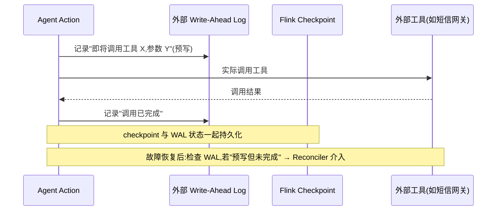

# 第 09 章 · Streaming Tool Call:FunctionTool、Durable Execution 与 Reconciler

> Demo:e12-09(Java,Flink Agents 0.3 Preview API)· Level:L5 · ⚠️ Preview API,见第 07 章说明

## 1. 问题:工具调用的副作用如何做到 exactly-once

Agent 调用外部工具(发短信、下单、调用远程诊断接口)与"读数据做决策"有本质区别:**读操作重放无害,写操作(有副作用的工具调用)重放可能是灾难**——同一条告警发两次短信、同一个诊断指令下发两次。Flink 的 checkpoint 机制天然保证"计算状态"的 exactly-once,但**工具调用这个外部副作用**默认不在这个保护范围内,需要额外机制:这就是 Durable Execution。

## 2. Durable Execution 的核心机制



**Reconciler**(0.3 新增)是这套机制的关键补丁:故障发生在"工具已经被调用,但确认结果还没写回状态"的间隙时,恢复后不能简单地"重新调用"(可能重复副作用),也不能简单地"假装没调用过"(可能漏做)——Reconciler 允许开发者注册一个回调,在恢复时**去核实外部系统的真实状态**(比如查询短信网关"这条短信到底发了没"),据此决定是重放、跳过还是标记失败,而不是靠猜测。

## 3. 代码示例

```java
public class NotifyOwnerAgent extends Agent {

    @Action(listenEvents = {AlertEvent.class})
    public void notifyOwner(Event event, RunnerContext ctx) throws Exception {
        AlertEvent alert = (AlertEvent) event;

        // durable block:注册 reconciler,故障恢复时用它核实副作用是否已生效
        ctx.executeDurable(
            () -> smsGateway.send(alert.ownerPhone, alert.message),   // 实际调用
            (requestId) -> smsGateway.queryStatus(requestId)          // reconciler:核实真实状态
        );

        ctx.sendEvent(new OutputEvent("notified: " + alert.ownerPhone));
    }
}
```

**FunctionTool** 是工具调用的声明式封装(类比传统 Agent 框架里的 Tool/Function Calling),区别在于它天生带着上面这套 Durable Execution 保护——声明一个 Tool,调用它的 exactly-once 语义是框架自动提供的,而不需要每次手写重试与幂等判断逻辑。

## 4. Demo 状态与降级路径

`examples/e12-09-streaming-tool-call/` 演示 `executeDurable` 的使用形态与 Reconciler 注册方式(代码依据 0.3 Release Notes 中 Reconciler 机制描述整理,具体 API 名称/签名未经官方文档逐字核实,存在偏差风险)。降级路径:若该机制暂不可用或行为与预期不符,退回**幂等设计**(军规常用方案)——工具调用侧提供幂等键(如 `alert_id` 作为短信网关的去重键),配合普通的 at-least-once 重试,效果上等价但需要下游系统配合(要求外部工具支持幂等键这一契约)。

## 5. 踩坑

| 坑 | 现象 | 解法 |
|---|---|---|
| 把所有工具调用都包 Durable Execution | 不必要的复杂度与延迟(读操作不需要这层保护) | 只对有副作用的写操作使用,读操作走普通 Async I/O(e11) |
| Reconciler 里做重业务逻辑 | 恢复路径本身变得脆弱、难测试 | Reconciler 应只做"核实状态",不做复杂决策 |
| 外部系统不支持状态查询 | Reconciler 无法核实,退化为只能猜测 | 优先选择支持幂等键或状态查询接口的外部系统作为工具后端 |

## 6. 最佳实践

- 每个 FunctionTool 上线前明确回答:这是读操作还是写操作?写操作是否有幂等键或状态可查询接口?
- Durable Execution 与幂等设计不是二选一,理想情况下两者叠加(双保险)。

## 7. 面试题

① 为什么"读操作重放无害,写操作重放危险"是理解 Durable Execution 必要性的关键?② Reconciler 解决的是"重放"还是"核实",两者有什么区别?③ 如果外部工具完全不支持幂等键或状态查询,你会如何设计容错方案?

## 8. 参考资料

Apache Flink Agents 0.3.0 Release Announcement(Durable Execution 与 Reconciler);docs/04-04(端到端一致性与两阶段提交——同一问题在 DataStream 层面的经典解法,可与本章对照理解)。
