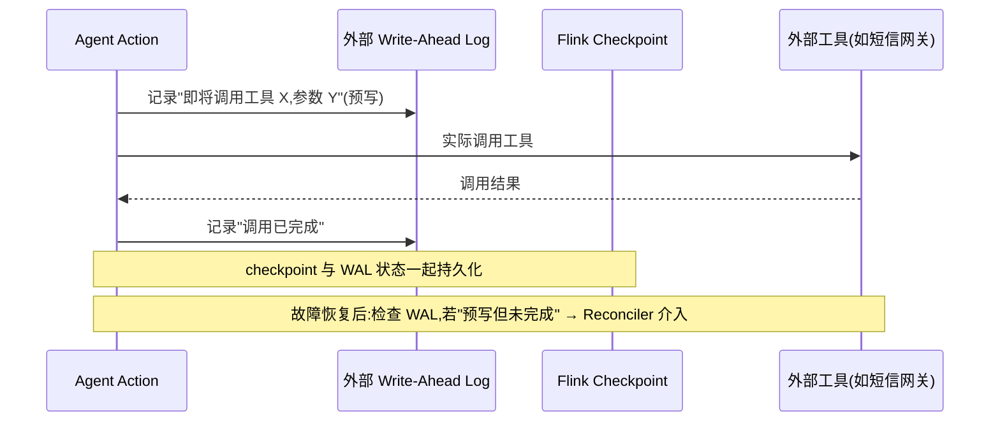
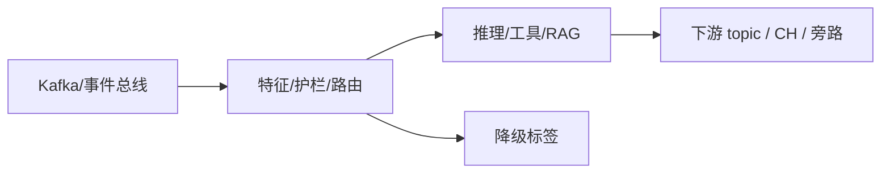

# 第 09 章 · Streaming Tool Call:FunctionTool、Durable Execution 与 Reconciler

> Demo:e12-09(Java,Flink Agents 0.3 Preview API)· Level:L5 · ⚠️ Preview API,见第 07 章说明

## 1. 问题:工具调用的副作用如何做到 exactly-once

Agent 调用外部工具(发短信、下单、调用远程诊断接口)与"读数据做决策"有本质区别:**读操作重放无害,写操作(有副作用的工具调用)重放可能是灾难**——同一条告警发两次短信、同一个诊断指令下发两次。Flink 的 checkpoint 机制天然保证"计算状态"的 exactly-once,但**工具调用这个外部副作用**默认不在这个保护范围内,需要额外机制:这就是 Durable Execution。

## 2. Durable Execution 的核心机制



**Reconciler**(0.3 新增)是这套机制的关键补丁:故障发生在"工具已经被调用,但确认结果还没写回状态"的间隙时,恢复后不能简单地"重新调用"(可能重复副作用),也不能简单地"假装没调用过"(可能漏做)——Reconciler 允许开发者注册一个回调,在恢复时**去核实外部系统的真实状态**(比如查询短信网关"这条短信到底发了没"),据此决定是重放、跳过还是标记失败,而不是靠猜测。

## 3. 代码示例

```java
public class NotifyOwnerAgent extends Agent {

    @Action(listenEvents = {AlertEvent.class})
    public void notifyOwner(Event event, RunnerContext ctx) throws Exception {
        AlertEvent alert = (AlertEvent) event;

        // durable block:注册 reconciler,故障恢复时用它核实副作用是否已生效
        ctx.executeDurable(
            () -> smsGateway.send(alert.ownerPhone, alert.message),   // 实际调用
            (requestId) -> smsGateway.queryStatus(requestId)          // reconciler:核实真实状态
        );

        ctx.sendEvent(new OutputEvent("notified: " + alert.ownerPhone));
    }
}
```

**FunctionTool** 是工具调用的声明式封装(类比传统 Agent 框架里的 Tool/Function Calling),区别在于它天生带着上面这套 Durable Execution 保护——声明一个 Tool,调用它的 exactly-once 语义是框架自动提供的,而不需要每次手写重试与幂等判断逻辑。

## 4. Demo 状态与降级路径

`examples/e12-09-streaming-tool-call/` 演示 `executeDurable` 的使用形态与 Reconciler 注册方式(代码依据 0.3 Release Notes 中 Reconciler 机制描述整理,具体 API 名称/签名未经官方文档逐字核实,存在偏差风险)。降级路径:若该机制暂不可用或行为与预期不符,退回**幂等设计**(军规常用方案)——工具调用侧提供幂等键(如 `alert_id` 作为短信网关的去重键),配合普通的 at-least-once 重试,效果上等价但需要下游系统配合(要求外部工具支持幂等键这一契约)。

## 5. 踩坑

| 坑 | 现象 | 解法 |
|---|---|---|
| 把所有工具调用都包 Durable Execution | 不必要的复杂度与延迟(读操作不需要这层保护) | 只对有副作用的写操作使用,读操作走普通 Async I/O(e11) |
| Reconciler 里做重业务逻辑 | 恢复路径本身变得脆弱、难测试 | Reconciler 应只做"核实状态",不做复杂决策 |
| 外部系统不支持状态查询 | Reconciler 无法核实,退化为只能猜测 | 优先选择支持幂等键或状态查询接口的外部系统作为工具后端 |

## 6. 最佳实践

- 每个 FunctionTool 上线前明确回答:这是读操作还是写操作?写操作是否有幂等键或状态可查询接口?
- Durable Execution 与幂等设计不是二选一,理想情况下两者叠加(双保险)。

## 7. 面试题

① 为什么"读操作重放无害,写操作重放危险"是理解 Durable Execution 必要性的关键?② Reconciler 解决的是"重放"还是"核实",两者有什么区别?③ 如果外部工具完全不支持幂等键或状态查询,你会如何设计容错方案?

## 8. 参考资料

Apache Flink Agents 0.3.0 Release Announcement(Durable Execution 与 Reconciler);docs/04-04(端到端一致性与两阶段提交——同一问题在 DataStream 层面的经典解法,可与本章对照理解)。

---

## Wave 2 扩写 · 09-streaming-tool-call

### 背景加固

本章对应 AI 学习路径中的「09-streaming-tool-call」。流式 AI 工程的约束与批式离线不同：延迟预算、成本封顶、降级路径、可观测追踪必须在作业图内一等公民对待。本仓库 e12 系列用零依赖 DataStream 演示机制；p01 提供可降级生产路径。

### 架构对照



控制面：预算、熔断、开关（Broadcast/侧输出）。数据面：embedding、提示、工具调用结果。
降级决策树：外部依赖超时 → 规则路径；成本超软顶 → 降采样；护栏命中 → 旁路。

### 与仓库 Demo 对照

- 优先查找 `examples/e12-09-*/README.md` 与同模块第二 Job；若编号为独立成册章节，见 `ai/README.md` 映射表。
- 生产对照：`projects/p01-log-ai-platform/`（AI off 默认可跑）。
- 规范：`best-practice/08-ai-degrade.md`。

### 踩坑实证

1. 坑 1：把同步外呼放在 map 线程；或无预算的工具调用；或无 trace 无法定位延迟。实证方向：用 e11/e12 作业制造超时，观察旁路与指标。

2. 坑 2：把同步外呼放在 map 线程；或无预算的工具调用；或无 trace 无法定位延迟。实证方向：用 e11/e12 作业制造超时，观察旁路与指标。

3. 坑 3：把同步外呼放在 map 线程；或无预算的工具调用；或无 trace 无法定位延迟。实证方向：用 e11/e12 作业制造超时，观察旁路与指标。

4. 坑 4：把同步外呼放在 map 线程；或无预算的工具调用；或无 trace 无法定位延迟。实证方向：用 e11/e12 作业制造超时，观察旁路与指标。

5. 坑 5：把同步外呼放在 map 线程；或无预算的工具调用；或无 trace 无法定位延迟。实证方向：用 e11/e12 作业制造超时，观察旁路与指标。

6. 坑 6：把同步外呼放在 map 线程；或无预算的工具调用；或无 trace 无法定位延迟。实证方向：用 e11/e12 作业制造超时，观察旁路与指标。

7. 坑 7：把同步外呼放在 map 线程；或无预算的工具调用；或无 trace 无法定位延迟。实证方向：用 e11/e12 作业制造超时，观察旁路与指标。

### 降级决策树

1. 依赖健康？否 → 规则/缓存路径。
2. 成本软顶？超 → 降采样/关昂贵模型。
3. 护栏分数？拒 → side output。
4. 全部通过 → 主输出。

### 验证步骤

1. 启动对应 e12 作业；注入正常/超时/超预算流量；检查主流与旁路；确认无违禁词文档；记录到个人 baseline 笔记。

2. 启动对应 e12 作业；注入正常/超时/超预算流量；检查主流与旁路；确认无违禁词文档；记录到个人 baseline 笔记。

3. 启动对应 e12 作业；注入正常/超时/超预算流量；检查主流与旁路；确认无违禁词文档；记录到个人 baseline 笔记。

4. 启动对应 e12 作业；注入正常/超时/超预算流量；检查主流与旁路；确认无违禁词文档；记录到个人 baseline 笔记。

5. 启动对应 e12 作业；注入正常/超时/超预算流量；检查主流与旁路；确认无违禁词文档；记录到个人 baseline 笔记。

### 面试钩子

用 90 秒讲清「09-streaming-tool-call」：定义、流式约束、降级、仓库路径（e12/p01）、一个指标。题库见 `interview/L8.md`。

### 模式卡片

#### 卡片 09-streaming-tool-call-1

问题：在流式场景下如何保证「09-streaming-tool-call」相关能力可降级且可观测？
方案：作业内开关 + 旁路 + 预算；外呼 Async；缓存 TTL；追踪字段贯通。
验证：OrbStack 跑 e12；断依赖仍有输出契约。
反例：无开关硬依赖 Ollama/Milvus 导致主路径不可用。

#### 卡片 09-streaming-tool-call-2

问题：在流式场景下如何保证「09-streaming-tool-call」相关能力可降级且可观测？
方案：作业内开关 + 旁路 + 预算；外呼 Async；缓存 TTL；追踪字段贯通。
验证：OrbStack 跑 e12；断依赖仍有输出契约。
反例：无开关硬依赖 Ollama/Milvus 导致主路径不可用。

#### 卡片 09-streaming-tool-call-3

问题：在流式场景下如何保证「09-streaming-tool-call」相关能力可降级且可观测？
方案：作业内开关 + 旁路 + 预算；外呼 Async；缓存 TTL；追踪字段贯通。
验证：OrbStack 跑 e12；断依赖仍有输出契约。
反例：无开关硬依赖 Ollama/Milvus 导致主路径不可用。

#### 卡片 09-streaming-tool-call-4

问题：在流式场景下如何保证「09-streaming-tool-call」相关能力可降级且可观测？
方案：作业内开关 + 旁路 + 预算；外呼 Async；缓存 TTL；追踪字段贯通。
验证：OrbStack 跑 e12；断依赖仍有输出契约。
反例：无开关硬依赖 Ollama/Milvus 导致主路径不可用。

#### 卡片 09-streaming-tool-call-5

问题：在流式场景下如何保证「09-streaming-tool-call」相关能力可降级且可观测？
方案：作业内开关 + 旁路 + 预算；外呼 Async；缓存 TTL；追踪字段贯通。
验证：OrbStack 跑 e12；断依赖仍有输出契约。
反例：无开关硬依赖 Ollama/Milvus 导致主路径不可用。

#### 卡片 09-streaming-tool-call-6

问题：在流式场景下如何保证「09-streaming-tool-call」相关能力可降级且可观测？
方案：作业内开关 + 旁路 + 预算；外呼 Async；缓存 TTL；追踪字段贯通。
验证：OrbStack 跑 e12；断依赖仍有输出契约。
反例：无开关硬依赖 Ollama/Milvus 导致主路径不可用。

#### 卡片 09-streaming-tool-call-7

问题：在流式场景下如何保证「09-streaming-tool-call」相关能力可降级且可观测？
方案：作业内开关 + 旁路 + 预算；外呼 Async；缓存 TTL；追踪字段贯通。
验证：OrbStack 跑 e12；断依赖仍有输出契约。
反例：无开关硬依赖 Ollama/Milvus 导致主路径不可用。

#### 卡片 09-streaming-tool-call-8

问题：在流式场景下如何保证「09-streaming-tool-call」相关能力可降级且可观测？
方案：作业内开关 + 旁路 + 预算；外呼 Async；缓存 TTL；追踪字段贯通。
验证：OrbStack 跑 e12；断依赖仍有输出契约。
反例：无开关硬依赖 Ollama/Milvus 导致主路径不可用。

#### 卡片 09-streaming-tool-call-9

问题：在流式场景下如何保证「09-streaming-tool-call」相关能力可降级且可观测？
方案：作业内开关 + 旁路 + 预算；外呼 Async；缓存 TTL；追踪字段贯通。
验证：OrbStack 跑 e12；断依赖仍有输出契约。
反例：无开关硬依赖 Ollama/Milvus 导致主路径不可用。

#### 卡片 09-streaming-tool-call-10

问题：在流式场景下如何保证「09-streaming-tool-call」相关能力可降级且可观测？
方案：作业内开关 + 旁路 + 预算；外呼 Async；缓存 TTL；追踪字段贯通。
验证：OrbStack 跑 e12；断依赖仍有输出契约。
反例：无开关硬依赖 Ollama/Milvus 导致主路径不可用。

#### 卡片 09-streaming-tool-call-11

问题：在流式场景下如何保证「09-streaming-tool-call」相关能力可降级且可观测？
方案：作业内开关 + 旁路 + 预算；外呼 Async；缓存 TTL；追踪字段贯通。
验证：OrbStack 跑 e12；断依赖仍有输出契约。
反例：无开关硬依赖 Ollama/Milvus 导致主路径不可用。

