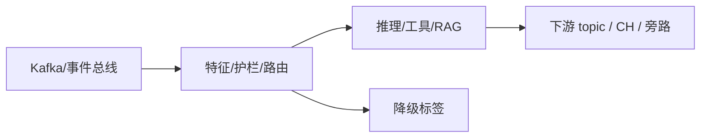

# 第 10 章 · Streaming MCP:事件驱动场景的 MCP 工具接入

> Demo:代码示意(未提供独立 e12 模块,理由见第 5 节)· Level:L5

## 1. 问题:MCP 工具生来是同步的

Model Context Protocol(MCP)标准化了"给 Agent 一批工具"的接入协议,但它的调用模型天生是**同步请求-响应**的(Agent 发起调用,等待 MCP Server 返回结果)。把这类同步工具直接搬进 Flink 的事件驱动算子里,如果不做异步化包装,就是在算子里同步阻塞——这正是军规 4 一直在强调的反模式。本章要解决的问题是:**如何把一批"天生同步"的 MCP 工具,安全地接入一个事件驱动、要求算子非阻塞的运行时**。

## 2. 接入模式


核心原则只有一条:**MCP 工具调用永远通过 `executeAsync`(或等价的 Async I/O 骨架)包装,不允许在 mailbox 线程内同步等待**。这与第 7 章讲的"耗时操作必须 executeAsync"是同一条纪律在 MCP 场景下的应用,MCP 本身不提供任何特殊豁免。

## 3. 可靠性包装

MCP Server 是外部进程/服务,其可用性通常不如内部系统可控,因此在 Agent 侧接入 MCP 工具时,应该叠加 e11 讲过的完整可靠性三件套:

```java
@Action(listenEvents = {ToolRequestEvent.class})
public void callMcpTool(Event event, RunnerContext ctx) throws Exception {
    ToolRequestEvent req = (ToolRequestEvent) event;
    try {
        String result = ctx.executeAsync(() -> mcpClient.call(req.toolName, req.args));
        ctx.sendEvent(new ToolResponseEvent(result));
    } catch (TimeoutException e) {
        // 降级:MCP Server 不可用时的兜底,而非让整条 Action 失败重启(e11-C2 同款纪律)
        ctx.sendEvent(new ToolResponseEvent(defaultFallbackFor(req.toolName)));
    }
}
```

## 4. 何时用 MCP、何时用 FunctionTool

| 场景 | 选择 |
|---|---|
| 工具已有现成的 MCP Server 实现(如通用文件系统、数据库连接器) | 直接接入 MCP,复用生态 |
| 工具是企业内部专有系统,且需要 Durable Execution 保护副作用 | 用第 9 章的 FunctionTool + Reconciler,MCP 协议本身不提供这层保护 |
| 需要跨语言复用(Python 生态的某个工具想在 Java Agent 里用) | MCP 的协议中立性是优势;也可考虑 0.3 新增的 Cross-Language Actions |

## 5. Demo 状态说明

本章未提供独立 `examples/e12-10` 模块:MCP 工具接入的核心工程内容(异步化包装、超时降级)与第 7/9 章、e11 高度重合,额外编写一个"调用某个具体 MCP Server"的示例需要引入外部 MCP Server 依赖(如某个具体工具的 Server 实现),这会让示例的可复现性系于一个第三方组件的可用性而非本书想传达的工程原理。因此本章以代码示意为主,鼓励读者将 e11 的 Async I/O 骨架直接套用到自己项目里实际接入的 MCP Server 上。

## 6. 踩坑

| 坑 | 现象 | 解法 |
|---|---|---|
| MCP 调用未异步化 | 阻塞 mailbox 线程,吞吐急剧下降 | 强制走 executeAsync/Async I/O |
| 未设超时降级 | 单个 MCP Server 抖动拖垮整个 Agent | e11-C2 同款超时+降级 |
| 把所有工具都塞进一个 MCP Server | 单点故障半径过大 | 按工具的可用性/权限要求分离部署 |

## 7. 最佳实践

- MCP Server 的可用性纳入整体 SLA 评估,不可用性视同外部系统依赖的常规风险管理。
- 工具调用的输入输出建议记录 EventLog(第 15 章),便于事后追溯"Agent 到底调了什么工具、传了什么参数"。

## 8. 面试题

① 为什么 MCP 协议本身不解决 exactly-once 问题?② 什么情况下你会选择用 MCP 而非直接手写 FunctionTool?③ MCP Server 的故障半径应该如何隔离?

## 9. 参考资料

Model Context Protocol 官方规范(工具调用协议);e11(Async I/O 可靠性三件套);第 7/9 章(mailbox 模型与 Durable Execution)。

---

## Wave 2 扩写 · 10-streaming-mcp

### 背景加固

本章对应 AI 学习路径中的「10-streaming-mcp」。流式 AI 工程的约束与批式离线不同：延迟预算、成本封顶、降级路径、可观测追踪必须在作业图内一等公民对待。本仓库 e12 系列用零依赖 DataStream 演示机制；p01 提供可降级生产路径。

### 架构对照



控制面：预算、熔断、开关（Broadcast/侧输出）。数据面：embedding、提示、工具调用结果。
降级决策树：外部依赖超时 → 规则路径；成本超软顶 → 降采样；护栏命中 → 旁路。

### 与仓库 Demo 对照

- 优先查找 `examples/e12-10-*/README.md` 与同模块第二 Job；若编号为独立成册章节，见 `ai/README.md` 映射表。
- 生产对照：`projects/p01-log-ai-platform/`（AI off 默认可跑）。
- 规范：`best-practice/08-ai-degrade.md`。

### 踩坑实证

1. 坑 1：把同步外呼放在 map 线程；或无预算的工具调用；或无 trace 无法定位延迟。实证方向：用 e11/e12 作业制造超时，观察旁路与指标。

2. 坑 2：把同步外呼放在 map 线程；或无预算的工具调用；或无 trace 无法定位延迟。实证方向：用 e11/e12 作业制造超时，观察旁路与指标。

3. 坑 3：把同步外呼放在 map 线程；或无预算的工具调用；或无 trace 无法定位延迟。实证方向：用 e11/e12 作业制造超时，观察旁路与指标。

4. 坑 4：把同步外呼放在 map 线程；或无预算的工具调用；或无 trace 无法定位延迟。实证方向：用 e11/e12 作业制造超时，观察旁路与指标。

5. 坑 5：把同步外呼放在 map 线程；或无预算的工具调用；或无 trace 无法定位延迟。实证方向：用 e11/e12 作业制造超时，观察旁路与指标。

6. 坑 6：把同步外呼放在 map 线程；或无预算的工具调用；或无 trace 无法定位延迟。实证方向：用 e11/e12 作业制造超时，观察旁路与指标。

7. 坑 7：把同步外呼放在 map 线程；或无预算的工具调用；或无 trace 无法定位延迟。实证方向：用 e11/e12 作业制造超时，观察旁路与指标。

### 降级决策树

1. 依赖健康？否 → 规则/缓存路径。
2. 成本软顶？超 → 降采样/关昂贵模型。
3. 护栏分数？拒 → side output。
4. 全部通过 → 主输出。

### 验证步骤

1. 启动对应 e12 作业；注入正常/超时/超预算流量；检查主流与旁路；确认无违禁词文档；记录到个人 baseline 笔记。

2. 启动对应 e12 作业；注入正常/超时/超预算流量；检查主流与旁路；确认无违禁词文档；记录到个人 baseline 笔记。

3. 启动对应 e12 作业；注入正常/超时/超预算流量；检查主流与旁路；确认无违禁词文档；记录到个人 baseline 笔记。

4. 启动对应 e12 作业；注入正常/超时/超预算流量；检查主流与旁路；确认无违禁词文档；记录到个人 baseline 笔记。

5. 启动对应 e12 作业；注入正常/超时/超预算流量；检查主流与旁路；确认无违禁词文档；记录到个人 baseline 笔记。

### 面试钩子

用 90 秒讲清「10-streaming-mcp」：定义、流式约束、降级、仓库路径（e12/p01）、一个指标。题库见 `interview/L8.md`。

### 模式卡片

#### 卡片 10-streaming-mcp-1

问题：在流式场景下如何保证「10-streaming-mcp」相关能力可降级且可观测？
方案：作业内开关 + 旁路 + 预算；外呼 Async；缓存 TTL；追踪字段贯通。
验证：OrbStack 跑 e12；断依赖仍有输出契约。
反例：无开关硬依赖 Ollama/Milvus 导致主路径不可用。

#### 卡片 10-streaming-mcp-2

问题：在流式场景下如何保证「10-streaming-mcp」相关能力可降级且可观测？
方案：作业内开关 + 旁路 + 预算；外呼 Async；缓存 TTL；追踪字段贯通。
验证：OrbStack 跑 e12；断依赖仍有输出契约。
反例：无开关硬依赖 Ollama/Milvus 导致主路径不可用。

#### 卡片 10-streaming-mcp-3

问题：在流式场景下如何保证「10-streaming-mcp」相关能力可降级且可观测？
方案：作业内开关 + 旁路 + 预算；外呼 Async；缓存 TTL；追踪字段贯通。
验证：OrbStack 跑 e12；断依赖仍有输出契约。
反例：无开关硬依赖 Ollama/Milvus 导致主路径不可用。

#### 卡片 10-streaming-mcp-4

问题：在流式场景下如何保证「10-streaming-mcp」相关能力可降级且可观测？
方案：作业内开关 + 旁路 + 预算；外呼 Async；缓存 TTL；追踪字段贯通。
验证：OrbStack 跑 e12；断依赖仍有输出契约。
反例：无开关硬依赖 Ollama/Milvus 导致主路径不可用。

#### 卡片 10-streaming-mcp-5

问题：在流式场景下如何保证「10-streaming-mcp」相关能力可降级且可观测？
方案：作业内开关 + 旁路 + 预算；外呼 Async；缓存 TTL；追踪字段贯通。
验证：OrbStack 跑 e12；断依赖仍有输出契约。
反例：无开关硬依赖 Ollama/Milvus 导致主路径不可用。

#### 卡片 10-streaming-mcp-6

问题：在流式场景下如何保证「10-streaming-mcp」相关能力可降级且可观测？
方案：作业内开关 + 旁路 + 预算；外呼 Async；缓存 TTL；追踪字段贯通。
验证：OrbStack 跑 e12；断依赖仍有输出契约。
反例：无开关硬依赖 Ollama/Milvus 导致主路径不可用。

#### 卡片 10-streaming-mcp-7

问题：在流式场景下如何保证「10-streaming-mcp」相关能力可降级且可观测？
方案：作业内开关 + 旁路 + 预算；外呼 Async；缓存 TTL；追踪字段贯通。
验证：OrbStack 跑 e12；断依赖仍有输出契约。
反例：无开关硬依赖 Ollama/Milvus 导致主路径不可用。

#### 卡片 10-streaming-mcp-8

问题：在流式场景下如何保证「10-streaming-mcp」相关能力可降级且可观测？
方案：作业内开关 + 旁路 + 预算；外呼 Async；缓存 TTL；追踪字段贯通。
验证：OrbStack 跑 e12；断依赖仍有输出契约。
反例：无开关硬依赖 Ollama/Milvus 导致主路径不可用。

#### 卡片 10-streaming-mcp-9

问题：在流式场景下如何保证「10-streaming-mcp」相关能力可降级且可观测？
方案：作业内开关 + 旁路 + 预算；外呼 Async；缓存 TTL；追踪字段贯通。
验证：OrbStack 跑 e12；断依赖仍有输出契约。
反例：无开关硬依赖 Ollama/Milvus 导致主路径不可用。

#### 卡片 10-streaming-mcp-10

问题：在流式场景下如何保证「10-streaming-mcp」相关能力可降级且可观测？
方案：作业内开关 + 旁路 + 预算；外呼 Async；缓存 TTL；追踪字段贯通。
验证：OrbStack 跑 e12；断依赖仍有输出契约。
反例：无开关硬依赖 Ollama/Milvus 导致主路径不可用。

#### 卡片 10-streaming-mcp-11

问题：在流式场景下如何保证「10-streaming-mcp」相关能力可降级且可观测？
方案：作业内开关 + 旁路 + 预算；外呼 Async；缓存 TTL；追踪字段贯通。
验证：OrbStack 跑 e12；断依赖仍有输出契约。
反例：无开关硬依赖 Ollama/Milvus 导致主路径不可用。

