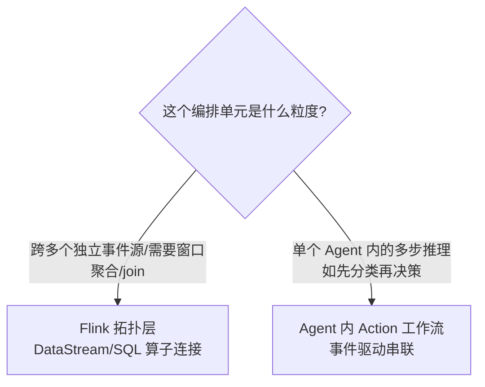
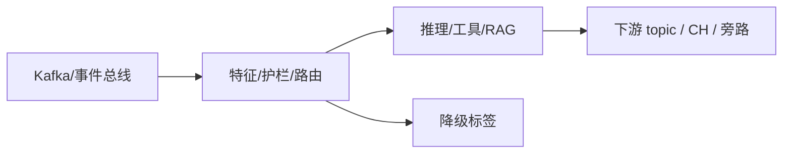

# 第 11 章 · Streaming Workflow:Agent 编排 vs Flink 拓扑编排

> Demo:代码/YAML 示意 · Level:L5

## 1. 问题:两种"编排"如何不打架

Flink 本身有一套拓扑编排语言(DataStream/SQL 的算子连接关系),Flink Agents 又提供了一套"事件驱动的 Action 编排"(一个 Agent 内多个 Action 通过事件互相触发,形成工作流)。当一个复杂系统同时用到两者时,容易出现"到底哪部分该用 Flink 拓扑表达,哪部分该用 Agent 内部工作流表达"的边界模糊。

## 2. 边界判断:粒度决定归属



判据一句话:**"数据形态的转换"(聚合、关联、过滤)交给 Flink 拓扑;"一个 Agent 内部的多步骤思考过程"交给 Action 编排**。例如案例三(车联网监控)里,"从原始 CAN 总线信号到风险信号的富化"是拓扑层的活(e10 CEP + e03 状态);"收到风险信号后,先判断严重等级、再决定是否需要调用远程诊断、再决定通知渠道"是一个 Agent 内部的多 Action 工作流。

## 3. YAML 声明式 API:非 Java/Python 团队的入口

Flink Agents 提供 YAML 声明式 API,允许不写代码定义简单的 Agent 工作流——这与 e08 CDC 的 YAML Pipeline 是同一设计哲学的延伸(把常见模式声明式化,降低非核心开发团队的接入门槛)。

```yaml
# 示意:YAML 声明式 Agent(具体 schema 以当前版本官方文档为准)
agent:
  name: severity-classifier
  actions:
    - name: classify
      listen: InputEvent
      chat_model: qwen_classifier
      prompt: severity_prompt
      on_result: RouteEvent
    - name: route
      listen: RouteEvent
      condition: "severity == 'HIGH'"
      then: NotifyEvent
```

## 4. 多步推理的状态传递

Action 工作流的每一步之间如何传递中间结果?两种方式:①通过自定义 Event 携带数据(第 7 章示例的 `sendEvent`);②通过 Sensory/Short-Term Memory 传递(第 8 章)。选择依据:**如果中间结果只在本次工作流内部使用**,走 Event 传递更清晰(数据流向在事件类型上一目了然);**如果中间结果需要跨多次触发复用**(如"上次分类的结果"),走记忆传递。

## 5. Demo 状态说明

本章以架构判断框架与 YAML 示意为主,不提供独立编译模块——工作流编排的价值在于"如何切分职责",这是设计层面的内容,具体实现已经在第 7-9 章的代码示例中体现(多个 Action 通过事件串联即是工作流的最小实现)。

## 6. 踩坑

| 坑 | 现象 | 解法 |
|---|---|---|
| 把跨事件源的聚合逻辑塞进单个 Action | Action 变得臃肿,失去 Flink 状态管理的优势 | 聚合类逻辑上提到 Flink 拓扑层(窗口/Join) |
| 用 Flink 拓扑表达简单的条件分支决策 | 拓扑图复杂化,可读性下降 | 简单的 if-then 决策留在 Agent Action 内 |

## 7. 最佳实践

- 系统设计文档中显式画出"拓扑层"与"Agent 工作流层"的分界线,团队协作时按此分工。
- YAML 声明式工作流优先用于变更频繁、逻辑简单的规则性 Agent(类比 e03-C7 Broadcast 规则的"运维可改"诉求)。

## 8. 面试题

① 给出一个"应该用 Flink 拓扑而非 Agent 工作流"的例子,反之亦然。② YAML 声明式 API 相比 Java/Python API 牺牲了什么、换取了什么?

## 9. 参考资料

Apache Flink Agents 官方文档(Multi-Language Support:Python/Java/YAML);e08(YAML Pipeline 同类设计哲学的参照)。

---

## Wave 2 扩写 · 11-streaming-workflow

### 背景加固

本章对应 AI 学习路径中的「11-streaming-workflow」。流式 AI 工程的约束与批式离线不同：延迟预算、成本封顶、降级路径、可观测追踪必须在作业图内一等公民对待。本仓库 e12 系列用零依赖 DataStream 演示机制；p01 提供可降级生产路径。

### 架构对照



控制面：预算、熔断、开关（Broadcast/侧输出）。数据面：embedding、提示、工具调用结果。
降级决策树：外部依赖超时 → 规则路径；成本超软顶 → 降采样；护栏命中 → 旁路。

### 与仓库 Demo 对照

- 优先查找 `examples/e12-11-*/README.md` 与同模块第二 Job；若编号为独立成册章节，见 `ai/README.md` 映射表。
- 生产对照：`projects/p01-log-ai-platform/`（AI off 默认可跑）。
- 规范：`best-practice/08-ai-degrade.md`。

### 踩坑实证

1. 坑 1：把同步外呼放在 map 线程；或无预算的工具调用；或无 trace 无法定位延迟。实证方向：用 e11/e12 作业制造超时，观察旁路与指标。

2. 坑 2：把同步外呼放在 map 线程；或无预算的工具调用；或无 trace 无法定位延迟。实证方向：用 e11/e12 作业制造超时，观察旁路与指标。

3. 坑 3：把同步外呼放在 map 线程；或无预算的工具调用；或无 trace 无法定位延迟。实证方向：用 e11/e12 作业制造超时，观察旁路与指标。

4. 坑 4：把同步外呼放在 map 线程；或无预算的工具调用；或无 trace 无法定位延迟。实证方向：用 e11/e12 作业制造超时，观察旁路与指标。

5. 坑 5：把同步外呼放在 map 线程；或无预算的工具调用；或无 trace 无法定位延迟。实证方向：用 e11/e12 作业制造超时，观察旁路与指标。

6. 坑 6：把同步外呼放在 map 线程；或无预算的工具调用；或无 trace 无法定位延迟。实证方向：用 e11/e12 作业制造超时，观察旁路与指标。

7. 坑 7：把同步外呼放在 map 线程；或无预算的工具调用；或无 trace 无法定位延迟。实证方向：用 e11/e12 作业制造超时，观察旁路与指标。

### 降级决策树

1. 依赖健康？否 → 规则/缓存路径。
2. 成本软顶？超 → 降采样/关昂贵模型。
3. 护栏分数？拒 → side output。
4. 全部通过 → 主输出。

### 验证步骤

1. 启动对应 e12 作业；注入正常/超时/超预算流量；检查主流与旁路；确认无违禁词文档；记录到个人 baseline 笔记。

2. 启动对应 e12 作业；注入正常/超时/超预算流量；检查主流与旁路；确认无违禁词文档；记录到个人 baseline 笔记。

3. 启动对应 e12 作业；注入正常/超时/超预算流量；检查主流与旁路；确认无违禁词文档；记录到个人 baseline 笔记。

4. 启动对应 e12 作业；注入正常/超时/超预算流量；检查主流与旁路；确认无违禁词文档；记录到个人 baseline 笔记。

5. 启动对应 e12 作业；注入正常/超时/超预算流量；检查主流与旁路；确认无违禁词文档；记录到个人 baseline 笔记。

### 面试钩子

用 90 秒讲清「11-streaming-workflow」：定义、流式约束、降级、仓库路径（e12/p01）、一个指标。题库见 `interview/L8.md`。

### 模式卡片

#### 卡片 11-streaming-workflow-1

问题：在流式场景下如何保证「11-streaming-workflow」相关能力可降级且可观测？
方案：作业内开关 + 旁路 + 预算；外呼 Async；缓存 TTL；追踪字段贯通。
验证：OrbStack 跑 e12；断依赖仍有输出契约。
反例：无开关硬依赖 Ollama/Milvus 导致主路径不可用。

#### 卡片 11-streaming-workflow-2

问题：在流式场景下如何保证「11-streaming-workflow」相关能力可降级且可观测？
方案：作业内开关 + 旁路 + 预算；外呼 Async；缓存 TTL；追踪字段贯通。
验证：OrbStack 跑 e12；断依赖仍有输出契约。
反例：无开关硬依赖 Ollama/Milvus 导致主路径不可用。

#### 卡片 11-streaming-workflow-3

问题：在流式场景下如何保证「11-streaming-workflow」相关能力可降级且可观测？
方案：作业内开关 + 旁路 + 预算；外呼 Async；缓存 TTL；追踪字段贯通。
验证：OrbStack 跑 e12；断依赖仍有输出契约。
反例：无开关硬依赖 Ollama/Milvus 导致主路径不可用。

#### 卡片 11-streaming-workflow-4

问题：在流式场景下如何保证「11-streaming-workflow」相关能力可降级且可观测？
方案：作业内开关 + 旁路 + 预算；外呼 Async；缓存 TTL；追踪字段贯通。
验证：OrbStack 跑 e12；断依赖仍有输出契约。
反例：无开关硬依赖 Ollama/Milvus 导致主路径不可用。

#### 卡片 11-streaming-workflow-5

问题：在流式场景下如何保证「11-streaming-workflow」相关能力可降级且可观测？
方案：作业内开关 + 旁路 + 预算；外呼 Async；缓存 TTL；追踪字段贯通。
验证：OrbStack 跑 e12；断依赖仍有输出契约。
反例：无开关硬依赖 Ollama/Milvus 导致主路径不可用。

#### 卡片 11-streaming-workflow-6

问题：在流式场景下如何保证「11-streaming-workflow」相关能力可降级且可观测？
方案：作业内开关 + 旁路 + 预算；外呼 Async；缓存 TTL；追踪字段贯通。
验证：OrbStack 跑 e12；断依赖仍有输出契约。
反例：无开关硬依赖 Ollama/Milvus 导致主路径不可用。

#### 卡片 11-streaming-workflow-7

问题：在流式场景下如何保证「11-streaming-workflow」相关能力可降级且可观测？
方案：作业内开关 + 旁路 + 预算；外呼 Async；缓存 TTL；追踪字段贯通。
验证：OrbStack 跑 e12；断依赖仍有输出契约。
反例：无开关硬依赖 Ollama/Milvus 导致主路径不可用。

#### 卡片 11-streaming-workflow-8

问题：在流式场景下如何保证「11-streaming-workflow」相关能力可降级且可观测？
方案：作业内开关 + 旁路 + 预算；外呼 Async；缓存 TTL；追踪字段贯通。
验证：OrbStack 跑 e12；断依赖仍有输出契约。
反例：无开关硬依赖 Ollama/Milvus 导致主路径不可用。

#### 卡片 11-streaming-workflow-9

问题：在流式场景下如何保证「11-streaming-workflow」相关能力可降级且可观测？
方案：作业内开关 + 旁路 + 预算；外呼 Async；缓存 TTL；追踪字段贯通。
验证：OrbStack 跑 e12；断依赖仍有输出契约。
反例：无开关硬依赖 Ollama/Milvus 导致主路径不可用。

#### 卡片 11-streaming-workflow-10

问题：在流式场景下如何保证「11-streaming-workflow」相关能力可降级且可观测？
方案：作业内开关 + 旁路 + 预算；外呼 Async；缓存 TTL；追踪字段贯通。
验证：OrbStack 跑 e12；断依赖仍有输出契约。
反例：无开关硬依赖 Ollama/Milvus 导致主路径不可用。

#### 卡片 11-streaming-workflow-11

问题：在流式场景下如何保证「11-streaming-workflow」相关能力可降级且可观测？
方案：作业内开关 + 旁路 + 预算；外呼 Async；缓存 TTL；追踪字段贯通。
验证：OrbStack 跑 e12；断依赖仍有输出契约。
反例：无开关硬依赖 Ollama/Milvus 导致主路径不可用。

