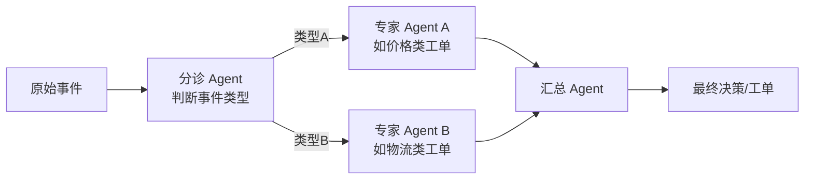

# 第 12 章 · Streaming Multi-Agent:多 Agent 协作拓扑

> Demo:代码示意 · Level:L5

## 1. 问题:分诊-专家-汇总模式

复杂决策场景往往不是单个 Agent 能独立完成的,而是需要"先分诊、再交给专家处理、最后汇总"的协作模式——类比人类组织里的"客服一线→专家二线→主管汇总"。事件驱动场景下,多个 Agent 通过事件消息互相协作,而不是像请求-响应式多 Agent 框架那样通过函数调用直接互相调用。

## 2. 协作拓扑

每个 Agent 只监听自己关心的事件类型(第 2 章事件契约的直接应用),分诊 Agent 产出的事件类型本身就是"路由决策"——类型 A 的事件只有专家 Agent A 在监听,类型 B 同理。这种"用事件类型做路由"的方式,天然获得了**松耦合**(新增专家 Agent C 不需要改分诊 Agent 的代码,只需要分诊 Agent 支持产出类型 C 的事件)。

## 3. 消息契约:多 Agent 协作的关键治理点

多 Agent 系统最容易失控的地方是"事件类型爆炸"——每加一个协作场景就加一种新事件类型,最终没人说得清系统里到底有多少种事件在流转。治理方法:

1. **事件类型注册表**:所有 Agent 间传递的事件类型集中登记(类比第 2 章的事件契约),包含"谁产出、谁消费、字段是什么"。
2. **分层事件命名**:如 `triage.classified`、`expert.priced`、`expert.shipped`、`summary.finalized`,从命名上就能看出所处协作阶段。
3. **超时兜底**:分诊后如果专家 Agent 长时间未响应(专家 Agent 本身故障或积压),需要有超时机制把事件转入人工兜底队列——这正是第 3 章 CEP(e10-C3 超时旁路)模式的多 Agent 版本。

## 4. 与单 Agent 内工作流(第 11 章)的区别

单 Agent 内多 Action 工作流适合"步骤间紧密耦合、状态频繁共享"的场景;多 Agent 协作适合"步骤间职责边界清晰、可独立伸缩、可能由不同团队维护"的场景。案例一(日志 AI 平台)里,"分诊+专家+汇总"这种粗粒度协作用多 Agent;每个专家 Agent 内部"先分类再决策"这种细粒度步骤用单 Agent 工作流——两者结合使用。

## 5. Demo 状态说明

本章以架构模式与事件契约治理方法为主,不提供独立编译模块:多 Agent 协作的具体实现是第 7 章"Agent + Action + Event"骨架的多实例组合,没有新增框架机制需要演示,重点在于设计方法论而非新 API。

## 6. 踩坑

| 坑 | 现象 | 解法 |
|---|---|---|
| 事件类型无治理,野蛜生长 | 没人说得清系统里有多少种事件在流转 | 建立事件类型注册表,新增事件类型走评审 |
| 专家 Agent 无超时兜底 | 专家 Agent 故障导致整条协作链路悬挂 | 引入超时+人工兜底队列(CEP 超时旁路模式) |
| 汇总 Agent 假设所有专家都会响应 | 部分响应缺失时汇总逻辑出错或永久等待 | 汇总逻辑显式处理"部分专家未响应"的场景 |

## 7. 最佳实践

- 多 Agent 协作拓扑画成架构图纳入设计评审,而不是只存在于代码里的隐式约定。
- 每个协作阶段的事件都应可独立重放(供故障排查用),这是事件驱动架构相对函数调用式多 Agent 框架的天然优势。

## 8. 面试题

① 多 Agent 协作与单 Agent 内工作流的选择边界是什么?② 如何防止多 Agent 系统的"事件类型爆炸"?③ 专家 Agent 长时间未响应时,系统应该如何降级?

## 9. 参考资料

第 2 章(事件契约);e10-C3(CEP 超时旁路,多 Agent 超时兜底的单机版参照)。
