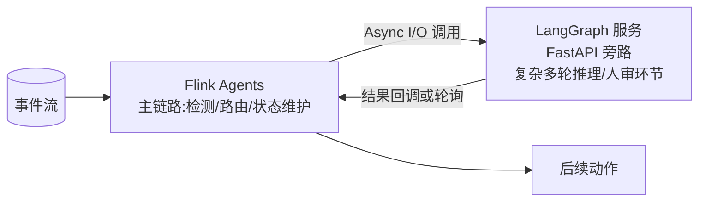
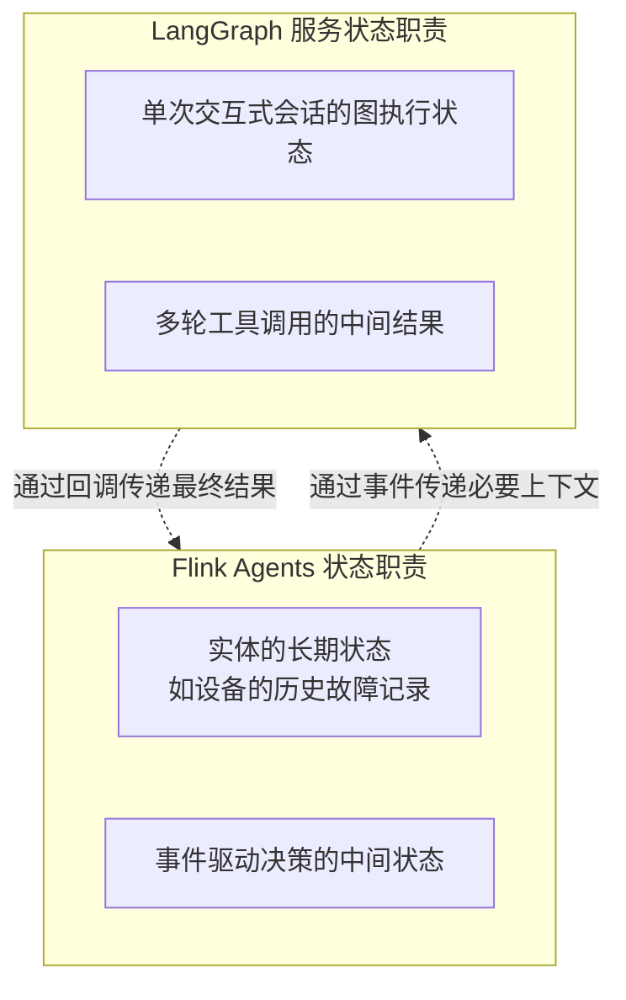
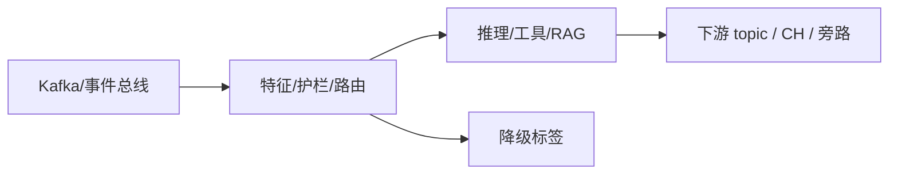

# 第 13 章 · Flink × LangGraph:何时外呼交互式服务

> Demo:代码示意(FastAPI+LangGraph 旁路服务的调用骨架)· Level:L5

## 1. 问题:不是所有环节都该用 Flink Agents 做

Flink Agents 擅长事件驱动、高吞吐、exactly-once 的场景;但有些环节天生是**交互式**的——需要人工审核、多轮澄清式对话、复杂的工具调用编排(这恰恰是 LangGraph 这类框架的强项)。把这类环节硬塞进 Flink Agents 的 Action 模型,会发现自己在用流处理引擎重新发明请求-响应框架的轮子。正确做法是:**Flink 负责事件驱动主链路,遇到需要交互式处理的节点,外呼一个独立的 LangGraph 服务,把结果异步收回主链路**。

## 2. 架构:Flink 作为编排层,LangGraph 作为交互式计算层



## 3. 判断标准:三个问题

1. **这个环节需要人工审核介入吗?** 需要 → LangGraph(或类似框架)天然支持"中断等待人工输入"的图执行模型,Flink Agents 目前没有对等的原生支持。
2. **这个环节的推理路径是否高度依赖上一步的中间结果动态决定(多轮工具调用编排)?** 是 → LangGraph 的图执行模型专为此设计;Flink Agents 的 Action-Event 模型也能做,但需要手工设计更多事件类型,复杂推理编排不是它的优化重点。
3. **这个环节的吞吐要求是否是"事件驱动、高频、低延迟"?** 是 → 留在 Flink 侧;否 → 允许外呼到独立服务,承受额外网络跳数的代价换取更合适的编排能力。

## 4. 状态归属:谁管什么

这是最容易出问题的设计决策:**Flink 侧的状态(实体的持续演化历史)与 LangGraph 侧的状态(单次交互式会话的中间推理状态)必须明确分工,不要重复存储、也不要跨界读写**。



## 5. 调用骨架

```java
// Flink 侧:通过 Async I/O 外呼 LangGraph 服务(与 e11 完全同构,LangGraph 只是"外部系统"的一种)
@Action(listenEvents = {NeedsComplexReasoningEvent.class})
public void delegateToLangGraph(Event event, RunnerContext ctx) throws Exception {
    NeedsComplexReasoningEvent e = (NeedsComplexReasoningEvent) event;
    String result = ctx.executeAsync(() -> langGraphClient.invoke(e.context));
    ctx.sendEvent(new ReasoningCompleteEvent(result));
}
```

```python
# LangGraph 侧(FastAPI 旁路服务示意,你已有的 atelier/synapse 类工程经验可直接复用)
from fastapi import FastAPI
app = FastAPI()

@app.post("/reason")
async def reason(payload: dict):
    result = await langgraph_app.ainvoke({"input": payload})
    return {"output": result}
```

## 6. Demo 状态说明

本章以架构决策框架与调用骨架为主。Flink 侧的 Async I/O 调用模式与 e11 完全一致(无新增机制需要单独验证);LangGraph 服务侧的实现直接复用你已有的 FastAPI + LangGraph 工程经验(atelier、synapse 等项目已验证过的模式),此处不重复展开完整实现。

## 7. 踩坑

| 坑 | 现象 | 解法 |
|---|---|---|
| 状态在两个系统间重复存储 | 一致性问题,谁的状态才是"真相" | 明确状态归属边界(第 4 节图示) |
| 把高频事件也外呼 LangGraph | LangGraph 服务成为吞吐瓶颈 | 只对确实需要交互式编排的低频/复杂环节外呼 |
| 外呼无超时降级 | 与其它外部系统调用相同的军规 4/e11 问题 | 复用 e11 可靠性三件套 |

## 8. 最佳实践

- 架构文档显式标注"哪些节点在 Flink 侧、哪些在 LangGraph 侧",作为团队协作的接口契约。
- LangGraph 服务的可用性纳入 Flink 侧的降级路径设计,该服务不可用时主链路仍能以降级模式运行。

## 9. 面试题

① 什么信号提示"这个环节该外呼 LangGraph 而非硬塞进 Flink Agents"?② 两个系统的状态边界如果设计不清晰,会导致什么具体故障?③ 如何设计"LangGraph 服务不可用"时的降级路径?

## 10. 参考资料

e11(Async I/O 可靠性三件套,是本章调用骨架的直接基础);你此前的 synapse/atelier 项目经验(FastAPI+LangGraph 集成模式)。

---

## Wave 2 扩写 · 13-flink-langgraph

### 背景加固

本章对应 AI 学习路径中的「13-flink-langgraph」。流式 AI 工程的约束与批式离线不同：延迟预算、成本封顶、降级路径、可观测追踪必须在作业图内一等公民对待。本仓库 e12 系列用零依赖 DataStream 演示机制；p01 提供可降级生产路径。

### 架构对照



控制面：预算、熔断、开关（Broadcast/侧输出）。数据面：embedding、提示、工具调用结果。
降级决策树：外部依赖超时 → 规则路径；成本超软顶 → 降采样；护栏命中 → 旁路。

### 与仓库 Demo 对照

- 优先查找 `examples/e12-13-*/README.md` 与同模块第二 Job；若编号为独立成册章节，见 `ai/README.md` 映射表。
- 生产对照：`projects/p01-log-ai-platform/`（AI off 默认可跑）。
- 规范：`best-practice/08-ai-degrade.md`。

### 踩坑实证

1. 坑 1：把同步外呼放在 map 线程；或无预算的工具调用；或无 trace 无法定位延迟。实证方向：用 e11/e12 作业制造超时，观察旁路与指标。

2. 坑 2：把同步外呼放在 map 线程；或无预算的工具调用；或无 trace 无法定位延迟。实证方向：用 e11/e12 作业制造超时，观察旁路与指标。

3. 坑 3：把同步外呼放在 map 线程；或无预算的工具调用；或无 trace 无法定位延迟。实证方向：用 e11/e12 作业制造超时，观察旁路与指标。

4. 坑 4：把同步外呼放在 map 线程；或无预算的工具调用；或无 trace 无法定位延迟。实证方向：用 e11/e12 作业制造超时，观察旁路与指标。

5. 坑 5：把同步外呼放在 map 线程；或无预算的工具调用；或无 trace 无法定位延迟。实证方向：用 e11/e12 作业制造超时，观察旁路与指标。

6. 坑 6：把同步外呼放在 map 线程；或无预算的工具调用；或无 trace 无法定位延迟。实证方向：用 e11/e12 作业制造超时，观察旁路与指标。

7. 坑 7：把同步外呼放在 map 线程；或无预算的工具调用；或无 trace 无法定位延迟。实证方向：用 e11/e12 作业制造超时，观察旁路与指标。

### 降级决策树

1. 依赖健康？否 → 规则/缓存路径。
2. 成本软顶？超 → 降采样/关昂贵模型。
3. 护栏分数？拒 → side output。
4. 全部通过 → 主输出。

### 验证步骤

1. 启动对应 e12 作业；注入正常/超时/超预算流量；检查主流与旁路；确认无违禁词文档；记录到个人 baseline 笔记。

2. 启动对应 e12 作业；注入正常/超时/超预算流量；检查主流与旁路；确认无违禁词文档；记录到个人 baseline 笔记。

3. 启动对应 e12 作业；注入正常/超时/超预算流量；检查主流与旁路；确认无违禁词文档；记录到个人 baseline 笔记。

4. 启动对应 e12 作业；注入正常/超时/超预算流量；检查主流与旁路；确认无违禁词文档；记录到个人 baseline 笔记。

5. 启动对应 e12 作业；注入正常/超时/超预算流量；检查主流与旁路；确认无违禁词文档；记录到个人 baseline 笔记。

### 面试钩子

用 90 秒讲清「13-flink-langgraph」：定义、流式约束、降级、仓库路径（e12/p01）、一个指标。题库见 `interview/L8.md`。

### 模式卡片

#### 卡片 13-flink-langgraph-1

问题：在流式场景下如何保证「13-flink-langgraph」相关能力可降级且可观测？
方案：作业内开关 + 旁路 + 预算；外呼 Async；缓存 TTL；追踪字段贯通。
验证：OrbStack 跑 e12；断依赖仍有输出契约。
反例：无开关硬依赖 Ollama/Milvus 导致主路径不可用。

#### 卡片 13-flink-langgraph-2

问题：在流式场景下如何保证「13-flink-langgraph」相关能力可降级且可观测？
方案：作业内开关 + 旁路 + 预算；外呼 Async；缓存 TTL；追踪字段贯通。
验证：OrbStack 跑 e12；断依赖仍有输出契约。
反例：无开关硬依赖 Ollama/Milvus 导致主路径不可用。

#### 卡片 13-flink-langgraph-3

问题：在流式场景下如何保证「13-flink-langgraph」相关能力可降级且可观测？
方案：作业内开关 + 旁路 + 预算；外呼 Async；缓存 TTL；追踪字段贯通。
验证：OrbStack 跑 e12；断依赖仍有输出契约。
反例：无开关硬依赖 Ollama/Milvus 导致主路径不可用。

#### 卡片 13-flink-langgraph-4

问题：在流式场景下如何保证「13-flink-langgraph」相关能力可降级且可观测？
方案：作业内开关 + 旁路 + 预算；外呼 Async；缓存 TTL；追踪字段贯通。
验证：OrbStack 跑 e12；断依赖仍有输出契约。
反例：无开关硬依赖 Ollama/Milvus 导致主路径不可用。

#### 卡片 13-flink-langgraph-5

问题：在流式场景下如何保证「13-flink-langgraph」相关能力可降级且可观测？
方案：作业内开关 + 旁路 + 预算；外呼 Async；缓存 TTL；追踪字段贯通。
验证：OrbStack 跑 e12；断依赖仍有输出契约。
反例：无开关硬依赖 Ollama/Milvus 导致主路径不可用。

#### 卡片 13-flink-langgraph-6

问题：在流式场景下如何保证「13-flink-langgraph」相关能力可降级且可观测？
方案：作业内开关 + 旁路 + 预算；外呼 Async；缓存 TTL；追踪字段贯通。
验证：OrbStack 跑 e12；断依赖仍有输出契约。
反例：无开关硬依赖 Ollama/Milvus 导致主路径不可用。

#### 卡片 13-flink-langgraph-7

问题：在流式场景下如何保证「13-flink-langgraph」相关能力可降级且可观测？
方案：作业内开关 + 旁路 + 预算；外呼 Async；缓存 TTL；追踪字段贯通。
验证：OrbStack 跑 e12；断依赖仍有输出契约。
反例：无开关硬依赖 Ollama/Milvus 导致主路径不可用。

#### 卡片 13-flink-langgraph-8

问题：在流式场景下如何保证「13-flink-langgraph」相关能力可降级且可观测？
方案：作业内开关 + 旁路 + 预算；外呼 Async；缓存 TTL；追踪字段贯通。
验证：OrbStack 跑 e12；断依赖仍有输出契约。
反例：无开关硬依赖 Ollama/Milvus 导致主路径不可用。

#### 卡片 13-flink-langgraph-9

问题：在流式场景下如何保证「13-flink-langgraph」相关能力可降级且可观测？
方案：作业内开关 + 旁路 + 预算；外呼 Async；缓存 TTL；追踪字段贯通。
验证：OrbStack 跑 e12；断依赖仍有输出契约。
反例：无开关硬依赖 Ollama/Milvus 导致主路径不可用。

#### 卡片 13-flink-langgraph-10

问题：在流式场景下如何保证「13-flink-langgraph」相关能力可降级且可观测？
方案：作业内开关 + 旁路 + 预算；外呼 Async；缓存 TTL；追踪字段贯通。
验证：OrbStack 跑 e12；断依赖仍有输出契约。
反例：无开关硬依赖 Ollama/Milvus 导致主路径不可用。

#### 卡片 13-flink-langgraph-11

问题：在流式场景下如何保证「13-flink-langgraph」相关能力可降级且可观测？
方案：作业内开关 + 旁路 + 预算；外呼 Async；缓存 TTL；追踪字段贯通。
验证：OrbStack 跑 e12；断依赖仍有输出契约。
反例：无开关硬依赖 Ollama/Milvus 导致主路径不可用。

