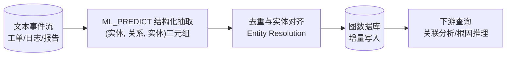

# 第 14 章 · Streaming Knowledge / Graph:流式知识抽取与图更新

> Demo:代码示意(结合 e05 SQL UDF + e07 JDBC/图数据库写入模式)· Level:L5

## 1. 问题:知识图谱为什么也要"流式"

企业知识图谱(实体关系网络,如"设备-维修记录-供应商"三元关系)传统上是批量 ETL 构建的,更新周期以天为单位。但很多场景需要"新增一条工单立刻更新图谱中的关系"(如"这台设备与这个新发现的故障模式建立关联"),批量构建无法满足。流式知识抽取的目标是把"从非结构化文本中抽取实体与关系"这个通常认为需要离线批处理的任务,做成事件驱动的增量更新。

## 2. 架构



## 3. 核心步骤:抽取 → 对齐 → 写入

**抽取**:用 `ML_PREDICT`(第 3 章)调用 LLM,把非结构化文本转成结构化三元组(主体、关系、客体)。

```sql
CREATE MODEL entity_extractor
INPUT (text STRING) OUTPUT (triples ARRAY<ROW<subject STRING, relation STRING, object STRING>>)
WITH ('provider'='openai','endpoint'='http://host.docker.internal:11434/v1',
      'model-name'='qwen3:8b','task'='extraction');
```

**对齐(Entity Resolution)**:LLM 抽取出的实体名可能是同一实体的不同表述("发动机故障"与"引擎异常"),需要对齐到统一的实体 ID——这一步通常结合向量相似度(第 4 章的 embedding)做模糊匹配,加规则库做精确匹配。

**写入**:图数据库(如 Neo4j/JanusGraph)的写入本质上是"节点 upsert + 边 upsert",与 e09 Paimon 主键表、e07-C2 JDBC upsert 是同一模式在图数据模型上的应用;若无专用图数据库,也可以用关系数据库的邻接表/三元组表模拟(适合中小规模)。

## 4. 增量更新的一致性挑战

与第 5 章 Streaming RAG 面临的问题类似:图谱的增量更新需要处理"矛盾信息"(新工单说 A 导致 B,但历史记录说 A 与 B 无关)——工程上通常引入**置信度**与**时间衰减**:每条边带置信度分数,矛盾边共存,下游查询按置信度加权,而不是"后来者覆盖先来者"这种简单策略(简单覆盖会丢失历史证据、且容易被单条错误抽取污染)。

## 5. Demo 状态说明

本章以架构方法论为主,不提供独立编译模块:核心技术组件(`ML_PREDICT` 结构化抽取见第 3 章、向量相似度见第 4 章、upsert 写入见 e07-C2/e09)均已在其它章节提供过具体 Demo,本章重点在于把它们组合成"知识图谱构建"这一新应用场景的方法论,而非引入新的框架机制。

## 6. 踩坑

| 坑 | 现象 | 解法 |
|---|---|---|
| 无实体对齐直接写入 | 图谱中出现大量同义重复节点 | 引入实体对齐步骤(向量相似度+规则库) |
| 矛盾信息简单覆盖 | 历史证据丢失,单条错误抽取污染全图 | 置信度加权共存,而非覆盖 |
| LLM 抽取无校验 | 幻觉关系被写入图谱,污染下游推理 | 抽取结果设最低置信度阈值,或人工抽样审核 |

## 7. 最佳实践

- 图谱更新记录变更历史(类似 e09 Time Travel),支持追溯"这条关系是什么时候、依据什么证据加入的"。
- LLM 抽取的置信度应作为一等公民字段贯穿抽取-对齐-写入-查询全链路,而不是在某一步被丢弃。

## 8. 面试题

① 为什么"后来者覆盖先来者"是知识图谱增量更新的反模式?② 实体对齐通常结合哪两类方法,各自解决什么问题?③ 如何设计图谱更新的可追溯性?

## 9. 参考资料

第 3 章(ML_PREDICT 结构化抽取)、第 4 章(向量相似度用于实体对齐)、e07-C2/e09(upsert 写入模式的类比参照)。
