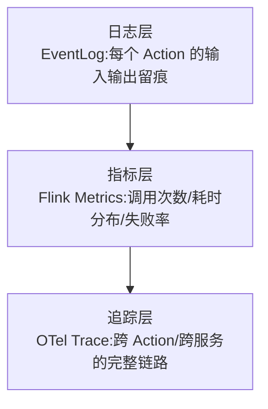
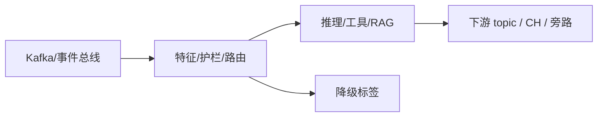

# 第 15 章 · Streaming Observability:Agent EventLog、OTel Trace、指标体系

> Demo:e12-15(完整可运行,基于 Flink Metrics API + 结构化日志,无 Preview API 依赖)· Level:L4

## 1. 问题:Agent 出了问题,怎么知道"它当时在想什么"

事件驱动 Agent 的可观测性比传统微服务更难:一个决策可能横跨多个 Action、多次 LLM 调用、多次状态读写,传统的"看一条 HTTP 请求日志"排障方式完全不适用。Flink Agents 0.3 把 EventLog 直接接入 Flink WebUI(默认启用),支持按事件类型配置日志级别——这是本章的框架层能力;本仓库额外补充了不依赖 Agents Preview API、任何 Flink 作业都能用的通用可观测性三件套。

## 2. 三层可观测性



## 3. 指标体系:四类必须有的指标

1. **吞吐指标**:每个 Action 每秒处理的事件数;
2. **延迟指标**:P50/P95/P99 处理耗时(尤其是含 LLM 调用的 Action,耗时方差远大于普通算子,详见第 3 章);
3. **错误率指标**:超时/异常/降级触发次数;
4. **业务指标**:如"告警产出速率""检测到的异常类型分布"——这类指标与纯技术指标同等重要,却最容易被遗漏。

```java
// Flink Metrics API 示例(不依赖 Agents Preview API,任何 RichFunction/Action 均可用)
public class ObservableThresholdCheck extends KeyedProcessFunction<String, Event, String> {
    private transient Counter alertCounter;
    private transient Histogram latencyHistogram;

    @Override
    public void open(OpenContext ctx) {
        alertCounter = getRuntimeContext().getMetricGroup()
                .counter("alerts_triggered");
        latencyHistogram = getRuntimeContext().getMetricGroup()
                .histogram("decision_latency_ms",
                        new DescriptiveStatisticsHistogram(1000));
    }

    @Override
    public void processElement(Event e, Context ctx, Collector<String> out) {
        long start = System.currentTimeMillis();
        boolean triggered = evaluate(e);
        latencyHistogram.update(System.currentTimeMillis() - start);
        if (triggered) {
            alertCounter.inc();
            out.collect("ALERT: " + e);
        }
    }
}
```

这些自定义 Metrics 通过已有的 Prometheus/Grafana 管道(docker-compose 已接通)直接可视化,不需要额外基础设施——这是本仓库从 Phase 0 就搭好可观测性底座的收益在 AI 场景的延续。

## 4. EventLog:结构化留痕

即使不使用 Flink Agents 框架自带的 EventLog,任何 Action/算子都应该对"关键决策点"做结构化日志留痕,便于事后重建决策路径:

```java
log.info("agent_decision event={} action={} input={} output={} latency_ms={} model_version={}",
        eventId, "checkThreshold", inputSummary, decision, latencyMs, modelVersion);
```

结构化(而非自由文本)日志是关键:字段化后才能被 ClickHouse/ELK 等系统索引查询,支撑"过去一小时哪些决策依据了哪个模型版本"这类排障问题。

## 5. Demo 状态

`examples/e12-15-observability/` 提供完整可运行的 DataStream 作业,演示自定义 Metrics(Counter/Histogram)接入 Flink Metrics API 并可在 Grafana 面板观察,以及结构化 EventLog 的输出格式约定。**本 Demo 不依赖任何 Preview API 或外部 LLM 服务**,置信度与 e12-06 同级,可直接本地验证。

## 6. 踩坑

| 坑 | 现象 | 解法 |
|---|---|---|
| 只记自由文本日志 | 排障时无法结构化查询,靠人工翻日志 | 统一结构化字段(JSON 或 key=value) |
| 只有技术指标没有业务指标 | 系统"看起来健康"但业务效果在下滑 | 指标体系必须包含业务侧指标 |
| LLM 调用延迟未单独监控 | 延迟劣化时无法定位是普通算子还是模型调用的问题 | 含 LLM 调用的 Action 单独打点,与其它 Action 区分 |

## 7. 最佳实践

- 每个 Agent 上线前定义"如果出问题,我需要看哪三个指标才能定位"——这是可观测性设计评审的核心问题。
- Grafana 看板固化"吞吐-延迟-错误率-业务指标"四象限布局,作为所有 Agent 类作业的统一看板模板。

## 8. 面试题

① 为什么事件驱动 Agent 的可观测性比传统微服务更难?② 结构化日志相比自由文本日志,在系统层面带来了什么能力?③ 如何设计"含 LLM 调用的算子"与"普通算子"的差异化监控策略?

## 9. 参考资料

Apache Flink Agents 0.3.0 Release Announcement(EventLog/WebUI 集成);Flink 官方 Metrics 文档;monitoring/(本仓库 Phase 5 的完整看板方案)。

---

## Wave 2 扩写 · 15-streaming-observability

### 背景加固

本章对应 AI 学习路径中的「15-streaming-observability」。流式 AI 工程的约束与批式离线不同：延迟预算、成本封顶、降级路径、可观测追踪必须在作业图内一等公民对待。本仓库 e12 系列用零依赖 DataStream 演示机制；p01 提供可降级生产路径。

### 架构对照



控制面：预算、熔断、开关（Broadcast/侧输出）。数据面：embedding、提示、工具调用结果。
降级决策树：外部依赖超时 → 规则路径；成本超软顶 → 降采样；护栏命中 → 旁路。

### 与仓库 Demo 对照

- 优先查找 `examples/e12-15-*/README.md` 与同模块第二 Job；若编号为独立成册章节，见 `ai/README.md` 映射表。
- 生产对照：`projects/p01-log-ai-platform/`（AI off 默认可跑）。
- 规范：`best-practice/08-ai-degrade.md`。

### 踩坑实证

1. 坑 1：把同步外呼放在 map 线程；或无预算的工具调用；或无 trace 无法定位延迟。实证方向：用 e11/e12 作业制造超时，观察旁路与指标。

2. 坑 2：把同步外呼放在 map 线程；或无预算的工具调用；或无 trace 无法定位延迟。实证方向：用 e11/e12 作业制造超时，观察旁路与指标。

3. 坑 3：把同步外呼放在 map 线程；或无预算的工具调用；或无 trace 无法定位延迟。实证方向：用 e11/e12 作业制造超时，观察旁路与指标。

4. 坑 4：把同步外呼放在 map 线程；或无预算的工具调用；或无 trace 无法定位延迟。实证方向：用 e11/e12 作业制造超时，观察旁路与指标。

5. 坑 5：把同步外呼放在 map 线程；或无预算的工具调用；或无 trace 无法定位延迟。实证方向：用 e11/e12 作业制造超时，观察旁路与指标。

6. 坑 6：把同步外呼放在 map 线程；或无预算的工具调用；或无 trace 无法定位延迟。实证方向：用 e11/e12 作业制造超时，观察旁路与指标。

7. 坑 7：把同步外呼放在 map 线程；或无预算的工具调用；或无 trace 无法定位延迟。实证方向：用 e11/e12 作业制造超时，观察旁路与指标。

### 降级决策树

1. 依赖健康？否 → 规则/缓存路径。
2. 成本软顶？超 → 降采样/关昂贵模型。
3. 护栏分数？拒 → side output。
4. 全部通过 → 主输出。

### 验证步骤

1. 启动对应 e12 作业；注入正常/超时/超预算流量；检查主流与旁路；确认无违禁词文档；记录到个人 baseline 笔记。

2. 启动对应 e12 作业；注入正常/超时/超预算流量；检查主流与旁路；确认无违禁词文档；记录到个人 baseline 笔记。

3. 启动对应 e12 作业；注入正常/超时/超预算流量；检查主流与旁路；确认无违禁词文档；记录到个人 baseline 笔记。

4. 启动对应 e12 作业；注入正常/超时/超预算流量；检查主流与旁路；确认无违禁词文档；记录到个人 baseline 笔记。

5. 启动对应 e12 作业；注入正常/超时/超预算流量；检查主流与旁路；确认无违禁词文档；记录到个人 baseline 笔记。

### 面试钩子

用 90 秒讲清「15-streaming-observability」：定义、流式约束、降级、仓库路径（e12/p01）、一个指标。题库见 `interview/L8.md`。

### 模式卡片

#### 卡片 15-streaming-observability-1

问题：在流式场景下如何保证「15-streaming-observability」相关能力可降级且可观测？
方案：作业内开关 + 旁路 + 预算；外呼 Async；缓存 TTL；追踪字段贯通。
验证：OrbStack 跑 e12；断依赖仍有输出契约。
反例：无开关硬依赖 Ollama/Milvus 导致主路径不可用。

#### 卡片 15-streaming-observability-2

问题：在流式场景下如何保证「15-streaming-observability」相关能力可降级且可观测？
方案：作业内开关 + 旁路 + 预算；外呼 Async；缓存 TTL；追踪字段贯通。
验证：OrbStack 跑 e12；断依赖仍有输出契约。
反例：无开关硬依赖 Ollama/Milvus 导致主路径不可用。

#### 卡片 15-streaming-observability-3

问题：在流式场景下如何保证「15-streaming-observability」相关能力可降级且可观测？
方案：作业内开关 + 旁路 + 预算；外呼 Async；缓存 TTL；追踪字段贯通。
验证：OrbStack 跑 e12；断依赖仍有输出契约。
反例：无开关硬依赖 Ollama/Milvus 导致主路径不可用。

#### 卡片 15-streaming-observability-4

问题：在流式场景下如何保证「15-streaming-observability」相关能力可降级且可观测？
方案：作业内开关 + 旁路 + 预算；外呼 Async；缓存 TTL；追踪字段贯通。
验证：OrbStack 跑 e12；断依赖仍有输出契约。
反例：无开关硬依赖 Ollama/Milvus 导致主路径不可用。

#### 卡片 15-streaming-observability-5

问题：在流式场景下如何保证「15-streaming-observability」相关能力可降级且可观测？
方案：作业内开关 + 旁路 + 预算；外呼 Async；缓存 TTL；追踪字段贯通。
验证：OrbStack 跑 e12；断依赖仍有输出契约。
反例：无开关硬依赖 Ollama/Milvus 导致主路径不可用。

#### 卡片 15-streaming-observability-6

问题：在流式场景下如何保证「15-streaming-observability」相关能力可降级且可观测？
方案：作业内开关 + 旁路 + 预算；外呼 Async；缓存 TTL；追踪字段贯通。
验证：OrbStack 跑 e12；断依赖仍有输出契约。
反例：无开关硬依赖 Ollama/Milvus 导致主路径不可用。

#### 卡片 15-streaming-observability-7

问题：在流式场景下如何保证「15-streaming-observability」相关能力可降级且可观测？
方案：作业内开关 + 旁路 + 预算；外呼 Async；缓存 TTL；追踪字段贯通。
验证：OrbStack 跑 e12；断依赖仍有输出契约。
反例：无开关硬依赖 Ollama/Milvus 导致主路径不可用。

#### 卡片 15-streaming-observability-8

问题：在流式场景下如何保证「15-streaming-observability」相关能力可降级且可观测？
方案：作业内开关 + 旁路 + 预算；外呼 Async；缓存 TTL；追踪字段贯通。
验证：OrbStack 跑 e12；断依赖仍有输出契约。
反例：无开关硬依赖 Ollama/Milvus 导致主路径不可用。

#### 卡片 15-streaming-observability-9

问题：在流式场景下如何保证「15-streaming-observability」相关能力可降级且可观测？
方案：作业内开关 + 旁路 + 预算；外呼 Async；缓存 TTL；追踪字段贯通。
验证：OrbStack 跑 e12；断依赖仍有输出契约。
反例：无开关硬依赖 Ollama/Milvus 导致主路径不可用。

#### 卡片 15-streaming-observability-10

问题：在流式场景下如何保证「15-streaming-observability」相关能力可降级且可观测？
方案：作业内开关 + 旁路 + 预算；外呼 Async；缓存 TTL；追踪字段贯通。
验证：OrbStack 跑 e12；断依赖仍有输出契约。
反例：无开关硬依赖 Ollama/Milvus 导致主路径不可用。

#### 卡片 15-streaming-observability-11

问题：在流式场景下如何保证「15-streaming-observability」相关能力可降级且可观测？
方案：作业内开关 + 旁路 + 预算；外呼 Async；缓存 TTL；追踪字段贯通。
验证：OrbStack 跑 e12；断依赖仍有输出契约。
反例：无开关硬依赖 Ollama/Milvus 导致主路径不可用。

