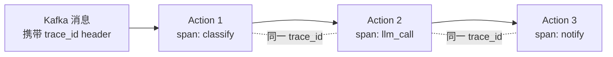
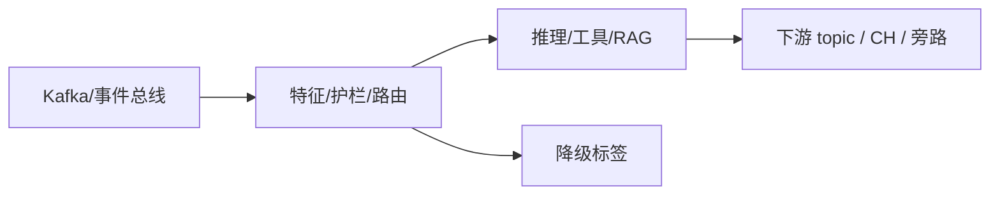

# 第 16 章 · Streaming Trace:从 Kafka 到 LLM 到动作的全链路追踪

> Demo:代码示意(建立在第 15 章 Metrics/日志基础之上)· Level:L4

## 1. 问题:一条事件的"一生"如何被完整重建

第 15 章解决了"某个 Action 内部发生了什么",本章要解决更进一步的问题:**一条事件从 Kafka 摄入,经过多少个 Action、多少次 LLM 调用、最终触发了什么动作,这条完整链路能否被端到端重建**。这是分布式追踪(Distributed Tracing)在流式 AI 场景的应用。

## 2. Trace 模型:TraceId 贯穿全链路



核心机制:**每条事件在进入系统的第一刻分配一个 trace_id(或沿用上游系统已有的),后续所有处理环节(Action、LLM 调用、工具调用)都携带这个 trace_id,并各自上报一个 span(记录该环节的开始/结束时间与关键属性)**。这正是 e07-C3 讲过的"Kafka headers 携带元数据"的生产落地——trace_id 就是最重要的 header 之一。

## 3. OpenTelemetry 集成

```java
// 每个 Action 内创建 span,记录关键属性(简化示意,生产实现依赖 OTel SDK 与 Trace 上下文传播)
Span span = tracer.spanBuilder("classify_severity")
        .setParent(Context.current().with(extractSpanFromKafkaHeaders(record)))
        .startSpan();
try (Scope scope = span.makeCurrent()) {
    span.setAttribute("model_version", modelVersion);
    span.setAttribute("input_length", text.length());
    String result = classify(text);
    span.setAttribute("result", result);
} finally {
    span.end();
}
```

Trace 数据汇聚到 Jaeger/Tempo 等追踪后端后,可以可视化出"这条工单从进入系统到最终工单派发,一共经过了哪些步骤、每步耗时多少"——这是排查"为什么这条决策用了 8 秒而不是预期的 200 毫秒"类问题的关键工具。

## 4. 与 Metrics/日志的协同

三种可观测性手段解决不同粒度的问题:**指标**回答"系统整体健康吗"(聚合视角);**日志**回答"某个具体环节发生了什么"(单点视角);**Trace** 回答"一条请求完整的时间线是什么"(端到端视角)。三者应该通过 trace_id/event_id 关联——从 Grafana 看到延迟异常(指标)→ 按 trace_id 查到具体是哪条事件慢(Trace)→ 展开该环节的详细日志排查根因(日志)。

## 5. Demo 状态说明

本章以架构设计与代码骨架为主,依赖 OpenTelemetry SDK 与追踪后端(Jaeger/Tempo),这些是通用可观测性基础设施而非 Flink/Agents 特有能力,本仓库不重复搭建(超出流处理教学范围),鼓励在实际项目中接入企业已有的 APM/Trace 体系。

## 6. 踩坑

| 坑 | 现象 | 解法 |
|---|---|---|
| trace_id 在跨系统边界丢失 | 追踪链路断裂,无法重建完整时间线 | 每个系统边界(Kafka header、HTTP header、RPC metadata)显式传播 trace_id |
| 只在关键 Action 打 span | 追踪出现空白区间 | 全链路一致的 span 打点纪律,而非选择性打点 |
| Trace 数据量过大拖垮系统 | 全量追踪的存储与传输开销显著 | 按采样率追踪(如 1% 全量,其余仅在异常时全量) |

## 7. 最佳实践

- trace_id 生成规则与传播路径写入架构文档,作为团队共同遵守的契约。
- 采样策略:正常流量按低采样率追踪,一旦触发错误/超时,该条 trace 强制全量保留(错误优先采样)。

## 8. 面试题

① 指标、日志、Trace 三者分别回答什么问题,为什么需要三者协同而非只用一种?② trace_id 在什么系统边界最容易丢失,如何预防?③ 全量追踪与采样追踪的权衡依据是什么?

## 9. 参考资料

OpenTelemetry 官方文档;第 15 章(指标与日志基础);e07-C3(Kafka headers 携带元数据的机制基础)。

---

## Wave 2 扩写 · 16-streaming-trace

### 背景加固

本章对应 AI 学习路径中的「16-streaming-trace」。流式 AI 工程的约束与批式离线不同：延迟预算、成本封顶、降级路径、可观测追踪必须在作业图内一等公民对待。本仓库 e12 系列用零依赖 DataStream 演示机制；p01 提供可降级生产路径。

### 架构对照



控制面：预算、熔断、开关（Broadcast/侧输出）。数据面：embedding、提示、工具调用结果。
降级决策树：外部依赖超时 → 规则路径；成本超软顶 → 降采样；护栏命中 → 旁路。

### 与仓库 Demo 对照

- 优先查找 `examples/e12-16-*/README.md` 与同模块第二 Job；若编号为独立成册章节，见 `ai/README.md` 映射表。
- 生产对照：`projects/p01-log-ai-platform/`（AI off 默认可跑）。
- 规范：`best-practice/08-ai-degrade.md`。

### 踩坑实证

1. 坑 1：把同步外呼放在 map 线程；或无预算的工具调用；或无 trace 无法定位延迟。实证方向：用 e11/e12 作业制造超时，观察旁路与指标。

2. 坑 2：把同步外呼放在 map 线程；或无预算的工具调用；或无 trace 无法定位延迟。实证方向：用 e11/e12 作业制造超时，观察旁路与指标。

3. 坑 3：把同步外呼放在 map 线程；或无预算的工具调用；或无 trace 无法定位延迟。实证方向：用 e11/e12 作业制造超时，观察旁路与指标。

4. 坑 4：把同步外呼放在 map 线程；或无预算的工具调用；或无 trace 无法定位延迟。实证方向：用 e11/e12 作业制造超时，观察旁路与指标。

5. 坑 5：把同步外呼放在 map 线程；或无预算的工具调用；或无 trace 无法定位延迟。实证方向：用 e11/e12 作业制造超时，观察旁路与指标。

6. 坑 6：把同步外呼放在 map 线程；或无预算的工具调用；或无 trace 无法定位延迟。实证方向：用 e11/e12 作业制造超时，观察旁路与指标。

7. 坑 7：把同步外呼放在 map 线程；或无预算的工具调用；或无 trace 无法定位延迟。实证方向：用 e11/e12 作业制造超时，观察旁路与指标。

### 降级决策树

1. 依赖健康？否 → 规则/缓存路径。
2. 成本软顶？超 → 降采样/关昂贵模型。
3. 护栏分数？拒 → side output。
4. 全部通过 → 主输出。

### 验证步骤

1. 启动对应 e12 作业；注入正常/超时/超预算流量；检查主流与旁路；确认无违禁词文档；记录到个人 baseline 笔记。

2. 启动对应 e12 作业；注入正常/超时/超预算流量；检查主流与旁路；确认无违禁词文档；记录到个人 baseline 笔记。

3. 启动对应 e12 作业；注入正常/超时/超预算流量；检查主流与旁路；确认无违禁词文档；记录到个人 baseline 笔记。

4. 启动对应 e12 作业；注入正常/超时/超预算流量；检查主流与旁路；确认无违禁词文档；记录到个人 baseline 笔记。

5. 启动对应 e12 作业；注入正常/超时/超预算流量；检查主流与旁路；确认无违禁词文档；记录到个人 baseline 笔记。

### 面试钩子

用 90 秒讲清「16-streaming-trace」：定义、流式约束、降级、仓库路径（e12/p01）、一个指标。题库见 `interview/L8.md`。

### 模式卡片

#### 卡片 16-streaming-trace-1

问题：在流式场景下如何保证「16-streaming-trace」相关能力可降级且可观测？
方案：作业内开关 + 旁路 + 预算；外呼 Async；缓存 TTL；追踪字段贯通。
验证：OrbStack 跑 e12；断依赖仍有输出契约。
反例：无开关硬依赖 Ollama/Milvus 导致主路径不可用。

#### 卡片 16-streaming-trace-2

问题：在流式场景下如何保证「16-streaming-trace」相关能力可降级且可观测？
方案：作业内开关 + 旁路 + 预算；外呼 Async；缓存 TTL；追踪字段贯通。
验证：OrbStack 跑 e12；断依赖仍有输出契约。
反例：无开关硬依赖 Ollama/Milvus 导致主路径不可用。

#### 卡片 16-streaming-trace-3

问题：在流式场景下如何保证「16-streaming-trace」相关能力可降级且可观测？
方案：作业内开关 + 旁路 + 预算；外呼 Async；缓存 TTL；追踪字段贯通。
验证：OrbStack 跑 e12；断依赖仍有输出契约。
反例：无开关硬依赖 Ollama/Milvus 导致主路径不可用。

#### 卡片 16-streaming-trace-4

问题：在流式场景下如何保证「16-streaming-trace」相关能力可降级且可观测？
方案：作业内开关 + 旁路 + 预算；外呼 Async；缓存 TTL；追踪字段贯通。
验证：OrbStack 跑 e12；断依赖仍有输出契约。
反例：无开关硬依赖 Ollama/Milvus 导致主路径不可用。

#### 卡片 16-streaming-trace-5

问题：在流式场景下如何保证「16-streaming-trace」相关能力可降级且可观测？
方案：作业内开关 + 旁路 + 预算；外呼 Async；缓存 TTL；追踪字段贯通。
验证：OrbStack 跑 e12；断依赖仍有输出契约。
反例：无开关硬依赖 Ollama/Milvus 导致主路径不可用。

#### 卡片 16-streaming-trace-6

问题：在流式场景下如何保证「16-streaming-trace」相关能力可降级且可观测？
方案：作业内开关 + 旁路 + 预算；外呼 Async；缓存 TTL；追踪字段贯通。
验证：OrbStack 跑 e12；断依赖仍有输出契约。
反例：无开关硬依赖 Ollama/Milvus 导致主路径不可用。

#### 卡片 16-streaming-trace-7

问题：在流式场景下如何保证「16-streaming-trace」相关能力可降级且可观测？
方案：作业内开关 + 旁路 + 预算；外呼 Async；缓存 TTL；追踪字段贯通。
验证：OrbStack 跑 e12；断依赖仍有输出契约。
反例：无开关硬依赖 Ollama/Milvus 导致主路径不可用。

#### 卡片 16-streaming-trace-8

问题：在流式场景下如何保证「16-streaming-trace」相关能力可降级且可观测？
方案：作业内开关 + 旁路 + 预算；外呼 Async；缓存 TTL；追踪字段贯通。
验证：OrbStack 跑 e12；断依赖仍有输出契约。
反例：无开关硬依赖 Ollama/Milvus 导致主路径不可用。

#### 卡片 16-streaming-trace-9

问题：在流式场景下如何保证「16-streaming-trace」相关能力可降级且可观测？
方案：作业内开关 + 旁路 + 预算；外呼 Async；缓存 TTL；追踪字段贯通。
验证：OrbStack 跑 e12；断依赖仍有输出契约。
反例：无开关硬依赖 Ollama/Milvus 导致主路径不可用。

#### 卡片 16-streaming-trace-10

问题：在流式场景下如何保证「16-streaming-trace」相关能力可降级且可观测？
方案：作业内开关 + 旁路 + 预算；外呼 Async；缓存 TTL；追踪字段贯通。
验证：OrbStack 跑 e12；断依赖仍有输出契约。
反例：无开关硬依赖 Ollama/Milvus 导致主路径不可用。

#### 卡片 16-streaming-trace-11

问题：在流式场景下如何保证「16-streaming-trace」相关能力可降级且可观测？
方案：作业内开关 + 旁路 + 预算；外呼 Async；缓存 TTL；追踪字段贯通。
验证：OrbStack 跑 e12；断依赖仍有输出契约。
反例：无开关硬依赖 Ollama/Milvus 导致主路径不可用。

