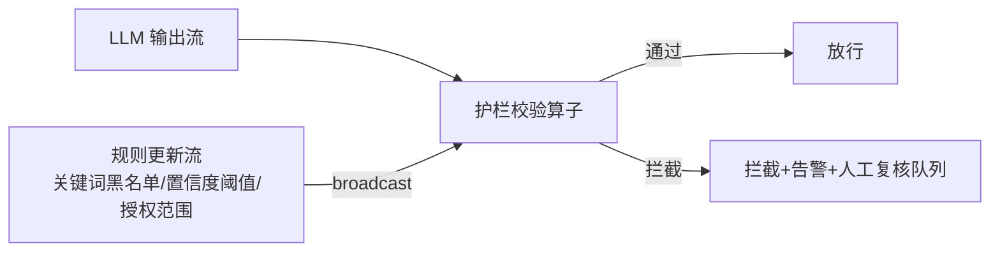
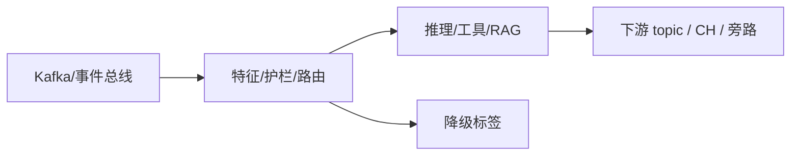

# 第 17 章 · Streaming Guardrail:流式内容护栏与策略引擎

> Demo:e12-17(完整可运行,基于 e03-C7 Broadcast State 模式,无 Preview API 依赖)· Level:L4

## 1. 问题:LLM 输出不可盲信,护栏必须是流水线的一等公民

LLM 的输出可能包含幻觉、不当内容、超出授权范围的建议(如给出错误的诊断结论并建议危险操作)。生产级 Agent 系统必须在"LLM 输出"与"实际执行的动作"之间插入护栏层,而且护栏规则需要能够**热更新**(新发现一类风险,应该能立刻生效,而不是等下一次发版)——这正是 e03-C7 Broadcast State 动态规则模式的用武之地。

## 2. 架构:Broadcast 规则 + 流式校验



## 3. 核心实现(直接复用 e03-C7 模式)

```java
public class GuardrailRule {
    public String ruleId, category;   // 如 "关键词黑名单" / "置信度下限" / "授权范围"
    public String pattern;            // 规则内容(关键词/正则/阈值,按 category 解释)
    public String action;             // BLOCK / WARN / REQUIRE_HUMAN_REVIEW
}

private static final MapStateDescriptor<String, GuardrailRule> RULES_DESC =
        new MapStateDescriptor<>("guardrail-rules", String.class, GuardrailRule.class);

// processElement:对每条 LLM 输出应用当前全部规则(与 e03-C7 的 ALERT 判断逻辑同构)
@Override
public void processElement(LlmOutput out, ReadOnlyContext ctx, Collector<GuardResult> collector)
        throws Exception {
    ReadOnlyBroadcastState<String, GuardrailRule> rules = ctx.getBroadcastState(RULES_DESC);
    for (Map.Entry<String, GuardrailRule> entry : rules.immutableEntries()) {
        GuardrailRule rule = entry.getValue();
        if (violates(out, rule)) {
            collector.collect(new GuardResult(out, rule, rule.action));
            return;   // 命中即拦截,不继续检查(或按需求改为收集全部命中规则)
        }
    }
    collector.collect(new GuardResult(out, null, "PASS"));
}
```

护栏规则通过运维后台/配置中心推送到规则流,广播到所有并行实例——发现新的风险模式(如某类幻觉输出)后,运维可以立刻下发一条新规则拦截该模式,不需要重新部署 Agent 作业。这与案例三车联网告警阈值热更新(e03-C7 原始场景)是完全相同的机制,只是应用领域从"车辆信号阈值"换成了"LLM 输出内容审查"。

## 4. 护栏的分层设计

| 层 | 检查内容 | 典型实现 |
|---|---|---|
| 输入护栏 | 用户输入是否包含注入攻击/敏感信息 | 关键词/正则规则(本章模式) |
| 输出护栏 | LLM 输出是否包含不当内容/超出授权建议 | 关键词规则 + 分类模型二次校验 |
| 行为护栏 | Agent 即将执行的动作是否在授权范围内 | 动作白名单(如"只能发通知,不能自动下单") |

三层护栏应该独立配置、独立可热更新,而不是耦合成一个巨大的规则文件。

## 5. Demo 状态

`examples/e12-17-streaming-guardrail/` 完整复用 e03-C7 的 Broadcast State 骨架实现上述护栏逻辑,**不依赖任何 Preview API**,可直接本地运行验证规则热更新效果(运行中新增一条规则,后续输出立刻按新规则校验)。

## 6. 踩坑

| 坑 | 现象 | 解法 |
|---|---|---|
| 护栏规则写死在代码里 | 每次调整规则都要重新发版 | 规则外置为 Broadcast 数据,支持热更新(本章模式) |
| 只有输出护栏没有行为护栏 | LLM 输出内容"看起来正常"但触发的实际动作超出授权 | 三层护栏独立设计,行为层是最后一道防线 |
| 拦截后无人工复核通道 | 被拦截的合法请求无法被纠正,用户体验受损 | 拦截动作应能路由到人工复核队列,而非直接丢弃 |

## 7. 最佳实践

- 护栏规则变更走审批流程但下发走热更新机制——审批保证规则质量,热更新保证响应速度。
- 定期回放历史数据检验新规则的误伤率(是否拦截了大量合法请求),而不是只关注漏放率。

## 8. 面试题

① 为什么护栏规则必须支持热更新而不能依赖发版?② 三层护栏(输入/输出/行为)分别防御什么风险?③ 如何评估一条新护栏规则的误伤率与漏放率的权衡?

## 9. 参考资料

e03-C7(Broadcast State 动态规则,本章的直接技术基础);docs/03-02(Broadcast State 确定性纪律)。

---

## Wave 2 扩写 · 17-streaming-guardrail

### 背景加固

本章对应 AI 学习路径中的「17-streaming-guardrail」。流式 AI 工程的约束与批式离线不同：延迟预算、成本封顶、降级路径、可观测追踪必须在作业图内一等公民对待。本仓库 e12 系列用零依赖 DataStream 演示机制；p01 提供可降级生产路径。

### 架构对照



控制面：预算、熔断、开关（Broadcast/侧输出）。数据面：embedding、提示、工具调用结果。
降级决策树：外部依赖超时 → 规则路径；成本超软顶 → 降采样；护栏命中 → 旁路。

### 与仓库 Demo 对照

- 优先查找 `examples/e12-17-*/README.md` 与同模块第二 Job；若编号为独立成册章节，见 `ai/README.md` 映射表。
- 生产对照：`projects/p01-log-ai-platform/`（AI off 默认可跑）。
- 规范：`best-practice/08-ai-degrade.md`。

### 踩坑实证

1. 坑 1：把同步外呼放在 map 线程；或无预算的工具调用；或无 trace 无法定位延迟。实证方向：用 e11/e12 作业制造超时，观察旁路与指标。

2. 坑 2：把同步外呼放在 map 线程；或无预算的工具调用；或无 trace 无法定位延迟。实证方向：用 e11/e12 作业制造超时，观察旁路与指标。

3. 坑 3：把同步外呼放在 map 线程；或无预算的工具调用；或无 trace 无法定位延迟。实证方向：用 e11/e12 作业制造超时，观察旁路与指标。

4. 坑 4：把同步外呼放在 map 线程；或无预算的工具调用；或无 trace 无法定位延迟。实证方向：用 e11/e12 作业制造超时，观察旁路与指标。

5. 坑 5：把同步外呼放在 map 线程；或无预算的工具调用；或无 trace 无法定位延迟。实证方向：用 e11/e12 作业制造超时，观察旁路与指标。

6. 坑 6：把同步外呼放在 map 线程；或无预算的工具调用；或无 trace 无法定位延迟。实证方向：用 e11/e12 作业制造超时，观察旁路与指标。

7. 坑 7：把同步外呼放在 map 线程；或无预算的工具调用；或无 trace 无法定位延迟。实证方向：用 e11/e12 作业制造超时，观察旁路与指标。

### 降级决策树

1. 依赖健康？否 → 规则/缓存路径。
2. 成本软顶？超 → 降采样/关昂贵模型。
3. 护栏分数？拒 → side output。
4. 全部通过 → 主输出。

### 验证步骤

1. 启动对应 e12 作业；注入正常/超时/超预算流量；检查主流与旁路；确认无违禁词文档；记录到个人 baseline 笔记。

2. 启动对应 e12 作业；注入正常/超时/超预算流量；检查主流与旁路；确认无违禁词文档；记录到个人 baseline 笔记。

3. 启动对应 e12 作业；注入正常/超时/超预算流量；检查主流与旁路；确认无违禁词文档；记录到个人 baseline 笔记。

4. 启动对应 e12 作业；注入正常/超时/超预算流量；检查主流与旁路；确认无违禁词文档；记录到个人 baseline 笔记。

5. 启动对应 e12 作业；注入正常/超时/超预算流量；检查主流与旁路；确认无违禁词文档；记录到个人 baseline 笔记。

### 面试钩子

用 90 秒讲清「17-streaming-guardrail」：定义、流式约束、降级、仓库路径（e12/p01）、一个指标。题库见 `interview/L8.md`。

### 模式卡片

#### 卡片 17-streaming-guardrail-1

问题：在流式场景下如何保证「17-streaming-guardrail」相关能力可降级且可观测？
方案：作业内开关 + 旁路 + 预算；外呼 Async；缓存 TTL；追踪字段贯通。
验证：OrbStack 跑 e12；断依赖仍有输出契约。
反例：无开关硬依赖 Ollama/Milvus 导致主路径不可用。

#### 卡片 17-streaming-guardrail-2

问题：在流式场景下如何保证「17-streaming-guardrail」相关能力可降级且可观测？
方案：作业内开关 + 旁路 + 预算；外呼 Async；缓存 TTL；追踪字段贯通。
验证：OrbStack 跑 e12；断依赖仍有输出契约。
反例：无开关硬依赖 Ollama/Milvus 导致主路径不可用。

#### 卡片 17-streaming-guardrail-3

问题：在流式场景下如何保证「17-streaming-guardrail」相关能力可降级且可观测？
方案：作业内开关 + 旁路 + 预算；外呼 Async；缓存 TTL；追踪字段贯通。
验证：OrbStack 跑 e12；断依赖仍有输出契约。
反例：无开关硬依赖 Ollama/Milvus 导致主路径不可用。

#### 卡片 17-streaming-guardrail-4

问题：在流式场景下如何保证「17-streaming-guardrail」相关能力可降级且可观测？
方案：作业内开关 + 旁路 + 预算；外呼 Async；缓存 TTL；追踪字段贯通。
验证：OrbStack 跑 e12；断依赖仍有输出契约。
反例：无开关硬依赖 Ollama/Milvus 导致主路径不可用。

#### 卡片 17-streaming-guardrail-5

问题：在流式场景下如何保证「17-streaming-guardrail」相关能力可降级且可观测？
方案：作业内开关 + 旁路 + 预算；外呼 Async；缓存 TTL；追踪字段贯通。
验证：OrbStack 跑 e12；断依赖仍有输出契约。
反例：无开关硬依赖 Ollama/Milvus 导致主路径不可用。

#### 卡片 17-streaming-guardrail-6

问题：在流式场景下如何保证「17-streaming-guardrail」相关能力可降级且可观测？
方案：作业内开关 + 旁路 + 预算；外呼 Async；缓存 TTL；追踪字段贯通。
验证：OrbStack 跑 e12；断依赖仍有输出契约。
反例：无开关硬依赖 Ollama/Milvus 导致主路径不可用。

#### 卡片 17-streaming-guardrail-7

问题：在流式场景下如何保证「17-streaming-guardrail」相关能力可降级且可观测？
方案：作业内开关 + 旁路 + 预算；外呼 Async；缓存 TTL；追踪字段贯通。
验证：OrbStack 跑 e12；断依赖仍有输出契约。
反例：无开关硬依赖 Ollama/Milvus 导致主路径不可用。

#### 卡片 17-streaming-guardrail-8

问题：在流式场景下如何保证「17-streaming-guardrail」相关能力可降级且可观测？
方案：作业内开关 + 旁路 + 预算；外呼 Async；缓存 TTL；追踪字段贯通。
验证：OrbStack 跑 e12；断依赖仍有输出契约。
反例：无开关硬依赖 Ollama/Milvus 导致主路径不可用。

#### 卡片 17-streaming-guardrail-9

问题：在流式场景下如何保证「17-streaming-guardrail」相关能力可降级且可观测？
方案：作业内开关 + 旁路 + 预算；外呼 Async；缓存 TTL；追踪字段贯通。
验证：OrbStack 跑 e12；断依赖仍有输出契约。
反例：无开关硬依赖 Ollama/Milvus 导致主路径不可用。

#### 卡片 17-streaming-guardrail-10

问题：在流式场景下如何保证「17-streaming-guardrail」相关能力可降级且可观测？
方案：作业内开关 + 旁路 + 预算；外呼 Async；缓存 TTL；追踪字段贯通。
验证：OrbStack 跑 e12；断依赖仍有输出契约。
反例：无开关硬依赖 Ollama/Milvus 导致主路径不可用。

#### 卡片 17-streaming-guardrail-11

问题：在流式场景下如何保证「17-streaming-guardrail」相关能力可降级且可观测？
方案：作业内开关 + 旁路 + 预算；外呼 Async；缓存 TTL；追踪字段贯通。
验证：OrbStack 跑 e12；断依赖仍有输出契约。
反例：无开关硬依赖 Ollama/Milvus 导致主路径不可用。

