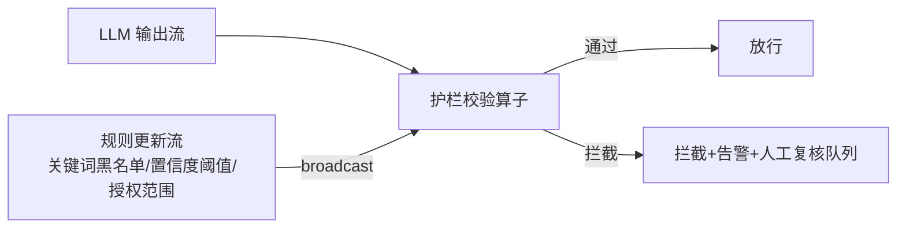

# 第 17 章 · Streaming Guardrail:流式内容护栏与策略引擎

> Demo:e12-17(完整可运行,基于 e03-C7 Broadcast State 模式,无 Preview API 依赖)· Level:L4

## 1. 问题:LLM 输出不可盲信,护栏必须是流水线的一等公民

LLM 的输出可能包含幻觉、不当内容、超出授权范围的建议(如给出错误的诊断结论并建议危险操作)。生产级 Agent 系统必须在"LLM 输出"与"实际执行的动作"之间插入护栏层,而且护栏规则需要能够**热更新**(新发现一类风险,应该能立刻生效,而不是等下一次发版)——这正是 e03-C7 Broadcast State 动态规则模式的用武之地。

## 2. 架构:Broadcast 规则 + 流式校验



## 3. 核心实现(直接复用 e03-C7 模式)

```java
public class GuardrailRule {
    public String ruleId, category;   // 如 "关键词黑名单" / "置信度下限" / "授权范围"
    public String pattern;            // 规则内容(关键词/正则/阈值,按 category 解释)
    public String action;             // BLOCK / WARN / REQUIRE_HUMAN_REVIEW
}

private static final MapStateDescriptor<String, GuardrailRule> RULES_DESC =
        new MapStateDescriptor<>("guardrail-rules", String.class, GuardrailRule.class);

// processElement:对每条 LLM 输出应用当前全部规则(与 e03-C7 的 ALERT 判断逻辑同构)
@Override
public void processElement(LlmOutput out, ReadOnlyContext ctx, Collector<GuardResult> collector)
        throws Exception {
    ReadOnlyBroadcastState<String, GuardrailRule> rules = ctx.getBroadcastState(RULES_DESC);
    for (Map.Entry<String, GuardrailRule> entry : rules.immutableEntries()) {
        GuardrailRule rule = entry.getValue();
        if (violates(out, rule)) {
            collector.collect(new GuardResult(out, rule, rule.action));
            return;   // 命中即拦截,不继续检查(或按需求改为收集全部命中规则)
        }
    }
    collector.collect(new GuardResult(out, null, "PASS"));
}
```

护栏规则通过运维后台/配置中心推送到规则流,广播到所有并行实例——发现新的风险模式(如某类幻觉输出)后,运维可以立刻下发一条新规则拦截该模式,不需要重新部署 Agent 作业。这与案例三车联网告警阈值热更新(e03-C7 原始场景)是完全相同的机制,只是应用领域从"车辆信号阈值"换成了"LLM 输出内容审查"。

## 4. 护栏的分层设计

| 层 | 检查内容 | 典型实现 |
|---|---|---|
| 输入护栏 | 用户输入是否包含注入攻击/敏感信息 | 关键词/正则规则(本章模式) |
| 输出护栏 | LLM 输出是否包含不当内容/超出授权建议 | 关键词规则 + 分类模型二次校验 |
| 行为护栏 | Agent 即将执行的动作是否在授权范围内 | 动作白名单(如"只能发通知,不能自动下单") |

三层护栏应该独立配置、独立可热更新,而不是耦合成一个巨大的规则文件。

## 5. Demo 状态

`examples/e12-17-streaming-guardrail/` 完整复用 e03-C7 的 Broadcast State 骨架实现上述护栏逻辑,**不依赖任何 Preview API**,可直接本地运行验证规则热更新效果(运行中新增一条规则,后续输出立刻按新规则校验)。

## 6. 踩坑

| 坑 | 现象 | 解法 |
|---|---|---|
| 护栏规则写死在代码里 | 每次调整规则都要重新发版 | 规则外置为 Broadcast 数据,支持热更新(本章模式) |
| 只有输出护栏没有行为护栏 | LLM 输出内容"看起来正常"但触发的实际动作超出授权 | 三层护栏独立设计,行为层是最后一道防线 |
| 拦截后无人工复核通道 | 被拦截的合法请求无法被纠正,用户体验受损 | 拦截动作应能路由到人工复核队列,而非直接丢弃 |

## 7. 最佳实践

- 护栏规则变更走审批流程但下发走热更新机制——审批保证规则质量,热更新保证响应速度。
- 定期回放历史数据检验新规则的误伤率(是否拦截了大量合法请求),而不是只关注漏放率。

## 8. 面试题

① 为什么护栏规则必须支持热更新而不能依赖发版?② 三层护栏(输入/输出/行为)分别防御什么风险?③ 如何评估一条新护栏规则的误伤率与漏放率的权衡?

## 9. 参考资料

e03-C7(Broadcast State 动态规则,本章的直接技术基础);docs/03-02(Broadcast State 确定性纪律)。
