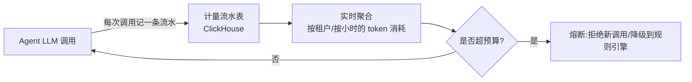

# 第 18 章 · Streaming Cost Control 与 Token Usage:计量流水与预算熔断

> Demo:e12-18(完整可运行,ClickHouse 计量流水,无 Preview API 依赖)· Level:L4

## 1. 问题:LLM 调用是要花钱的,而流处理默认"来者不拒"

传统流处理算子的成本几乎只取决于计算与网络资源,一次意外的数据重放最多是"多算一遍,浪费点 CPU"。但当算子里嵌入了 LLM 调用后,**每一次调用都是真金白银**——一次意外的历史数据回溯重跑,可能产生数千美元的模型调用账单。Cost Control 必须是这类系统的一等公民设计,而不是事后补救。

## 2. 架构:计量流水 + 预算熔断



## 3. 计量流水设计(复用 e07-C6 ClickHouse 写入模式)

```java
public class TokenUsageRecord {
    public String tenantId, agentName, modelName;
    public long promptTokens, completionTokens;
    public double estimatedCostUsd;
    public long timestampMs;
}

// 复用 e07-C6 的 ClickHouse HTTP 批写骨架,每次 LLM 调用后记一条流水
@Override
public void flush(boolean endOfInput) throws IOException {
    // ... 攒批逻辑同 e07-C6,表结构:token_usage(tenant_id, agent_name, model_name,
    //     prompt_tokens, completion_tokens, cost_usd, ts) ENGINE=MergeTree ORDER BY ts
}
```

## 4. 实时预算熔断:窗口聚合 + Broadcast 阈值

```java
// 窗口聚合:每个租户每小时的累计消耗(e02 滚动窗口的生产复用)
usageStream.keyBy(r -> r.tenantId)
    .window(TumblingEventTimeWindows.of(Duration.ofHours(1)))
    .aggregate(new CostSumAgg())
    .connect(budgetThresholdBroadcastStream)   // 预算阈值走 Broadcast,支持运维热调整(e03-C7 模式)
    .process(new BudgetEnforcer());            // 超阈值时产出"熔断信号"

// 熔断信号被 Agent 侧的 LLM 调用前置检查读取(可以是 Broadcast 状态或外部配置中心)
```

**熔断后的降级策略**不是简单地"拒绝服务",而应该分级:①切换到更便宜的小模型;②切换到纯规则引擎(牺牲智能程度但保证基本可用性);③仅对低优先级租户/场景熔断,核心链路保留预算余量。这与 e11 讲的"超时降级而非直接失败"是同一设计哲学在成本维度的应用。

## 5. Demo 状态

`examples/e12-18-streaming-cost-control/` 提供完整可运行的计量流水与窗口聚合作业,组合复用 e07-C6(ClickHouse 写入)、e02(滚动窗口)、e03-C7(Broadcast 阈值)三个已验证模式,token 数量以模拟数据代替真实 LLM 调用(避免依赖外部服务),**核心计量与熔断逻辑不依赖任何 Preview API**,置信度较高。

## 6. 踩坑

| 坑 | 现象 | 解法 |
|---|---|---|
| 只在应用层估算成本,没有独立计量流水 | 无法事后审计"这笔费用花在哪个租户/哪个功能上" | 每次调用落一条计量流水,独立于业务日志 |
| 熔断策略"一刀切"拒绝所有请求 | 核心业务与边缘功能同等受损 | 分级熔断:先切降级模型,再限边缘场景,最后才影响核心链路 |
| 预算阈值写死在代码里 | 调整预算需要重新发版,响应运营需求慢 | 预算阈值走 Broadcast/配置中心,支持热更新 |

## 7. 最佳实践

- 计量流水作为独立于业务逻辑的横切关注点(cross-cutting concern),通过统一的 AI 网关(第 19 章)自动记录,而不是要求每个 Agent 开发者手写计量代码。
- 定期(如每日)生成成本报表,按租户/Agent/模型维度拆解,识别异常消耗模式。

## 8. 面试题

① 为什么 LLM 调用的成本控制不能是"事后补救"而必须是架构级设计?② 分级熔断相比"一刀切"熔断解决了什么问题?③ 如果计量流水本身写入延迟或丢失,会给成本控制带来什么风险,如何缓解?

## 9. 参考资料

e07-C6(ClickHouse 批写骨架)、e02(窗口聚合)、e03-C7(Broadcast 动态阈值)——本章是三者在成本控制场景的组合应用。
