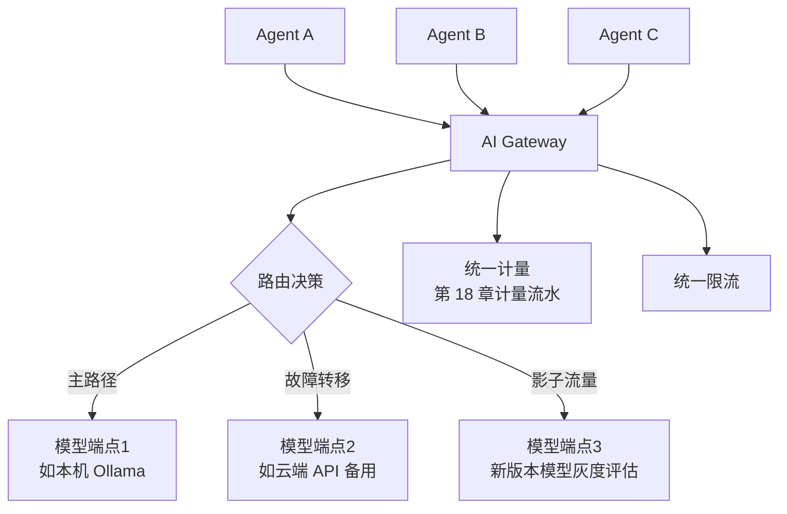

# 第 19 章 · Streaming AI Gateway 与 Model Routing

> Demo:代码/架构示意(建立在第 3/18 章基础之上)· Level:L5

## 1. 问题:每个 Agent 都直连模型端点,会失控

如果每个 Agent 各自硬编码模型端点地址、各自实现重试逻辑、各自处理限流,系统很快会陷入"改一个模型版本要改十几处代码"的困境。AI Gateway 把"模型调用"这一横切关注点收敛到统一入口:所有 Agent 通过 Gateway 调用模型,Gateway 负责路由、限流、故障转移、计量(第 18 章的计量流水实际上应该在 Gateway 层统一实现,而不是每个 Agent 各写一遍)。

## 2. 架构



## 3. 模型路由的三种模式

1. **故障转移(Failover)**:主模型端点不可用时自动切换备用端点,对调用方透明;
2. **多模型路由**:按请求特征(如任务类型、租户等级)路由到不同模型(高价值租户用大模型,普通场景用小模型控制成本);
3. **影子流量(Shadow Traffic)**:新模型版本上线前,复制一份真实流量给它评估效果,但不影响真实响应(响应仍来自旧模型)——这是模型灰度发布最安全的验证手段。

```java
// Gateway 路由决策示意(与 e07 连接器选型的"语义矩阵"思路一致:先问需求特征,再选路由目标)
public String route(ModelRequest req) {
    if (req.tenantTier == Tier.PREMIUM) return "large-model-endpoint";
    if (isPrimaryHealthy()) return "primary-endpoint";
    return "fallback-endpoint";   // 故障转移
}
```

## 4. 与 Prompt 灰度(第 22 章)的关系

AI Gateway 处理的是"调用哪个模型端点";第 22 章的 Prompt 版本化处理的是"用哪个 prompt 模板"。两者是正交的维度,可以独立灰度:同一个 prompt 版本可以路由到不同模型对比效果,同一个模型也可以搭配不同 prompt 版本对比效果。生产系统通常需要能够独立控制这两个维度并交叉分析结果。

## 5. Demo 状态说明

本章以架构模式为主,不提供独立编译模块:AI Gateway 的核心能力(路由、限流、计量)本质上是第 3 章(ML_PREDICT 外呼)与第 18 章(计量流水)的横切封装,不引入新的 Flink/流处理机制,更多是一个独立的网关服务(可以用你已有的自定义 AI 网关工程经验实现,与本仓库 AITS 平台设计中的 AI Gateway 组件是同一概念)。

## 6. 踩坑

| 坑 | 现象 | 解法 |
|---|---|---|
| 每个 Agent 直连模型端点 | 模型切换/故障处理需要改多处代码 | 统一收敛到 Gateway |
| 影子流量影响真实响应延迟 | 影子调用与真实调用共享资源池,拖慢主路径 | 影子流量走独立资源池/异步旁路,不阻塞主响应 |
| 路由决策无监控 | 无法验证路由策略是否按预期生效 | 路由决策结果本身也应计入可观测性体系(第 15 章) |

## 7. 最佳实践

- Gateway 作为独立服务部署,与 Flink 集群解耦,允许独立扩缩容与独立发布节奏。
- 故障转移策略需要定期演练(类比 e04 的故障恢复演练),而不是只在真正故障发生时才第一次验证。

## 8. 面试题

① AI Gateway 收敛了哪些原本分散在各 Agent 里的横切关注点?② 影子流量与 A/B 测试的区别是什么?③ 模型路由与 Prompt 版本灰度为什么是正交维度,如何设计交叉分析?

## 9. 参考资料

第 3 章(ML_PREDICT 外呼基础)、第 18 章(计量流水)、第 22 章(Prompt 灰度);你已有的 AITS 平台自定义 AI 网关设计经验。
