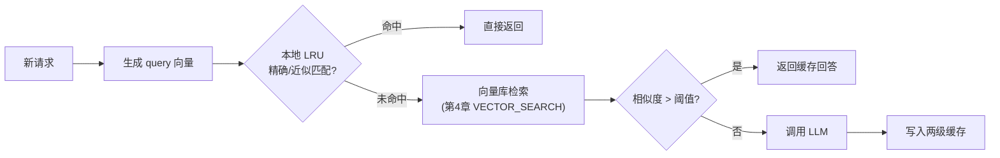

# 第 20 章 · Streaming Embedding Cache:语义缓存的流式实现

> Demo:代码示意(基于 e11-C3 两级缓存模式)· Level:L5

## 1. 问题:相似的问题不该重复付费问 LLM

如果两次用户输入语义高度相似("这个故障码是什么意思"和"这个故障代码代表什么"),分别调用一次 LLM 是浪费的——语义缓存的目标是"输入语义相似,直接返回缓存的历史回答,不重复调用模型"。这与传统的精确匹配缓存(key 完全相同才命中)不同,需要基于向量相似度做"模糊命中"判断。

## 2. 架构:两级缓存 + 相似度阈值



这个架构直接继承 e11-C3(两级维表:本地 LRU + 异步远端)的骨架,只是把"远端维表点查"换成"远端向量相似度检索"——工程模式完全一致,只是判断"命中"的方式从"精确 key 匹配"变成"相似度超阈值"。

## 3. 核心实现

```java
public final class SemanticCacheEnrich extends RichAsyncFunction<Query, CachedOrFresh> {
    private transient Map<String, CacheEntry> localLru;   // e11-C3 同款 LRU
    private transient VectorStoreClient vectorStore;

    @Override
    public void asyncInvoke(Query q, ResultFuture<CachedOrFresh> rf) {
        // ① 本地精确/近似匹配(便宜、快)
        CacheEntry local = localLru.get(q.normalizedText);
        if (local != null) {
            rf.complete(Collections.singleton(CachedOrFresh.hit(local.answer)));
            return;
        }
        // ② 向量相似度检索(第 4 章 VECTOR_SEARCH 的 DataStream 等价实现)
        vectorStore.searchAsync(q.embedding, TOP_K).whenComplete((results, err) -> {
            if (err == null && !results.isEmpty() && results.get(0).score > SIMILARITY_THRESHOLD) {
                rf.complete(Collections.singleton(CachedOrFresh.hit(results.get(0).cachedAnswer)));
            } else {
                rf.complete(Collections.singleton(CachedOrFresh.miss(q)));  // 交给下游调用 LLM
            }
        });
    }
}
```

## 4. 相似度阈值的业务校准

阈值设得太松(如 0.7)会导致"看起来相似但实际语义不同"的问题被错误合并回答(如"如何退款"与"如何退货"向量距离可能很近但答案完全不同)——这是语义缓存最大的风险点,**错误命中比缓存未命中的代价更高**(缓存未命中只是多调一次模型,错误命中是给用户错误答案)。因此语义缓存通常只用于风险容忍度高的场景(如 FAQ 类问答),不用于高风险决策场景(如医疗建议、金融决策)。

## 5. 缓存失效:答案也会过时

与第 5 章 Streaming RAG 面临的问题类似,缓存的历史回答可能因为业务规则变化而过时(如政策更新后,旧的"如何退款"回答不再准确)。缓存条目应携带版本/时间戳,业务规则变更时应有机制批量失效相关缓存条目,而不是让过时答案无限期地被复用。

## 6. Demo 状态说明

本章以代码骨架为主,核心机制(两级缓存、异步检索)已在 e11-C3 完整验证过,本章是该模式在"语义缓存"场景的应用扩展,不重复提供独立编译模块。

## 7. 踩坑

| 坑 | 现象 | 解法 |
|---|---|---|
| 相似度阈值设置过松 | 语义不同的问题被错误合并回答 | 阈值需要业务场景实测校准,高风险场景干脆不用语义缓存 |
| 缓存无失效机制 | 业务规则变化后,过时答案被持续复用 | 缓存条目携带版本,规则变更触发批量失效 |
| 用于高风险决策场景 | 错误命中的代价超出可接受范围 | 语义缓存仅用于风险容忍度高的场景(如 FAQ) |

## 8. 最佳实践

- 语义缓存命中率与错误命中率都要监控(第 15 章),不能只看命中率不看误伤。
- 缓存回答应该标注"这是缓存结果"以及缓存生成时间,供有需要的场景做新鲜度判断。

## 9. 面试题

① 为什么说"错误命中比缓存未命中代价更高"?② 语义缓存适合什么场景,不适合什么场景?③ 缓存失效机制应该如何与业务规则变更联动?

## 10. 参考资料

e11-C3(两级缓存骨架,本章的直接技术基础);第 4 章(向量检索基础);第 5 章(缓存/索引新鲜度问题的同构参照)。
