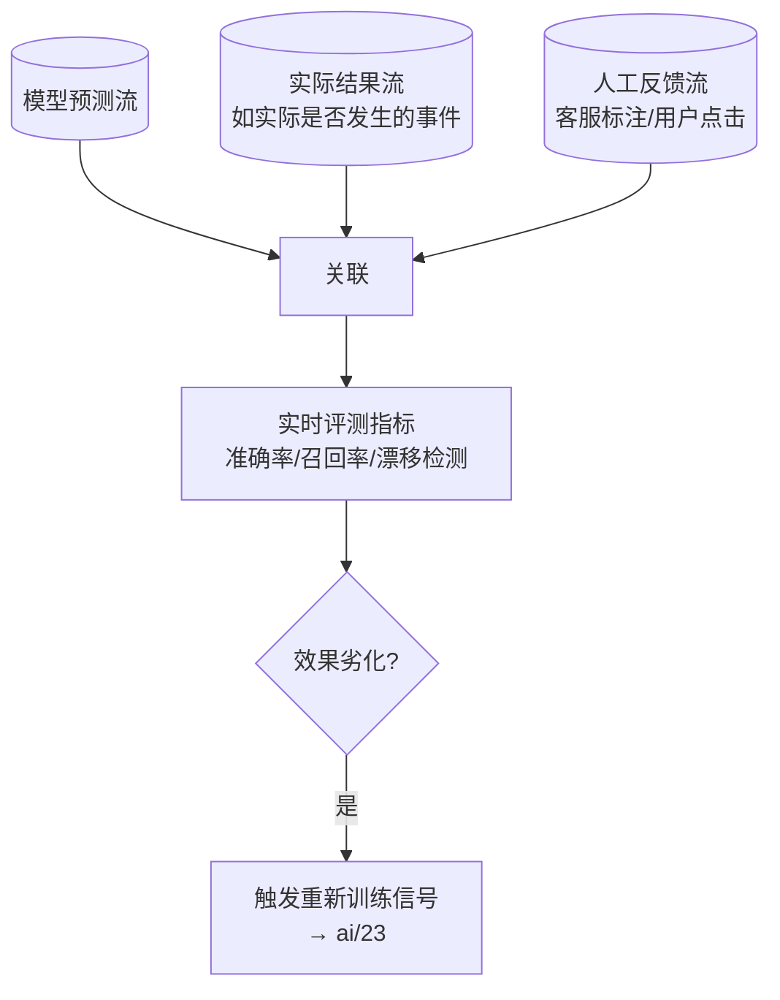

# 第 21 章 · Streaming Evaluation 与 Feedback:在线评测与人反馈回流

> Demo:代码示意(结合 e02 窗口聚合 + e07 JDBC 落库模式)· Level:L5

## 1. 问题:模型效果如何持续验证,而不是"上线后就不管了"

离线评测(在测试集上跑一遍准确率)只能验证"上线前"的效果,无法捕捉生产环境里真实分布漂移导致的效果劣化。Streaming Evaluation 的目标是让评测成为一个**持续运行的流处理任务**:实时采集"模型输出"与"实际结果/人工反馈",持续计算线上效果指标,而不是等季度评审才发现模型已经"跑偏"很久了。

## 2. 架构:三路输入,持续评测



## 3. 核心实现:预测与实际结果的延迟关联

模型预测发生在 T 时刻,"实际结果是否正确"往往要等一段时间才能知道(如"预测这个用户会流失",要等 30 天后才能验证)。这是一个典型的 **Interval Join 场景**(第 05-C5 章已详解,时间带内关联,状态随 watermark 自动清理):

```sql
-- 预测流与延迟到达的实际结果流关联(e05-C5 Interval Join 模式的直接复用)
SELECT p.prediction_id, p.predicted_label, a.actual_label,
       p.predicted_label = a.actual_label AS is_correct
FROM predictions p JOIN actuals a ON p.entity_id = a.entity_id
WHERE a.ts BETWEEN p.ts AND p.ts + INTERVAL '30' DAY;
```

关联后的结果按窗口聚合出滚动准确率(e02 窗口模式复用),写入 ClickHouse/PostgreSQL(e07-C2/C6 落库模式)供效果看板消费。

## 4. 漂移检测:不只是看准确率下降

除了直接的准确率/召回率,还应监控**输入分布漂移**(如"最近输入的文本长度/领域分布,与训练时的分布是否显著不同")与**输出分布漂移**(如"模型输出某个类别的比例是否异常升高")。这类漂移可能早于准确率下降就出现信号,是更早期的预警指标。

## 5. 人反馈回流:客服标注如何进入评测与训练

人工反馈(客服认为某次 Agent 判断错误,标注更正)本身也是一条事件流,与预测结果关联后:①立即用于评测指标修正;②累积后作为增量训练样本(ai/23 联动)。反馈回流的设计要点是**低摩擦**——标注入口应该嵌入客服现有工作流,而不是要求他们去另一个系统里手动录入,否则反馈率会低到没有统计意义。

## 6. Demo 状态说明

本章核心技术组件(Interval Join、窗口聚合、JDBC 落库)均已在 e05-C5、e02、e07-C2/C6 提供过完整验证的 Demo,本章重点在于把它们组合成"持续在线评测"这一应用场景的方法论,不重复提供独立编译模块。

## 7. 踩坑

| 坑 | 现象 | 解法 |
|---|---|---|
| 只看准确率不看分布漂移 | 效果劣化被发现得太晚 | 输入/输出分布漂移作为早期预警指标 |
| 反馈入口摩擦大 | 反馈率过低,评测样本量不足以有统计意义 | 反馈入口嵌入现有工作流,降低标注成本 |
| Interval Join 时间带设置不合理 | 太短漏掉延迟到达的实际结果,太宽状态膨胀 | 按业务实际的"结果确认周期"设定,并监控迟到率 |

## 8. 最佳实践

- 评测指标看板与业务看板并列展示,让"模型效果"成为业务方也能直接看到的一等公民指标,而非只有算法团队关心。
- 效果劣化的告警阈值应该分级(轻微劣化→通知观察,严重劣化→触发重新训练流程)。

## 9. 面试题

① 为什么说"分布漂移"是比"准确率下降"更早的预警信号?② 预测流与延迟到达的实际结果流关联,为什么是 Interval Join 而非 Regular Join 的适用场景?③ 如何设计低摩擦的人工反馈回流机制?

## 10. 参考资料

e05-C5(Interval Join)、e02(窗口聚合)、e07-C2/C6(落库模式)——本章是三者在在线评测场景的组合应用;第 23 章(反馈回流到训练管线)。
