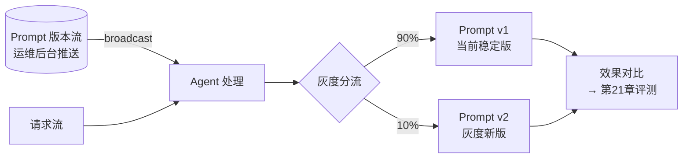

# 第 22 章 · Streaming Prompt:Prompt 版本化与灰度

> Demo:e12-22(完整可运行,基于 e03-C7 Broadcast State 模式,无 Preview API 依赖)· Level:L4

## 1. 问题:Prompt 是"配置"还是"代码"

Prompt 的迭代速度通常远快于代码发版周期——运营/算法团队可能一天调整好几次 prompt 措辞来优化效果。如果 prompt 硬编码在 Java 代码里,每次调整都要走完整的编译-测试-发版流程,响应速度跟不上迭代需求。**Prompt 应该被当作外部化配置,支持独立于代码发版的热更新与灰度**——这与第 17 章护栏规则、e03-C7 车联网阈值是完全相同的架构模式:用 Broadcast State 承载运行时可变的"策略数据"。

## 2. 架构:Prompt 即 Broadcast 数据 + 灰度分流



## 3. 核心实现

```java
public class PromptVersion {
    public String promptId, version, template;
    public double trafficRatio;   // 灰度流量占比,如 0.1 表示 10%
}

private static final MapStateDescriptor<String, PromptVersion> PROMPTS_DESC =
        new MapStateDescriptor<>("prompt-versions", String.class, PromptVersion.class);

@Override
public void processElement(Request req, ReadOnlyContext ctx, Collector<Response> out)
        throws Exception {
    ReadOnlyBroadcastState<String, PromptVersion> prompts = ctx.getBroadcastState(PROMPTS_DESC);
    PromptVersion stable = prompts.get("stable");
    PromptVersion canary = prompts.get("canary");

    // 按请求哈希做确定性分流(同一用户/实体始终走同一版本,避免体验跳变)
    boolean useCanary = canary != null
            && Math.abs(req.entityId.hashCode()) % 100 < canary.trafficRatio * 100;
    PromptVersion chosen = useCanary ? canary : stable;

    String prompt = renderTemplate(chosen.template, req);
    // ... 调用模型,响应携带 prompt 版本号,供第 21 章评测按版本拆分效果
    out.collect(new Response(callLlm(prompt), chosen.version));
}
```

**确定性分流**是这里的关键细节:用请求所属实体的哈希值而非随机数决定灰度分支,保证同一用户/同一设备在整个灰度周期内始终看到同一版本的行为,避免"同样的问题这次和上次得到风格不同的回答"这种体验跳变——这与 e02-C1 讲过的"参数对照实验"思路一致,但增加了确定性分流这一约束。

## 4. Prompt 版本与效果评测的联动

灰度期间,每次调用的响应都携带 prompt 版本号(上面代码的 `chosen.version`),这条信息随后流入第 21 章的评测管线——评测结果按版本拆分对比,才能回答"v2 到底比 v1 好不好"这个问题。没有版本标注的评测数据是没法用来做灰度决策的。

## 5. Demo 状态

`examples/e12-22-streaming-prompt/` 完整复用 e03-C7 Broadcast State 骨架实现上述灰度分流逻辑,**不依赖任何 Preview API**,可直接本地验证:运行中推送一条新的 canary 版本配置,后续满足哈希条件的请求立刻按新版本处理。

## 6. 踩坑

| 坑 | 现象 | 解法 |
|---|---|---|
| Prompt 硬编码在代码里 | 每次调整都要走发版流程,迭代慢 | 外部化为 Broadcast 数据,支持热更新 |
| 灰度分流用随机数而非确定性哈希 | 同一用户多次请求看到不同版本,体验跳变 | 按实体 ID 哈希做确定性分流 |
| 响应不携带 prompt 版本号 | 评测数据无法按版本拆分,灰度决策没有依据 | 版本号作为一等公民字段贯穿调用与评测全链路 |

## 7. 最佳实践

- Prompt 变更走"编写→小流量灰度→评测对比→全量或回滚"的标准流程,与代码发版的灰度纪律对齐但走独立的更轻量通道。
- 每个 Prompt 版本的变更记录(谁改的、改了什么、为什么改)应可追溯,类比代码的 Git 历史。

## 8. 面试题

① 为什么 Prompt 灰度分流必须用确定性哈希而非随机数?② Prompt 版本化与第 17 章护栏规则在架构上有什么共同点?③ 如果没有版本号标注,灰度评测会遇到什么根本性障碍?

## 9. 参考资料

e03-C7(Broadcast State 动态规则,本章的直接技术基础);第 21 章(评测管线,与本章版本标注联动)。
