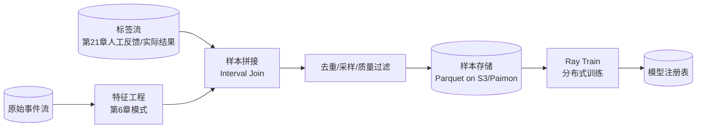
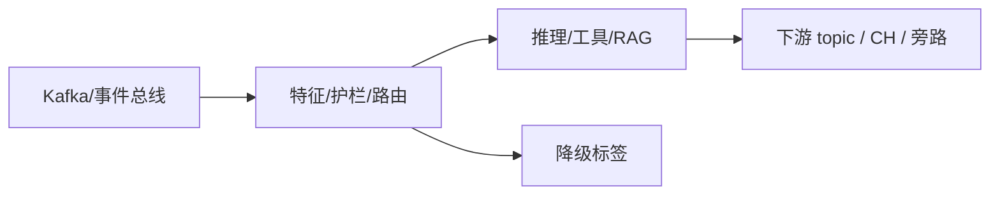

# 第 23 章 · Streaming Online Learning 与 Fine-tuning 数据管线:样本流→训练集(Flink×Ray 分工)

> Demo:代码示意(整合 e06 特征管线 + docs/11-02 Flink×Ray 分工模型)· Level:L6

## 1. 问题:训练数据不该是"离线批量导出一次"

模型持续改进需要持续产出高质量训练样本,而不是每次训练前手工跑一次批量导出脚本。本章要解决的是"事件流如何持续沉淀为可用于训练的样本集",并明确 Flink 与 Ray 在这条管线上的分工边界(11-02 已给出总体框架,本章是它在训练数据场景的具体展开)。

## 2. 架构:样本工厂



## 3. 核心步骤

**特征与标签的拼接**:特征在事件发生时就绪(第 6 章),标签(实际结果/人工反馈)往往延迟到达(第 21 章),两者的拼接是 Interval Join 的又一个应用场景——与第 21 章的"预测-实际结果"关联使用同一套技术,只是这里拼接出的是训练样本而非评测记录。

```sql
-- 特征快照与延迟到达标签的拼接,产出带标签的训练样本
SELECT f.entity_id, f.feature_vector, l.label
FROM features f JOIN labels l ON f.entity_id = l.entity_id
WHERE l.ts BETWEEN f.ts AND f.ts + INTERVAL '30' DAY;
```

**去重与质量过滤**:同一实体可能因为多次事件产生多条相似样本,需要按业务规则去重(e05-C4 去重模式);明显异常的样本(如特征值超出合理范围)应过滤,避免污染训练集。

**写入 Paimon/Parquet**:样本落地到支持增量读取的存储(e09 Paimon 主键表或简单的分区 Parquet),供 Ray Train 以增量或全量方式消费——这里的存储选型与第 09 章的湖仓能力直接呼应。

## 4. Flink 与 Ray 的边界(11-02 的具体化)

**Flink 负责**:样本的实时生成、拼接、去重、质量过滤——这些是流式、有状态、需要精确时间语义的工作,是 Flink 的核心优势区。**Ray 负责**:读取沉淀好的样本集,做分布式训练(数据并行/模型并行调度)——这是计算密集、需要 GPU 资源调度的工作,不是 Flink 的设计目标。两者通过"样本存储"这一介质解耦,而不是让 Flink 直接驱动训练循环。

## 5. 在线学习的特殊情形:增量更新而非重新训练

对于某些轻量模型(如在线学习的逻辑回归/树模型),可以不必等到攒够一批样本才重新训练,而是让模型参数随样本流**增量更新**——这类场景 Flink 甚至可以直接承载参数更新逻辑(参数作为 Keyed State,新样本到达即做一次梯度更新),不需要外部 Ray 介入。但对于深度学习/大模型微调,增量更新的工程复杂度通常不划算,批量重新训练(交给 Ray)仍是主流做法。

## 6. Demo 状态说明

本章核心技术组件(Interval Join 样本拼接、去重、湖仓存储)均已在此前章节(第 21 章、e05-C4、e09)提供过验证的 Demo,本章是它们在"训练数据管线"场景的组合应用方法论,Ray 训练侧的具体实现超出本仓库的 Flink 教学范围,不重复展开。

## 7. 踩坑

| 坑 | 现象 | 解法 |
|---|---|---|
| 样本无去重 | 高频活跃实体的样本被过度代表,训练集分布失真 | 按实体/时间窗口做采样去重 |
| Flink 直接驱动大模型训练循环 | 违反"计算密集型工作不适合塞进流处理算子"的原则 | 样本沉淀与训练解耦,交给 Ray/专用训练框架 |
| 训练样本与在线特征口径不一致 | Training-Serving Skew(第 6 章已述),模型上线效果不及预期 | 统一特征计算逻辑,双出口而非双实现 |

## 8. 最佳实践

- 样本管线产出的数据集应该有版本号与生成时间戳,训练任务据此可追溯"这次训练用的是哪个版本的样本集"。
- 样本质量指标(如标签分布、特征完整率)应纳入可观测性体系(第 15 章),样本质量劣化应该像模型效果劣化一样被监控。

## 9. 面试题

① 为什么说"计算密集型训练不适合塞进 Flink 算子"?② 在线学习与批量重新训练的选择依据是什么?③ 样本拼接为什么也是 Interval Join 的适用场景?

## 10. 参考资料

docs/11-02(Flink×Ray 分工总览);第 6 章(特征工程)、第 21 章(标签数据来源)、e09(湖仓存储);e05-C4(去重模式)。

---

## Wave 2 扩写 · 23-streaming-online-learning

### 背景加固

本章对应 AI 学习路径中的「23-streaming-online-learning」。流式 AI 工程的约束与批式离线不同：延迟预算、成本封顶、降级路径、可观测追踪必须在作业图内一等公民对待。本仓库 e12 系列用零依赖 DataStream 演示机制；p01 提供可降级生产路径。

### 架构对照



控制面：预算、熔断、开关（Broadcast/侧输出）。数据面：embedding、提示、工具调用结果。
降级决策树：外部依赖超时 → 规则路径；成本超软顶 → 降采样；护栏命中 → 旁路。

### 与仓库 Demo 对照

- 优先查找 `examples/e12-23-*/README.md` 与同模块第二 Job；若编号为独立成册章节，见 `ai/README.md` 映射表。
- 生产对照：`projects/p01-log-ai-platform/`（AI off 默认可跑）。
- 规范：`best-practice/08-ai-degrade.md`。

### 踩坑实证

1. 坑 1：把同步外呼放在 map 线程；或无预算的工具调用；或无 trace 无法定位延迟。实证方向：用 e11/e12 作业制造超时，观察旁路与指标。

2. 坑 2：把同步外呼放在 map 线程；或无预算的工具调用；或无 trace 无法定位延迟。实证方向：用 e11/e12 作业制造超时，观察旁路与指标。

3. 坑 3：把同步外呼放在 map 线程；或无预算的工具调用；或无 trace 无法定位延迟。实证方向：用 e11/e12 作业制造超时，观察旁路与指标。

4. 坑 4：把同步外呼放在 map 线程；或无预算的工具调用；或无 trace 无法定位延迟。实证方向：用 e11/e12 作业制造超时，观察旁路与指标。

5. 坑 5：把同步外呼放在 map 线程；或无预算的工具调用；或无 trace 无法定位延迟。实证方向：用 e11/e12 作业制造超时，观察旁路与指标。

6. 坑 6：把同步外呼放在 map 线程；或无预算的工具调用；或无 trace 无法定位延迟。实证方向：用 e11/e12 作业制造超时，观察旁路与指标。

7. 坑 7：把同步外呼放在 map 线程；或无预算的工具调用；或无 trace 无法定位延迟。实证方向：用 e11/e12 作业制造超时，观察旁路与指标。

### 降级决策树

1. 依赖健康？否 → 规则/缓存路径。
2. 成本软顶？超 → 降采样/关昂贵模型。
3. 护栏分数？拒 → side output。
4. 全部通过 → 主输出。

### 验证步骤

1. 启动对应 e12 作业；注入正常/超时/超预算流量；检查主流与旁路；确认无违禁词文档；记录到个人 baseline 笔记。

2. 启动对应 e12 作业；注入正常/超时/超预算流量；检查主流与旁路；确认无违禁词文档；记录到个人 baseline 笔记。

3. 启动对应 e12 作业；注入正常/超时/超预算流量；检查主流与旁路；确认无违禁词文档；记录到个人 baseline 笔记。

4. 启动对应 e12 作业；注入正常/超时/超预算流量；检查主流与旁路；确认无违禁词文档；记录到个人 baseline 笔记。

5. 启动对应 e12 作业；注入正常/超时/超预算流量；检查主流与旁路；确认无违禁词文档；记录到个人 baseline 笔记。

### 面试钩子

用 90 秒讲清「23-streaming-online-learning」：定义、流式约束、降级、仓库路径（e12/p01）、一个指标。题库见 `interview/L8.md`。

### 模式卡片

#### 卡片 23-streaming-online-learning-1

问题：在流式场景下如何保证「23-streaming-online-learning」相关能力可降级且可观测？
方案：作业内开关 + 旁路 + 预算；外呼 Async；缓存 TTL；追踪字段贯通。
验证：OrbStack 跑 e12；断依赖仍有输出契约。
反例：无开关硬依赖 Ollama/Milvus 导致主路径不可用。

#### 卡片 23-streaming-online-learning-2

问题：在流式场景下如何保证「23-streaming-online-learning」相关能力可降级且可观测？
方案：作业内开关 + 旁路 + 预算；外呼 Async；缓存 TTL；追踪字段贯通。
验证：OrbStack 跑 e12；断依赖仍有输出契约。
反例：无开关硬依赖 Ollama/Milvus 导致主路径不可用。

#### 卡片 23-streaming-online-learning-3

问题：在流式场景下如何保证「23-streaming-online-learning」相关能力可降级且可观测？
方案：作业内开关 + 旁路 + 预算；外呼 Async；缓存 TTL；追踪字段贯通。
验证：OrbStack 跑 e12；断依赖仍有输出契约。
反例：无开关硬依赖 Ollama/Milvus 导致主路径不可用。

#### 卡片 23-streaming-online-learning-4

问题：在流式场景下如何保证「23-streaming-online-learning」相关能力可降级且可观测？
方案：作业内开关 + 旁路 + 预算；外呼 Async；缓存 TTL；追踪字段贯通。
验证：OrbStack 跑 e12；断依赖仍有输出契约。
反例：无开关硬依赖 Ollama/Milvus 导致主路径不可用。

#### 卡片 23-streaming-online-learning-5

问题：在流式场景下如何保证「23-streaming-online-learning」相关能力可降级且可观测？
方案：作业内开关 + 旁路 + 预算；外呼 Async；缓存 TTL；追踪字段贯通。
验证：OrbStack 跑 e12；断依赖仍有输出契约。
反例：无开关硬依赖 Ollama/Milvus 导致主路径不可用。

#### 卡片 23-streaming-online-learning-6

问题：在流式场景下如何保证「23-streaming-online-learning」相关能力可降级且可观测？
方案：作业内开关 + 旁路 + 预算；外呼 Async；缓存 TTL；追踪字段贯通。
验证：OrbStack 跑 e12；断依赖仍有输出契约。
反例：无开关硬依赖 Ollama/Milvus 导致主路径不可用。

#### 卡片 23-streaming-online-learning-7

问题：在流式场景下如何保证「23-streaming-online-learning」相关能力可降级且可观测？
方案：作业内开关 + 旁路 + 预算；外呼 Async；缓存 TTL；追踪字段贯通。
验证：OrbStack 跑 e12；断依赖仍有输出契约。
反例：无开关硬依赖 Ollama/Milvus 导致主路径不可用。

#### 卡片 23-streaming-online-learning-8

问题：在流式场景下如何保证「23-streaming-online-learning」相关能力可降级且可观测？
方案：作业内开关 + 旁路 + 预算；外呼 Async；缓存 TTL；追踪字段贯通。
验证：OrbStack 跑 e12；断依赖仍有输出契约。
反例：无开关硬依赖 Ollama/Milvus 导致主路径不可用。

#### 卡片 23-streaming-online-learning-9

问题：在流式场景下如何保证「23-streaming-online-learning」相关能力可降级且可观测？
方案：作业内开关 + 旁路 + 预算；外呼 Async；缓存 TTL；追踪字段贯通。
验证：OrbStack 跑 e12；断依赖仍有输出契约。
反例：无开关硬依赖 Ollama/Milvus 导致主路径不可用。

#### 卡片 23-streaming-online-learning-10

问题：在流式场景下如何保证「23-streaming-online-learning」相关能力可降级且可观测？
方案：作业内开关 + 旁路 + 预算；外呼 Async；缓存 TTL；追踪字段贯通。
验证：OrbStack 跑 e12；断依赖仍有输出契约。
反例：无开关硬依赖 Ollama/Milvus 导致主路径不可用。

#### 卡片 23-streaming-online-learning-11

问题：在流式场景下如何保证「23-streaming-online-learning」相关能力可降级且可观测？
方案：作业内开关 + 旁路 + 预算；外呼 Async；缓存 TTL；追踪字段贯通。
验证：OrbStack 跑 e12；断依赖仍有输出契约。
反例：无开关硬依赖 Ollama/Milvus 导致主路径不可用。

