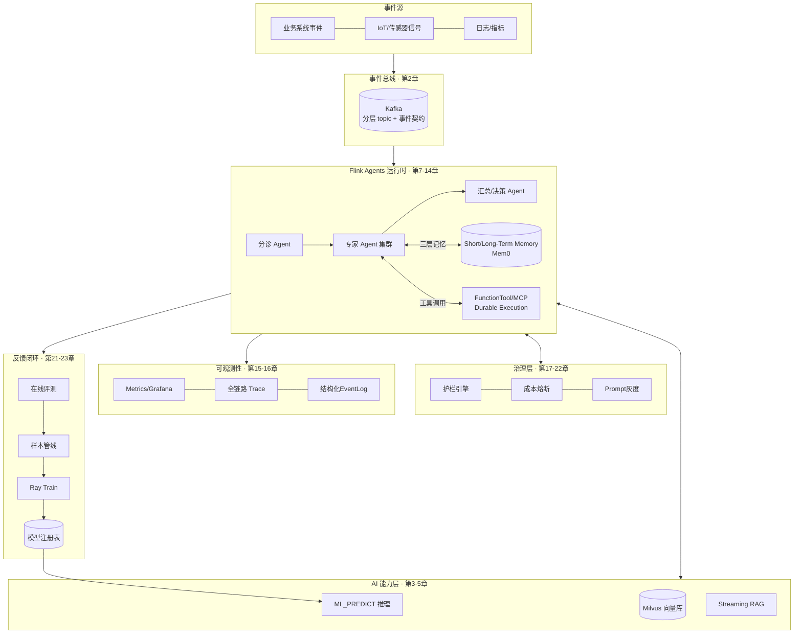
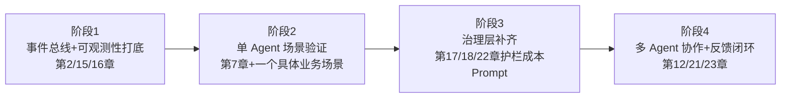

# 第 24 章 · 架构收官:事件驱动 AI 平台参考架构

> 本章综合前 23 章内容,产出可直接用于企业汇报的参考架构 · Level:L7

## 1. 全景架构图

## 2. 分层职责一览表

| 层 | 核心职责 | 对应章节 |
|---|---|---|
| 事件总线 | 事件契约、Schema 治理、命令/事实语义分离 | 02 |
| AI 能力层 | 流式推理、向量检索、RAG、知识图谱 | 03-05、14 |
| Agent 运行时 | Action 编排、记忆、工具调用、多 Agent 协作 | 07-13 |
| 治理层 | 护栏、成本控制、Prompt 灰度、模型路由 | 17-20、22 |
| 可观测性 | 指标、Trace、结构化日志 | 15-16 |
| 反馈闭环 | 在线评测、样本管线、训练协同(Ray) | 06、21、23 |

## 3. 与企业既有 AIOS/AIDO 蓝图的映射指南

本参考架构与你的 AITS(智能分诊)/SVDM(智能车辆数据诊断)融合蓝图 AIDO 存在直接的概念映射:

| 本书概念 | AIDO/AITS 对应概念 | 映射说明 |
|---|---|---|
| 分诊-专家-汇总多 Agent 协作(第12章) | AITS 两层诊断设计 | 同一"先分诊、后专家处理"的架构模式 |
| 护栏引擎(第17章) | AITS 告警会话生命周期耦合协议 | 都是"决策与执行之间插入的安全阀" |
| AI Gateway(第19章) | AITS 自定义 AI 网关 | 概念完全对应,本书提供了流式化的补充视角 |
| 三层记忆(第08章) | mem0 2.0.x 长期记忆工程经验 | Flink Agents 的 Mem0 收敛验证了你此前的技术选型方向 |
| Streaming Feature(第06章) | 车联网监控案例三的实时特征需求 | 直接技术基础 |

**给企业汇报使用的核心论点**(可直接摘录):"我们过去在 AITS/SVDM 上验证的分诊-专家-汇总架构、动态规则热更新、AI 网关等设计模式,与 Apache 官方最新推出的 Flink Agents 项目在架构理念上高度一致——这既验证了我们此前架构决策的前瞻性,也意味着可以用官方标准化组件替代部分自建能力,降低长期维护成本。"

## 4. 分阶段落地建议

不建议一次性铺开全部 24 章的能力——按此四阶段路线,每阶段验证一批能力再推进下一阶段,与 Flink Agents 本身"Preview→逐步收敛稳定"的成熟度曲线保持同步。

## 5. 全书核心工程判据回顾

贯穿全书的判断框架,收敛为可直接用于方案评审的检查单:

1. 触发源是人还是事件?(第1章)
2. 正确性要求动作不重不漏吗?(第1、9章)
3. 上下文是会话级还是跨事件累积?(第1、8章)
4. 这个环节该用 Flink 拓扑还是 Agent 工作流还是外呼交互式服务?(第11、13章)
5. 这个决策的成本、护栏、可追溯性是否已经设计到位?(第15-20章)

## 6. 面试题(全书综合)

① 如果只能向一个从未接触过事件驱动 AI 的团队讲一件事,你会讲什么?② 本参考架构里,哪个组件最有可能在生产中先崩溃,为什么?③ 如何向非技术管理层解释"为什么 AI Agent 需要流处理引擎"这件事(用一个类比)?

## 7. 参考资料

全书第 1-23 章;docs/00-landscape(技术底座总览);docs/11(生态协同,架构选型的外部参照系)。
