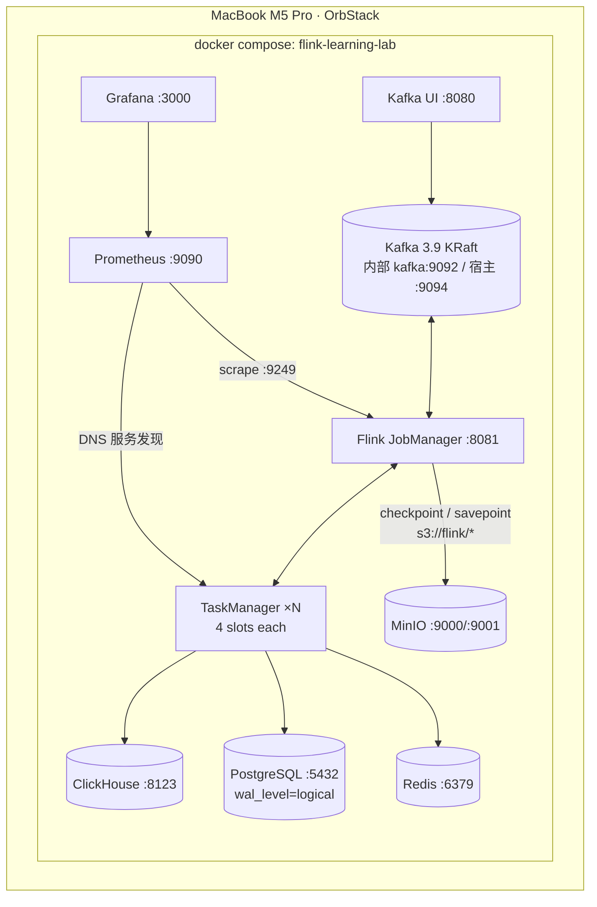

# docker/ · 本地企业级流平台

一条命令拉起完整实验环境,全部镜像原生支持 arm64(OrbStack 下无 Rosetta 转译)。

## 架构

设计要点:

1. **Checkpoint 直接落 MinIO(S3)**:通过 `ENABLE_BUILT_IN_PLUGINS=flink-s3-fs-hadoop-2.2.1.jar` 激活官方镜像自带的 S3 插件,`state.checkpoints.dir=s3://flink/checkpoints`。这样练习 Savepoint / 增量 Checkpoint 时行为与生产一致,而不是落本地盘的"玩具模式"。
2. **Kafka 双监听器**:容器内走 `kafka:9092`(Flink 作业用),宿主机走 `localhost:9094`(数据生成脚本用)。混用是最常见的连不上的原因。
3. **TaskManager 可伸缩**:`make up TM=3` 即 3 台;Prometheus 用 DNS A 记录发现所有实例。
4. **topic 显式管理**:关闭自动建 topic,统一走 `make init`,与企业规范一致。
5. **ClickHouse Native 端口映射为宿主 9002**,避让 MinIO S3 API 的 9000。

## 常用命令

| 命令 | 作用 |
|---|---|
| `make up` / `make up TM=3` | 启动(可指定 TaskManager 数) |
| `make init` | 建 topics / 校验 CH 与 Flink(幂等) |
| `make urls` | 打印全部控制台地址 |
| `make sql` | 进入 Flink SQL Client |
| `make submit-e01` | 提交示例作业 e01 |
| `make logs S=jobmanager` | 跟踪某服务日志 |
| `make down` / `make clean` | 停止 / 停止并清卷 |

## 资源占用(48GB 机器参考)

默认配置(2 TM)整套栈稳态约占 6~7GB 内存。若要给本地 LLM(Ollama/LM Studio)留足空间,可 `make up TM=1`;要做压测再临时扩到 `TM=3`。

## 故障排查

| 症状 | 原因与处理 |
|---|---|
| 作业报 `TimeoutException: Topic clicks not present` | 忘了 `make init`;或脚本连了 9092 而不是宿主机的 9094 |
| Flink UI 打不开但容器在跑 | JobManager 依赖 MinIO 初始化完成;`make logs S=jobmanager` 看是否卡在 S3 插件加载,通常再等 10s |
| checkpoint 报 `Could not find a file system implementation for scheme 's3'` | `ENABLE_BUILT_IN_PLUGINS` 的 jar 名必须与镜像内 `/opt/flink/opt/` 下实际文件名一致(含版本号);升级 Flink 镜像版本时同步改 compose 中的插件文件名 |
| Prometheus 抓不到 TaskManager | TM 是 scale 出来的,确认 `dns_sd_configs` 生效:Prometheus UI → Status → Targets |
| ClickHouse 首次 init.sql 未执行 | init 脚本只在**空数据卷**首次启动执行;`make clean && make up` 重建 |
| Kafka UI 显示集群 offline | kafka 健康检查未过就启动了 UI,等 healthcheck 通过后刷新即可 |
| Apple Silicon 上镜像拉成 amd64 | 本栈所有镜像均有 arm64 构建;若曾手动 pull 过 amd64,`docker pull --platform linux/arm64 <image>` 纠正 |

## 与生产的差异声明(重要)

本环境是"语义等价、规格缩小"的生产模拟:单副本 Kafka、单点 JM(无 HA)、无认证。HA、Kerberos/SASL、多副本与 K8s 形态在 `production/` 模块覆盖,不要把本目录的配置直接用于生产。
