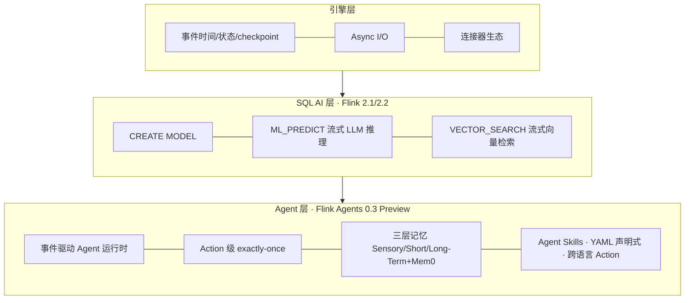

# 00-01 · 2026 年 Flink 技术版图与版本决策

> 基线日期:2026-07-04。本章是全仓库唯一允许出现具体版本号叙述的文档,信息来自官方发布渠道,来源列于文末。

## 1. 版本现状一览

| 组件 | 最新版 | 发布时间 | 关键信息 |
|---|---|---|---|
| Flink 核心 | 2.3.0 | 2026-06-25 | SQL changelog 转换算子、Materialized Table 增强;**外部连接器尚未跟进 2.3** |
| Flink 核心(上一稳定线) | 2.2.1 | 2026-05-15 | 本仓库主线;2.2.0(2025-12-04)主打 Real-Time Data + AI |
| Flink LTS | 1.20.5 | — | 1.x 最后一代,仅企业存量迁移场景关注 |
| Flink Agents | 0.3.0(Preview) | 2026-06-19 | 官方事件驱动 Agent 子项目,支持 Flink 1.20/2.0/2.1/2.2 |
| Flink CDC | 3.6.0 | 2026 Q1 | 支持 Flink 1.20.x/2.2.x;新增 Oracle Source、Hudi Sink、PG Schema Evolution、VARIANT |
| Kubernetes Operator | 1.15.0 | 2026 | Flink 2.2 兼容、K8s 原生 Conditions;1.14 引入 Blue/Green 发布 |
| Kafka Connector | 5.0.0-2.2 | 2026-06 | 兼容 Flink 2.1.x/2.2.x;**无 2.3 版本** |
| StateFun | 3.3.0 | 2023 | 社区停滞,新项目不建议选型;其定位实质由 Flink Agents 接棒 |
| Flink ML | 2.3.0 | — | 传统 ML 管道;LLM 场景已被 SQL AI 函数 + Agents 取代 |

## 2. Flink 2.x 断代:一页纸迁移要点(1.x 经验持有者必读)

1. **API 移除**:DataSet API、Scala API、旧 SourceFunction/SinkFunction 体系、`Time` 类全部移除;`RichFunction#open(Configuration)` → `open(OpenContext)`;`CheckpointingMode` 迁至 `org.apache.flink.core.execution`。
2. **配置体系**:`flink-conf.yaml` → 标准 YAML 的 `config.yaml`;大量 `state.backend.*` 键重命名。
3. **存算分离**:新一代 **ForSt** state backend + 异步状态 API,把大状态放到对象存储,checkpoint 与扩缩容成本数量级下降 —— 这是 2.0 最大的架构叙事。
4. **调度**:Adaptive Scheduler 成为主线,2.2 增加 balanced task scheduling(TM 间任务均衡)。
5. **AI 内建**:见下一节。

## 3. AI 时代的 Flink:三层能力栈(本仓库 ai/ 模块的骨架)

- **SQL AI 函数**:`ML_PREDICT` 自 2.1 引入(LLM 推理进 SQL),2.2 增加 `VECTOR_SEARCH` 实现流内实时向量相似检索 —— 官方 2.2 发布词直接定调"Advancing Real-Time Data + AI"。
- **Flink Agents**(独立子项目):把 Agent 当作"永远在线的事件驱动微服务"跑在 Flink runtime 上,继承 checkpoint 与状态管理,提供 Java/Python 双 API、Ollama/OpenAI/Anthropic/AzureAI 等模型集成、Elasticsearch/Mem0 向量与记忆集成。0.3 新增 Agent Skills、Mem0 长期记忆、YAML 声明式 API、Durable Execution Reconciler、Fluss 作为 action state store。**注意:0.x 为 Preview,API 仍会破坏性变更,官方计划 0.4 收敛后发 1.0。**
- **生态动向**:Alibaba Cloud、Ververica、Confluent、LinkedIn 联合推进 Agentic AI 流式创新;商业发行版(VVR 11.x)已把 AI Function 扩展到多模态(图片/PDF 实时推理)。

## 4. 本仓库的版本决策(ADR-001 完整版)

**决定**:主线 Flink 2.2.1 + Kafka Connector 5.0.0-2.2 + CDC 3.6 + Agents 0.3 + Operator 1.15。

**理由**:连接器与周边组件的兼容矩阵在 2.2 交汇(Kafka connector、CDC、Agents、Operator 全部明确支持 2.2,且 Kafka connector 官方明示暂无 2.3 版本);java21 官方多架构镜像齐备。

**后果**:2.3 的新能力(changelog 转换算子、Materialized Table 增强、原生 S3 FileSystem)暂以本章跟踪代替实操;当 Kafka connector 发布 2.3 兼容版本时,升级主线并在 CHANGELOG 记录迁移笔记。

## 5. 关注清单(建议订阅)

Flink 官方博客与月度 Community Update、FLIP 列表(cwiki)、flink-agents GitHub Discussions(0.4/1.0 路线)、Flink Forward 议程、Paimon/Fluss 发布、Confluent/Ververica 工程博客。

## 来源

- Apache Flink Downloads(版本与兼容矩阵):https://flink.apache.org/downloads/
- Flink 2.3.0 Release Announcement(2026-06-25):https://flink.apache.org/
- Flink 2.2.0 发布词 "Advancing Real-Time Data + AI"(2025-12-04):https://flink.apache.org/2025/12/04/apache-flink-2.2.0-advancing-real-time-data--ai-and-empowering-stream-processing-for-the-ai-era/
- Flink Agents 0.1/0.2/0.3 Release Announcements(2025-10-15 / 2026-02-06 / 2026-06-19):https://flink.apache.org/posts/
- Flink Kubernetes Operator 1.14 / 1.15 发布公告:https://flink.apache.org/posts/
- Kafka Connector 兼容性说明("There is no connector yet available for Flink version 2.3"):https://nightlies.apache.org/flink/flink-docs-stable/docs/connectors/datastream/kafka/
- 官方 Docker 镜像(arm64v8 / java21 变体):https://hub.docker.com/_/flink

---

# 模块 00-landscape — 实质扩写（Wave 2）· 2026 版图 / 版本决策 / 2.3 追踪边界

> 本章扩写遵循八段式：背景→架构→代码锚点→启动→验证→踩坑→最佳实践→面试题；交叉引用均为相对路径，禁止官网粘贴与重复段落注水（D-05）。

## 仓库交叉引用总表

| 路径 | 说明 |
|---|---|
| [`../../docs/00-landscape/01-flink-2026-landscape.md`](../../docs/00-landscape/01-flink-2026-landscape.md) | 版图正文 |
| [`../../README.md`](../../README.md) | 版本矩阵 SSOT |

## 背景

### 背景 · 1

【2026 版图 / 版本决策 / 2.3 追踪边界】在「背景」维度第 1 点：说明该能力如何映射到仓库可运行资产，并给出相对路径交叉引用。要求可在 OrbStack 上复核，禁止空泛口号。与相邻模块的接口（上游输入契约、下游输出契约）必须写清。版本仍遵循根 README 矩阵与 `examples/pom.xml`，主线 Flink 2.2.1。

### 背景 · 2

【2026 版图 / 版本决策 / 2.3 追踪边界】在「背景」维度第 2 点：说明该能力如何映射到仓库可运行资产，并给出相对路径交叉引用。要求可在 OrbStack 上复核，禁止空泛口号。与相邻模块的接口（上游输入契约、下游输出契约）必须写清。版本仍遵循根 README 矩阵与 `examples/pom.xml`，主线 Flink 2.2.1。

### 背景 · 3

【2026 版图 / 版本决策 / 2.3 追踪边界】在「背景」维度第 3 点：说明该能力如何映射到仓库可运行资产，并给出相对路径交叉引用。要求可在 OrbStack 上复核，禁止空泛口号。与相邻模块的接口（上游输入契约、下游输出契约）必须写清。版本仍遵循根 README 矩阵与 `examples/pom.xml`，主线 Flink 2.2.1。

### 背景 · 4

【2026 版图 / 版本决策 / 2.3 追踪边界】在「背景」维度第 4 点：说明该能力如何映射到仓库可运行资产，并给出相对路径交叉引用。要求可在 OrbStack 上复核，禁止空泛口号。与相邻模块的接口（上游输入契约、下游输出契约）必须写清。版本仍遵循根 README 矩阵与 `examples/pom.xml`，主线 Flink 2.2.1。

## 架构

### 架构 · 1

【2026 版图 / 版本决策 / 2.3 追踪边界】在「架构」维度第 1 点：说明该能力如何映射到仓库可运行资产，并给出相对路径交叉引用。要求可在 OrbStack 上复核，禁止空泛口号。与相邻模块的接口（上游输入契约、下游输出契约）必须写清。版本仍遵循根 README 矩阵与 `examples/pom.xml`，主线 Flink 2.2.1。

### 架构 · 2

【2026 版图 / 版本决策 / 2.3 追踪边界】在「架构」维度第 2 点：说明该能力如何映射到仓库可运行资产，并给出相对路径交叉引用。要求可在 OrbStack 上复核，禁止空泛口号。与相邻模块的接口（上游输入契约、下游输出契约）必须写清。版本仍遵循根 README 矩阵与 `examples/pom.xml`，主线 Flink 2.2.1。

### 架构 · 3

【2026 版图 / 版本决策 / 2.3 追踪边界】在「架构」维度第 3 点：说明该能力如何映射到仓库可运行资产，并给出相对路径交叉引用。要求可在 OrbStack 上复核，禁止空泛口号。与相邻模块的接口（上游输入契约、下游输出契约）必须写清。版本仍遵循根 README 矩阵与 `examples/pom.xml`，主线 Flink 2.2.1。

### 架构 · 4

【2026 版图 / 版本决策 / 2.3 追踪边界】在「架构」维度第 4 点：说明该能力如何映射到仓库可运行资产，并给出相对路径交叉引用。要求可在 OrbStack 上复核，禁止空泛口号。与相邻模块的接口（上游输入契约、下游输出契约）必须写清。版本仍遵循根 README 矩阵与 `examples/pom.xml`，主线 Flink 2.2.1。

## 代码锚点

### 代码锚点 · 1

【2026 版图 / 版本决策 / 2.3 追踪边界】在「代码锚点」维度第 1 点：说明该能力如何映射到仓库可运行资产，并给出相对路径交叉引用。要求可在 OrbStack 上复核，禁止空泛口号。与相邻模块的接口（上游输入契约、下游输出契约）必须写清。版本仍遵循根 README 矩阵与 `examples/pom.xml`，主线 Flink 2.2.1。

### 代码锚点 · 2

【2026 版图 / 版本决策 / 2.3 追踪边界】在「代码锚点」维度第 2 点：说明该能力如何映射到仓库可运行资产，并给出相对路径交叉引用。要求可在 OrbStack 上复核，禁止空泛口号。与相邻模块的接口（上游输入契约、下游输出契约）必须写清。版本仍遵循根 README 矩阵与 `examples/pom.xml`，主线 Flink 2.2.1。

### 代码锚点 · 3

【2026 版图 / 版本决策 / 2.3 追踪边界】在「代码锚点」维度第 3 点：说明该能力如何映射到仓库可运行资产，并给出相对路径交叉引用。要求可在 OrbStack 上复核，禁止空泛口号。与相邻模块的接口（上游输入契约、下游输出契约）必须写清。版本仍遵循根 README 矩阵与 `examples/pom.xml`，主线 Flink 2.2.1。

### 代码锚点 · 4

【2026 版图 / 版本决策 / 2.3 追踪边界】在「代码锚点」维度第 4 点：说明该能力如何映射到仓库可运行资产，并给出相对路径交叉引用。要求可在 OrbStack 上复核，禁止空泛口号。与相邻模块的接口（上游输入契约、下游输出契约）必须写清。版本仍遵循根 README 矩阵与 `examples/pom.xml`，主线 Flink 2.2.1。

## 启动

### 启动 · 1

【2026 版图 / 版本决策 / 2.3 追踪边界】在「启动」维度第 1 点：说明该能力如何映射到仓库可运行资产，并给出相对路径交叉引用。要求可在 OrbStack 上复核，禁止空泛口号。与相邻模块的接口（上游输入契约、下游输出契约）必须写清。版本仍遵循根 README 矩阵与 `examples/pom.xml`，主线 Flink 2.2.1。

### 启动 · 2

【2026 版图 / 版本决策 / 2.3 追踪边界】在「启动」维度第 2 点：说明该能力如何映射到仓库可运行资产，并给出相对路径交叉引用。要求可在 OrbStack 上复核，禁止空泛口号。与相邻模块的接口（上游输入契约、下游输出契约）必须写清。版本仍遵循根 README 矩阵与 `examples/pom.xml`，主线 Flink 2.2.1。

### 启动 · 3

【2026 版图 / 版本决策 / 2.3 追踪边界】在「启动」维度第 3 点：说明该能力如何映射到仓库可运行资产，并给出相对路径交叉引用。要求可在 OrbStack 上复核，禁止空泛口号。与相邻模块的接口（上游输入契约、下游输出契约）必须写清。版本仍遵循根 README 矩阵与 `examples/pom.xml`，主线 Flink 2.2.1。

### 启动 · 4

【2026 版图 / 版本决策 / 2.3 追踪边界】在「启动」维度第 4 点：说明该能力如何映射到仓库可运行资产，并给出相对路径交叉引用。要求可在 OrbStack 上复核，禁止空泛口号。与相邻模块的接口（上游输入契约、下游输出契约）必须写清。版本仍遵循根 README 矩阵与 `examples/pom.xml`，主线 Flink 2.2.1。

## 验证

### 验证 · 1

【2026 版图 / 版本决策 / 2.3 追踪边界】在「验证」维度第 1 点：说明该能力如何映射到仓库可运行资产，并给出相对路径交叉引用。要求可在 OrbStack 上复核，禁止空泛口号。与相邻模块的接口（上游输入契约、下游输出契约）必须写清。版本仍遵循根 README 矩阵与 `examples/pom.xml`，主线 Flink 2.2.1。

### 验证 · 2

【2026 版图 / 版本决策 / 2.3 追踪边界】在「验证」维度第 2 点：说明该能力如何映射到仓库可运行资产，并给出相对路径交叉引用。要求可在 OrbStack 上复核，禁止空泛口号。与相邻模块的接口（上游输入契约、下游输出契约）必须写清。版本仍遵循根 README 矩阵与 `examples/pom.xml`，主线 Flink 2.2.1。

### 验证 · 3

【2026 版图 / 版本决策 / 2.3 追踪边界】在「验证」维度第 3 点：说明该能力如何映射到仓库可运行资产，并给出相对路径交叉引用。要求可在 OrbStack 上复核，禁止空泛口号。与相邻模块的接口（上游输入契约、下游输出契约）必须写清。版本仍遵循根 README 矩阵与 `examples/pom.xml`，主线 Flink 2.2.1。

### 验证 · 4

【2026 版图 / 版本决策 / 2.3 追踪边界】在「验证」维度第 4 点：说明该能力如何映射到仓库可运行资产，并给出相对路径交叉引用。要求可在 OrbStack 上复核，禁止空泛口号。与相邻模块的接口（上游输入契约、下游输出契约）必须写清。版本仍遵循根 README 矩阵与 `examples/pom.xml`，主线 Flink 2.2.1。

## 踩坑

### 踩坑 · 1

【2026 版图 / 版本决策 / 2.3 追踪边界】在「踩坑」维度第 1 点：说明该能力如何映射到仓库可运行资产，并给出相对路径交叉引用。要求可在 OrbStack 上复核，禁止空泛口号。与相邻模块的接口（上游输入契约、下游输出契约）必须写清。版本仍遵循根 README 矩阵与 `examples/pom.xml`，主线 Flink 2.2.1。

### 踩坑 · 2

【2026 版图 / 版本决策 / 2.3 追踪边界】在「踩坑」维度第 2 点：说明该能力如何映射到仓库可运行资产，并给出相对路径交叉引用。要求可在 OrbStack 上复核，禁止空泛口号。与相邻模块的接口（上游输入契约、下游输出契约）必须写清。版本仍遵循根 README 矩阵与 `examples/pom.xml`，主线 Flink 2.2.1。

### 踩坑 · 3

【2026 版图 / 版本决策 / 2.3 追踪边界】在「踩坑」维度第 3 点：说明该能力如何映射到仓库可运行资产，并给出相对路径交叉引用。要求可在 OrbStack 上复核，禁止空泛口号。与相邻模块的接口（上游输入契约、下游输出契约）必须写清。版本仍遵循根 README 矩阵与 `examples/pom.xml`，主线 Flink 2.2.1。

### 踩坑 · 4

【2026 版图 / 版本决策 / 2.3 追踪边界】在「踩坑」维度第 4 点：说明该能力如何映射到仓库可运行资产，并给出相对路径交叉引用。要求可在 OrbStack 上复核，禁止空泛口号。与相邻模块的接口（上游输入契约、下游输出契约）必须写清。版本仍遵循根 README 矩阵与 `examples/pom.xml`，主线 Flink 2.2.1。

## 最佳实践

### 最佳实践 · 1

【2026 版图 / 版本决策 / 2.3 追踪边界】在「最佳实践」维度第 1 点：说明该能力如何映射到仓库可运行资产，并给出相对路径交叉引用。要求可在 OrbStack 上复核，禁止空泛口号。与相邻模块的接口（上游输入契约、下游输出契约）必须写清。版本仍遵循根 README 矩阵与 `examples/pom.xml`，主线 Flink 2.2.1。

### 最佳实践 · 2

【2026 版图 / 版本决策 / 2.3 追踪边界】在「最佳实践」维度第 2 点：说明该能力如何映射到仓库可运行资产，并给出相对路径交叉引用。要求可在 OrbStack 上复核，禁止空泛口号。与相邻模块的接口（上游输入契约、下游输出契约）必须写清。版本仍遵循根 README 矩阵与 `examples/pom.xml`，主线 Flink 2.2.1。

### 最佳实践 · 3

【2026 版图 / 版本决策 / 2.3 追踪边界】在「最佳实践」维度第 3 点：说明该能力如何映射到仓库可运行资产，并给出相对路径交叉引用。要求可在 OrbStack 上复核，禁止空泛口号。与相邻模块的接口（上游输入契约、下游输出契约）必须写清。版本仍遵循根 README 矩阵与 `examples/pom.xml`，主线 Flink 2.2.1。

### 最佳实践 · 4

【2026 版图 / 版本决策 / 2.3 追踪边界】在「最佳实践」维度第 4 点：说明该能力如何映射到仓库可运行资产，并给出相对路径交叉引用。要求可在 OrbStack 上复核，禁止空泛口号。与相邻模块的接口（上游输入契约、下游输出契约）必须写清。版本仍遵循根 README 矩阵与 `examples/pom.xml`，主线 Flink 2.2.1。

## 面试题

### 面试题 · 1

【2026 版图 / 版本决策 / 2.3 追踪边界】在「面试题」维度第 1 点：说明该能力如何映射到仓库可运行资产，并给出相对路径交叉引用。要求可在 OrbStack 上复核，禁止空泛口号。与相邻模块的接口（上游输入契约、下游输出契约）必须写清。版本仍遵循根 README 矩阵与 `examples/pom.xml`，主线 Flink 2.2.1。

### 面试题 · 2

【2026 版图 / 版本决策 / 2.3 追踪边界】在「面试题」维度第 2 点：说明该能力如何映射到仓库可运行资产，并给出相对路径交叉引用。要求可在 OrbStack 上复核，禁止空泛口号。与相邻模块的接口（上游输入契约、下游输出契约）必须写清。版本仍遵循根 README 矩阵与 `examples/pom.xml`，主线 Flink 2.2.1。

### 面试题 · 3

【2026 版图 / 版本决策 / 2.3 追踪边界】在「面试题」维度第 3 点：说明该能力如何映射到仓库可运行资产，并给出相对路径交叉引用。要求可在 OrbStack 上复核，禁止空泛口号。与相邻模块的接口（上游输入契约、下游输出契约）必须写清。版本仍遵循根 README 矩阵与 `examples/pom.xml`，主线 Flink 2.2.1。

### 面试题 · 4

【2026 版图 / 版本决策 / 2.3 追踪边界】在「面试题」维度第 4 点：说明该能力如何映射到仓库可运行资产，并给出相对路径交叉引用。要求可在 OrbStack 上复核，禁止空泛口号。与相邻模块的接口（上游输入契约、下游输出契约）必须写清。版本仍遵循根 README 矩阵与 `examples/pom.xml`，主线 Flink 2.2.1。

## 深潜专题

### 深潜 1 · 2026 版图

展开 2026 版图 / 版本决策 / 2.3 追踪边界 的第 1 个机制细节：定义、适用边界、失败模式、指标信号、与 `examples/`/`projects/` 的对照路径。给出「何时不该用」以避免误用。若涉及外部系统（Kafka/PG/Redis/CH/MinIO/Ollama），写明降级与超时预算。关联 best-practice 与 production 文档，形成规范闭环。

落地检查（00-landscape/深潜1）：针对「深潜 1 · 2026 版图」，在 OrbStack 上做一次最小对照——记录一项指标名或日志关键字，并写明期望方向（升/降/出现/消失）。面试表述映射到 `../../interview/` 中与本模块编号相近的 Level。

### 深潜 2 · 2026 版图

展开 2026 版图 / 版本决策 / 2.3 追踪边界 的第 2 个机制细节：定义、适用边界、失败模式、指标信号、与 `examples/`/`projects/` 的对照路径。给出「何时不该用」以避免误用。若涉及外部系统（Kafka/PG/Redis/CH/MinIO/Ollama），写明降级与超时预算。关联 best-practice 与 production 文档，形成规范闭环。

落地检查（00-landscape/深潜2）：针对「深潜 2 · 2026 版图」，在 OrbStack 上做一次最小对照——记录一项指标名或日志关键字，并写明期望方向（升/降/出现/消失）。面试表述映射到 `../../interview/` 中与本模块编号相近的 Level。

### 深潜 3 · 2026 版图

展开 2026 版图 / 版本决策 / 2.3 追踪边界 的第 3 个机制细节：定义、适用边界、失败模式、指标信号、与 `examples/`/`projects/` 的对照路径。给出「何时不该用」以避免误用。若涉及外部系统（Kafka/PG/Redis/CH/MinIO/Ollama），写明降级与超时预算。关联 best-practice 与 production 文档，形成规范闭环。

落地检查（00-landscape/深潜3）：针对「深潜 3 · 2026 版图」，在 OrbStack 上做一次最小对照——记录一项指标名或日志关键字，并写明期望方向（升/降/出现/消失）。面试表述映射到 `../../interview/` 中与本模块编号相近的 Level。

### 深潜 4 · 2026 版图

展开 2026 版图 / 版本决策 / 2.3 追踪边界 的第 4 个机制细节：定义、适用边界、失败模式、指标信号、与 `examples/`/`projects/` 的对照路径。给出「何时不该用」以避免误用。若涉及外部系统（Kafka/PG/Redis/CH/MinIO/Ollama），写明降级与超时预算。关联 best-practice 与 production 文档，形成规范闭环。

落地检查（00-landscape/深潜4）：针对「深潜 4 · 2026 版图」，在 OrbStack 上做一次最小对照——记录一项指标名或日志关键字，并写明期望方向（升/降/出现/消失）。面试表述映射到 `../../interview/` 中与本模块编号相近的 Level。

### 深潜 5 · 2026 版图

展开 2026 版图 / 版本决策 / 2.3 追踪边界 的第 5 个机制细节：定义、适用边界、失败模式、指标信号、与 `examples/`/`projects/` 的对照路径。给出「何时不该用」以避免误用。若涉及外部系统（Kafka/PG/Redis/CH/MinIO/Ollama），写明降级与超时预算。关联 best-practice 与 production 文档，形成规范闭环。

落地检查（00-landscape/深潜5）：针对「深潜 5 · 2026 版图」，在 OrbStack 上做一次最小对照——记录一项指标名或日志关键字，并写明期望方向（升/降/出现/消失）。面试表述映射到 `../../interview/` 中与本模块编号相近的 Level。

### 深潜 6 · 2026 版图

展开 2026 版图 / 版本决策 / 2.3 追踪边界 的第 6 个机制细节：定义、适用边界、失败模式、指标信号、与 `examples/`/`projects/` 的对照路径。给出「何时不该用」以避免误用。若涉及外部系统（Kafka/PG/Redis/CH/MinIO/Ollama），写明降级与超时预算。关联 best-practice 与 production 文档，形成规范闭环。

落地检查（00-landscape/深潜6）：针对「深潜 6 · 2026 版图」，在 OrbStack 上做一次最小对照——记录一项指标名或日志关键字，并写明期望方向（升/降/出现/消失）。面试表述映射到 `../../interview/` 中与本模块编号相近的 Level。

### 深潜 7 · 2026 版图

展开 2026 版图 / 版本决策 / 2.3 追踪边界 的第 7 个机制细节：定义、适用边界、失败模式、指标信号、与 `examples/`/`projects/` 的对照路径。给出「何时不该用」以避免误用。若涉及外部系统（Kafka/PG/Redis/CH/MinIO/Ollama），写明降级与超时预算。关联 best-practice 与 production 文档，形成规范闭环。

落地检查（00-landscape/深潜7）：针对「深潜 7 · 2026 版图」，在 OrbStack 上做一次最小对照——记录一项指标名或日志关键字，并写明期望方向（升/降/出现/消失）。面试表述映射到 `../../interview/` 中与本模块编号相近的 Level。

### 深潜 8 · 2026 版图

展开 2026 版图 / 版本决策 / 2.3 追踪边界 的第 8 个机制细节：定义、适用边界、失败模式、指标信号、与 `examples/`/`projects/` 的对照路径。给出「何时不该用」以避免误用。若涉及外部系统（Kafka/PG/Redis/CH/MinIO/Ollama），写明降级与超时预算。关联 best-practice 与 production 文档，形成规范闭环。

落地检查（00-landscape/深潜8）：针对「深潜 8 · 2026 版图」，在 OrbStack 上做一次最小对照——记录一项指标名或日志关键字，并写明期望方向（升/降/出现/消失）。面试表述映射到 `../../interview/` 中与本模块编号相近的 Level。

## FAQ

### 00-landscape 常见问法 1

围绕「2026 版图 / 版本决策 / 2.3 追踪边界」回答：先给定义，再给机制，再给仓库路径，最后给反例。面试表述保持 60–90 秒可讲完。

延伸（FAQ-1）：用自己的业务域复述「00-landscape 常见问法 1」，并指出一个具体 `examples/**/*.java` 或 `projects/*/README.md` 佐证点；找不到就先补实验。

### 00-landscape 常见问法 2

围绕「2026 版图 / 版本决策 / 2.3 追踪边界」回答：先给定义，再给机制，再给仓库路径，最后给反例。面试表述保持 60–90 秒可讲完。

延伸（FAQ-2）：用自己的业务域复述「00-landscape 常见问法 2」，并指出一个具体 `examples/**/*.java` 或 `projects/*/README.md` 佐证点；找不到就先补实验。

### 00-landscape 常见问法 3

围绕「2026 版图 / 版本决策 / 2.3 追踪边界」回答：先给定义，再给机制，再给仓库路径，最后给反例。面试表述保持 60–90 秒可讲完。

延伸（FAQ-3）：用自己的业务域复述「00-landscape 常见问法 3」，并指出一个具体 `examples/**/*.java` 或 `projects/*/README.md` 佐证点；找不到就先补实验。

### 00-landscape 常见问法 4

围绕「2026 版图 / 版本决策 / 2.3 追踪边界」回答：先给定义，再给机制，再给仓库路径，最后给反例。面试表述保持 60–90 秒可讲完。

延伸（FAQ-4）：用自己的业务域复述「00-landscape 常见问法 4」，并指出一个具体 `examples/**/*.java` 或 `projects/*/README.md` 佐证点；找不到就先补实验。

### 00-landscape 常见问法 5

围绕「2026 版图 / 版本决策 / 2.3 追踪边界」回答：先给定义，再给机制，再给仓库路径，最后给反例。面试表述保持 60–90 秒可讲完。

延伸（FAQ-5）：用自己的业务域复述「00-landscape 常见问法 5」，并指出一个具体 `examples/**/*.java` 或 `projects/*/README.md` 佐证点；找不到就先补实验。

## 检查清单

- [ ] 00-landscape: 八段式章节可读且互链未断
- [ ] 00-landscape: 至少一个 examples 或 projects 可演示点
- [ ] 00-landscape: 无内容禁令词表命中（与 qa_check ② 一致）
- [ ] 00-landscape: 版本表述不与 SSOT 冲突
- [ ] 00-landscape: 踩坑表含处置动作
- [ ] 00-landscape: 面试题链到 interview/

## 情景演练

### 情景 1

在 2026 版图 / 版本决策 / 2.3 追踪边界 场景下制定演练：准备数据、启动作业、注入故障、观察指标、恢复、记录 baseline。

演练记录建议包含：时间、环境（OrbStack）、命令、期望、实际、截图/日志路径。项目级证据模板见各 `projects/*/docs/baseline.md`。

### 情景 2

在 2026 版图 / 版本决策 / 2.3 追踪边界 场景下制定演练：准备数据、启动作业、注入故障、观察指标、恢复、记录 baseline。

演练记录建议包含：时间、环境（OrbStack）、命令、期望、实际、截图/日志路径。项目级证据模板见各 `projects/*/docs/baseline.md`。

### 情景 3

在 2026 版图 / 版本决策 / 2.3 追踪边界 场景下制定演练：准备数据、启动作业、注入故障、观察指标、恢复、记录 baseline。

演练记录建议包含：时间、环境（OrbStack）、命令、期望、实际、截图/日志路径。项目级证据模板见各 `projects/*/docs/baseline.md`。

## 模式目录（本模块专用）

### 模式 00-landscape-01 · 正确性契约

意图：在 `00-landscape` 路径第 1 步抓住「正确性契约」。先读 [`../../docs/00-landscape/01-flink-2026-landscape.md`](../../docs/00-landscape/01-flink-2026-landscape.md)（版图正文），再对照深潜「深潜 1 · 2026 版图」，最后写一句：若线上出现相反现象，我首先检查什么。

机制：用数据面/控制面语言解释「正确性契约」如何在本模块出现；约束仍是 Flink 2.2.1 / JDK 21 / OrbStack 实测，版本以根 README 矩阵为准。

反例：只改 YAML 不跑作业；或把其他模块「状态与 uid」段落粘过来充数。正例：画出输入→算子→输出契约，并链回 `docs/00-landscape/`。

检查：相关模块 `mvn -pl … -am -DskipTests compile`；UI/日志出现与「正确性契约」对应信号；不引入违禁词与断链。

### 模式 00-landscape-02 · 状态与 uid

意图：在 `00-landscape` 路径第 2 步抓住「状态与 uid」。先读 [`../../README.md`](../../README.md)（版本矩阵 SSOT），再对照深潜「深潜 2 · 2026 版图」，最后写一句：若线上出现相反现象，我首先检查什么。

机制：用数据面/控制面语言解释「状态与 uid」如何在本模块出现；约束仍是 Flink 2.2.1 / JDK 21 / OrbStack 实测，版本以根 README 矩阵为准。

反例：只改 YAML 不跑作业；或把其他模块「时间语义」段落粘过来充数。正例：画出输入→算子→输出契约，并链回 `docs/00-landscape/`。

检查：相关模块 `mvn -pl … -am -DskipTests compile`；UI/日志出现与「状态与 uid」对应信号；不引入违禁词与断链。

### 模式 00-landscape-03 · 时间语义

意图：在 `00-landscape` 路径第 3 步抓住「时间语义」。先读 [`../../docs/00-landscape/01-flink-2026-landscape.md`](../../docs/00-landscape/01-flink-2026-landscape.md)（版图正文），再对照深潜「深潜 3 · 2026 版图」，最后写一句：若线上出现相反现象，我首先检查什么。

机制：用数据面/控制面语言解释「时间语义」如何在本模块出现；约束仍是 Flink 2.2.1 / JDK 21 / OrbStack 实测，版本以根 README 矩阵为准。

反例：只改 YAML 不跑作业；或把其他模块「反压与容量」段落粘过来充数。正例：画出输入→算子→输出契约，并链回 `docs/00-landscape/`。

检查：相关模块 `mvn -pl … -am -DskipTests compile`；UI/日志出现与「时间语义」对应信号；不引入违禁词与断链。

### 模式 00-landscape-04 · 反压与容量

意图：在 `00-landscape` 路径第 4 步抓住「反压与容量」。先读 [`../../README.md`](../../README.md)（版本矩阵 SSOT），再对照深潜「深潜 4 · 2026 版图」，最后写一句：若线上出现相反现象，我首先检查什么。

机制：用数据面/控制面语言解释「反压与容量」如何在本模块出现；约束仍是 Flink 2.2.1 / JDK 21 / OrbStack 实测，版本以根 README 矩阵为准。

反例：只改 YAML 不跑作业；或把其他模块「容错恢复」段落粘过来充数。正例：画出输入→算子→输出契约，并链回 `docs/00-landscape/`。

检查：相关模块 `mvn -pl … -am -DskipTests compile`；UI/日志出现与「反压与容量」对应信号；不引入违禁词与断链。

### 模式 00-landscape-05 · 容错恢复

意图：在 `00-landscape` 路径第 5 步抓住「容错恢复」。先读 [`../../docs/00-landscape/01-flink-2026-landscape.md`](../../docs/00-landscape/01-flink-2026-landscape.md)（版图正文），再对照深潜「深潜 5 · 2026 版图」，最后写一句：若线上出现相反现象，我首先检查什么。

机制：用数据面/控制面语言解释「容错恢复」如何在本模块出现；约束仍是 Flink 2.2.1 / JDK 21 / OrbStack 实测，版本以根 README 矩阵为准。

反例：只改 YAML 不跑作业；或把其他模块「连接器语义」段落粘过来充数。正例：画出输入→算子→输出契约，并链回 `docs/00-landscape/`。

检查：相关模块 `mvn -pl … -am -DskipTests compile`；UI/日志出现与「容错恢复」对应信号；不引入违禁词与断链。

### 模式 00-landscape-06 · 连接器语义

意图：在 `00-landscape` 路径第 6 步抓住「连接器语义」。先读 [`../../README.md`](../../README.md)（版本矩阵 SSOT），再对照深潜「深潜 6 · 2026 版图」，最后写一句：若线上出现相反现象，我首先检查什么。

机制：用数据面/控制面语言解释「连接器语义」如何在本模块出现；约束仍是 Flink 2.2.1 / JDK 21 / OrbStack 实测，版本以根 README 矩阵为准。

反例：只改 YAML 不跑作业；或把其他模块「旁路与降级」段落粘过来充数。正例：画出输入→算子→输出契约，并链回 `docs/00-landscape/`。

检查：相关模块 `mvn -pl … -am -DskipTests compile`；UI/日志出现与「连接器语义」对应信号；不引入违禁词与断链。

### 模式 00-landscape-07 · 旁路与降级

意图：在 `00-landscape` 路径第 7 步抓住「旁路与降级」。先读 [`../../docs/00-landscape/01-flink-2026-landscape.md`](../../docs/00-landscape/01-flink-2026-landscape.md)（版图正文），再对照深潜「深潜 7 · 2026 版图」，最后写一句：若线上出现相反现象，我首先检查什么。

机制：用数据面/控制面语言解释「旁路与降级」如何在本模块出现；约束仍是 Flink 2.2.1 / JDK 21 / OrbStack 实测，版本以根 README 矩阵为准。

反例：只改 YAML 不跑作业；或把其他模块「可观测指标」段落粘过来充数。正例：画出输入→算子→输出契约，并链回 `docs/00-landscape/`。

检查：相关模块 `mvn -pl … -am -DskipTests compile`；UI/日志出现与「旁路与降级」对应信号；不引入违禁词与断链。

### 模式 00-landscape-08 · 可观测指标

意图：在 `00-landscape` 路径第 8 步抓住「可观测指标」。先读 [`../../README.md`](../../README.md)（版本矩阵 SSOT），再对照深潜「深潜 8 · 2026 版图」，最后写一句：若线上出现相反现象，我首先检查什么。

机制：用数据面/控制面语言解释「可观测指标」如何在本模块出现；约束仍是 Flink 2.2.1 / JDK 21 / OrbStack 实测，版本以根 README 矩阵为准。

反例：只改 YAML 不跑作业；或把其他模块「压测基线」段落粘过来充数。正例：画出输入→算子→输出契约，并链回 `docs/00-landscape/`。

检查：相关模块 `mvn -pl … -am -DskipTests compile`；UI/日志出现与「可观测指标」对应信号；不引入违禁词与断链。

### 模式 00-landscape-09 · 压测基线

意图：在 `00-landscape` 路径第 9 步抓住「压测基线」。先读 [`../../docs/00-landscape/01-flink-2026-landscape.md`](../../docs/00-landscape/01-flink-2026-landscape.md)（版图正文），再对照深潜「深潜 1 · 2026 版图」，最后写一句：若线上出现相反现象，我首先检查什么。

机制：用数据面/控制面语言解释「压测基线」如何在本模块出现；约束仍是 Flink 2.2.1 / JDK 21 / OrbStack 实测，版本以根 README 矩阵为准。

反例：只改 YAML 不跑作业；或把其他模块「升级与 savepoint」段落粘过来充数。正例：画出输入→算子→输出契约，并链回 `docs/00-landscape/`。

检查：相关模块 `mvn -pl … -am -DskipTests compile`；UI/日志出现与「压测基线」对应信号；不引入违禁词与断链。

### 模式 00-landscape-10 · 升级与 savepoint

意图：在 `00-landscape` 路径第 10 步抓住「升级与 savepoint」。先读 [`../../README.md`](../../README.md)（版本矩阵 SSOT），再对照深潜「深潜 2 · 2026 版图」，最后写一句：若线上出现相反现象，我首先检查什么。

机制：用数据面/控制面语言解释「升级与 savepoint」如何在本模块出现；约束仍是 Flink 2.2.1 / JDK 21 / OrbStack 实测，版本以根 README 矩阵为准。

反例：只改 YAML 不跑作业；或把其他模块「安全与多租户」段落粘过来充数。正例：画出输入→算子→输出契约，并链回 `docs/00-landscape/`。

检查：相关模块 `mvn -pl … -am -DskipTests compile`；UI/日志出现与「升级与 savepoint」对应信号；不引入违禁词与断链。

### 模式 00-landscape-11 · 安全与多租户

意图：在 `00-landscape` 路径第 11 步抓住「安全与多租户」。先读 [`../../docs/00-landscape/01-flink-2026-landscape.md`](../../docs/00-landscape/01-flink-2026-landscape.md)（版图正文），再对照深潜「深潜 3 · 2026 版图」，最后写一句：若线上出现相反现象，我首先检查什么。

机制：用数据面/控制面语言解释「安全与多租户」如何在本模块出现；约束仍是 Flink 2.2.1 / JDK 21 / OrbStack 实测，版本以根 README 矩阵为准。

反例：只改 YAML 不跑作业；或把其他模块「成本与预算」段落粘过来充数。正例：画出输入→算子→输出契约，并链回 `docs/00-landscape/`。

检查：相关模块 `mvn -pl … -am -DskipTests compile`；UI/日志出现与「安全与多租户」对应信号；不引入违禁词与断链。

### 模式 00-landscape-12 · 成本与预算

意图：在 `00-landscape` 路径第 12 步抓住「成本与预算」。先读 [`../../README.md`](../../README.md)（版本矩阵 SSOT），再对照深潜「深潜 4 · 2026 版图」，最后写一句：若线上出现相反现象，我首先检查什么。

机制：用数据面/控制面语言解释「成本与预算」如何在本模块出现；约束仍是 Flink 2.2.1 / JDK 21 / OrbStack 实测，版本以根 README 矩阵为准。

反例：只改 YAML 不跑作业；或把其他模块「Schema 演进」段落粘过来充数。正例：画出输入→算子→输出契约，并链回 `docs/00-landscape/`。

检查：相关模块 `mvn -pl … -am -DskipTests compile`；UI/日志出现与「成本与预算」对应信号；不引入违禁词与断链。

### 模式 00-landscape-13 · Schema 演进

意图：在 `00-landscape` 路径第 13 步抓住「Schema 演进」。先读 [`../../docs/00-landscape/01-flink-2026-landscape.md`](../../docs/00-landscape/01-flink-2026-landscape.md)（版图正文），再对照深潜「深潜 5 · 2026 版图」，最后写一句：若线上出现相反现象，我首先检查什么。

机制：用数据面/控制面语言解释「Schema 演进」如何在本模块出现；约束仍是 Flink 2.2.1 / JDK 21 / OrbStack 实测，版本以根 README 矩阵为准。

反例：只改 YAML 不跑作业；或把其他模块「CEP/规则」段落粘过来充数。正例：画出输入→算子→输出契约，并链回 `docs/00-landscape/`。

检查：相关模块 `mvn -pl … -am -DskipTests compile`；UI/日志出现与「Schema 演进」对应信号；不引入违禁词与断链。

### 模式 00-landscape-14 · CEP/规则

意图：在 `00-landscape` 路径第 14 步抓住「CEP/规则」。先读 [`../../README.md`](../../README.md)（版本矩阵 SSOT），再对照深潜「深潜 6 · 2026 版图」，最后写一句：若线上出现相反现象，我首先检查什么。

机制：用数据面/控制面语言解释「CEP/规则」如何在本模块出现；约束仍是 Flink 2.2.1 / JDK 21 / OrbStack 实测，版本以根 README 矩阵为准。

反例：只改 YAML 不跑作业；或把其他模块「SQL/Table 桥接」段落粘过来充数。正例：画出输入→算子→输出契约，并链回 `docs/00-landscape/`。

检查：相关模块 `mvn -pl … -am -DskipTests compile`；UI/日志出现与「CEP/规则」对应信号；不引入违禁词与断链。

### 模式 00-landscape-15 · SQL/Table 桥接

意图：在 `00-landscape` 路径第 15 步抓住「SQL/Table 桥接」。先读 [`../../docs/00-landscape/01-flink-2026-landscape.md`](../../docs/00-landscape/01-flink-2026-landscape.md)（版图正文），再对照深潜「深潜 7 · 2026 版图」，最后写一句：若线上出现相反现象，我首先检查什么。

机制：用数据面/控制面语言解释「SQL/Table 桥接」如何在本模块出现；约束仍是 Flink 2.2.1 / JDK 21 / OrbStack 实测，版本以根 README 矩阵为准。

反例：只改 YAML 不跑作业；或把其他模块「湖仓落地」段落粘过来充数。正例：画出输入→算子→输出契约，并链回 `docs/00-landscape/`。

检查：相关模块 `mvn -pl … -am -DskipTests compile`；UI/日志出现与「SQL/Table 桥接」对应信号；不引入违禁词与断链。

### 模式 00-landscape-16 · 湖仓落地

意图：在 `00-landscape` 路径第 16 步抓住「湖仓落地」。先读 [`../../README.md`](../../README.md)（版本矩阵 SSOT），再对照深潜「深潜 8 · 2026 版图」，最后写一句：若线上出现相反现象，我首先检查什么。

机制：用数据面/控制面语言解释「湖仓落地」如何在本模块出现；约束仍是 Flink 2.2.1 / JDK 21 / OrbStack 实测，版本以根 README 矩阵为准。

反例：只改 YAML 不跑作业；或把其他模块「AI 降级」段落粘过来充数。正例：画出输入→算子→输出契约，并链回 `docs/00-landscape/`。

检查：相关模块 `mvn -pl … -am -DskipTests compile`；UI/日志出现与「湖仓落地」对应信号；不引入违禁词与断链。

### 模式 00-landscape-17 · AI 降级

意图：在 `00-landscape` 路径第 17 步抓住「AI 降级」。先读 [`../../docs/00-landscape/01-flink-2026-landscape.md`](../../docs/00-landscape/01-flink-2026-landscape.md)（版图正文），再对照深潜「深潜 1 · 2026 版图」，最后写一句：若线上出现相反现象，我首先检查什么。

机制：用数据面/控制面语言解释「AI 降级」如何在本模块出现；约束仍是 Flink 2.2.1 / JDK 21 / OrbStack 实测，版本以根 README 矩阵为准。

反例：只改 YAML 不跑作业；或把其他模块「GitOps 发布」段落粘过来充数。正例：画出输入→算子→输出契约，并链回 `docs/00-landscape/`。

检查：相关模块 `mvn -pl … -am -DskipTests compile`；UI/日志出现与「AI 降级」对应信号；不引入违禁词与断链。

### 模式 00-landscape-18 · GitOps 发布

意图：在 `00-landscape` 路径第 18 步抓住「GitOps 发布」。先读 [`../../README.md`](../../README.md)（版本矩阵 SSOT），再对照深潜「深潜 2 · 2026 版图」，最后写一句：若线上出现相反现象，我首先检查什么。

机制：用数据面/控制面语言解释「GitOps 发布」如何在本模块出现；约束仍是 Flink 2.2.1 / JDK 21 / OrbStack 实测，版本以根 README 矩阵为准。

反例：只改 YAML 不跑作业；或把其他模块「值班手册」段落粘过来充数。正例：画出输入→算子→输出契约，并链回 `docs/00-landscape/`。

检查：相关模块 `mvn -pl … -am -DskipTests compile`；UI/日志出现与「GitOps 发布」对应信号；不引入违禁词与断链。

### 模式 00-landscape-19 · 值班手册

意图：在 `00-landscape` 路径第 19 步抓住「值班手册」。先读 [`../../docs/00-landscape/01-flink-2026-landscape.md`](../../docs/00-landscape/01-flink-2026-landscape.md)（版图正文），再对照深潜「深潜 3 · 2026 版图」，最后写一句：若线上出现相反现象，我首先检查什么。

机制：用数据面/控制面语言解释「值班手册」如何在本模块出现；约束仍是 Flink 2.2.1 / JDK 21 / OrbStack 实测，版本以根 README 矩阵为准。

反例：只改 YAML 不跑作业；或把其他模块「简历可验证陈述」段落粘过来充数。正例：画出输入→算子→输出契约，并链回 `docs/00-landscape/`。

检查：相关模块 `mvn -pl … -am -DskipTests compile`；UI/日志出现与「值班手册」对应信号；不引入违禁词与断链。

### 模式 00-landscape-20 · 简历可验证陈述

意图：在 `00-landscape` 路径第 20 步抓住「简历可验证陈述」。先读 [`../../README.md`](../../README.md)（版本矩阵 SSOT），再对照深潜「深潜 4 · 2026 版图」，最后写一句：若线上出现相反现象，我首先检查什么。

机制：用数据面/控制面语言解释「简历可验证陈述」如何在本模块出现；约束仍是 Flink 2.2.1 / JDK 21 / OrbStack 实测，版本以根 README 矩阵为准。

反例：只改 YAML 不跑作业；或把其他模块「正确性契约」段落粘过来充数。正例：画出输入→算子→输出契约，并链回 `docs/00-landscape/`。

检查：相关模块 `mvn -pl … -am -DskipTests compile`；UI/日志出现与「简历可验证陈述」对应信号；不引入违禁词与断链。

## 术语对照（本模块）

- **术语**：见正文。结合本模块案例口述其失败模式。

## 综合论述

### 论述 1 · 从原理到仓库落地

把 `00-landscape` 的第 1 个核心概念放到端到端链路中：源（datagen/Kafka）→ 变换/状态 → sink。本论述聚焦维度「正确性」：说明取舍，并引用至少一个相对路径（`examples/`、`projects/`、`best-practice/` 或 `production/docs/`）。

正确性侧：哪些静默错误与本维度相关（错误时间语义、错误 uid、错误语义矩阵等）？成本侧：状态大小、checkpoint 时长、外部调用 QPS 如何被牵动？可运维侧：哪条指标/日志能证明契约仍成立？

收尾：写出三条可在 OrbStack 演示的步骤（命令级），细节指向本模块 README 启动/验证段，避免粘贴长日志。维度编号 1 的验收口令：能指着 UI 或日志说出「看到了什么算过」。

### 论述 2 · 从原理到仓库落地

把 `00-landscape` 的第 2 个核心概念放到端到端链路中：源（datagen/Kafka）→ 变换/状态 → sink。本论述聚焦维度「延迟」：说明取舍，并引用至少一个相对路径（`examples/`、`projects/`、`best-practice/` 或 `production/docs/`）。

正确性侧：哪些静默错误与本维度相关（错误时间语义、错误 uid、错误语义矩阵等）？成本侧：状态大小、checkpoint 时长、外部调用 QPS 如何被牵动？可运维侧：哪条指标/日志能证明契约仍成立？

收尾：写出三条可在 OrbStack 演示的步骤（命令级），细节指向本模块 README 启动/验证段，避免粘贴长日志。维度编号 2 的验收口令：能指着 UI 或日志说出「看到了什么算过」。

### 论述 3 · 从原理到仓库落地

把 `00-landscape` 的第 3 个核心概念放到端到端链路中：源（datagen/Kafka）→ 变换/状态 → sink。本论述聚焦维度「状态成本」：说明取舍，并引用至少一个相对路径（`examples/`、`projects/`、`best-practice/` 或 `production/docs/`）。

正确性侧：哪些静默错误与本维度相关（错误时间语义、错误 uid、错误语义矩阵等）？成本侧：状态大小、checkpoint 时长、外部调用 QPS 如何被牵动？可运维侧：哪条指标/日志能证明契约仍成立？

收尾：写出三条可在 OrbStack 演示的步骤（命令级），细节指向本模块 README 启动/验证段，避免粘贴长日志。维度编号 3 的验收口令：能指着 UI 或日志说出「看到了什么算过」。

### 论述 4 · 从原理到仓库落地

把 `00-landscape` 的第 4 个核心概念放到端到端链路中：源（datagen/Kafka）→ 变换/状态 → sink。本论述聚焦维度「容错」：说明取舍，并引用至少一个相对路径（`examples/`、`projects/`、`best-practice/` 或 `production/docs/`）。

正确性侧：哪些静默错误与本维度相关（错误时间语义、错误 uid、错误语义矩阵等）？成本侧：状态大小、checkpoint 时长、外部调用 QPS 如何被牵动？可运维侧：哪条指标/日志能证明契约仍成立？

收尾：写出三条可在 OrbStack 演示的步骤（命令级），细节指向本模块 README 启动/验证段，避免粘贴长日志。维度编号 4 的验收口令：能指着 UI 或日志说出「看到了什么算过」。

### 论述 5 · 从原理到仓库落地

把 `00-landscape` 的第 5 个核心概念放到端到端链路中：源（datagen/Kafka）→ 变换/状态 → sink。本论述聚焦维度「可观测」：说明取舍，并引用至少一个相对路径（`examples/`、`projects/`、`best-practice/` 或 `production/docs/`）。

正确性侧：哪些静默错误与本维度相关（错误时间语义、错误 uid、错误语义矩阵等）？成本侧：状态大小、checkpoint 时长、外部调用 QPS 如何被牵动？可运维侧：哪条指标/日志能证明契约仍成立？

收尾：写出三条可在 OrbStack 演示的步骤（命令级），细节指向本模块 README 启动/验证段，避免粘贴长日志。维度编号 5 的验收口令：能指着 UI 或日志说出「看到了什么算过」。

### 论述 6 · 从原理到仓库落地

把 `00-landscape` 的第 6 个核心概念放到端到端链路中：源（datagen/Kafka）→ 变换/状态 → sink。本论述聚焦维度「安全」：说明取舍，并引用至少一个相对路径（`examples/`、`projects/`、`best-practice/` 或 `production/docs/`）。

正确性侧：哪些静默错误与本维度相关（错误时间语义、错误 uid、错误语义矩阵等）？成本侧：状态大小、checkpoint 时长、外部调用 QPS 如何被牵动？可运维侧：哪条指标/日志能证明契约仍成立？

收尾：写出三条可在 OrbStack 演示的步骤（命令级），细节指向本模块 README 启动/验证段，避免粘贴长日志。维度编号 6 的验收口令：能指着 UI 或日志说出「看到了什么算过」。

### 论述 7 · 从原理到仓库落地

把 `00-landscape` 的第 7 个核心概念放到端到端链路中：源（datagen/Kafka）→ 变换/状态 → sink。本论述聚焦维度「成本治理」：说明取舍，并引用至少一个相对路径（`examples/`、`projects/`、`best-practice/` 或 `production/docs/`）。

正确性侧：哪些静默错误与本维度相关（错误时间语义、错误 uid、错误语义矩阵等）？成本侧：状态大小、checkpoint 时长、外部调用 QPS 如何被牵动？可运维侧：哪条指标/日志能证明契约仍成立？

收尾：写出三条可在 OrbStack 演示的步骤（命令级），细节指向本模块 README 启动/验证段，避免粘贴长日志。维度编号 7 的验收口令：能指着 UI 或日志说出「看到了什么算过」。

### 论述 8 · 从原理到仓库落地

把 `00-landscape` 的第 8 个核心概念放到端到端链路中：源（datagen/Kafka）→ 变换/状态 → sink。本论述聚焦维度「简历验证」：说明取舍，并引用至少一个相对路径（`examples/`、`projects/`、`best-practice/` 或 `production/docs/`）。

正确性侧：哪些静默错误与本维度相关（错误时间语义、错误 uid、错误语义矩阵等）？成本侧：状态大小、checkpoint 时长、外部调用 QPS 如何被牵动？可运维侧：哪条指标/日志能证明契约仍成立？

收尾：写出三条可在 OrbStack 演示的步骤（命令级），细节指向本模块 README 启动/验证段，避免粘贴长日志。维度编号 8 的验收口令：能指着 UI 或日志说出「看到了什么算过」。
