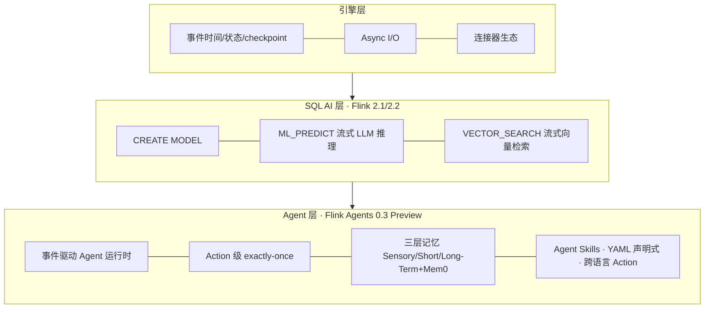

# 00-01 · 2026 年 Flink 技术版图与版本决策

> 基线日期:2026-07-04。本章是全仓库唯一允许出现具体版本号叙述的文档,信息来自官方发布渠道,来源列于文末。

## 1. 版本现状一览

| 组件 | 最新版 | 发布时间 | 关键信息 |
|---|---|---|---|
| Flink 核心 | 2.3.0 | 2026-06-25 | SQL changelog 转换算子、Materialized Table 增强;**外部连接器尚未跟进 2.3** |
| Flink 核心(上一稳定线) | 2.2.1 | 2026-05-15 | 本仓库主线;2.2.0(2025-12-04)主打 Real-Time Data + AI |
| Flink LTS | 1.20.5 | — | 1.x 最后一代,仅企业存量迁移场景关注 |
| Flink Agents | 0.3.0(Preview) | 2026-06-19 | 官方事件驱动 Agent 子项目,支持 Flink 1.20/2.0/2.1/2.2 |
| Flink CDC | 3.6.0 | 2026 Q1 | 支持 Flink 1.20.x/2.2.x;新增 Oracle Source、Hudi Sink、PG Schema Evolution、VARIANT |
| Kubernetes Operator | 1.15.0 | 2026 | Flink 2.2 兼容、K8s 原生 Conditions;1.14 引入 Blue/Green 发布 |
| Kafka Connector | 5.0.0-2.2 | 2026-06 | 兼容 Flink 2.1.x/2.2.x;**无 2.3 版本** |
| StateFun | 3.3.0 | 2023 | 社区停滞,新项目不建议选型;其定位实质由 Flink Agents 接棒 |
| Flink ML | 2.3.0 | — | 传统 ML 管道;LLM 场景已被 SQL AI 函数 + Agents 取代 |

## 2. Flink 2.x 断代:一页纸迁移要点(1.x 经验持有者必读)

1. **API 移除**:DataSet API、Scala API、旧 SourceFunction/SinkFunction 体系、`Time` 类全部移除;`RichFunction#open(Configuration)` → `open(OpenContext)`;`CheckpointingMode` 迁至 `org.apache.flink.core.execution`。
2. **配置体系**:`flink-conf.yaml` → 标准 YAML 的 `config.yaml`;大量 `state.backend.*` 键重命名。
3. **存算分离**:新一代 **ForSt** state backend + 异步状态 API,把大状态放到对象存储,checkpoint 与扩缩容成本数量级下降 —— 这是 2.0 最大的架构叙事。
4. **调度**:Adaptive Scheduler 成为主线,2.2 增加 balanced task scheduling(TM 间任务均衡)。
5. **AI 内建**:见下一节。

## 3. AI 时代的 Flink:三层能力栈(本仓库 ai/ 模块的骨架)

- **SQL AI 函数**:`ML_PREDICT` 自 2.1 引入(LLM 推理进 SQL),2.2 增加 `VECTOR_SEARCH` 实现流内实时向量相似检索 —— 官方 2.2 发布词直接定调"Advancing Real-Time Data + AI"。
- **Flink Agents**(独立子项目):把 Agent 当作"永远在线的事件驱动微服务"跑在 Flink runtime 上,继承 checkpoint 与状态管理,提供 Java/Python 双 API、Ollama/OpenAI/Anthropic/AzureAI 等模型集成、Elasticsearch/Mem0 向量与记忆集成。0.3 新增 Agent Skills、Mem0 长期记忆、YAML 声明式 API、Durable Execution Reconciler、Fluss 作为 action state store。**注意:0.x 为 Preview,API 仍会破坏性变更,官方计划 0.4 收敛后发 1.0。**
- **生态动向**:Alibaba Cloud、Ververica、Confluent、LinkedIn 联合推进 Agentic AI 流式创新;商业发行版(VVR 11.x)已把 AI Function 扩展到多模态(图片/PDF 实时推理)。

## 4. 本仓库的版本决策(ADR-001 完整版)

**决定**:主线 Flink 2.2.1 + Kafka Connector 5.0.0-2.2 + CDC 3.6 + Agents 0.3 + Operator 1.15。

**理由**:连接器与周边组件的兼容矩阵在 2.2 交汇(Kafka connector、CDC、Agents、Operator 全部明确支持 2.2,且 Kafka connector 官方明示暂无 2.3 版本);java21 官方多架构镜像齐备。

**后果**:2.3 的新能力(changelog 转换算子、Materialized Table 增强、原生 S3 FileSystem)暂以本章跟踪代替实操;当 Kafka connector 发布 2.3 兼容版本时,升级主线并在 CHANGELOG 记录迁移笔记。

## 5. 关注清单(建议订阅)

Flink 官方博客与月度 Community Update、FLIP 列表(cwiki)、flink-agents GitHub Discussions(0.4/1.0 路线)、Flink Forward 议程、Paimon/Fluss 发布、Confluent/Ververica 工程博客。

## 来源

- Apache Flink Downloads(版本与兼容矩阵):https://flink.apache.org/downloads/
- Flink 2.3.0 Release Announcement(2026-06-25):https://flink.apache.org/
- Flink 2.2.0 发布词 "Advancing Real-Time Data + AI"(2025-12-04):https://flink.apache.org/2025/12/04/apache-flink-2.2.0-advancing-real-time-data--ai-and-empowering-stream-processing-for-the-ai-era/
- Flink Agents 0.1/0.2/0.3 Release Announcements(2025-10-15 / 2026-02-06 / 2026-06-19):https://flink.apache.org/posts/
- Flink Kubernetes Operator 1.14 / 1.15 发布公告:https://flink.apache.org/posts/
- Kafka Connector 兼容性说明("There is no connector yet available for Flink version 2.3"):https://nightlies.apache.org/flink/flink-docs-stable/docs/connectors/datastream/kafka/
- 官方 Docker 镜像(arm64v8 / java21 变体):https://hub.docker.com/_/flink
