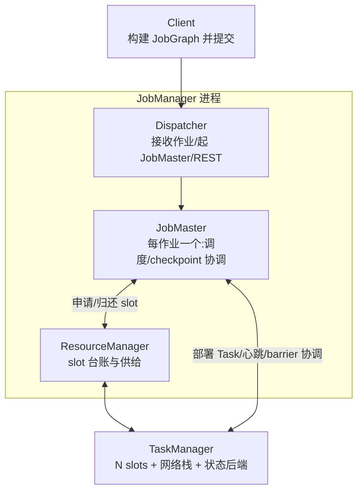
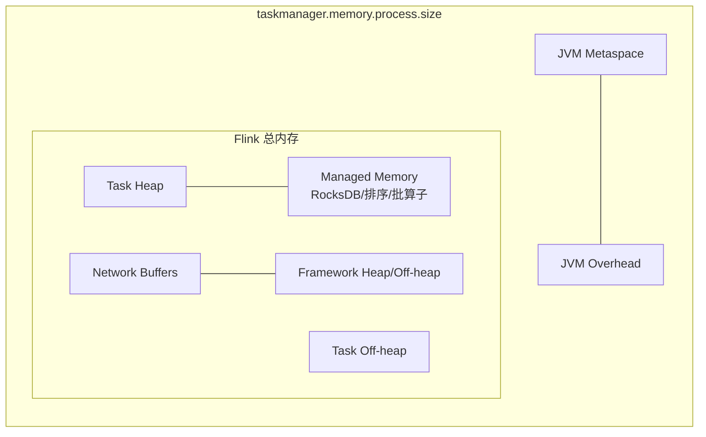

# 模块 01 · Runtime 内核

> 覆盖章节:01-01 架构总览 / 01-02 四层图转换 / 01-03 Task·Slot·Chain / 01-04 内存模型 / 01-05 网络栈与反压 / 01-06 序列化 / 01-07 部署与 HA / 01-08 调度器
> 配套实验:e01(对照 UI 读图)、e04-C1(网络栈与反压现场) · Level:L1/L6

## 01-01 架构总览

职责一句话:**Dispatcher 管进门,ResourceManager 管资源,JobMaster 管一个作业的一生,TaskManager 干活**。高可用(01-07)保护的是 JM 侧的元数据与领导权,TM 挂了由 RM 补位、JobMaster 重部署。

## 01-02 四层图转换

| 层 | 生成者/时机 | 内容 | 你能干预什么 |
|---|---|---|---|
| StreamGraph | Client,API 调用即积累 | 算子级 DAG | API 写法本身 |
| JobGraph | Client 提交前 | **chain 合并后的** JobVertex DAG + 配置 | chain 策略、slotSharingGroup、uid |
| ExecutionGraph | JobMaster | 并行化(每 vertex × parallelism 个 Execution) | 并行度、调度器类型 |
| 物理执行 | TM 部署后 | Task 线程 + 网络 channel + 状态后端实例 | 内存/网络参数 |

面试高频陷阱:**uid 影响的是 JobGraph 里 vertex 的稳定标识**(savepoint 契约),而 name 只是 UI 展示 —— 两者都要设,作用完全不同。

## 01-03 Task / Slot / Operator Chain

- **chain 合并条件**(全部满足):上下游并行度相同、连接是 forward、同一 slotSharingGroup、双方 chaining 策略允许、无显式 disable。合并收益:省序列化 + 省网络 + 省线程切换。
- **何时手动断开**:①算子内有重 CPU/阻塞逻辑想单独扩缩观察(`startNewChain`);②需要单独测量某算子的反压/busy 指标。
- **Slot ≠ CPU**:slot 只隔离 managed memory,不隔离 CPU;`taskmanager.numberOfTaskSlots` 通常设为核数或核数的 1/2(重状态作业)。
- **Slot Sharing**:同一作业的不同 vertex 的 subtask 可共享一个 slot → 一个 slot 能跑"一条完整 pipeline",作业所需 slot 数 = 最大算子并行度(同一共享组内)。

## 01-04 内存模型

三条决策线:① RocksDB/ForSt 作业把 `taskmanager.memory.managed.fraction` 提到 0.5~0.7(块缓存与 memtable 都从这里出);② HashMap 后端作业 managed 基本闲置,可压低换 heap;③ 反压高频出没时先查 `network` buffer 是否饥饿(见 01-05),再谈加内存。OOM-Killer 死于 process.size 超容器限额,先核对 compose/K8s limit 与该值的差额(JVM Overhead 是否够)。

## 01-05 网络栈与反压

Credit-based 流控:下游为每个 channel 授信(可用 buffer 数),上游按 credit 发送 —— 没 credit 就地阻塞,反压因此是**逐级向上游传导的自然背压**,不是异常。定位三步(e04-C1 可现场演练):

1. UI 找第一个 `backpressured` 高的算子,它的**下游第一个 busy≈100%** 的才是根因;
2. 根因算子在干嘛:外呼(改 Async I/O)/倾斜(看 subtask 间 records 差)/序列化(看是否 Kryo)/真算力不足(扩并行度);
3. checkpoint 是否被拖垮:是 → 短期开非对齐,长期治根因。

Buffer debloating(自动收缩 in-flight 缓冲)默认开启,极限低延迟场景再手调 `taskmanager.network.memory.buffer-debloat.*`。

## 01-06 序列化

优先级链:Flink 专有序列化器(基本型/POJO/Tuple/Row)→ **Kryo 兜底(慢且演进差)**。工程要点:

- POJO 判定:public 类 + public 无参构造 + 字段 public 或 getter/setter;Java record 自 1.19 起原生支持。
- "意外 Kryo"排查:日志搜 `GenericTypeInfo`;高频肇事者:接口/抽象类型字段、`Object`、第三方类、含 HashSet 的累加器(e01-J2 有意示范并标注)。
- 状态 schema 演进:POJO 支持加/删字段,Kryo 不支持 —— 这决定了**状态里的类型必须是 POJO 或显式 TypeInfo**,是军规级约束。

## 01-07 部署形态与 HA

| 形态 | 隔离 | 适用 |
|---|---|---|
| Application Mode | 每作业独立 JM,main 在 JM 跑 | 生产默认 |
| Session Mode | 共享集群,提交快 | 开发/实验平台(本仓库 docker 即 session) |

Per-Job Mode 已在 2.x 移除。HA 两要素:领导选举 + 元数据持久化(JobGraph/已完成 checkpoint 指针),K8s 上由 ConfigMap + 对象存储承担,配置入口 `high-availability.type: kubernetes`(production/ 模块落地)。

## 01-08 调度器

- **Default(Pipelined Region)**:静态并行度,流作业默认。
- **Adaptive**:声明资源区间,资源多少决定实际并行度;配合 Autoscaler(Operator)实现"改资源不重启拓扑"的弹性 —— 2.x 主推,2.2 的 balanced task scheduling 进一步让 TM 间任务分布均衡,缓解"个别 TM 过热"。
- **Adaptive Batch**:批作业按数据量自动定并行度。
- **细粒度资源管理**:按 slotSharingGroup 声明 CPU/内存规格,异构算子(如 AI 推理算子吃内存)不再被"均一 slot"绑架 —— ai/ 模块的 LLM 算子会用到。

## 知识总结与重点

一句话链路:代码 → StreamGraph → chain → JobGraph → 并行化 ExecutionGraph → slot 部署 → credit-based 数据流。**重点**:uid 纪律、chain 条件、slot sharing 的 slot 数推算、managed memory 与 RocksDB 的关系、反压三步定位、POJO 序列化红线。

## 常见错误

把 slot 当 CPU 隔离;name 当 uid;并行度 > Kafka 分区数导致空闲 subtask 拖 watermark(与 02 模块联动);容器内存 limit 恰好等于 process.size(必被 OOM-Kill)。

## 企业实践

平台侧应把「uid 检查、内存参数模板、chain 白名单」做成提交前静态检查(production/ CI 章);每个作业的 JobGraph 截图/描述纳入上线评审材料。

## 面试题

interview/README L1-L2 段 1~3 题 + L5-L7 段 23 题;加一道进阶:*Adaptive Scheduler 下并行度变化,keyed state 如何重分布?(提示:key group,maxParallelism 决定粒度上限)*。

## 参考资料

官方 Concepts→Flink Architecture;Deployment→Memory Configuration;Ops→Monitoring Back Pressure;FLIP-138(Pipelined Region)、FLIP-160(Adaptive Scheduler)、FLIP-370(balanced scheduling)。
