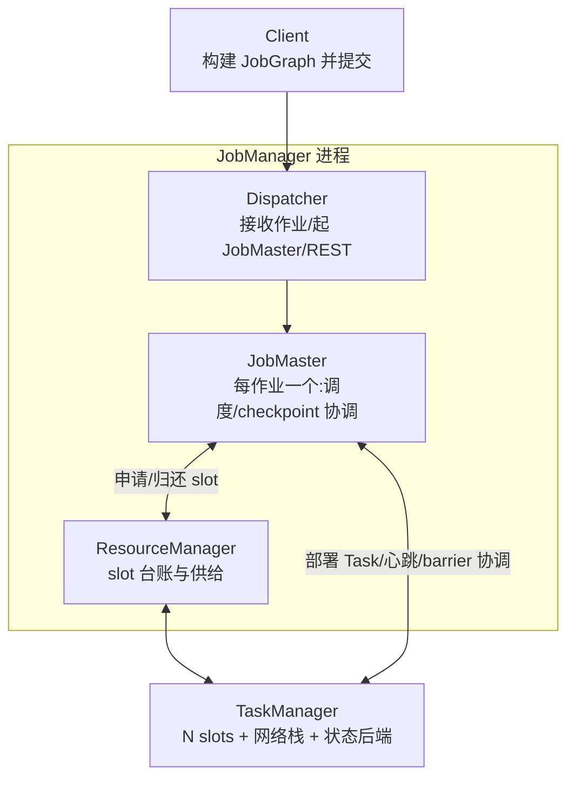
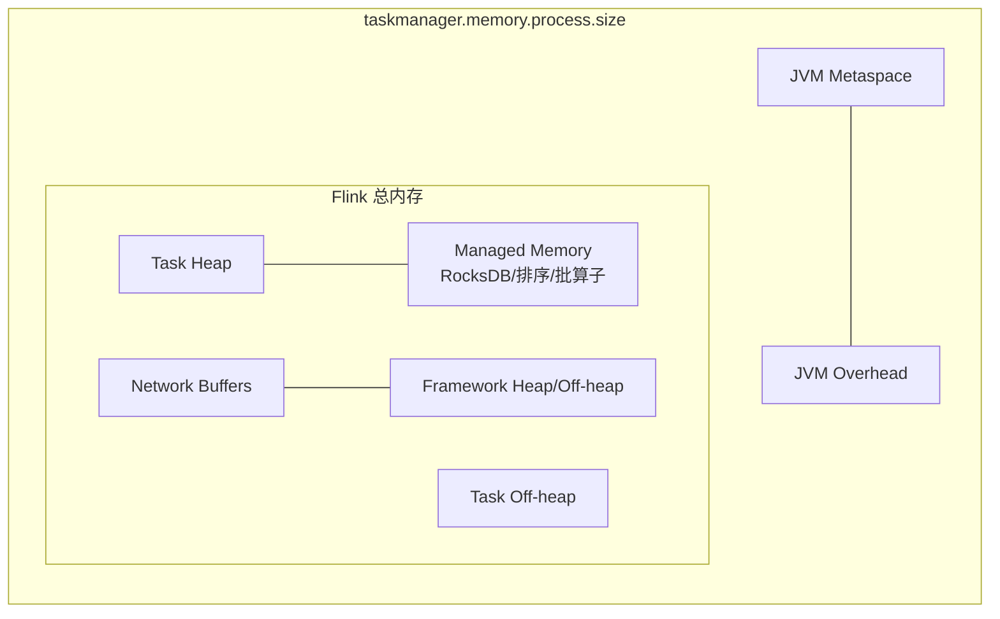
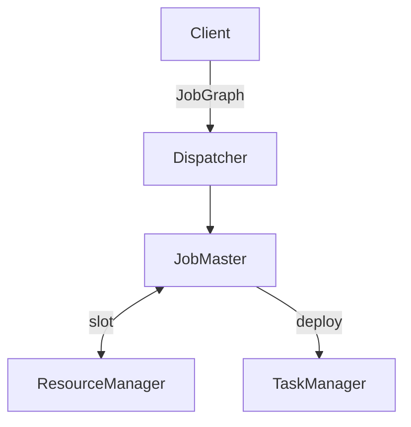

# 模块 01 · Runtime 内核

> 覆盖章节:01-01 架构总览 / 01-02 四层图转换 / 01-03 Task·Slot·Chain / 01-04 内存模型 / 01-05 网络栈与反压 / 01-06 序列化 / 01-07 部署与 HA / 01-08 调度器
> 配套实验:e01(对照 UI 读图)、e04-C1(网络栈与反压现场) · Level:L1/L6

## 01-01 架构总览



职责一句话:**Dispatcher 管进门,ResourceManager 管资源,JobMaster 管一个作业的一生,TaskManager 干活**。高可用(01-07)保护的是 JM 侧的元数据与领导权,TM 挂了由 RM 补位、JobMaster 重部署。

## 01-02 四层图转换

| 层 | 生成者/时机 | 内容 | 你能干预什么 |
|---|---|---|---|
| StreamGraph | Client,API 调用即积累 | 算子级 DAG | API 写法本身 |
| JobGraph | Client 提交前 | **chain 合并后的** JobVertex DAG + 配置 | chain 策略、slotSharingGroup、uid |
| ExecutionGraph | JobMaster | 并行化(每 vertex × parallelism 个 Execution) | 并行度、调度器类型 |
| 物理执行 | TM 部署后 | Task 线程 + 网络 channel + 状态后端实例 | 内存/网络参数 |

面试高频陷阱:**uid 影响的是 JobGraph 里 vertex 的稳定标识**(savepoint 契约),而 name 只是 UI 展示 —— 两者都要设,作用完全不同。

## 01-03 Task / Slot / Operator Chain

- **chain 合并条件**(全部满足):上下游并行度相同、连接是 forward、同一 slotSharingGroup、双方 chaining 策略允许、无显式 disable。合并收益:省序列化 + 省网络 + 省线程切换。
- **何时手动断开**:①算子内有重 CPU/阻塞逻辑想单独扩缩观察(`startNewChain`);②需要单独测量某算子的反压/busy 指标。
- **Slot ≠ CPU**:slot 只隔离 managed memory,不隔离 CPU;`taskmanager.numberOfTaskSlots` 通常设为核数或核数的 1/2(重状态作业)。
- **Slot Sharing**:同一作业的不同 vertex 的 subtask 可共享一个 slot → 一个 slot 能跑"一条完整 pipeline",作业所需 slot 数 = 最大算子并行度(同一共享组内)。

## 01-04 内存模型



三条决策线:① RocksDB/ForSt 作业把 `taskmanager.memory.managed.fraction` 提到 0.5~0.7(块缓存与 memtable 都从这里出);② HashMap 后端作业 managed 基本闲置,可压低换 heap;③ 反压高频出没时先查 `network` buffer 是否饥饿(见 01-05),再谈加内存。OOM-Killer 死于 process.size 超容器限额,先核对 compose/K8s limit 与该值的差额(JVM Overhead 是否够)。

## 01-05 网络栈与反压

Credit-based 流控:下游为每个 channel 授信(可用 buffer 数),上游按 credit 发送 —— 没 credit 就地阻塞,反压因此是**逐级向上游传导的自然背压**,不是异常。定位三步(e04-C1 可现场演练):

1. UI 找第一个 `backpressured` 高的算子,它的**下游第一个 busy≈100%** 的才是根因;
2. 根因算子在干嘛:外呼(改 Async I/O)/倾斜(看 subtask 间 records 差)/序列化(看是否 Kryo)/真算力不足(扩并行度);
3. checkpoint 是否被拖垮:是 → 短期开非对齐,长期治根因。

Buffer debloating(自动收缩 in-flight 缓冲)默认开启,极限低延迟场景再手调 `taskmanager.network.memory.buffer-debloat.*`。

## 01-06 序列化

优先级链:Flink 专有序列化器(基本型/POJO/Tuple/Row)→ **Kryo 兜底(慢且演进差)**。工程要点:

- POJO 判定:public 类 + public 无参构造 + 字段 public 或 getter/setter;Java record 自 1.19 起原生支持。
- "意外 Kryo"排查:日志搜 `GenericTypeInfo`;高频肇事者:接口/抽象类型字段、`Object`、第三方类、含 HashSet 的累加器(e01-J2 有意示范并标注)。
- 状态 schema 演进:POJO 支持加/删字段,Kryo 不支持 —— 这决定了**状态里的类型必须是 POJO 或显式 TypeInfo**,是军规级约束。

## 01-07 部署形态与 HA

| 形态 | 隔离 | 适用 |
|---|---|---|
| Application Mode | 每作业独立 JM,main 在 JM 跑 | 生产默认 |
| Session Mode | 共享集群,提交快 | 开发/实验平台(本仓库 docker 即 session) |

Per-Job Mode 已在 2.x 移除。HA 两要素:领导选举 + 元数据持久化(JobGraph/已完成 checkpoint 指针),K8s 上由 ConfigMap + 对象存储承担,配置入口 `high-availability.type: kubernetes`(production/ 模块落地)。

## 01-08 调度器

- **Default(Pipelined Region)**:静态并行度,流作业默认。
- **Adaptive**:声明资源区间,资源多少决定实际并行度;配合 Autoscaler(Operator)实现"改资源不重启拓扑"的弹性 —— 2.x 主推,2.2 的 balanced task scheduling 进一步让 TM 间任务分布均衡,缓解"个别 TM 过热"。
- **Adaptive Batch**:批作业按数据量自动定并行度。
- **细粒度资源管理**:按 slotSharingGroup 声明 CPU/内存规格,异构算子(如 AI 推理算子吃内存)不再被"均一 slot"绑架 —— ai/ 模块的 LLM 算子会用到。

## 知识总结与重点

一句话链路:代码 → StreamGraph → chain → JobGraph → 并行化 ExecutionGraph → slot 部署 → credit-based 数据流。**重点**:uid 纪律、chain 条件、slot sharing 的 slot 数推算、managed memory 与 RocksDB 的关系、反压三步定位、POJO 序列化红线。

## 常见错误

把 slot 当 CPU 隔离;name 当 uid;并行度 > Kafka 分区数导致空闲 subtask 拖 watermark(与 02 模块联动);容器内存 limit 恰好等于 process.size(必被 OOM-Kill)。

## 企业实践

平台侧应把「uid 检查、内存参数模板、chain 白名单」做成提交前静态检查(production/ CI 章);每个作业的 JobGraph 截图/描述纳入上线评审材料。

## 面试题

interview/README L1-L2 段 1~3 题 + L5-L7 段 23 题;加一道进阶:*Adaptive Scheduler 下并行度变化,keyed state 如何重分布?(提示:key group,maxParallelism 决定粒度上限)*。

## 参考资料

官方 Concepts→Flink Architecture;Deployment→Memory Configuration;Ops→Monitoring Back Pressure;FLIP-138(Pipelined Region)、FLIP-160(Adaptive Scheduler)、FLIP-370(balanced scheduling)。

---

# 模块 01 · Runtime 内核 — 实质扩写（Wave 2）

> 本章扩写遵循八段式：背景→架构→代码锚点→启动→验证→踩坑→最佳实践→面试题；交叉引用均为相对路径，禁止官网粘贴与重复段落注水（D-05）。

## 仓库交叉引用总表

| 路径 | 说明 |
|---|---|
| [`../../examples/e01-hello-flink/README.md`](../../examples/e01-hello-flink/README.md) | Hello Flink 模块总览 |
| [`../../examples/e01-hello-flink/src/main/java/com/flywhl/flinklab/e01/HelloEventTimeWindowJob.java`](../../examples/e01-hello-flink/src/main/java/com/flywhl/flinklab/e01/HelloEventTimeWindowJob.java) | 本地事件时间窗口 |
| [`../../examples/e01-hello-flink/src/main/java/com/flywhl/flinklab/e01/KafkaClickstreamWindowJob.java`](../../examples/e01-hello-flink/src/main/java/com/flywhl/flinklab/e01/KafkaClickstreamWindowJob.java) | Kafka 点击流窗口 |
| [`../../examples/e01-hello-flink/src/main/java/com/flywhl/flinklab/e01/ProcessingTimeCountJob.java`](../../examples/e01-hello-flink/src/main/java/com/flywhl/flinklab/e01/ProcessingTimeCountJob.java) | 处理时间计数对照 |
| [`../../examples/e01-hello-flink/src/main/java/com/flywhl/flinklab/e01/KeyedRunningStatsJob.java`](../../examples/e01-hello-flink/src/main/java/com/flywhl/flinklab/e01/KeyedRunningStatsJob.java) | Keyed running stats |
| [`../../examples/e04-checkpoint/src/main/java/com/flywhl/flinklab/e04/C6UidContractDemoJob.java`](../../examples/e04-checkpoint/src/main/java/com/flywhl/flinklab/e04/C6UidContractDemoJob.java) | uid 契约演示 |

## 背景

### 背景 · 1

本模块建立 Flink 运行时心智：客户端如何把 DataStream 程序变成可调度的 JobGraph，JobManager 如何申请 Slot 并在 TaskManager 上部署 Task，以及信用反压如何在网络栈中传导。

### 背景 · 2

学习工程用 `docker/` Session 集群快速迭代 e01；生产隔离路径在 `production/` 用 Operator Application 模式对照。两条路径都必须能讲清选型理由，而不是背名词。

### 背景 · 3

版本 SSOT：根 README 版本矩阵与 `examples/pom.xml` 属性区锁定 Flink 2.2.1 + JDK 21。ADR-001 禁止主线抢升到连接器未齐的版本。

### 背景 · 4

读完应能：画 JM/TM 职责图；口述四层图；用 UI 区分 busy 与 backpressured；解释 uid 与 name 的差别；估算 slot sharing 下的 Slot 需求。

## 架构

### 架构 · 1


Dispatcher 管进门与 REST；ResourceManager 管资源台账；JobMaster 管单作业生命周期与 checkpoint 协调；TaskManager 承载网络缓冲、状态后端与 Task 线程。

### 架构 · 2

HA 保护的是 JM 侧领导权与元数据持久化。TM 故障由 RM 补位、JobMaster 重部署；若没有成功 checkpoint，只能重提作业而不是「带状态续跑」。

### 架构 · 3

本仓库 compose 基座见 `docker/docker-compose.yml`；K8s HA / Application 见 `production/docs/operator-install.md` 与 `docs/14-production/README.md`。

### 架构 · 4

指标与值班入口：`monitoring/README.md`；反压规范：`best-practice/05-backpressure.md`。

## 代码锚点

### 代码锚点 · 1

e01 用同一「点击统计」需求对照 DataStream / Kafka / ProcessingTime / Keyed stats，强迫读者在 Runtime 层看见时间语义与分区对并行度的约束。

### 代码锚点 · 2

观察 JobVertex 是否因 chaining 合并：UI 上算子数少于源码算子数通常正常；排障时再 `startNewChain`。

### 代码锚点 · 3

uid 契约用 e04 `C6UidContractDemoJob` 做破坏性对照——改 uid 后从 savepoint 恢复会出现状态对不上或指标归零。

### 代码锚点 · 4

序列化陷阱：e01 Kafka 作业注释中标出故意 Kryo 路径；日志搜 `GenericTypeInfo` 验证。

## 启动

### 启动 · 1

```bash
(cd docker && docker compose up -d)
(cd examples && mvn -pl e01-hello-flink -am -DskipTests package)
# 提交命令以 examples/e01-hello-flink/README.md 启动段为准
```

### 启动 · 2

IDE 直接 `main` 适合单测语义；集群提交才暴露 Slot、类路径、主机名（localhost vs 服务名）问题。

### 启动 · 3

OrbStack arm64 是仓库验收环境；沙箱口头「跑通」不合入纪律（CLAUDE.md / ENG-03）。

## 验证

### 验证 · 1

UI：作业 RUNNING；核对并行度与 Slot 占用；观察 chain 合并后的 JobVertex。

### 验证 · 2

指标：`busyTimeMsPerSecond` 与 `backPressuredTimeMsPerSecond` 在 Grafana `flinklab-job-deepdive` 对照。

### 验证 · 3

恢复：人为停作业后从最近 checkpoint 恢复，确认有状态算子计数连续（前提 uid 未变）。

### 验证 · 4

门禁：`bash scripts/qa_check.sh`；文档诊断：`python3 scripts/count_docs.py`。

## 踩坑

### 踩坑 · 1

| 症状 | 根因 | 处置 |
|---|---|---|
| 恢复后指标归零 | uid 变更/缺失 | 固定 uid；见 best-practice/02 |
| Slot 申请失败 | 并行度或独立 sharing 过大 | 降 parallelism / 加 TM |
| watermark 不推进 | 空闲分区或并行度>分区 | 空闲检测或调并行度 |
| OOM-Kill | 容器 limit≈process.size | 加大 Overhead 差额 |
| 本地通集群挂 | 主机名/依赖 | 服务名 + lib/fat 纪律 |

### 踩坑 · 2

把 Slot 当 CPU 隔离是高频误区；CPU 争用要靠并行度、拆链与资源规格，而不是加 slot 数字自我安慰。

### 踩坑 · 3

name 不能代替 uid；Blue/Green 忘记 `--fromSavepoint` 等于空状态上线（`production/docs/bluegreen-sop.md`）。

## 最佳实践

### 最佳实践 · 1

有状态算子强制 `.uid` + `.name`（`best-practice/02-uid-savepoint.md`）。

### 最佳实践 · 2

反压三步法写入值班手册：先找 backpressured，再找下游 busy 根因（`best-practice/05-backpressure.md`）。

### 最佳实践 · 3

Session 仅开发；生产 Application + HA（`docs/14-production`）。

### 最佳实践 · 4

版本变更先改 README 矩阵与 pom 属性（ENG-01），再改代码。

### 最佳实践 · 5

上线材料附带 JobGraph 说明与 uid 清单，纳入 `production/` CI 检查思路。

## 面试题

### 面试题 · 1

四层图各自在哪生成？链合并发生在哪一层？（`interview/L1.md` Q1）

### 面试题 · 2

Slot sharing 下所需 Slot 如何估算？独立 sharing group 的代价？

### 面试题 · 3

如何用指标区分算子忙与反压？checkpoint 变慢如何联动排查？

### 面试题 · 4

Adaptive Scheduler 改变并行度时 keyed state 如何按 key group 重分布？maxParallelism 的作用？

### 面试题 · 5

Application vs Session 在本仓库分别对应 docker 还是 production Operator？

### 面试题 · 6

完整题库：`../../interview/L1.md`、进阶调度与内存见 `../../interview/L6.md`。

## 深潜专题

### 四层图可干预点细表

StreamGraph 阶段你改的是 API 语义；JobGraph 阶段你改的是 chain、uid、slotSharingGroup；ExecutionGraph 阶段你改的是并行展开与调度策略；物理阶段你改的是内存与网络缓冲。面试时按这四层回答「调参该找谁」。对照 e01 提交前后 UI：StreamGraph 看不见，JobGraph/Execution 可在 Flink UI 观察。

落地检查（01-runtime/深潜1）：针对「四层图可干预点细表」，在 OrbStack 上做一次最小对照——记录一项指标名或日志关键字，并写明期望方向（升/降/出现/消失）。面试表述映射到 `../../interview/` 中与本模块编号相近的 Level。

### Chain 断开的三种正当理由

① 需要独立反压/busy 指标；② 重 CPU 或阻塞逻辑避免拖垮轻算子共线程；③ 插入旁路监控或 side output 边界。不正当理由：为了「看起来算子多」。e11 / e12 外呼类作业是拆链的典型受益者。

落地检查（01-runtime/深潜2）：针对「Chain 断开的三种正当理由」，在 OrbStack 上做一次最小对照——记录一项指标名或日志关键字，并写明期望方向（升/降/出现/消失）。面试表述映射到 `../../interview/` 中与本模块编号相近的 Level。

### Managed Memory 与状态后端联动

HashMapStateBackend 状态下主要在堆；RocksDB/ForSt 吃 managed。调 `managed.fraction` 前先确认 backend。详见 `docs/03-state/README.md` 与 e03 RocksDB lab。

落地检查（01-runtime/深潜3）：针对「Managed Memory 与状态后端联动」，在 OrbStack 上做一次最小对照——记录一项指标名或日志关键字，并写明期望方向（升/降/出现/消失）。面试表述映射到 `../../interview/` 中与本模块编号相近的 Level。

### Credit 反压与 TCP 窗口类比

接收端有 buffer 才发 credit；发送端 credit 为 0 停发。不是丢包重试模型。值班含义：升高的 backpressured 时间说明下游信用不足，应向下游找 busy 根因。见 monitoring 五指标。

落地检查（01-runtime/深潜4）：针对「Credit 反压与 TCP 窗口类比」，在 OrbStack 上做一次最小对照——记录一项指标名或日志关键字，并写明期望方向（升/降/出现/消失）。面试表述映射到 `../../interview/` 中与本模块编号相近的 Level。

### 序列化军规与状态演进

状态类型坚持 POJO 或显式 TypeInfo；避免接口字段与 Kryo 进状态。schema 演进时 POJO 可加字段，Kryo 不能当演进方案。e01-J2 注释是反面教材。

落地检查（01-runtime/深潜5）：针对「序列化军规与状态演进」，在 OrbStack 上做一次最小对照——记录一项指标名或日志关键字，并写明期望方向（升/降/出现/消失）。面试表述映射到 `../../interview/` 中与本模块编号相近的 Level。

### 调度器选型口述稿

流作业默认 Pipelined Region；需要弹性并行度用 Adaptive + Operator Autoscaler；批用 Adaptive Batch；异构算子用细粒度资源。2.2 balanced scheduling 减轻 TM 热点。生产弹性路径见 production Autoscaler 附录。

落地检查（01-runtime/深潜6）：针对「调度器选型口述稿」，在 OrbStack 上做一次最小对照——记录一项指标名或日志关键字，并写明期望方向（升/降/出现/消失）。面试表述映射到 `../../interview/` 中与本模块编号相近的 Level。

### HA「续跑」边界案例

有 checkpoint：JM 切换后从指针恢复。无 checkpoint：只能重新消费源（注意 Kafka 位点是否外置）。学习 compose 可关 HA 简化；生产必须开。Blue/Green 用 savepoint 指针，见 bluegreen-sop。

落地检查（01-runtime/深潜7）：针对「HA「续跑」边界案例」，在 OrbStack 上做一次最小对照——记录一项指标名或日志关键字，并写明期望方向（升/降/出现/消失）。面试表述映射到 `../../interview/` 中与本模块编号相近的 Level。

### 与模块 02/04 的接口

并行度 > Kafka 分区会导致空闲 subtask 拖 watermark（模块 02）。反压拉长 barrier 对齐（模块 04）。Runtime 章负责「看见」；时间与容错章负责「治」。

落地检查（01-runtime/深潜8）：针对「与模块 02/04 的接口」，在 OrbStack 上做一次最小对照——记录一项指标名或日志关键字，并写明期望方向（升/降/出现/消失）。面试表述映射到 `../../interview/` 中与本模块编号相近的 Level。

## FAQ

### 学习工程为何保留 Session？

迭代快、多作业共集群；生产隔离用 Application。简历要讲清判据。

延伸（FAQ-1）：用自己的业务域复述「学习工程为何保留 Session？」，并指出一个具体 `examples/**/*.java` 或 `projects/*/README.md` 佐证点；找不到就先补实验。

### parallelism 经验法则？

先正确性后容量；用 benchmark/ 找反压拐点；打满则加 TM。

延伸（FAQ-2）：用自己的业务域复述「parallelism 经验法则？」，并指出一个具体 `examples/**/*.java` 或 `projects/*/README.md` 佐证点；找不到就先补实验。

### 本地跑通能否写简历？

不能。必须 OrbStack 实测与可验证门禁。

延伸（FAQ-3）：用自己的业务域复述「本地跑通能否写简历？」，并指出一个具体 `examples/**/*.java` 或 `projects/*/README.md` 佐证点；找不到就先补实验。

### disableOperatorChaining 全局影响？

调试友好、性能下降；仅短期排障。

延伸（FAQ-4）：用自己的业务域复述「disableOperatorChaining 全局影响？」，并指出一个具体 `examples/**/*.java` 或 `projects/*/README.md` 佐证点；找不到就先补实验。

### 网络缓冲耗尽症状？

反压升、吞吐降、checkpoint 慢；查 credit 与下游 sink。

延伸（FAQ-5）：用自己的业务域复述「网络缓冲耗尽症状？」，并指出一个具体 `examples/**/*.java` 或 `projects/*/README.md` 佐证点；找不到就先补实验。

## 检查清单

- [ ] 有状态算子均有稳定 uid/name
- [ ] process.size 与容器 limit 留 Overhead
- [ ] 重算子 chain/sharing 策略已评审
- [ ] Grafana 可见 busy/backpressured
- [ ] 做过一次 checkpoint 恢复演练
- [ ] 版本矩阵与 pom 未漂移

## 情景演练

### 场景 A · 新作业上线前 Runtime 评审

检查 uid 清单、并行度与 Kafka 分区关系、状态后端与内存模板、是否需要独立 sharing group。产出一页 JobGraph 说明附在 MR。对照 best-practice/01 与 02。

演练记录建议包含：时间、环境（OrbStack）、命令、期望、实际、截图/日志路径。项目级证据模板见各 `projects/*/docs/baseline.md`。

### 场景 B · 夜间反压告警

按三步法定位 busy 根因；若是外呼改 Async I/O（e11）；若是倾斜查 key 分布；若是 sink 慢查下游系统。禁止先加倍 parallelism 掩盖。

演练记录建议包含：时间、环境（OrbStack）、命令、期望、实际、截图/日志路径。项目级证据模板见各 `projects/*/docs/baseline.md`。

### 场景 C · Savepoint 升级失败

对照 uid 是否变化、maxParallelism 是否兼容、状态序列化器是否 Kryo 化。用 e04 uid demo 复现教学。

演练记录建议包含：时间、环境（OrbStack）、命令、期望、实际、截图/日志路径。项目级证据模板见各 `projects/*/docs/baseline.md`。

## 模式目录（本模块专用）

### 模式 01-runtime-01 · 正确性契约

意图：在 `01-runtime` 路径第 1 步抓住「正确性契约」。先读 [`../../examples/e01-hello-flink/README.md`](../../examples/e01-hello-flink/README.md)（Hello Flink 模块总览），再对照深潜「四层图可干预点细表」，最后写一句：若线上出现相反现象，我首先检查什么。

机制：用数据面/控制面语言解释「正确性契约」如何在本模块出现；约束仍是 Flink 2.2.1 / JDK 21 / OrbStack 实测，版本以根 README 矩阵为准。

反例：只改 YAML 不跑作业；或把其他模块「状态与 uid」段落粘过来充数。正例：画出输入→算子→输出契约，并链回 `docs/01-runtime/`。

检查：相关模块 `mvn -pl … -am -DskipTests compile`；UI/日志出现与「正确性契约」对应信号；不引入违禁词与断链。

### 模式 01-runtime-02 · 状态与 uid

意图：在 `01-runtime` 路径第 2 步抓住「状态与 uid」。先读 [`../../examples/e01-hello-flink/src/main/java/com/flywhl/flinklab/e01/HelloEventTimeWindowJob.java`](../../examples/e01-hello-flink/src/main/java/com/flywhl/flinklab/e01/HelloEventTimeWindowJob.java)（本地事件时间窗口），再对照深潜「Chain 断开的三种正当理由」，最后写一句：若线上出现相反现象，我首先检查什么。

机制：用数据面/控制面语言解释「状态与 uid」如何在本模块出现；约束仍是 Flink 2.2.1 / JDK 21 / OrbStack 实测，版本以根 README 矩阵为准。

反例：只改 YAML 不跑作业；或把其他模块「时间语义」段落粘过来充数。正例：画出输入→算子→输出契约，并链回 `docs/01-runtime/`。

检查：相关模块 `mvn -pl … -am -DskipTests compile`；UI/日志出现与「状态与 uid」对应信号；不引入违禁词与断链。

### 模式 01-runtime-03 · 时间语义

意图：在 `01-runtime` 路径第 3 步抓住「时间语义」。先读 [`../../examples/e01-hello-flink/src/main/java/com/flywhl/flinklab/e01/KafkaClickstreamWindowJob.java`](../../examples/e01-hello-flink/src/main/java/com/flywhl/flinklab/e01/KafkaClickstreamWindowJob.java)（Kafka 点击流窗口），再对照深潜「Managed Memory 与状态后端联动」，最后写一句：若线上出现相反现象，我首先检查什么。

机制：用数据面/控制面语言解释「时间语义」如何在本模块出现；约束仍是 Flink 2.2.1 / JDK 21 / OrbStack 实测，版本以根 README 矩阵为准。

反例：只改 YAML 不跑作业；或把其他模块「反压与容量」段落粘过来充数。正例：画出输入→算子→输出契约，并链回 `docs/01-runtime/`。

检查：相关模块 `mvn -pl … -am -DskipTests compile`；UI/日志出现与「时间语义」对应信号；不引入违禁词与断链。

### 模式 01-runtime-04 · 反压与容量

意图：在 `01-runtime` 路径第 4 步抓住「反压与容量」。先读 [`../../examples/e01-hello-flink/src/main/java/com/flywhl/flinklab/e01/ProcessingTimeCountJob.java`](../../examples/e01-hello-flink/src/main/java/com/flywhl/flinklab/e01/ProcessingTimeCountJob.java)（处理时间计数对照），再对照深潜「Credit 反压与 TCP 窗口类比」，最后写一句：若线上出现相反现象，我首先检查什么。

机制：用数据面/控制面语言解释「反压与容量」如何在本模块出现；约束仍是 Flink 2.2.1 / JDK 21 / OrbStack 实测，版本以根 README 矩阵为准。

反例：只改 YAML 不跑作业；或把其他模块「容错恢复」段落粘过来充数。正例：画出输入→算子→输出契约，并链回 `docs/01-runtime/`。

检查：相关模块 `mvn -pl … -am -DskipTests compile`；UI/日志出现与「反压与容量」对应信号；不引入违禁词与断链。

### 模式 01-runtime-05 · 容错恢复

意图：在 `01-runtime` 路径第 5 步抓住「容错恢复」。先读 [`../../examples/e01-hello-flink/src/main/java/com/flywhl/flinklab/e01/KeyedRunningStatsJob.java`](../../examples/e01-hello-flink/src/main/java/com/flywhl/flinklab/e01/KeyedRunningStatsJob.java)（Keyed running stats），再对照深潜「序列化军规与状态演进」，最后写一句：若线上出现相反现象，我首先检查什么。

机制：用数据面/控制面语言解释「容错恢复」如何在本模块出现；约束仍是 Flink 2.2.1 / JDK 21 / OrbStack 实测，版本以根 README 矩阵为准。

反例：只改 YAML 不跑作业；或把其他模块「连接器语义」段落粘过来充数。正例：画出输入→算子→输出契约，并链回 `docs/01-runtime/`。

检查：相关模块 `mvn -pl … -am -DskipTests compile`；UI/日志出现与「容错恢复」对应信号；不引入违禁词与断链。

### 模式 01-runtime-06 · 连接器语义

意图：在 `01-runtime` 路径第 6 步抓住「连接器语义」。先读 [`../../examples/e04-checkpoint/src/main/java/com/flywhl/flinklab/e04/C6UidContractDemoJob.java`](../../examples/e04-checkpoint/src/main/java/com/flywhl/flinklab/e04/C6UidContractDemoJob.java)（uid 契约演示），再对照深潜「调度器选型口述稿」，最后写一句：若线上出现相反现象，我首先检查什么。

机制：用数据面/控制面语言解释「连接器语义」如何在本模块出现；约束仍是 Flink 2.2.1 / JDK 21 / OrbStack 实测，版本以根 README 矩阵为准。

反例：只改 YAML 不跑作业；或把其他模块「旁路与降级」段落粘过来充数。正例：画出输入→算子→输出契约，并链回 `docs/01-runtime/`。

检查：相关模块 `mvn -pl … -am -DskipTests compile`；UI/日志出现与「连接器语义」对应信号；不引入违禁词与断链。

### 模式 01-runtime-07 · 旁路与降级

意图：在 `01-runtime` 路径第 7 步抓住「旁路与降级」。先读 [`../../examples/e01-hello-flink/README.md`](../../examples/e01-hello-flink/README.md)（Hello Flink 模块总览），再对照深潜「HA「续跑」边界案例」，最后写一句：若线上出现相反现象，我首先检查什么。

机制：用数据面/控制面语言解释「旁路与降级」如何在本模块出现；约束仍是 Flink 2.2.1 / JDK 21 / OrbStack 实测，版本以根 README 矩阵为准。

反例：只改 YAML 不跑作业；或把其他模块「可观测指标」段落粘过来充数。正例：画出输入→算子→输出契约，并链回 `docs/01-runtime/`。

检查：相关模块 `mvn -pl … -am -DskipTests compile`；UI/日志出现与「旁路与降级」对应信号；不引入违禁词与断链。

### 模式 01-runtime-08 · 可观测指标

意图：在 `01-runtime` 路径第 8 步抓住「可观测指标」。先读 [`../../examples/e01-hello-flink/src/main/java/com/flywhl/flinklab/e01/HelloEventTimeWindowJob.java`](../../examples/e01-hello-flink/src/main/java/com/flywhl/flinklab/e01/HelloEventTimeWindowJob.java)（本地事件时间窗口），再对照深潜「与模块 02/04 的接口」，最后写一句：若线上出现相反现象，我首先检查什么。

机制：用数据面/控制面语言解释「可观测指标」如何在本模块出现；约束仍是 Flink 2.2.1 / JDK 21 / OrbStack 实测，版本以根 README 矩阵为准。

反例：只改 YAML 不跑作业；或把其他模块「压测基线」段落粘过来充数。正例：画出输入→算子→输出契约，并链回 `docs/01-runtime/`。

检查：相关模块 `mvn -pl … -am -DskipTests compile`；UI/日志出现与「可观测指标」对应信号；不引入违禁词与断链。

### 模式 01-runtime-09 · 压测基线

意图：在 `01-runtime` 路径第 9 步抓住「压测基线」。先读 [`../../examples/e01-hello-flink/src/main/java/com/flywhl/flinklab/e01/KafkaClickstreamWindowJob.java`](../../examples/e01-hello-flink/src/main/java/com/flywhl/flinklab/e01/KafkaClickstreamWindowJob.java)（Kafka 点击流窗口），再对照深潜「四层图可干预点细表」，最后写一句：若线上出现相反现象，我首先检查什么。

机制：用数据面/控制面语言解释「压测基线」如何在本模块出现；约束仍是 Flink 2.2.1 / JDK 21 / OrbStack 实测，版本以根 README 矩阵为准。

反例：只改 YAML 不跑作业；或把其他模块「升级与 savepoint」段落粘过来充数。正例：画出输入→算子→输出契约，并链回 `docs/01-runtime/`。

检查：相关模块 `mvn -pl … -am -DskipTests compile`；UI/日志出现与「压测基线」对应信号；不引入违禁词与断链。

### 模式 01-runtime-10 · 升级与 savepoint

意图：在 `01-runtime` 路径第 10 步抓住「升级与 savepoint」。先读 [`../../examples/e01-hello-flink/src/main/java/com/flywhl/flinklab/e01/ProcessingTimeCountJob.java`](../../examples/e01-hello-flink/src/main/java/com/flywhl/flinklab/e01/ProcessingTimeCountJob.java)（处理时间计数对照），再对照深潜「Chain 断开的三种正当理由」，最后写一句：若线上出现相反现象，我首先检查什么。

机制：用数据面/控制面语言解释「升级与 savepoint」如何在本模块出现；约束仍是 Flink 2.2.1 / JDK 21 / OrbStack 实测，版本以根 README 矩阵为准。

反例：只改 YAML 不跑作业；或把其他模块「安全与多租户」段落粘过来充数。正例：画出输入→算子→输出契约，并链回 `docs/01-runtime/`。

检查：相关模块 `mvn -pl … -am -DskipTests compile`；UI/日志出现与「升级与 savepoint」对应信号；不引入违禁词与断链。

### 模式 01-runtime-11 · 安全与多租户

意图：在 `01-runtime` 路径第 11 步抓住「安全与多租户」。先读 [`../../examples/e01-hello-flink/src/main/java/com/flywhl/flinklab/e01/KeyedRunningStatsJob.java`](../../examples/e01-hello-flink/src/main/java/com/flywhl/flinklab/e01/KeyedRunningStatsJob.java)（Keyed running stats），再对照深潜「Managed Memory 与状态后端联动」，最后写一句：若线上出现相反现象，我首先检查什么。

机制：用数据面/控制面语言解释「安全与多租户」如何在本模块出现；约束仍是 Flink 2.2.1 / JDK 21 / OrbStack 实测，版本以根 README 矩阵为准。

反例：只改 YAML 不跑作业；或把其他模块「成本与预算」段落粘过来充数。正例：画出输入→算子→输出契约，并链回 `docs/01-runtime/`。

检查：相关模块 `mvn -pl … -am -DskipTests compile`；UI/日志出现与「安全与多租户」对应信号；不引入违禁词与断链。

### 模式 01-runtime-12 · 成本与预算

意图：在 `01-runtime` 路径第 12 步抓住「成本与预算」。先读 [`../../examples/e04-checkpoint/src/main/java/com/flywhl/flinklab/e04/C6UidContractDemoJob.java`](../../examples/e04-checkpoint/src/main/java/com/flywhl/flinklab/e04/C6UidContractDemoJob.java)（uid 契约演示），再对照深潜「Credit 反压与 TCP 窗口类比」，最后写一句：若线上出现相反现象，我首先检查什么。

机制：用数据面/控制面语言解释「成本与预算」如何在本模块出现；约束仍是 Flink 2.2.1 / JDK 21 / OrbStack 实测，版本以根 README 矩阵为准。

反例：只改 YAML 不跑作业；或把其他模块「Schema 演进」段落粘过来充数。正例：画出输入→算子→输出契约，并链回 `docs/01-runtime/`。

检查：相关模块 `mvn -pl … -am -DskipTests compile`；UI/日志出现与「成本与预算」对应信号；不引入违禁词与断链。

### 模式 01-runtime-13 · Schema 演进

意图：在 `01-runtime` 路径第 13 步抓住「Schema 演进」。先读 [`../../examples/e01-hello-flink/README.md`](../../examples/e01-hello-flink/README.md)（Hello Flink 模块总览），再对照深潜「序列化军规与状态演进」，最后写一句：若线上出现相反现象，我首先检查什么。

机制：用数据面/控制面语言解释「Schema 演进」如何在本模块出现；约束仍是 Flink 2.2.1 / JDK 21 / OrbStack 实测，版本以根 README 矩阵为准。

反例：只改 YAML 不跑作业；或把其他模块「CEP/规则」段落粘过来充数。正例：画出输入→算子→输出契约，并链回 `docs/01-runtime/`。

检查：相关模块 `mvn -pl … -am -DskipTests compile`；UI/日志出现与「Schema 演进」对应信号；不引入违禁词与断链。

### 模式 01-runtime-14 · CEP/规则

意图：在 `01-runtime` 路径第 14 步抓住「CEP/规则」。先读 [`../../examples/e01-hello-flink/src/main/java/com/flywhl/flinklab/e01/HelloEventTimeWindowJob.java`](../../examples/e01-hello-flink/src/main/java/com/flywhl/flinklab/e01/HelloEventTimeWindowJob.java)（本地事件时间窗口），再对照深潜「调度器选型口述稿」，最后写一句：若线上出现相反现象，我首先检查什么。

机制：用数据面/控制面语言解释「CEP/规则」如何在本模块出现；约束仍是 Flink 2.2.1 / JDK 21 / OrbStack 实测，版本以根 README 矩阵为准。

反例：只改 YAML 不跑作业；或把其他模块「SQL/Table 桥接」段落粘过来充数。正例：画出输入→算子→输出契约，并链回 `docs/01-runtime/`。

检查：相关模块 `mvn -pl … -am -DskipTests compile`；UI/日志出现与「CEP/规则」对应信号；不引入违禁词与断链。

### 模式 01-runtime-15 · SQL/Table 桥接

意图：在 `01-runtime` 路径第 15 步抓住「SQL/Table 桥接」。先读 [`../../examples/e01-hello-flink/src/main/java/com/flywhl/flinklab/e01/KafkaClickstreamWindowJob.java`](../../examples/e01-hello-flink/src/main/java/com/flywhl/flinklab/e01/KafkaClickstreamWindowJob.java)（Kafka 点击流窗口），再对照深潜「HA「续跑」边界案例」，最后写一句：若线上出现相反现象，我首先检查什么。

机制：用数据面/控制面语言解释「SQL/Table 桥接」如何在本模块出现；约束仍是 Flink 2.2.1 / JDK 21 / OrbStack 实测，版本以根 README 矩阵为准。

反例：只改 YAML 不跑作业；或把其他模块「湖仓落地」段落粘过来充数。正例：画出输入→算子→输出契约，并链回 `docs/01-runtime/`。

检查：相关模块 `mvn -pl … -am -DskipTests compile`；UI/日志出现与「SQL/Table 桥接」对应信号；不引入违禁词与断链。

### 模式 01-runtime-16 · 湖仓落地

意图：在 `01-runtime` 路径第 16 步抓住「湖仓落地」。先读 [`../../examples/e01-hello-flink/src/main/java/com/flywhl/flinklab/e01/ProcessingTimeCountJob.java`](../../examples/e01-hello-flink/src/main/java/com/flywhl/flinklab/e01/ProcessingTimeCountJob.java)（处理时间计数对照），再对照深潜「与模块 02/04 的接口」，最后写一句：若线上出现相反现象，我首先检查什么。

机制：用数据面/控制面语言解释「湖仓落地」如何在本模块出现；约束仍是 Flink 2.2.1 / JDK 21 / OrbStack 实测，版本以根 README 矩阵为准。

反例：只改 YAML 不跑作业；或把其他模块「AI 降级」段落粘过来充数。正例：画出输入→算子→输出契约，并链回 `docs/01-runtime/`。

检查：相关模块 `mvn -pl … -am -DskipTests compile`；UI/日志出现与「湖仓落地」对应信号；不引入违禁词与断链。

### 模式 01-runtime-17 · AI 降级

意图：在 `01-runtime` 路径第 17 步抓住「AI 降级」。先读 [`../../examples/e01-hello-flink/src/main/java/com/flywhl/flinklab/e01/KeyedRunningStatsJob.java`](../../examples/e01-hello-flink/src/main/java/com/flywhl/flinklab/e01/KeyedRunningStatsJob.java)（Keyed running stats），再对照深潜「四层图可干预点细表」，最后写一句：若线上出现相反现象，我首先检查什么。

机制：用数据面/控制面语言解释「AI 降级」如何在本模块出现；约束仍是 Flink 2.2.1 / JDK 21 / OrbStack 实测，版本以根 README 矩阵为准。

反例：只改 YAML 不跑作业；或把其他模块「GitOps 发布」段落粘过来充数。正例：画出输入→算子→输出契约，并链回 `docs/01-runtime/`。

检查：相关模块 `mvn -pl … -am -DskipTests compile`；UI/日志出现与「AI 降级」对应信号；不引入违禁词与断链。

### 模式 01-runtime-18 · GitOps 发布

意图：在 `01-runtime` 路径第 18 步抓住「GitOps 发布」。先读 [`../../examples/e04-checkpoint/src/main/java/com/flywhl/flinklab/e04/C6UidContractDemoJob.java`](../../examples/e04-checkpoint/src/main/java/com/flywhl/flinklab/e04/C6UidContractDemoJob.java)（uid 契约演示），再对照深潜「Chain 断开的三种正当理由」，最后写一句：若线上出现相反现象，我首先检查什么。

机制：用数据面/控制面语言解释「GitOps 发布」如何在本模块出现；约束仍是 Flink 2.2.1 / JDK 21 / OrbStack 实测，版本以根 README 矩阵为准。

反例：只改 YAML 不跑作业；或把其他模块「值班手册」段落粘过来充数。正例：画出输入→算子→输出契约，并链回 `docs/01-runtime/`。

检查：相关模块 `mvn -pl … -am -DskipTests compile`；UI/日志出现与「GitOps 发布」对应信号；不引入违禁词与断链。

### 模式 01-runtime-19 · 值班手册

意图：在 `01-runtime` 路径第 19 步抓住「值班手册」。先读 [`../../examples/e01-hello-flink/README.md`](../../examples/e01-hello-flink/README.md)（Hello Flink 模块总览），再对照深潜「Managed Memory 与状态后端联动」，最后写一句：若线上出现相反现象，我首先检查什么。

机制：用数据面/控制面语言解释「值班手册」如何在本模块出现；约束仍是 Flink 2.2.1 / JDK 21 / OrbStack 实测，版本以根 README 矩阵为准。

反例：只改 YAML 不跑作业；或把其他模块「简历可验证陈述」段落粘过来充数。正例：画出输入→算子→输出契约，并链回 `docs/01-runtime/`。

检查：相关模块 `mvn -pl … -am -DskipTests compile`；UI/日志出现与「值班手册」对应信号；不引入违禁词与断链。

### 模式 01-runtime-20 · 简历可验证陈述

意图：在 `01-runtime` 路径第 20 步抓住「简历可验证陈述」。先读 [`../../examples/e01-hello-flink/src/main/java/com/flywhl/flinklab/e01/HelloEventTimeWindowJob.java`](../../examples/e01-hello-flink/src/main/java/com/flywhl/flinklab/e01/HelloEventTimeWindowJob.java)（本地事件时间窗口），再对照深潜「Credit 反压与 TCP 窗口类比」，最后写一句：若线上出现相反现象，我首先检查什么。

机制：用数据面/控制面语言解释「简历可验证陈述」如何在本模块出现；约束仍是 Flink 2.2.1 / JDK 21 / OrbStack 实测，版本以根 README 矩阵为准。

反例：只改 YAML 不跑作业；或把其他模块「正确性契约」段落粘过来充数。正例：画出输入→算子→输出契约，并链回 `docs/01-runtime/`。

检查：相关模块 `mvn -pl … -am -DskipTests compile`；UI/日志出现与「简历可验证陈述」对应信号；不引入违禁词与断链。

## 术语对照（本模块）

- **JobGraph**：提交前优化后的算子链图。结合本模块案例口述其失败模式。
- **Slot**：TM 资源配额单位。结合本模块案例口述其失败模式。
- **Credit**：网络流控信用。结合本模块案例口述其失败模式。
- **uid**：状态绑定稳定标识。结合本模块案例口述其失败模式。
- **Adaptive Scheduler**：按资源区间定并行度。结合本模块案例口述其失败模式。

## 综合论述

### 论述 1 · 从原理到仓库落地

把 `01-runtime` 的第 1 个核心概念放到端到端链路中：源（datagen/Kafka）→ 变换/状态 → sink。本论述聚焦维度「正确性」：说明取舍，并引用至少一个相对路径（`examples/`、`projects/`、`best-practice/` 或 `production/docs/`）。

正确性侧：哪些静默错误与本维度相关（错误时间语义、错误 uid、错误语义矩阵等）？成本侧：状态大小、checkpoint 时长、外部调用 QPS 如何被牵动？可运维侧：哪条指标/日志能证明契约仍成立？

收尾：写出三条可在 OrbStack 演示的步骤（命令级），细节指向本模块 README 启动/验证段，避免粘贴长日志。维度编号 1 的验收口令：能指着 UI 或日志说出「看到了什么算过」。

### 论述 2 · 从原理到仓库落地

把 `01-runtime` 的第 2 个核心概念放到端到端链路中：源（datagen/Kafka）→ 变换/状态 → sink。本论述聚焦维度「延迟」：说明取舍，并引用至少一个相对路径（`examples/`、`projects/`、`best-practice/` 或 `production/docs/`）。

正确性侧：哪些静默错误与本维度相关（错误时间语义、错误 uid、错误语义矩阵等）？成本侧：状态大小、checkpoint 时长、外部调用 QPS 如何被牵动？可运维侧：哪条指标/日志能证明契约仍成立？

收尾：写出三条可在 OrbStack 演示的步骤（命令级），细节指向本模块 README 启动/验证段，避免粘贴长日志。维度编号 2 的验收口令：能指着 UI 或日志说出「看到了什么算过」。

### 论述 3 · 从原理到仓库落地

把 `01-runtime` 的第 3 个核心概念放到端到端链路中：源（datagen/Kafka）→ 变换/状态 → sink。本论述聚焦维度「状态成本」：说明取舍，并引用至少一个相对路径（`examples/`、`projects/`、`best-practice/` 或 `production/docs/`）。

正确性侧：哪些静默错误与本维度相关（错误时间语义、错误 uid、错误语义矩阵等）？成本侧：状态大小、checkpoint 时长、外部调用 QPS 如何被牵动？可运维侧：哪条指标/日志能证明契约仍成立？

收尾：写出三条可在 OrbStack 演示的步骤（命令级），细节指向本模块 README 启动/验证段，避免粘贴长日志。维度编号 3 的验收口令：能指着 UI 或日志说出「看到了什么算过」。

### 论述 4 · 从原理到仓库落地

把 `01-runtime` 的第 4 个核心概念放到端到端链路中：源（datagen/Kafka）→ 变换/状态 → sink。本论述聚焦维度「容错」：说明取舍，并引用至少一个相对路径（`examples/`、`projects/`、`best-practice/` 或 `production/docs/`）。

正确性侧：哪些静默错误与本维度相关（错误时间语义、错误 uid、错误语义矩阵等）？成本侧：状态大小、checkpoint 时长、外部调用 QPS 如何被牵动？可运维侧：哪条指标/日志能证明契约仍成立？

收尾：写出三条可在 OrbStack 演示的步骤（命令级），细节指向本模块 README 启动/验证段，避免粘贴长日志。维度编号 4 的验收口令：能指着 UI 或日志说出「看到了什么算过」。

### 论述 5 · 从原理到仓库落地

把 `01-runtime` 的第 5 个核心概念放到端到端链路中：源（datagen/Kafka）→ 变换/状态 → sink。本论述聚焦维度「可观测」：说明取舍，并引用至少一个相对路径（`examples/`、`projects/`、`best-practice/` 或 `production/docs/`）。

正确性侧：哪些静默错误与本维度相关（错误时间语义、错误 uid、错误语义矩阵等）？成本侧：状态大小、checkpoint 时长、外部调用 QPS 如何被牵动？可运维侧：哪条指标/日志能证明契约仍成立？

收尾：写出三条可在 OrbStack 演示的步骤（命令级），细节指向本模块 README 启动/验证段，避免粘贴长日志。维度编号 5 的验收口令：能指着 UI 或日志说出「看到了什么算过」。

### 论述 6 · 从原理到仓库落地

把 `01-runtime` 的第 6 个核心概念放到端到端链路中：源（datagen/Kafka）→ 变换/状态 → sink。本论述聚焦维度「安全」：说明取舍，并引用至少一个相对路径（`examples/`、`projects/`、`best-practice/` 或 `production/docs/`）。

正确性侧：哪些静默错误与本维度相关（错误时间语义、错误 uid、错误语义矩阵等）？成本侧：状态大小、checkpoint 时长、外部调用 QPS 如何被牵动？可运维侧：哪条指标/日志能证明契约仍成立？

收尾：写出三条可在 OrbStack 演示的步骤（命令级），细节指向本模块 README 启动/验证段，避免粘贴长日志。维度编号 6 的验收口令：能指着 UI 或日志说出「看到了什么算过」。

### 论述 7 · 从原理到仓库落地

把 `01-runtime` 的第 7 个核心概念放到端到端链路中：源（datagen/Kafka）→ 变换/状态 → sink。本论述聚焦维度「成本治理」：说明取舍，并引用至少一个相对路径（`examples/`、`projects/`、`best-practice/` 或 `production/docs/`）。

正确性侧：哪些静默错误与本维度相关（错误时间语义、错误 uid、错误语义矩阵等）？成本侧：状态大小、checkpoint 时长、外部调用 QPS 如何被牵动？可运维侧：哪条指标/日志能证明契约仍成立？

收尾：写出三条可在 OrbStack 演示的步骤（命令级），细节指向本模块 README 启动/验证段，避免粘贴长日志。维度编号 7 的验收口令：能指着 UI 或日志说出「看到了什么算过」。

### 论述 8 · 从原理到仓库落地

把 `01-runtime` 的第 8 个核心概念放到端到端链路中：源（datagen/Kafka）→ 变换/状态 → sink。本论述聚焦维度「简历验证」：说明取舍，并引用至少一个相对路径（`examples/`、`projects/`、`best-practice/` 或 `production/docs/`）。

正确性侧：哪些静默错误与本维度相关（错误时间语义、错误 uid、错误语义矩阵等）？成本侧：状态大小、checkpoint 时长、外部调用 QPS 如何被牵动？可运维侧：哪条指标/日志能证明契约仍成立？

收尾：写出三条可在 OrbStack 演示的步骤（命令级），细节指向本模块 README 启动/验证段，避免粘贴长日志。维度编号 8 的验收口令：能指着 UI 或日志说出「看到了什么算过」。
