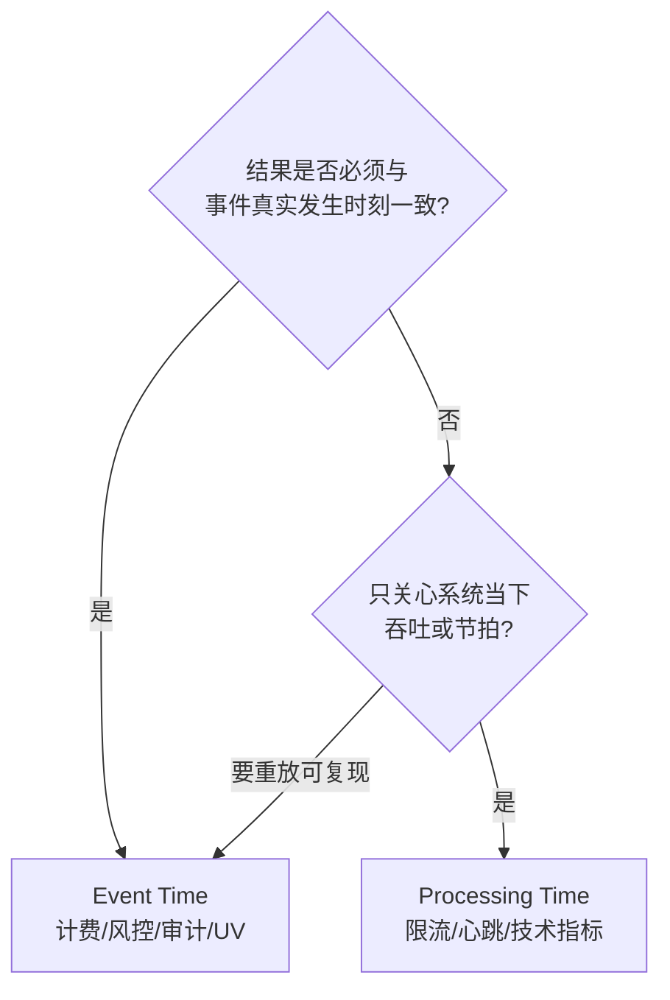

# 模块 02 · 时间与窗口

> 覆盖章节:02-01 时间语义 / 02-02 Watermark / 02-03 窗口类型与生命周期 / 02-04 Trigger·Evictor·迟到 / 02-05 Timer 与 ProcessFunction
> 配套实验:e02 全部 5 案例、e03-C9 · Level:L2

## 02-01 时间语义决策树

判据只有一条:**重放历史数据,结果必须一致吗?** 必须 → Event Time。Processing Time 的结果依赖执行时机,重放即漂移 —— 它便宜(无 watermark、无迟到问题),但只配承担"技术性"语义。

## 02-02 Watermark:生成、传播、对齐、空闲

**本质**:一条随流而行的断言 `Watermark(t)` = "时间戳 ≤ t 的事件(基本)到齐了"。它是**估计**,错了的代价就是迟到数据。

- **生成**:`forBoundedOutOfOrderness(b)` 周期性(默认 200ms)发出 `maxSeenTs - b - 1`;`forMonotonousTimestamps` 是 b=0 特例;打点式(punctuated)按特殊记录发,少用(量大)。
- **传播**:算子对**多输入取 min**,并把自己的 watermark 广播给所有下游 channel。推论:任何一个上游分区停滞,全局 watermark 停摆(e02-C5 亲测)。
- **空闲**:`withIdleness(d)`——分区静默超 d 即被剔出 min 计算;救"部分分区没数据",救不了"全都没数据"(此时用 Timer 双保险,e03-C9)。
- **对齐**(FLIP-182,e02-C5):同组源之间 watermark 漂移超上限时**暂停快源拉取**,封顶状态积压;只对 FLIP-27 源生效。
- 并行度 > 分区数 ⇒ 空转 subtask 的 watermark 恒为 MIN ⇒ 全局停摆:要么对齐并行度,要么 idleness。这是窗口不触发的第一嫌疑人。

## 02-03 窗口类型与生命周期

| 类型 | 边界 | 状态清理 | 典型 |
|---|---|---|---|
| Tumbling | 固定不重叠 | wm 过 end+lateness 即清 | 分钟级报表 |
| Sliding | 固定重叠,元素属 size/slide 个窗口 | 同上,但**状态 × 重叠倍数** | 平滑趋势 |
| Session | 数据驱动,可合并(Merging) | 会话关闭后 | 行为分析(e02-C2) |
| Global | 无边界 | 全靠自定义 Trigger/Evictor | 特殊计数 |

生命周期:首元素到达即建窗 → 增量聚合进累加器 → `wm ≥ end-1` 触发 → lateness 期内迟到重触发 → `wm ≥ end+lateness` 销毁(状态、Trigger 状态、timer 一并清)。**Sliding 的状态倍增**是它在生产被"大窗口+提前触发"(e02-C4)替代的根本原因。

## 02-04 Trigger / Evictor / 迟到三分层

- Trigger 返回值四态:CONTINUE / FIRE(出结果留状态)/ PURGE(清状态不出)/ FIRE_AND_PURGE。**FIRE 语义 = 下游拿累计并需幂等覆盖;FIRE_AND_PURGE = 下游拿增量自行累加** —— 契约必须写进接口文档(e02-C4)。
- 自定义 Trigger 三纪律:周期状态入 partitioned state、clear() 对称删 timer、别在 Trigger 里做业务(它没有 Collector)。
- Evictor 在触发前/后剔元素,会强制窗口**缓存全部元素**(禁用增量聚合路径),非用不可再用。
- 迟到三分层(e02-C3):bound 内正常;`allowedLateness` 内**同窗口重触发**(下游 upsert);超期 `sideOutputLateData` 进死信对账。`bound + lateness` 的总预算依据真实迟到分布(P99)定,不拍脑袋。

## 02-05 Timer 与 ProcessFunction

`KeyedProcessFunction` = 状态 + 定时器 + 旁路输出的完全体,窗口做不了的"个性化时序逻辑"(超时检测、延迟触达、条件挂起)都在这里。要点:

- 定时器**按 key + 时间戳去重**,注册百万次同刻 timer 只存一个;
- 事件时间 timer 由 watermark 驱动、处理时间 timer 由墙钟驱动,SLA 严格场景两者并注双保险(e03-C9);
- timer 随状态 checkpoint,恢复后依然触发 —— "延迟 24h 提醒"这类需求天然容错;
- 先删旧再注册新(状态里记 timer 时间)是防重复触发的标准模板。

## 知识总结与重点

窗口问题的排查总入口是一句话:**"watermark 现在是多少、为什么"**(UI Watermarks 列 → 分区流量 → 策略参数)。重点:min 传播规则、并行度陷阱、迟到三分层、FIRE/PURGE 契约、Timer 双保险。

## 常见错误

时间戳单位秒/毫秒搞混(watermark 直接飞到 1970 或 52000 年);sliding 窗口 slide 设太小引发状态爆炸;在 ProcessWindowFunction 里缓存全量元素(该用增量聚合);把 allowedLateness 当"修数",忘了下游幂等。

## 企业实践

为每条业务线沉淀《迟到分布档案》(P50/P99/最大),watermark 参数从档案推导并随季度复审;看板类需求统一走"大窗口+提前触发"模板(templates/job-datastream 将内置)。

## 面试题

interview/README 4~8 题;进阶:*两条流 interval join,watermark 分别怎么影响 join 的输出与状态清理?*(为 05-03 铺垫)。

## 参考资料

官方 Concepts→Timely Stream Processing;DataStream→Windows / Generating Watermarks;FLIP-182;e02 五案例源码。
