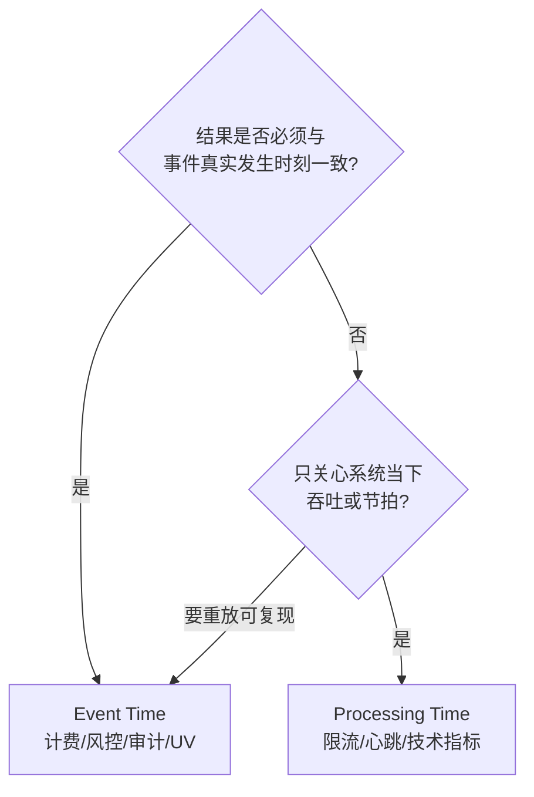
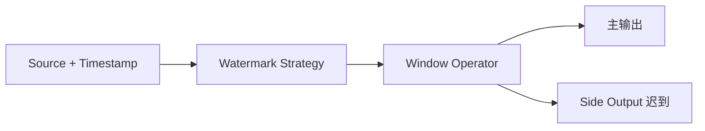

# 模块 02 · 时间与窗口

> 覆盖章节:02-01 时间语义 / 02-02 Watermark / 02-03 窗口类型与生命周期 / 02-04 Trigger·Evictor·迟到 / 02-05 Timer 与 ProcessFunction
> 配套实验:e02 全部 5 案例、e03-C9 · Level:L2

## 02-01 时间语义决策树



判据只有一条:**重放历史数据,结果必须一致吗?** 必须 → Event Time。Processing Time 的结果依赖执行时机,重放即漂移 —— 它便宜(无 watermark、无迟到问题),但只配承担"技术性"语义。

## 02-02 Watermark:生成、传播、对齐、空闲

**本质**:一条随流而行的断言 `Watermark(t)` = "时间戳 ≤ t 的事件(基本)到齐了"。它是**估计**,错了的代价就是迟到数据。

- **生成**:`forBoundedOutOfOrderness(b)` 周期性(默认 200ms)发出 `maxSeenTs - b - 1`;`forMonotonousTimestamps` 是 b=0 特例;打点式(punctuated)按特殊记录发,少用(量大)。
- **传播**:算子对**多输入取 min**,并把自己的 watermark 广播给所有下游 channel。推论:任何一个上游分区停滞,全局 watermark 停摆(e02-C5 亲测)。
- **空闲**:`withIdleness(d)`——分区静默超 d 即被剔出 min 计算;救"部分分区没数据",救不了"全都没数据"(此时用 Timer 双保险,e03-C9)。
- **对齐**(FLIP-182,e02-C5):同组源之间 watermark 漂移超上限时**暂停快源拉取**,封顶状态积压;只对 FLIP-27 源生效。
- 并行度 > 分区数 ⇒ 空转 subtask 的 watermark 恒为 MIN ⇒ 全局停摆:要么对齐并行度,要么 idleness。这是窗口不触发的第一嫌疑人。

## 02-03 窗口类型与生命周期

| 类型 | 边界 | 状态清理 | 典型 |
|---|---|---|---|
| Tumbling | 固定不重叠 | wm 过 end+lateness 即清 | 分钟级报表 |
| Sliding | 固定重叠,元素属 size/slide 个窗口 | 同上,但**状态 × 重叠倍数** | 平滑趋势 |
| Session | 数据驱动,可合并(Merging) | 会话关闭后 | 行为分析(e02-C2) |
| Global | 无边界 | 全靠自定义 Trigger/Evictor | 特殊计数 |

生命周期:首元素到达即建窗 → 增量聚合进累加器 → `wm ≥ end-1` 触发 → lateness 期内迟到重触发 → `wm ≥ end+lateness` 销毁(状态、Trigger 状态、timer 一并清)。**Sliding 的状态倍增**是它在生产被"大窗口+提前触发"(e02-C4)替代的根本原因。

## 02-04 Trigger / Evictor / 迟到三分层

- Trigger 返回值四态:CONTINUE / FIRE(出结果留状态)/ PURGE(清状态不出)/ FIRE_AND_PURGE。**FIRE 语义 = 下游拿累计并需幂等覆盖;FIRE_AND_PURGE = 下游拿增量自行累加** —— 契约必须写进接口文档(e02-C4)。
- 自定义 Trigger 三纪律:周期状态入 partitioned state、clear() 对称删 timer、别在 Trigger 里做业务(它没有 Collector)。
- Evictor 在触发前/后剔元素,会强制窗口**缓存全部元素**(禁用增量聚合路径),非用不可再用。
- 迟到三分层(e02-C3):bound 内正常;`allowedLateness` 内**同窗口重触发**(下游 upsert);超期 `sideOutputLateData` 进死信对账。`bound + lateness` 的总预算依据真实迟到分布(P99)定,不拍脑袋。

## 02-05 Timer 与 ProcessFunction

`KeyedProcessFunction` = 状态 + 定时器 + 旁路输出的完全体,窗口做不了的"个性化时序逻辑"(超时检测、延迟触达、条件挂起)都在这里。要点:

- 定时器**按 key + 时间戳去重**,注册百万次同刻 timer 只存一个;
- 事件时间 timer 由 watermark 驱动、处理时间 timer 由墙钟驱动,SLA 严格场景两者并注双保险(e03-C9);
- timer 随状态 checkpoint,恢复后依然触发 —— "延迟 24h 提醒"这类需求天然容错;
- 先删旧再注册新(状态里记 timer 时间)是防重复触发的标准模板。

## 知识总结与重点

窗口问题的排查总入口是一句话:**"watermark 现在是多少、为什么"**(UI Watermarks 列 → 分区流量 → 策略参数)。重点:min 传播规则、并行度陷阱、迟到三分层、FIRE/PURGE 契约、Timer 双保险。

## 常见错误

时间戳单位秒/毫秒搞混(watermark 直接飞到 1970 或 52000 年);sliding 窗口 slide 设太小引发状态爆炸;在 ProcessWindowFunction 里缓存全量元素(该用增量聚合);把 allowedLateness 当"修数",忘了下游幂等。

## 企业实践

为每条业务线沉淀《迟到分布档案》(P50/P99/最大),watermark 参数从档案推导并随季度复审;看板类需求统一走"大窗口+提前触发"模板(templates/job-datastream 将内置)。

## 面试题

interview/README 4~8 题;进阶:*两条流 interval join,watermark 分别怎么影响 join 的输出与状态清理?*(为 05-03 铺垫)。

## 参考资料

官方 Concepts→Timely Stream Processing;DataStream→Windows / Generating Watermarks;FLIP-182;e02 五案例源码。

---

# 模块 02 · 时间与窗口 — 实质扩写（Wave 2）

> 本章扩写遵循八段式：背景→架构→代码锚点→启动→验证→踩坑→最佳实践→面试题；交叉引用均为相对路径，禁止官网粘贴与重复段落注水（D-05）。

## 仓库交叉引用总表

| 路径 | 说明 |
|---|---|
| [`../../examples/e02-time-window/README.md`](../../examples/e02-time-window/README.md) | 时间窗口模块总览 |
| [`../../examples/e02-time-window/src/main/java/com/flywhl/flinklab/e02/C1OutOfOrderCompensationJob.java`](../../examples/e02-time-window/src/main/java/com/flywhl/flinklab/e02/C1OutOfOrderCompensationJob.java) | 乱序补偿 |
| [`../../examples/e02-time-window/src/main/java/com/flywhl/flinklab/e02/C2SessionWindowJob.java`](../../examples/e02-time-window/src/main/java/com/flywhl/flinklab/e02/C2SessionWindowJob.java) | 会话窗口 |
| [`../../examples/e02-time-window/src/main/java/com/flywhl/flinklab/e02/C3LateDataSideOutputJob.java`](../../examples/e02-time-window/src/main/java/com/flywhl/flinklab/e02/C3LateDataSideOutputJob.java) | 迟到旁路 |
| [`../../examples/e02-time-window/src/main/java/com/flywhl/flinklab/e02/C5WatermarkAlignmentJob.java`](../../examples/e02-time-window/src/main/java/com/flywhl/flinklab/e02/C5WatermarkAlignmentJob.java) | watermark 对齐 |
| [`../../examples/e02-time-window/src/main/java/com/flywhl/flinklab/e02/C6SlidingEventTimeJob.java`](../../examples/e02-time-window/src/main/java/com/flywhl/flinklab/e02/C6SlidingEventTimeJob.java) | 滑动事件时间窗口 |
| [`../../examples/e02-time-window/src/main/java/com/flywhl/flinklab/e02/C7GlobalWindowCountJob.java`](../../examples/e02-time-window/src/main/java/com/flywhl/flinklab/e02/C7GlobalWindowCountJob.java) | GlobalWindow 计数 |
| [`../../examples/e01-hello-flink/src/main/java/com/flywhl/flinklab/e01/ProcessingTimeCountJob.java`](../../examples/e01-hello-flink/src/main/java/com/flywhl/flinklab/e01/ProcessingTimeCountJob.java) | 处理时间对照 |

## 背景

### 背景 · 1

时间语义是流计算正确性的第一决策：Processing Time 简单但不可复现；Event Time + Watermark 可复现但对乱序与空闲分区敏感。

### 背景 · 2

本模块用 e02 一组案例覆盖乱序、会话、迟到旁路、对齐、滑动与 GlobalWindow，形成「决策树 → 机制 → 旁路」闭环。

### 背景 · 3

与 Runtime 联动：并行度与源分区影响 watermark 推进；与 Checkpoint 联动：事件时间窗口恢复后结果可复现。

### 背景 · 4

业务优先 Event Time 的场景：对账、会话、SLA、车联网告警时间线（p03）。

## 架构

### 架构 · 1



### 架构 · 2

TimestampAssigner 从记录取事件时间；WatermarkStrategy 决定乱序容忍与空闲检测；WindowAssigner/Trigger/Evictor 决定窗口生命周期。

### 架构 · 3

allowedLateness 延长窗口生命；超出后走 side output（e02-C3）。Watermark 对齐防止快慢分区拖垮（e02-C5）。

### 架构 · 4

Timer 与 ProcessFunction 是窗口之下的原语：会话、自定义触发都可落到 onTimer。

## 代码锚点

### 代码锚点 · 1

C1：乱序补偿与 out-of-orderness 参数如何改变窗口关闭时机。

### 代码锚点 · 2

C2：Session gap 与活动超时；对照业务「无操作 N 分钟结束会话」。

### 代码锚点 · 3

C3：迟到数据 side output 契约，主流通路保持干净。

### 代码锚点 · 4

C4：早期触发 Trigger 与近似结果权衡。

### 代码锚点 · 5

C5：对齐策略避免空闲/倾斜源卡住全局 watermark。

### 代码锚点 · 6

C6/C7：滑动窗口与 GlobalWindow+Trigger 的计数模式。

## 启动

### 启动 · 1

```bash
(cd examples && mvn -pl e02-time-window -am -DskipTests package)
# 按 examples/e02-time-window/README.md 逐案例提交
```

### 启动 · 2

建议先跑 C1/C3 建立乱序与迟到直觉，再跑 C5 理解对齐。

### 启动 · 3

用 datagen 或模块自带源；需要 Kafka 时先起 docker 基座。

## 验证

### 验证 · 1

窗口结果条数与手算一致；调整乱序参数后观察关闭延迟变化。

### 验证 · 2

迟到旁路：故意延迟事件，确认 side output 有数据而主流契约不变。

### 验证 · 3

对齐：制造快慢分区，观察未对齐时窗口拖延、对齐后恢复。

### 验证 · 4

故障恢复：Event Time 作业从 checkpoint 恢复后窗口边界仍按事件时间对齐。

## 踩坑

### 踩坑 · 1

| 症状 | 根因 | 处置 |
|---|---|---|
| 窗口永不关 | 无 watermark / 空闲分区 | 策略+空闲检测 |
| 大量迟到 | watermark 过快 | 增大 out-of-orderness |
| 恢复后结果漂 | 误用 Processing Time | 改 Event Time |
| 对齐延迟过高 | 极端慢分区 | 对齐上限+治理源 |
| GlobalWindow 爆内存 | Trigger 不当 | 限流触发+状态 TTL |

### 踩坑 · 2

并行度大于源分区时，空闲 subtask 不产生 watermark，拖住整体——Runtime 章已提示，这里是时间语义实锤。

### 踩坑 · 3

禁止「用处理时间窗口做对账」写进生产设计。

## 最佳实践

### 最佳实践 · 1

默认 Event Time；Processing Time 仅监控类或明确可丢可重的场景。

### 最佳实践 · 2

迟到必须有策略：allowedLateness、side output 或丢弃，并写进合约。

### 最佳实践 · 3

会话窗口 gap 来自产品定义，不是拍脑袋。

### 最佳实践 · 4

与 p03 车联网：告警窗口与 CEP 时间约束共用事件时间轴。

### 最佳实践 · 5

题库：`interview/L2.md`。

## 面试题

### 面试题 · 1

Watermark(t) 语义是什么？与乱序参数如何权衡？

### 面试题 · 2

Processing Time 与 Event Time 故障恢复差异？

### 面试题 · 3

allowedLateness 与 side output 各自解决什么？

### 面试题 · 4

Watermark 对齐的收益与代价？

### 面试题 · 5

Session Window 与滑动窗口在状态代价上的差别？

## 深潜专题

### 时间语义决策树

需要可复现、按业务时间对齐 → Event Time。只需「机器时钟上每分钟刷一次」且可接受恢复漂移 → Processing Time。混合系统用 ingest time 要明确文档化，本仓库教学主线仍推 Event Time。

落地检查（02-time-window/深潜1）：针对「时间语义决策树」，在 OrbStack 上做一次最小对照——记录一项指标名或日志关键字，并写明期望方向（升/降/出现/消失）。面试表述映射到 `../../interview/` 中与本模块编号相近的 Level。

### Watermark 传播与多源

多输入时 watermark 取慢者；广播/连接流要理解哪条边推进时间。对齐是缓解策略不是根治倾斜源。

落地检查（02-time-window/深潜2）：针对「Watermark 传播与多源」，在 OrbStack 上做一次最小对照——记录一项指标名或日志关键字，并写明期望方向（升/降/出现/消失）。面试表述映射到 `../../interview/` 中与本模块编号相近的 Level。

### Trigger / Evictor 职责

Trigger 决定何时计算；Evictor 在计算前后剔除元素。早期火触发用在近似大盘；精确对账慎用。见 C4。

落地检查（02-time-window/深潜3）：针对「Trigger / Evictor 职责」，在 OrbStack 上做一次最小对照——记录一项指标名或日志关键字，并写明期望方向（升/降/出现/消失）。面试表述映射到 `../../interview/` 中与本模块编号相近的 Level。

### Timer 调试技巧

Keyed ProcessFunction 中 event-time timer 随 watermark 触发；processing-time timer 随机器时钟。恢复后行为不同，测试夹具要分别写。

落地检查（02-time-window/深潜4）：针对「Timer 调试技巧」，在 OrbStack 上做一次最小对照——记录一项指标名或日志关键字，并写明期望方向（升/降/出现/消失）。面试表述映射到 `../../interview/` 中与本模块编号相近的 Level。

### 窗口状态膨胀

长会话、宽滑动、高基数 key 都会放大窗口状态。配合 TTL（模块 03）与业务过期。p02 特征窗口同样适用。

落地检查（02-time-window/深潜5）：针对「窗口状态膨胀」，在 OrbStack 上做一次最小对照——记录一项指标名或日志关键字，并写明期望方向（升/降/出现/消失）。面试表述映射到 `../../interview/` 中与本模块编号相近的 Level。

### 与 SQL 窗口 TVF 对照

DataStream 窗口与 SQL Window TVF 概念对应但 API 不同；e05 窗口题与本模块互链，选型见 docs/05-sql。

落地检查（02-time-window/深潜6）：针对「与 SQL 窗口 TVF 对照」，在 OrbStack 上做一次最小对照——记录一项指标名或日志关键字，并写明期望方向（升/降/出现/消失）。面试表述映射到 `../../interview/` 中与本模块编号相近的 Level。

### 车联网时间线

p03 告警依赖事件时间顺序与 CEP 窗口；watermark 过快会导致漏报模式。对照 `projects/p03-vehicle-monitoring/docs/ARCHITECTURE.md`。

落地检查（02-time-window/深潜7）：针对「车联网时间线」，在 OrbStack 上做一次最小对照——记录一项指标名或日志关键字，并写明期望方向（升/降/出现/消失）。面试表述映射到 `../../interview/` 中与本模块编号相近的 Level。

### GlobalWindow 适用边界

GlobalWindow 本身不切时间，全靠 Trigger；适合自定义计数/会话原语，不适合无界无触发的「先攒着」。C7 演示计数触发。

落地检查（02-time-window/深潜8）：针对「GlobalWindow 适用边界」，在 OrbStack 上做一次最小对照——记录一项指标名或日志关键字，并写明期望方向（升/降/出现/消失）。面试表述映射到 `../../interview/` 中与本模块编号相近的 Level。

## FAQ

### 乱序 5 秒还是 30 秒？

看业务可接受延迟与真实迟到分布；用旁路观察再定。

延伸（FAQ-1）：用自己的业务域复述「乱序 5 秒还是 30 秒？」，并指出一个具体 `examples/**/*.java` 或 `projects/*/README.md` 佐证点；找不到就先补实验。

### 空闲检测会不会误判？

流量天然稀疏的源要调 idle timeout，避免误推进。

延伸（FAQ-2）：用自己的业务域复述「空闲检测会不会误判？」，并指出一个具体 `examples/**/*.java` 或 `projects/*/README.md` 佐证点；找不到就先补实验。

### 滑动窗口输出太多？

增大 slide 或下游节流；评估状态代价。

延伸（FAQ-3）：用自己的业务域复述「滑动窗口输出太多？」，并指出一个具体 `examples/**/*.java` 或 `projects/*/README.md` 佐证点；找不到就先补实验。

### 能否混用处理时间定时器？

可以，但要文档化；恢复语义与事件时间不同。

延伸（FAQ-4）：用自己的业务域复述「能否混用处理时间定时器？」，并指出一个具体 `examples/**/*.java` 或 `projects/*/README.md` 佐证点；找不到就先补实验。

### 迟到数据要不要回写主流？

一般不；走旁路纠错作业，保持主流幂等契约。

延伸（FAQ-5）：用自己的业务域复述「迟到数据要不要回写主流？」，并指出一个具体 `examples/**/*.java` 或 `projects/*/README.md` 佐证点；找不到就先补实验。

## 检查清单

- [ ] 时间语义书面决策（Event/Processing）
- [ ] Watermark 策略与空闲检测已配置
- [ ] 迟到策略（lateness/side/drop）已定义
- [ ] 并行度与源分区关系已检查
- [ ] 恢复演练验证窗口可复现
- [ ] 关键作业有 uid

## 情景演练

### 场景 A · 对账窗口漏数

检查 watermark 是否过快、分区是否空闲、是否误用处理时间。用 C1/C3 参数对照复现。

演练记录建议包含：时间、环境（OrbStack）、命令、期望、实际、截图/日志路径。项目级证据模板见各 `projects/*/docs/baseline.md`。

### 场景 B · 会话无法结束

gap 过大或事件时间不推进；检查源时间戳字段与空闲策略。

演练记录建议包含：时间、环境（OrbStack）、命令、期望、实际、截图/日志路径。项目级证据模板见各 `projects/*/docs/baseline.md`。

### 场景 C · 大盘要「提前看一眼」

用早期 Trigger 出近似值，最终结果仍以窗口结束火为准；UI 标注 approximate。

演练记录建议包含：时间、环境（OrbStack）、命令、期望、实际、截图/日志路径。项目级证据模板见各 `projects/*/docs/baseline.md`。

## 模式目录（本模块专用）

### 模式 02-time-window-01 · 正确性契约

意图：在 `02-time-window` 路径第 1 步抓住「正确性契约」。先读 [`../../examples/e02-time-window/README.md`](../../examples/e02-time-window/README.md)（时间窗口模块总览），再对照深潜「时间语义决策树」，最后写一句：若线上出现相反现象，我首先检查什么。

机制：用数据面/控制面语言解释「正确性契约」如何在本模块出现；约束仍是 Flink 2.2.1 / JDK 21 / OrbStack 实测，版本以根 README 矩阵为准。

反例：只改 YAML 不跑作业；或把其他模块「状态与 uid」段落粘过来充数。正例：画出输入→算子→输出契约，并链回 `docs/02-time-window/`。

检查：相关模块 `mvn -pl … -am -DskipTests compile`；UI/日志出现与「正确性契约」对应信号；不引入违禁词与断链。

### 模式 02-time-window-02 · 状态与 uid

意图：在 `02-time-window` 路径第 2 步抓住「状态与 uid」。先读 [`../../examples/e02-time-window/src/main/java/com/flywhl/flinklab/e02/C1OutOfOrderCompensationJob.java`](../../examples/e02-time-window/src/main/java/com/flywhl/flinklab/e02/C1OutOfOrderCompensationJob.java)（乱序补偿），再对照深潜「Watermark 传播与多源」，最后写一句：若线上出现相反现象，我首先检查什么。

机制：用数据面/控制面语言解释「状态与 uid」如何在本模块出现；约束仍是 Flink 2.2.1 / JDK 21 / OrbStack 实测，版本以根 README 矩阵为准。

反例：只改 YAML 不跑作业；或把其他模块「时间语义」段落粘过来充数。正例：画出输入→算子→输出契约，并链回 `docs/02-time-window/`。

检查：相关模块 `mvn -pl … -am -DskipTests compile`；UI/日志出现与「状态与 uid」对应信号；不引入违禁词与断链。

### 模式 02-time-window-03 · 时间语义

意图：在 `02-time-window` 路径第 3 步抓住「时间语义」。先读 [`../../examples/e02-time-window/src/main/java/com/flywhl/flinklab/e02/C2SessionWindowJob.java`](../../examples/e02-time-window/src/main/java/com/flywhl/flinklab/e02/C2SessionWindowJob.java)（会话窗口），再对照深潜「Trigger / Evictor 职责」，最后写一句：若线上出现相反现象，我首先检查什么。

机制：用数据面/控制面语言解释「时间语义」如何在本模块出现；约束仍是 Flink 2.2.1 / JDK 21 / OrbStack 实测，版本以根 README 矩阵为准。

反例：只改 YAML 不跑作业；或把其他模块「反压与容量」段落粘过来充数。正例：画出输入→算子→输出契约，并链回 `docs/02-time-window/`。

检查：相关模块 `mvn -pl … -am -DskipTests compile`；UI/日志出现与「时间语义」对应信号；不引入违禁词与断链。

### 模式 02-time-window-04 · 反压与容量

意图：在 `02-time-window` 路径第 4 步抓住「反压与容量」。先读 [`../../examples/e02-time-window/src/main/java/com/flywhl/flinklab/e02/C3LateDataSideOutputJob.java`](../../examples/e02-time-window/src/main/java/com/flywhl/flinklab/e02/C3LateDataSideOutputJob.java)（迟到旁路），再对照深潜「Timer 调试技巧」，最后写一句：若线上出现相反现象，我首先检查什么。

机制：用数据面/控制面语言解释「反压与容量」如何在本模块出现；约束仍是 Flink 2.2.1 / JDK 21 / OrbStack 实测，版本以根 README 矩阵为准。

反例：只改 YAML 不跑作业；或把其他模块「容错恢复」段落粘过来充数。正例：画出输入→算子→输出契约，并链回 `docs/02-time-window/`。

检查：相关模块 `mvn -pl … -am -DskipTests compile`；UI/日志出现与「反压与容量」对应信号；不引入违禁词与断链。

### 模式 02-time-window-05 · 容错恢复

意图：在 `02-time-window` 路径第 5 步抓住「容错恢复」。先读 [`../../examples/e02-time-window/src/main/java/com/flywhl/flinklab/e02/C5WatermarkAlignmentJob.java`](../../examples/e02-time-window/src/main/java/com/flywhl/flinklab/e02/C5WatermarkAlignmentJob.java)（watermark 对齐），再对照深潜「窗口状态膨胀」，最后写一句：若线上出现相反现象，我首先检查什么。

机制：用数据面/控制面语言解释「容错恢复」如何在本模块出现；约束仍是 Flink 2.2.1 / JDK 21 / OrbStack 实测，版本以根 README 矩阵为准。

反例：只改 YAML 不跑作业；或把其他模块「连接器语义」段落粘过来充数。正例：画出输入→算子→输出契约，并链回 `docs/02-time-window/`。

检查：相关模块 `mvn -pl … -am -DskipTests compile`；UI/日志出现与「容错恢复」对应信号；不引入违禁词与断链。

### 模式 02-time-window-06 · 连接器语义

意图：在 `02-time-window` 路径第 6 步抓住「连接器语义」。先读 [`../../examples/e02-time-window/src/main/java/com/flywhl/flinklab/e02/C6SlidingEventTimeJob.java`](../../examples/e02-time-window/src/main/java/com/flywhl/flinklab/e02/C6SlidingEventTimeJob.java)（滑动事件时间窗口），再对照深潜「与 SQL 窗口 TVF 对照」，最后写一句：若线上出现相反现象，我首先检查什么。

机制：用数据面/控制面语言解释「连接器语义」如何在本模块出现；约束仍是 Flink 2.2.1 / JDK 21 / OrbStack 实测，版本以根 README 矩阵为准。

反例：只改 YAML 不跑作业；或把其他模块「旁路与降级」段落粘过来充数。正例：画出输入→算子→输出契约，并链回 `docs/02-time-window/`。

检查：相关模块 `mvn -pl … -am -DskipTests compile`；UI/日志出现与「连接器语义」对应信号；不引入违禁词与断链。

### 模式 02-time-window-07 · 旁路与降级

意图：在 `02-time-window` 路径第 7 步抓住「旁路与降级」。先读 [`../../examples/e02-time-window/src/main/java/com/flywhl/flinklab/e02/C7GlobalWindowCountJob.java`](../../examples/e02-time-window/src/main/java/com/flywhl/flinklab/e02/C7GlobalWindowCountJob.java)（GlobalWindow 计数），再对照深潜「车联网时间线」，最后写一句：若线上出现相反现象，我首先检查什么。

机制：用数据面/控制面语言解释「旁路与降级」如何在本模块出现；约束仍是 Flink 2.2.1 / JDK 21 / OrbStack 实测，版本以根 README 矩阵为准。

反例：只改 YAML 不跑作业；或把其他模块「可观测指标」段落粘过来充数。正例：画出输入→算子→输出契约，并链回 `docs/02-time-window/`。

检查：相关模块 `mvn -pl … -am -DskipTests compile`；UI/日志出现与「旁路与降级」对应信号；不引入违禁词与断链。

### 模式 02-time-window-08 · 可观测指标

意图：在 `02-time-window` 路径第 8 步抓住「可观测指标」。先读 [`../../examples/e01-hello-flink/src/main/java/com/flywhl/flinklab/e01/ProcessingTimeCountJob.java`](../../examples/e01-hello-flink/src/main/java/com/flywhl/flinklab/e01/ProcessingTimeCountJob.java)（处理时间对照），再对照深潜「GlobalWindow 适用边界」，最后写一句：若线上出现相反现象，我首先检查什么。

机制：用数据面/控制面语言解释「可观测指标」如何在本模块出现；约束仍是 Flink 2.2.1 / JDK 21 / OrbStack 实测，版本以根 README 矩阵为准。

反例：只改 YAML 不跑作业；或把其他模块「压测基线」段落粘过来充数。正例：画出输入→算子→输出契约，并链回 `docs/02-time-window/`。

检查：相关模块 `mvn -pl … -am -DskipTests compile`；UI/日志出现与「可观测指标」对应信号；不引入违禁词与断链。

### 模式 02-time-window-09 · 压测基线

意图：在 `02-time-window` 路径第 9 步抓住「压测基线」。先读 [`../../examples/e02-time-window/README.md`](../../examples/e02-time-window/README.md)（时间窗口模块总览），再对照深潜「时间语义决策树」，最后写一句：若线上出现相反现象，我首先检查什么。

机制：用数据面/控制面语言解释「压测基线」如何在本模块出现；约束仍是 Flink 2.2.1 / JDK 21 / OrbStack 实测，版本以根 README 矩阵为准。

反例：只改 YAML 不跑作业；或把其他模块「升级与 savepoint」段落粘过来充数。正例：画出输入→算子→输出契约，并链回 `docs/02-time-window/`。

检查：相关模块 `mvn -pl … -am -DskipTests compile`；UI/日志出现与「压测基线」对应信号；不引入违禁词与断链。

### 模式 02-time-window-10 · 升级与 savepoint

意图：在 `02-time-window` 路径第 10 步抓住「升级与 savepoint」。先读 [`../../examples/e02-time-window/src/main/java/com/flywhl/flinklab/e02/C1OutOfOrderCompensationJob.java`](../../examples/e02-time-window/src/main/java/com/flywhl/flinklab/e02/C1OutOfOrderCompensationJob.java)（乱序补偿），再对照深潜「Watermark 传播与多源」，最后写一句：若线上出现相反现象，我首先检查什么。

机制：用数据面/控制面语言解释「升级与 savepoint」如何在本模块出现；约束仍是 Flink 2.2.1 / JDK 21 / OrbStack 实测，版本以根 README 矩阵为准。

反例：只改 YAML 不跑作业；或把其他模块「安全与多租户」段落粘过来充数。正例：画出输入→算子→输出契约，并链回 `docs/02-time-window/`。

检查：相关模块 `mvn -pl … -am -DskipTests compile`；UI/日志出现与「升级与 savepoint」对应信号；不引入违禁词与断链。

### 模式 02-time-window-11 · 安全与多租户

意图：在 `02-time-window` 路径第 11 步抓住「安全与多租户」。先读 [`../../examples/e02-time-window/src/main/java/com/flywhl/flinklab/e02/C2SessionWindowJob.java`](../../examples/e02-time-window/src/main/java/com/flywhl/flinklab/e02/C2SessionWindowJob.java)（会话窗口），再对照深潜「Trigger / Evictor 职责」，最后写一句：若线上出现相反现象，我首先检查什么。

机制：用数据面/控制面语言解释「安全与多租户」如何在本模块出现；约束仍是 Flink 2.2.1 / JDK 21 / OrbStack 实测，版本以根 README 矩阵为准。

反例：只改 YAML 不跑作业；或把其他模块「成本与预算」段落粘过来充数。正例：画出输入→算子→输出契约，并链回 `docs/02-time-window/`。

检查：相关模块 `mvn -pl … -am -DskipTests compile`；UI/日志出现与「安全与多租户」对应信号；不引入违禁词与断链。

### 模式 02-time-window-12 · 成本与预算

意图：在 `02-time-window` 路径第 12 步抓住「成本与预算」。先读 [`../../examples/e02-time-window/src/main/java/com/flywhl/flinklab/e02/C3LateDataSideOutputJob.java`](../../examples/e02-time-window/src/main/java/com/flywhl/flinklab/e02/C3LateDataSideOutputJob.java)（迟到旁路），再对照深潜「Timer 调试技巧」，最后写一句：若线上出现相反现象，我首先检查什么。

机制：用数据面/控制面语言解释「成本与预算」如何在本模块出现；约束仍是 Flink 2.2.1 / JDK 21 / OrbStack 实测，版本以根 README 矩阵为准。

反例：只改 YAML 不跑作业；或把其他模块「Schema 演进」段落粘过来充数。正例：画出输入→算子→输出契约，并链回 `docs/02-time-window/`。

检查：相关模块 `mvn -pl … -am -DskipTests compile`；UI/日志出现与「成本与预算」对应信号；不引入违禁词与断链。

### 模式 02-time-window-13 · Schema 演进

意图：在 `02-time-window` 路径第 13 步抓住「Schema 演进」。先读 [`../../examples/e02-time-window/src/main/java/com/flywhl/flinklab/e02/C5WatermarkAlignmentJob.java`](../../examples/e02-time-window/src/main/java/com/flywhl/flinklab/e02/C5WatermarkAlignmentJob.java)（watermark 对齐），再对照深潜「窗口状态膨胀」，最后写一句：若线上出现相反现象，我首先检查什么。

机制：用数据面/控制面语言解释「Schema 演进」如何在本模块出现；约束仍是 Flink 2.2.1 / JDK 21 / OrbStack 实测，版本以根 README 矩阵为准。

反例：只改 YAML 不跑作业；或把其他模块「CEP/规则」段落粘过来充数。正例：画出输入→算子→输出契约，并链回 `docs/02-time-window/`。

检查：相关模块 `mvn -pl … -am -DskipTests compile`；UI/日志出现与「Schema 演进」对应信号；不引入违禁词与断链。

### 模式 02-time-window-14 · CEP/规则

意图：在 `02-time-window` 路径第 14 步抓住「CEP/规则」。先读 [`../../examples/e02-time-window/src/main/java/com/flywhl/flinklab/e02/C6SlidingEventTimeJob.java`](../../examples/e02-time-window/src/main/java/com/flywhl/flinklab/e02/C6SlidingEventTimeJob.java)（滑动事件时间窗口），再对照深潜「与 SQL 窗口 TVF 对照」，最后写一句：若线上出现相反现象，我首先检查什么。

机制：用数据面/控制面语言解释「CEP/规则」如何在本模块出现；约束仍是 Flink 2.2.1 / JDK 21 / OrbStack 实测，版本以根 README 矩阵为准。

反例：只改 YAML 不跑作业；或把其他模块「SQL/Table 桥接」段落粘过来充数。正例：画出输入→算子→输出契约，并链回 `docs/02-time-window/`。

检查：相关模块 `mvn -pl … -am -DskipTests compile`；UI/日志出现与「CEP/规则」对应信号；不引入违禁词与断链。

### 模式 02-time-window-15 · SQL/Table 桥接

意图：在 `02-time-window` 路径第 15 步抓住「SQL/Table 桥接」。先读 [`../../examples/e02-time-window/src/main/java/com/flywhl/flinklab/e02/C7GlobalWindowCountJob.java`](../../examples/e02-time-window/src/main/java/com/flywhl/flinklab/e02/C7GlobalWindowCountJob.java)（GlobalWindow 计数），再对照深潜「车联网时间线」，最后写一句：若线上出现相反现象，我首先检查什么。

机制：用数据面/控制面语言解释「SQL/Table 桥接」如何在本模块出现；约束仍是 Flink 2.2.1 / JDK 21 / OrbStack 实测，版本以根 README 矩阵为准。

反例：只改 YAML 不跑作业；或把其他模块「湖仓落地」段落粘过来充数。正例：画出输入→算子→输出契约，并链回 `docs/02-time-window/`。

检查：相关模块 `mvn -pl … -am -DskipTests compile`；UI/日志出现与「SQL/Table 桥接」对应信号；不引入违禁词与断链。

### 模式 02-time-window-16 · 湖仓落地

意图：在 `02-time-window` 路径第 16 步抓住「湖仓落地」。先读 [`../../examples/e01-hello-flink/src/main/java/com/flywhl/flinklab/e01/ProcessingTimeCountJob.java`](../../examples/e01-hello-flink/src/main/java/com/flywhl/flinklab/e01/ProcessingTimeCountJob.java)（处理时间对照），再对照深潜「GlobalWindow 适用边界」，最后写一句：若线上出现相反现象，我首先检查什么。

机制：用数据面/控制面语言解释「湖仓落地」如何在本模块出现；约束仍是 Flink 2.2.1 / JDK 21 / OrbStack 实测，版本以根 README 矩阵为准。

反例：只改 YAML 不跑作业；或把其他模块「AI 降级」段落粘过来充数。正例：画出输入→算子→输出契约，并链回 `docs/02-time-window/`。

检查：相关模块 `mvn -pl … -am -DskipTests compile`；UI/日志出现与「湖仓落地」对应信号；不引入违禁词与断链。

### 模式 02-time-window-17 · AI 降级

意图：在 `02-time-window` 路径第 17 步抓住「AI 降级」。先读 [`../../examples/e02-time-window/README.md`](../../examples/e02-time-window/README.md)（时间窗口模块总览），再对照深潜「时间语义决策树」，最后写一句：若线上出现相反现象，我首先检查什么。

机制：用数据面/控制面语言解释「AI 降级」如何在本模块出现；约束仍是 Flink 2.2.1 / JDK 21 / OrbStack 实测，版本以根 README 矩阵为准。

反例：只改 YAML 不跑作业；或把其他模块「GitOps 发布」段落粘过来充数。正例：画出输入→算子→输出契约，并链回 `docs/02-time-window/`。

检查：相关模块 `mvn -pl … -am -DskipTests compile`；UI/日志出现与「AI 降级」对应信号；不引入违禁词与断链。

### 模式 02-time-window-18 · GitOps 发布

意图：在 `02-time-window` 路径第 18 步抓住「GitOps 发布」。先读 [`../../examples/e02-time-window/src/main/java/com/flywhl/flinklab/e02/C1OutOfOrderCompensationJob.java`](../../examples/e02-time-window/src/main/java/com/flywhl/flinklab/e02/C1OutOfOrderCompensationJob.java)（乱序补偿），再对照深潜「Watermark 传播与多源」，最后写一句：若线上出现相反现象，我首先检查什么。

机制：用数据面/控制面语言解释「GitOps 发布」如何在本模块出现；约束仍是 Flink 2.2.1 / JDK 21 / OrbStack 实测，版本以根 README 矩阵为准。

反例：只改 YAML 不跑作业；或把其他模块「值班手册」段落粘过来充数。正例：画出输入→算子→输出契约，并链回 `docs/02-time-window/`。

检查：相关模块 `mvn -pl … -am -DskipTests compile`；UI/日志出现与「GitOps 发布」对应信号；不引入违禁词与断链。

### 模式 02-time-window-19 · 值班手册

意图：在 `02-time-window` 路径第 19 步抓住「值班手册」。先读 [`../../examples/e02-time-window/src/main/java/com/flywhl/flinklab/e02/C2SessionWindowJob.java`](../../examples/e02-time-window/src/main/java/com/flywhl/flinklab/e02/C2SessionWindowJob.java)（会话窗口），再对照深潜「Trigger / Evictor 职责」，最后写一句：若线上出现相反现象，我首先检查什么。

机制：用数据面/控制面语言解释「值班手册」如何在本模块出现；约束仍是 Flink 2.2.1 / JDK 21 / OrbStack 实测，版本以根 README 矩阵为准。

反例：只改 YAML 不跑作业；或把其他模块「简历可验证陈述」段落粘过来充数。正例：画出输入→算子→输出契约，并链回 `docs/02-time-window/`。

检查：相关模块 `mvn -pl … -am -DskipTests compile`；UI/日志出现与「值班手册」对应信号；不引入违禁词与断链。

### 模式 02-time-window-20 · 简历可验证陈述

意图：在 `02-time-window` 路径第 20 步抓住「简历可验证陈述」。先读 [`../../examples/e02-time-window/src/main/java/com/flywhl/flinklab/e02/C3LateDataSideOutputJob.java`](../../examples/e02-time-window/src/main/java/com/flywhl/flinklab/e02/C3LateDataSideOutputJob.java)（迟到旁路），再对照深潜「Timer 调试技巧」，最后写一句：若线上出现相反现象，我首先检查什么。

机制：用数据面/控制面语言解释「简历可验证陈述」如何在本模块出现；约束仍是 Flink 2.2.1 / JDK 21 / OrbStack 实测，版本以根 README 矩阵为准。

反例：只改 YAML 不跑作业；或把其他模块「正确性契约」段落粘过来充数。正例：画出输入→算子→输出契约，并链回 `docs/02-time-window/`。

检查：相关模块 `mvn -pl … -am -DskipTests compile`；UI/日志出现与「简历可验证陈述」对应信号；不引入违禁词与断链。

## 术语对照（本模块）

- **Watermark**：事件时间进度声明。结合本模块案例口述其失败模式。
- **allowedLateness**：窗口延迟关闭容忍。结合本模块案例口述其失败模式。
- **Session gap**：会话非活动间隔。结合本模块案例口述其失败模式。
- **Side Output**：旁路输出标签。结合本模块案例口述其失败模式。
- **Trigger**：窗口计算触发器。结合本模块案例口述其失败模式。

## 综合论述

### 论述 1 · 从原理到仓库落地

把 `02-time-window` 的第 1 个核心概念放到端到端链路中：源（datagen/Kafka）→ 变换/状态 → sink。本论述聚焦维度「正确性」：说明取舍，并引用至少一个相对路径（`examples/`、`projects/`、`best-practice/` 或 `production/docs/`）。

正确性侧：哪些静默错误与本维度相关（错误时间语义、错误 uid、错误语义矩阵等）？成本侧：状态大小、checkpoint 时长、外部调用 QPS 如何被牵动？可运维侧：哪条指标/日志能证明契约仍成立？

收尾：写出三条可在 OrbStack 演示的步骤（命令级），细节指向本模块 README 启动/验证段，避免粘贴长日志。维度编号 1 的验收口令：能指着 UI 或日志说出「看到了什么算过」。

### 论述 2 · 从原理到仓库落地

把 `02-time-window` 的第 2 个核心概念放到端到端链路中：源（datagen/Kafka）→ 变换/状态 → sink。本论述聚焦维度「延迟」：说明取舍，并引用至少一个相对路径（`examples/`、`projects/`、`best-practice/` 或 `production/docs/`）。

正确性侧：哪些静默错误与本维度相关（错误时间语义、错误 uid、错误语义矩阵等）？成本侧：状态大小、checkpoint 时长、外部调用 QPS 如何被牵动？可运维侧：哪条指标/日志能证明契约仍成立？

收尾：写出三条可在 OrbStack 演示的步骤（命令级），细节指向本模块 README 启动/验证段，避免粘贴长日志。维度编号 2 的验收口令：能指着 UI 或日志说出「看到了什么算过」。

### 论述 3 · 从原理到仓库落地

把 `02-time-window` 的第 3 个核心概念放到端到端链路中：源（datagen/Kafka）→ 变换/状态 → sink。本论述聚焦维度「状态成本」：说明取舍，并引用至少一个相对路径（`examples/`、`projects/`、`best-practice/` 或 `production/docs/`）。

正确性侧：哪些静默错误与本维度相关（错误时间语义、错误 uid、错误语义矩阵等）？成本侧：状态大小、checkpoint 时长、外部调用 QPS 如何被牵动？可运维侧：哪条指标/日志能证明契约仍成立？

收尾：写出三条可在 OrbStack 演示的步骤（命令级），细节指向本模块 README 启动/验证段，避免粘贴长日志。维度编号 3 的验收口令：能指着 UI 或日志说出「看到了什么算过」。

### 论述 4 · 从原理到仓库落地

把 `02-time-window` 的第 4 个核心概念放到端到端链路中：源（datagen/Kafka）→ 变换/状态 → sink。本论述聚焦维度「容错」：说明取舍，并引用至少一个相对路径（`examples/`、`projects/`、`best-practice/` 或 `production/docs/`）。

正确性侧：哪些静默错误与本维度相关（错误时间语义、错误 uid、错误语义矩阵等）？成本侧：状态大小、checkpoint 时长、外部调用 QPS 如何被牵动？可运维侧：哪条指标/日志能证明契约仍成立？

收尾：写出三条可在 OrbStack 演示的步骤（命令级），细节指向本模块 README 启动/验证段，避免粘贴长日志。维度编号 4 的验收口令：能指着 UI 或日志说出「看到了什么算过」。

### 论述 5 · 从原理到仓库落地

把 `02-time-window` 的第 5 个核心概念放到端到端链路中：源（datagen/Kafka）→ 变换/状态 → sink。本论述聚焦维度「可观测」：说明取舍，并引用至少一个相对路径（`examples/`、`projects/`、`best-practice/` 或 `production/docs/`）。

正确性侧：哪些静默错误与本维度相关（错误时间语义、错误 uid、错误语义矩阵等）？成本侧：状态大小、checkpoint 时长、外部调用 QPS 如何被牵动？可运维侧：哪条指标/日志能证明契约仍成立？

收尾：写出三条可在 OrbStack 演示的步骤（命令级），细节指向本模块 README 启动/验证段，避免粘贴长日志。维度编号 5 的验收口令：能指着 UI 或日志说出「看到了什么算过」。

### 论述 6 · 从原理到仓库落地

把 `02-time-window` 的第 6 个核心概念放到端到端链路中：源（datagen/Kafka）→ 变换/状态 → sink。本论述聚焦维度「安全」：说明取舍，并引用至少一个相对路径（`examples/`、`projects/`、`best-practice/` 或 `production/docs/`）。

正确性侧：哪些静默错误与本维度相关（错误时间语义、错误 uid、错误语义矩阵等）？成本侧：状态大小、checkpoint 时长、外部调用 QPS 如何被牵动？可运维侧：哪条指标/日志能证明契约仍成立？

收尾：写出三条可在 OrbStack 演示的步骤（命令级），细节指向本模块 README 启动/验证段，避免粘贴长日志。维度编号 6 的验收口令：能指着 UI 或日志说出「看到了什么算过」。

### 论述 7 · 从原理到仓库落地

把 `02-time-window` 的第 7 个核心概念放到端到端链路中：源（datagen/Kafka）→ 变换/状态 → sink。本论述聚焦维度「成本治理」：说明取舍，并引用至少一个相对路径（`examples/`、`projects/`、`best-practice/` 或 `production/docs/`）。

正确性侧：哪些静默错误与本维度相关（错误时间语义、错误 uid、错误语义矩阵等）？成本侧：状态大小、checkpoint 时长、外部调用 QPS 如何被牵动？可运维侧：哪条指标/日志能证明契约仍成立？

收尾：写出三条可在 OrbStack 演示的步骤（命令级），细节指向本模块 README 启动/验证段，避免粘贴长日志。维度编号 7 的验收口令：能指着 UI 或日志说出「看到了什么算过」。

### 论述 8 · 从原理到仓库落地

把 `02-time-window` 的第 8 个核心概念放到端到端链路中：源（datagen/Kafka）→ 变换/状态 → sink。本论述聚焦维度「简历验证」：说明取舍，并引用至少一个相对路径（`examples/`、`projects/`、`best-practice/` 或 `production/docs/`）。

正确性侧：哪些静默错误与本维度相关（错误时间语义、错误 uid、错误语义矩阵等）？成本侧：状态大小、checkpoint 时长、外部调用 QPS 如何被牵动？可运维侧：哪条指标/日志能证明契约仍成立？

收尾：写出三条可在 OrbStack 演示的步骤（命令级），细节指向本模块 README 启动/验证段，避免粘贴长日志。维度编号 8 的验收口令：能指着 UI 或日志说出「看到了什么算过」。
