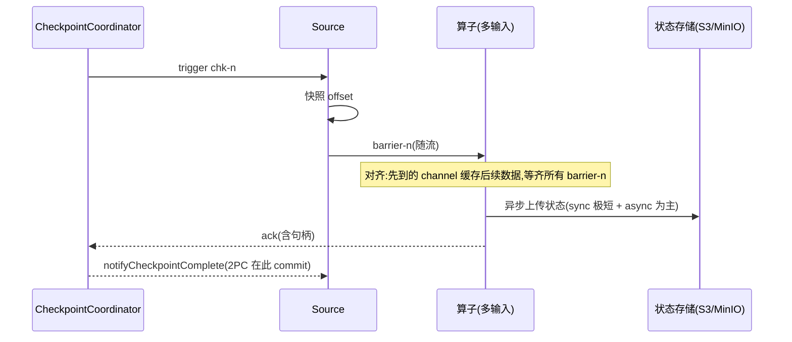

# 模块 04 · 容错:Checkpoint 与 Savepoint

> 覆盖章节:04-01 Checkpoint 全链路 / 04-02 Savepoint 与作业演进 / 04-03 State Processor API / 04-04 端到端一致性与 2PC
> 配套实验:e04 全部 4 案例 · Level:L3

## 04-01 Checkpoint 全链路

基于 Chandy-Lamport 思想的异步屏障快照(ABS):JobMaster 的 CheckpointCoordinator 周期性向所有 Source 注入 **barrier-n**;barrier 随数据流动,每个算子收齐所有输入的 barrier-n 后快照自身状态并向下游转发;所有算子(含 Sink)确认后,协调者标记 chk-n 完成并广播通知。

**三段耗时**(UI 上逐段可见,定位口径):
- *sync*:内存屏障内的本地快照准备,应为毫秒级;
- *async*:上传状态到远端,受状态大小与增量与否支配;
- *alignment/start delay*:barrier 在反压 channel 里排队的时间——**反压拖垮 checkpoint 的病灶在这一段**(e04-C1 亲测)。

**对齐 vs 非对齐**:对齐保证快照内不含"越过 barrier 的数据",体积小;非对齐(FLIP-76)让 barrier 越过 in-flight 数据、把这些数据本身写进快照——时效稳了,代价是体积与恢复时间。决策:反压常态化且 checkpoint 频繁超时才开,并优先治反压本身。可配 `execution.checkpointing.aligned-checkpoint-timeout` 实现"先对齐、超时自动转非对齐"的混合策略。

**增量 checkpoint**(RocksDB/ForSt,e03-C10):chk-n 只上传新增/变更 SST,共享部分进 `shared/` 引用计数管理——删除旧 checkpoint 不一定释放空间(引用未清零),容量按 shared 总量规划。

**其它必知配置**:`execution.checkpointing.timeout`(默认 10min)、`min-pause`(两次 checkpoint 最小间隙,防"永远在做 checkpoint")、`tolerable-failed-checkpoints`(容忍连续失败次数)、`externalized-checkpoint-retention: RETAIN_ON_CANCELLATION`(取消后保留,生产必设)。

## 04-02 Savepoint 与作业演进

| | Checkpoint | Savepoint |
|---|---|---|
| 目的 | 故障自愈 | 有计划的停机/升级/迁移/回滚 |
| 触发 | 自动周期 | 人工/平台 API |
| 格式 | 后端原生(增量、可能引用 shared) | **规范化自包含**格式,跨后端可移植 |
| 生命周期 | 作业自管(保留 N 个) | 用户自管,显式删除 |

升级五步 SOP(e04-C3 全程演练):`stop --savepointPath`(优雅停,含最后一次精确快照+Sink commit)→ 部署新 jar → `run -s <path>` → 观察状态延续 → 保留旧 savepoint 直到新版本验收。**恢复匹配按 `uid → 状态名` 二级索引**:uid 不变随便改逻辑;删有状态算子需 `--allowNonRestoredState`;maxParallelism 不可变(03-01)。

savepoint 还有两个常被忽略的用法:**扩缩容入口**(改并行度必须经 savepoint/retained checkpoint 重启)与**跨集群迁移**(机房搬迁、K8s 集群更换)。

## 04-03 State Processor API:把状态当数据集

`flink-state-processor-api` 允许用批作业**离线读、改、建**savepoint:

- **读**:审计某作业状态(如"哪些 key 的余额异常"),`SavepointReader.read(...).readKeyedState(uid, readerFn)`;
- **改**:洗掉脏 key、修正状态字段、**重写 maxParallelism**、迁移状态 POJO 包名;
- **建**:从 Hive/文件全量数据 bootstrap 一个初始 savepoint,让新作业"带着历史上线"(推荐系统冷启动的标准解法,案例二会用)。

工程定位:它是状态世界的"手术刀",低频但不可替代;所有操作产出**新** savepoint,原件不动,天然可回滚。

## 04-04 端到端一致性与两阶段提交

分层论证(e04-C4 + e04-C2 两个实验合起来就是完整证明):

1. **作业内 exactly-once**:checkpoint 保证状态不多算不漏算——但故障恢复会**回放** checkpoint 之后的数据;
2. **输出端**:无事务 Sink(print/普通 HTTP)在回放段产生重复 → 端到端只有 at-least-once;
3. **补齐方案 A:幂等**——下游按业务键 upsert(ClickHouse ReplacingMergeTree、Redis SET、ES _id),简单皮实,大多数场景够用;
4. **补齐方案 B:事务(2PC)**——Sink 把"两次 checkpoint 之间的输出"包进事务:pre-commit 随快照发生,commit 在 `notifyCheckpointComplete`;故障时未完成事务 abort,回放段重写同一事务。Kafka Sink 的三条件与超时不等式见 e04-C2 javadoc(军规 2)。

**2PC 的隐含代价**:输出可见性延迟 = checkpoint 间隔(read_committed 只能看到已 commit 批次);间隔 30s 的作业,下游最坏 30s 才见数——"要多实时"与"要多准确"在这里正面相撞,必须写进 SLA。JDBC 类 Sink 的 XA 两阶段提交同理但更脆(连接占用/悬挂事务),优先幂等方案。

## 知识总结与重点

一张脑图:**barrier(对齐/非对齐)→ 三段耗时 → 增量与 shared/ → savepoint 的 uid 契约 → State Processor 手术刀 → 端到端 = 状态一致 + 输出幂等或事务**。重点:alignment 耗时与反压的关系、RETAIN_ON_CANCELLATION、stop 与 cancel 的天壤之别、超时不等式、2PC 的可见性延迟。

## 常见错误

checkpoint 间隔设得比状态上传耗时还短(叠加风暴,设 min-pause);把 savepoint 当备份长存对象存储却从不演练恢复;transactionalIdPrefix 复用;误以为 `--allowNonRestoredState` 是"兼容模式"(它是**弃状态**开关);在 notifyCheckpointComplete 里做重业务(它在主线程,卡住会拖垮后续 checkpoint)。

## 企业实践

发布流水线硬卡三件事:uid 全覆盖静态检查、stop-with-savepoint 而非 cancel、恢复演练留痕(e04-C3/C4 即演练脚本雏形);监控侧对 `lastCheckpointDuration`、`numberOfFailedCheckpoints` 设告警(monitoring/ 五指标之一)。

## 面试题

interview/README 10~15;进阶:*混合对齐(aligned-checkpoint-timeout)在什么时刻做出转换决策?* / *2PC Sink 在 notifyCheckpointComplete 丢失(进程死在通知前)时如何保证不丢 commit?(提示:恢复时按快照里的事务句柄补 commit)*。

## 参考资料

官方 Concepts→Stateful Stream Processing;Ops→Checkpoints/Savepoints/Unaligned Checkpoints;Libs→State Processor API;FLIP-76、FLIP-193(stop-with-savepoint 语义);Kafka connector Fault Tolerance 章;e04 四案例源码。
