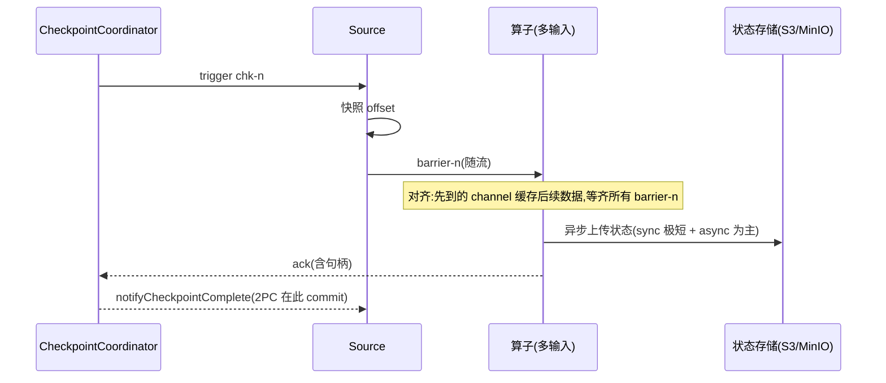
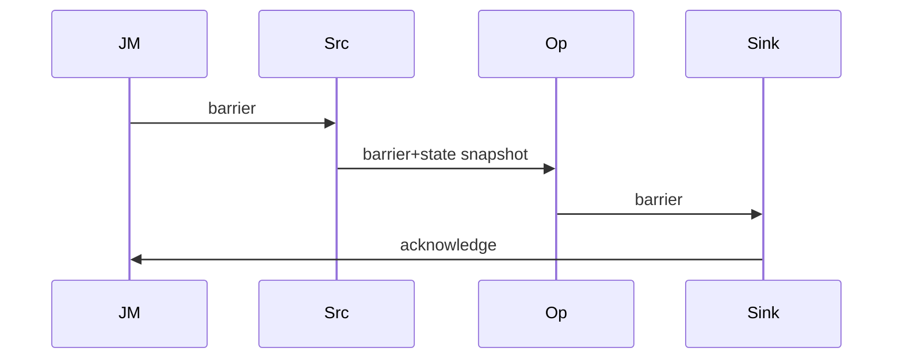

# 模块 04 · 容错:Checkpoint 与 Savepoint

> 覆盖章节:04-01 Checkpoint 全链路 / 04-02 Savepoint 与作业演进 / 04-03 State Processor API / 04-04 端到端一致性与 2PC
> 配套实验:e04 全部 4 案例 · Level:L3

## 04-01 Checkpoint 全链路

基于 Chandy-Lamport 思想的异步屏障快照(ABS):JobMaster 的 CheckpointCoordinator 周期性向所有 Source 注入 **barrier-n**;barrier 随数据流动,每个算子收齐所有输入的 barrier-n 后快照自身状态并向下游转发;所有算子(含 Sink)确认后,协调者标记 chk-n 完成并广播通知。



**三段耗时**(UI 上逐段可见,定位口径):
- *sync*:内存屏障内的本地快照准备,应为毫秒级;
- *async*:上传状态到远端,受状态大小与增量与否支配;
- *alignment/start delay*:barrier 在反压 channel 里排队的时间——**反压拖垮 checkpoint 的病灶在这一段**(e04-C1 亲测)。

**对齐 vs 非对齐**:对齐保证快照内不含"越过 barrier 的数据",体积小;非对齐(FLIP-76)让 barrier 越过 in-flight 数据、把这些数据本身写进快照——时效稳了,代价是体积与恢复时间。决策:反压常态化且 checkpoint 频繁超时才开,并优先治反压本身。可配 `execution.checkpointing.aligned-checkpoint-timeout` 实现"先对齐、超时自动转非对齐"的混合策略。

**增量 checkpoint**(RocksDB/ForSt,e03-C10):chk-n 只上传新增/变更 SST,共享部分进 `shared/` 引用计数管理——删除旧 checkpoint 不一定释放空间(引用未清零),容量按 shared 总量规划。

**其它必知配置**:`execution.checkpointing.timeout`(默认 10min)、`min-pause`(两次 checkpoint 最小间隙,防"永远在做 checkpoint")、`tolerable-failed-checkpoints`(容忍连续失败次数)、`externalized-checkpoint-retention: RETAIN_ON_CANCELLATION`(取消后保留,生产必设)。

## 04-02 Savepoint 与作业演进

| | Checkpoint | Savepoint |
|---|---|---|
| 目的 | 故障自愈 | 有计划的停机/升级/迁移/回滚 |
| 触发 | 自动周期 | 人工/平台 API |
| 格式 | 后端原生(增量、可能引用 shared) | **规范化自包含**格式,跨后端可移植 |
| 生命周期 | 作业自管(保留 N 个) | 用户自管,显式删除 |

升级五步 SOP(e04-C3 全程演练):`stop --savepointPath`(优雅停,含最后一次精确快照+Sink commit)→ 部署新 jar → `run -s <path>` → 观察状态延续 → 保留旧 savepoint 直到新版本验收。**恢复匹配按 `uid → 状态名` 二级索引**:uid 不变随便改逻辑;删有状态算子需 `--allowNonRestoredState`;maxParallelism 不可变(03-01)。

savepoint 还有两个常被忽略的用法:**扩缩容入口**(改并行度必须经 savepoint/retained checkpoint 重启)与**跨集群迁移**(机房搬迁、K8s 集群更换)。

## 04-03 State Processor API:把状态当数据集

`flink-state-processor-api` 允许用批作业**离线读、改、建**savepoint:

- **读**:审计某作业状态(如"哪些 key 的余额异常"),`SavepointReader.read(...).readKeyedState(uid, readerFn)`;
- **改**:洗掉脏 key、修正状态字段、**重写 maxParallelism**、迁移状态 POJO 包名;
- **建**:从 Hive/文件全量数据 bootstrap 一个初始 savepoint,让新作业"带着历史上线"(推荐系统冷启动的标准解法,案例二会用)。

工程定位:它是状态世界的"手术刀",低频但不可替代;所有操作产出**新** savepoint,原件不动,天然可回滚。

## 04-04 端到端一致性与两阶段提交

分层论证(e04-C4 + e04-C2 两个实验合起来就是完整证明):

1. **作业内 exactly-once**:checkpoint 保证状态不多算不漏算——但故障恢复会**回放** checkpoint 之后的数据;
2. **输出端**:无事务 Sink(print/普通 HTTP)在回放段产生重复 → 端到端只有 at-least-once;
3. **补齐方案 A:幂等**——下游按业务键 upsert(ClickHouse ReplacingMergeTree、Redis SET、ES _id),简单皮实,大多数场景够用;
4. **补齐方案 B:事务(2PC)**——Sink 把"两次 checkpoint 之间的输出"包进事务:pre-commit 随快照发生,commit 在 `notifyCheckpointComplete`;故障时未完成事务 abort,回放段重写同一事务。Kafka Sink 的三条件与超时不等式见 e04-C2 javadoc(军规 2)。

**2PC 的隐含代价**:输出可见性延迟 = checkpoint 间隔(read_committed 只能看到已 commit 批次);间隔 30s 的作业,下游最坏 30s 才见数——"要多实时"与"要多准确"在这里正面相撞,必须写进 SLA。JDBC 类 Sink 的 XA 两阶段提交同理但更脆(连接占用/悬挂事务),优先幂等方案。

## 知识总结与重点

一张脑图:**barrier(对齐/非对齐)→ 三段耗时 → 增量与 shared/ → savepoint 的 uid 契约 → State Processor 手术刀 → 端到端 = 状态一致 + 输出幂等或事务**。重点:alignment 耗时与反压的关系、RETAIN_ON_CANCELLATION、stop 与 cancel 的天壤之别、超时不等式、2PC 的可见性延迟。

## 常见错误

checkpoint 间隔设得比状态上传耗时还短(叠加风暴,设 min-pause);把 savepoint 当备份长存对象存储却从不演练恢复;transactionalIdPrefix 复用;误以为 `--allowNonRestoredState` 是"兼容模式"(它是**弃状态**开关);在 notifyCheckpointComplete 里做重业务(它在主线程,卡住会拖垮后续 checkpoint)。

## 企业实践

发布流水线硬卡三件事:uid 全覆盖静态检查、stop-with-savepoint 而非 cancel、恢复演练留痕(e04-C3/C4 即演练脚本雏形);监控侧对 `lastCheckpointDuration`、`numberOfFailedCheckpoints` 设告警(monitoring/ 五指标之一)。

## 面试题

interview/README 10~15;进阶:*混合对齐(aligned-checkpoint-timeout)在什么时刻做出转换决策?* / *2PC Sink 在 notifyCheckpointComplete 丢失(进程死在通知前)时如何保证不丢 commit?(提示:恢复时按快照里的事务句柄补 commit)*。

## 参考资料

官方 Concepts→Stateful Stream Processing;Ops→Checkpoints/Savepoints/Unaligned Checkpoints;Libs→State Processor API;FLIP-76、FLIP-193(stop-with-savepoint 语义);Kafka connector Fault Tolerance 章;e04 四案例源码。

---

# 模块 04 · 容错与 Checkpoint — 实质扩写（Wave 2）

> 本章扩写遵循八段式：背景→架构→代码锚点→启动→验证→踩坑→最佳实践→面试题；交叉引用均为相对路径，禁止官网粘贴与重复段落注水（D-05）。

## 仓库交叉引用总表

| 路径 | 说明 |
|---|---|
| [`../../examples/e04-checkpoint/README.md`](../../examples/e04-checkpoint/README.md) | 容错模块总览 |
| [`../../examples/e04-checkpoint/src/main/java/com/flywhl/flinklab/e04/C5CheckpointedCounterJob.java`](../../examples/e04-checkpoint/src/main/java/com/flywhl/flinklab/e04/C5CheckpointedCounterJob.java) | 可恢复计数 |
| [`../../examples/e04-checkpoint/src/main/java/com/flywhl/flinklab/e04/C6UidContractDemoJob.java`](../../examples/e04-checkpoint/src/main/java/com/flywhl/flinklab/e04/C6UidContractDemoJob.java) | uid 契约 |
| [`../../best-practice/02-uid-savepoint.md`](../../best-practice/02-uid-savepoint.md) | uid/savepoint 规范 |
| [`../../best-practice/03-checkpoint-kafka.md`](../../best-practice/03-checkpoint-kafka.md) | Kafka 一致性 |
| [`../../production/docs/bluegreen-sop.md`](../../production/docs/bluegreen-sop.md) | Blue/Green SOP |

## 背景

### 背景 · 1

Checkpoint 是 Flink 容错的中枢：barrier 注入、对齐/非对齐、状态快照、源位点回滚，共同支撑 exactly-once 引擎内语义。

### 背景 · 2

Savepoint 是运维触发的「有名字的一致性点」，服务升级与迁移；与 checkpoint 共享机制但生命周期不同。

### 背景 · 3

本仓库 MinIO/S3 兼容存储作为 checkpoint 目录教学；生产路径见 production。

### 背景 · 4

端到端 exactly-once 还需 sink 两阶段提交（Kafka transactional 等）——见 connectors 章。

## 架构

### 架构 · 1



### 架构 · 2

对齐：等待所有输入 barrier 到齐；反压时耗时长。非对齐：降低等待，适合反压场景的权宜。

### 架构 · 3

增量 checkpoint 减少重复上传；大状态作业几乎必备。

### 架构 · 4

uid 决定状态如何匹配；maxParallelism 决定 key group 迁移粒度。

## 代码锚点

### 代码锚点 · 1

C5：计数器跨恢复连续。

### 代码锚点 · 2

C6：破坏 uid 后的失败模式教学。

### 代码锚点 · 3

结合 e01 Kafka 作业看源位点与 checkpoint 目录。

### 代码锚点 · 4

Blue/Green：`production/docs/bluegreen-timeline.md` 为演练证据，勿再堆重复时间线。

## 启动

### 启动 · 1

```bash
(cd examples && mvn -pl e04-checkpoint -am -DskipTests package)
# checkpoint 目录指向 compose MinIO，见模块 README
```

### 启动 · 2

确认 `execution.checkpointing.interval` 与最小暂停、超时。

### 启动 · 3

升级演练走 stop-with-savepoint，禁止生产 cancel 当升级。

## 验证

### 验证 · 1

UI Checkpoint History 成功；失败原因可读。

### 验证 · 2

杀 TM 后作业恢复且状态连续（C5）。

### 验证 · 3

改 uid 后恢复应失败或状态不连续（C6 预期教学）。

### 验证 · 4

Kafka sink 事务：对照 best-practice/03 检查语义矩阵。

## 踩坑

### 踩坑 · 1

| 症状 | 根因 | 处置 |
|---|---|---|
| checkpoint 超时 | 反压/大状态 | 治反压/增量/延时 |
| 恢复丢数 | 源语义/sink 非 EO | 查矩阵 |
| 升级状态错乱 | uid 变 | 固定 uid |
| S3 权限失败 | 凭证/桶 | 修存储 |
| 小文件爆炸 | 间隔过密+并行高 | 调间隔 |

### 踩坑 · 2

非对齐不是免费午餐：理解一致性边界再开。

### 踩坑 · 3

保留多份 savepoint（规范建议 ≥3）防误删。

## 最佳实践

### 最佳实践 · 1

遵循 `best-practice/02-uid-savepoint.md` 与 `03-checkpoint-kafka.md`。

### 最佳实践 · 2

生产默认增量 checkpoint；间隔与业务 RPO 对齐。

### 最佳实践 · 3

升级：stop-with-savepoint → 保留 → fromSavepoint。

### 最佳实践 · 4

State Processor API 用于离线改状态/迁移（进阶）。

### 最佳实践 · 5

题库：`interview/L4.md`。

## 面试题

### 面试题 · 1

Barrier 对齐与非对齐差异？

### 面试题 · 2

Checkpoint 与 Savepoint 生命周期差别？

### 面试题 · 3

端到端 exactly-once 还缺什么？

### 面试题 · 4

uid 破坏后有哪些可见症状？

### 面试题 · 5

增量 checkpoint 原理一句话？

## 深潜专题

### 两阶段提交 sink

预提交在 checkpoint 完成前回写事务；通知提交在 checkpoint 完成后。Kafka / 部分文件 sink 支持。见 e07 语义矩阵。

落地检查（04-checkpoint/深潜1）：针对「两阶段提交 sink」，在 OrbStack 上做一次最小对照——记录一项指标名或日志关键字，并写明期望方向（升/降/出现/消失）。面试表述映射到 `../../interview/` 中与本模块编号相近的 Level。

### 非对齐适用边界

反压严重、对齐过慢时开启；要理解飞行中数据与状态边界。长期仍应治反压。

落地检查（04-checkpoint/深潜2）：针对「非对齐适用边界」，在 OrbStack 上做一次最小对照——记录一项指标名或日志关键字，并写明期望方向（升/降/出现/消失）。面试表述映射到 `../../interview/` 中与本模块编号相近的 Level。

### Savepoint 与 rescale

并行度变更依赖 key group 映射；maxParallelism 是天花板。上线前论证。

落地检查（04-checkpoint/深潜3）：针对「Savepoint 与 rescale」，在 OrbStack 上做一次最小对照——记录一项指标名或日志关键字，并写明期望方向（升/降/出现/消失）。面试表述映射到 `../../interview/` 中与本模块编号相近的 Level。

### 外部位点与引擎位点

Kafka 消费位点在 Flink 状态中；不要用外部「另起消费者组」假装 exactly-once。

落地检查（04-checkpoint/深潜4）：针对「外部位点与引擎位点」，在 OrbStack 上做一次最小对照——记录一项指标名或日志关键字，并写明期望方向（升/降/出现/消失）。面试表述映射到 `../../interview/` 中与本模块编号相近的 Level。

### Checkpoint 存储选型

学习用 MinIO；生产用可靠对象存储；本地盘仅单机玩具。

落地检查（04-checkpoint/深潜5）：针对「Checkpoint 存储选型」，在 OrbStack 上做一次最小对照——记录一项指标名或日志关键字，并写明期望方向（升/降/出现/消失）。面试表述映射到 `../../interview/` 中与本模块编号相近的 Level。

### 失败风暴

连续 checkpoint 失败会触发作业失败策略；先看根因（反压、OOM、存储）。

落地检查（04-checkpoint/深潜6）：针对「失败风暴」，在 OrbStack 上做一次最小对照——记录一项指标名或日志关键字，并写明期望方向（升/降/出现/消失）。面试表述映射到 `../../interview/` 中与本模块编号相近的 Level。

### 与 Operator Blue/Green

SOP 要求新版本从 savepoint 启动；时间线文档记录实测证据。

落地检查（04-checkpoint/深潜7）：针对「与 Operator Blue/Green」，在 OrbStack 上做一次最小对照——记录一项指标名或日志关键字，并写明期望方向（升/降/出现/消失）。面试表述映射到 `../../interview/` 中与本模块编号相近的 Level。

### State Processor 场景

删字段、迁 uid、导出调试；不是日常热路径。

落地检查（04-checkpoint/深潜8）：针对「State Processor 场景」，在 OrbStack 上做一次最小对照——记录一项指标名或日志关键字，并写明期望方向（升/降/出现/消失）。面试表述映射到 `../../interview/` 中与本模块编号相近的 Level。

## FAQ

### 多久做一次 checkpoint？

按 RPO 与状态大小；常见 30s–5min，压测校准。

延伸（FAQ-1）：用自己的业务域复述「多久做一次 checkpoint？」，并指出一个具体 `examples/**/*.java` 或 `projects/*/README.md` 佐证点；找不到就先补实验。

### savepoint 能当备份策略吗？

是迁移工具；仍需存储生命周期管理。

延伸（FAQ-2）：用自己的业务域复述「savepoint 能当备份策略吗？」，并指出一个具体 `examples/**/*.java` 或 `projects/*/README.md` 佐证点；找不到就先补实验。

### exactly-once 到 clickhouse？

多数 HTTP/JDBC sink 是 at-least-once；用幂等表或去重。

延伸（FAQ-3）：用自己的业务域复述「exactly-once 到 clickhouse？」，并指出一个具体 `examples/**/*.java` 或 `projects/*/README.md` 佐证点；找不到就先补实验。

### 取消作业会留 savepoint 吗？

cancel 不保证；用 stop-with-savepoint。

延伸（FAQ-4）：用自己的业务域复述「取消作业会留 savepoint 吗？」，并指出一个具体 `examples/**/*.java` 或 `projects/*/README.md` 佐证点；找不到就先补实验。

### 增量失败会怎样？

可能回退全量；监控失败率。

延伸（FAQ-5）：用自己的业务域复述「增量失败会怎样？」，并指出一个具体 `examples/**/*.java` 或 `projects/*/README.md` 佐证点；找不到就先补实验。

## 检查清单

- [ ] checkpoint 间隔/超时/目录已设
- [ ] 增量开关符合状态体量
- [ ] uid 清单冻结
- [ ] 升级走 savepoint SOP
- [ ] Kafka 语义矩阵已选
- [ ] 保留多份 savepoint

## 情景演练

### 场景 A · 大促前容错演练

杀 TM、断对象存储权限、制造反压，观察恢复与告警。记录进 baseline。

演练记录建议包含：时间、环境（OrbStack）、命令、期望、实际、截图/日志路径。项目级证据模板见各 `projects/*/docs/baseline.md`。

### 场景 B · 版本升级

按 bluegreen-sop：双版本、fromSavepoint、切流、保留回滚点。

演练记录建议包含：时间、环境（OrbStack）、命令、期望、实际、截图/日志路径。项目级证据模板见各 `projects/*/docs/baseline.md`。

### 场景 C · uid 重构事故

用 C6 教学；生产禁止无迁移改 uid。

演练记录建议包含：时间、环境（OrbStack）、命令、期望、实际、截图/日志路径。项目级证据模板见各 `projects/*/docs/baseline.md`。

## 模式目录（本模块专用）

### 模式 04-checkpoint-01 · 正确性契约

意图：在 `04-checkpoint` 路径第 1 步抓住「正确性契约」。先读 [`../../examples/e04-checkpoint/README.md`](../../examples/e04-checkpoint/README.md)（容错模块总览），再对照深潜「两阶段提交 sink」，最后写一句：若线上出现相反现象，我首先检查什么。

机制：用数据面/控制面语言解释「正确性契约」如何在本模块出现；约束仍是 Flink 2.2.1 / JDK 21 / OrbStack 实测，版本以根 README 矩阵为准。

反例：只改 YAML 不跑作业；或把其他模块「状态与 uid」段落粘过来充数。正例：画出输入→算子→输出契约，并链回 `docs/04-checkpoint/`。

检查：相关模块 `mvn -pl … -am -DskipTests compile`；UI/日志出现与「正确性契约」对应信号；不引入违禁词与断链。

### 模式 04-checkpoint-02 · 状态与 uid

意图：在 `04-checkpoint` 路径第 2 步抓住「状态与 uid」。先读 [`../../examples/e04-checkpoint/src/main/java/com/flywhl/flinklab/e04/C5CheckpointedCounterJob.java`](../../examples/e04-checkpoint/src/main/java/com/flywhl/flinklab/e04/C5CheckpointedCounterJob.java)（可恢复计数），再对照深潜「非对齐适用边界」，最后写一句：若线上出现相反现象，我首先检查什么。

机制：用数据面/控制面语言解释「状态与 uid」如何在本模块出现；约束仍是 Flink 2.2.1 / JDK 21 / OrbStack 实测，版本以根 README 矩阵为准。

反例：只改 YAML 不跑作业；或把其他模块「时间语义」段落粘过来充数。正例：画出输入→算子→输出契约，并链回 `docs/04-checkpoint/`。

检查：相关模块 `mvn -pl … -am -DskipTests compile`；UI/日志出现与「状态与 uid」对应信号；不引入违禁词与断链。

### 模式 04-checkpoint-03 · 时间语义

意图：在 `04-checkpoint` 路径第 3 步抓住「时间语义」。先读 [`../../examples/e04-checkpoint/src/main/java/com/flywhl/flinklab/e04/C6UidContractDemoJob.java`](../../examples/e04-checkpoint/src/main/java/com/flywhl/flinklab/e04/C6UidContractDemoJob.java)（uid 契约），再对照深潜「Savepoint 与 rescale」，最后写一句：若线上出现相反现象，我首先检查什么。

机制：用数据面/控制面语言解释「时间语义」如何在本模块出现；约束仍是 Flink 2.2.1 / JDK 21 / OrbStack 实测，版本以根 README 矩阵为准。

反例：只改 YAML 不跑作业；或把其他模块「反压与容量」段落粘过来充数。正例：画出输入→算子→输出契约，并链回 `docs/04-checkpoint/`。

检查：相关模块 `mvn -pl … -am -DskipTests compile`；UI/日志出现与「时间语义」对应信号；不引入违禁词与断链。

### 模式 04-checkpoint-04 · 反压与容量

意图：在 `04-checkpoint` 路径第 4 步抓住「反压与容量」。先读 [`../../best-practice/02-uid-savepoint.md`](../../best-practice/02-uid-savepoint.md)（uid/savepoint 规范），再对照深潜「外部位点与引擎位点」，最后写一句：若线上出现相反现象，我首先检查什么。

机制：用数据面/控制面语言解释「反压与容量」如何在本模块出现；约束仍是 Flink 2.2.1 / JDK 21 / OrbStack 实测，版本以根 README 矩阵为准。

反例：只改 YAML 不跑作业；或把其他模块「容错恢复」段落粘过来充数。正例：画出输入→算子→输出契约，并链回 `docs/04-checkpoint/`。

检查：相关模块 `mvn -pl … -am -DskipTests compile`；UI/日志出现与「反压与容量」对应信号；不引入违禁词与断链。

### 模式 04-checkpoint-05 · 容错恢复

意图：在 `04-checkpoint` 路径第 5 步抓住「容错恢复」。先读 [`../../best-practice/03-checkpoint-kafka.md`](../../best-practice/03-checkpoint-kafka.md)（Kafka 一致性），再对照深潜「Checkpoint 存储选型」，最后写一句：若线上出现相反现象，我首先检查什么。

机制：用数据面/控制面语言解释「容错恢复」如何在本模块出现；约束仍是 Flink 2.2.1 / JDK 21 / OrbStack 实测，版本以根 README 矩阵为准。

反例：只改 YAML 不跑作业；或把其他模块「连接器语义」段落粘过来充数。正例：画出输入→算子→输出契约，并链回 `docs/04-checkpoint/`。

检查：相关模块 `mvn -pl … -am -DskipTests compile`；UI/日志出现与「容错恢复」对应信号；不引入违禁词与断链。

### 模式 04-checkpoint-06 · 连接器语义

意图：在 `04-checkpoint` 路径第 6 步抓住「连接器语义」。先读 [`../../production/docs/bluegreen-sop.md`](../../production/docs/bluegreen-sop.md)（Blue/Green SOP），再对照深潜「失败风暴」，最后写一句：若线上出现相反现象，我首先检查什么。

机制：用数据面/控制面语言解释「连接器语义」如何在本模块出现；约束仍是 Flink 2.2.1 / JDK 21 / OrbStack 实测，版本以根 README 矩阵为准。

反例：只改 YAML 不跑作业；或把其他模块「旁路与降级」段落粘过来充数。正例：画出输入→算子→输出契约，并链回 `docs/04-checkpoint/`。

检查：相关模块 `mvn -pl … -am -DskipTests compile`；UI/日志出现与「连接器语义」对应信号；不引入违禁词与断链。

### 模式 04-checkpoint-07 · 旁路与降级

意图：在 `04-checkpoint` 路径第 7 步抓住「旁路与降级」。先读 [`../../examples/e04-checkpoint/README.md`](../../examples/e04-checkpoint/README.md)（容错模块总览），再对照深潜「与 Operator Blue/Green」，最后写一句：若线上出现相反现象，我首先检查什么。

机制：用数据面/控制面语言解释「旁路与降级」如何在本模块出现；约束仍是 Flink 2.2.1 / JDK 21 / OrbStack 实测，版本以根 README 矩阵为准。

反例：只改 YAML 不跑作业；或把其他模块「可观测指标」段落粘过来充数。正例：画出输入→算子→输出契约，并链回 `docs/04-checkpoint/`。

检查：相关模块 `mvn -pl … -am -DskipTests compile`；UI/日志出现与「旁路与降级」对应信号；不引入违禁词与断链。

### 模式 04-checkpoint-08 · 可观测指标

意图：在 `04-checkpoint` 路径第 8 步抓住「可观测指标」。先读 [`../../examples/e04-checkpoint/src/main/java/com/flywhl/flinklab/e04/C5CheckpointedCounterJob.java`](../../examples/e04-checkpoint/src/main/java/com/flywhl/flinklab/e04/C5CheckpointedCounterJob.java)（可恢复计数），再对照深潜「State Processor 场景」，最后写一句：若线上出现相反现象，我首先检查什么。

机制：用数据面/控制面语言解释「可观测指标」如何在本模块出现；约束仍是 Flink 2.2.1 / JDK 21 / OrbStack 实测，版本以根 README 矩阵为准。

反例：只改 YAML 不跑作业；或把其他模块「压测基线」段落粘过来充数。正例：画出输入→算子→输出契约，并链回 `docs/04-checkpoint/`。

检查：相关模块 `mvn -pl … -am -DskipTests compile`；UI/日志出现与「可观测指标」对应信号；不引入违禁词与断链。

### 模式 04-checkpoint-09 · 压测基线

意图：在 `04-checkpoint` 路径第 9 步抓住「压测基线」。先读 [`../../examples/e04-checkpoint/src/main/java/com/flywhl/flinklab/e04/C6UidContractDemoJob.java`](../../examples/e04-checkpoint/src/main/java/com/flywhl/flinklab/e04/C6UidContractDemoJob.java)（uid 契约），再对照深潜「两阶段提交 sink」，最后写一句：若线上出现相反现象，我首先检查什么。

机制：用数据面/控制面语言解释「压测基线」如何在本模块出现；约束仍是 Flink 2.2.1 / JDK 21 / OrbStack 实测，版本以根 README 矩阵为准。

反例：只改 YAML 不跑作业；或把其他模块「升级与 savepoint」段落粘过来充数。正例：画出输入→算子→输出契约，并链回 `docs/04-checkpoint/`。

检查：相关模块 `mvn -pl … -am -DskipTests compile`；UI/日志出现与「压测基线」对应信号；不引入违禁词与断链。

### 模式 04-checkpoint-10 · 升级与 savepoint

意图：在 `04-checkpoint` 路径第 10 步抓住「升级与 savepoint」。先读 [`../../best-practice/02-uid-savepoint.md`](../../best-practice/02-uid-savepoint.md)（uid/savepoint 规范），再对照深潜「非对齐适用边界」，最后写一句：若线上出现相反现象，我首先检查什么。

机制：用数据面/控制面语言解释「升级与 savepoint」如何在本模块出现；约束仍是 Flink 2.2.1 / JDK 21 / OrbStack 实测，版本以根 README 矩阵为准。

反例：只改 YAML 不跑作业；或把其他模块「安全与多租户」段落粘过来充数。正例：画出输入→算子→输出契约，并链回 `docs/04-checkpoint/`。

检查：相关模块 `mvn -pl … -am -DskipTests compile`；UI/日志出现与「升级与 savepoint」对应信号；不引入违禁词与断链。

### 模式 04-checkpoint-11 · 安全与多租户

意图：在 `04-checkpoint` 路径第 11 步抓住「安全与多租户」。先读 [`../../best-practice/03-checkpoint-kafka.md`](../../best-practice/03-checkpoint-kafka.md)（Kafka 一致性），再对照深潜「Savepoint 与 rescale」，最后写一句：若线上出现相反现象，我首先检查什么。

机制：用数据面/控制面语言解释「安全与多租户」如何在本模块出现；约束仍是 Flink 2.2.1 / JDK 21 / OrbStack 实测，版本以根 README 矩阵为准。

反例：只改 YAML 不跑作业；或把其他模块「成本与预算」段落粘过来充数。正例：画出输入→算子→输出契约，并链回 `docs/04-checkpoint/`。

检查：相关模块 `mvn -pl … -am -DskipTests compile`；UI/日志出现与「安全与多租户」对应信号；不引入违禁词与断链。

### 模式 04-checkpoint-12 · 成本与预算

意图：在 `04-checkpoint` 路径第 12 步抓住「成本与预算」。先读 [`../../production/docs/bluegreen-sop.md`](../../production/docs/bluegreen-sop.md)（Blue/Green SOP），再对照深潜「外部位点与引擎位点」，最后写一句：若线上出现相反现象，我首先检查什么。

机制：用数据面/控制面语言解释「成本与预算」如何在本模块出现；约束仍是 Flink 2.2.1 / JDK 21 / OrbStack 实测，版本以根 README 矩阵为准。

反例：只改 YAML 不跑作业；或把其他模块「Schema 演进」段落粘过来充数。正例：画出输入→算子→输出契约，并链回 `docs/04-checkpoint/`。

检查：相关模块 `mvn -pl … -am -DskipTests compile`；UI/日志出现与「成本与预算」对应信号；不引入违禁词与断链。

### 模式 04-checkpoint-13 · Schema 演进

意图：在 `04-checkpoint` 路径第 13 步抓住「Schema 演进」。先读 [`../../examples/e04-checkpoint/README.md`](../../examples/e04-checkpoint/README.md)（容错模块总览），再对照深潜「Checkpoint 存储选型」，最后写一句：若线上出现相反现象，我首先检查什么。

机制：用数据面/控制面语言解释「Schema 演进」如何在本模块出现；约束仍是 Flink 2.2.1 / JDK 21 / OrbStack 实测，版本以根 README 矩阵为准。

反例：只改 YAML 不跑作业；或把其他模块「CEP/规则」段落粘过来充数。正例：画出输入→算子→输出契约，并链回 `docs/04-checkpoint/`。

检查：相关模块 `mvn -pl … -am -DskipTests compile`；UI/日志出现与「Schema 演进」对应信号；不引入违禁词与断链。

### 模式 04-checkpoint-14 · CEP/规则

意图：在 `04-checkpoint` 路径第 14 步抓住「CEP/规则」。先读 [`../../examples/e04-checkpoint/src/main/java/com/flywhl/flinklab/e04/C5CheckpointedCounterJob.java`](../../examples/e04-checkpoint/src/main/java/com/flywhl/flinklab/e04/C5CheckpointedCounterJob.java)（可恢复计数），再对照深潜「失败风暴」，最后写一句：若线上出现相反现象，我首先检查什么。

机制：用数据面/控制面语言解释「CEP/规则」如何在本模块出现；约束仍是 Flink 2.2.1 / JDK 21 / OrbStack 实测，版本以根 README 矩阵为准。

反例：只改 YAML 不跑作业；或把其他模块「SQL/Table 桥接」段落粘过来充数。正例：画出输入→算子→输出契约，并链回 `docs/04-checkpoint/`。

检查：相关模块 `mvn -pl … -am -DskipTests compile`；UI/日志出现与「CEP/规则」对应信号；不引入违禁词与断链。

### 模式 04-checkpoint-15 · SQL/Table 桥接

意图：在 `04-checkpoint` 路径第 15 步抓住「SQL/Table 桥接」。先读 [`../../examples/e04-checkpoint/src/main/java/com/flywhl/flinklab/e04/C6UidContractDemoJob.java`](../../examples/e04-checkpoint/src/main/java/com/flywhl/flinklab/e04/C6UidContractDemoJob.java)（uid 契约），再对照深潜「与 Operator Blue/Green」，最后写一句：若线上出现相反现象，我首先检查什么。

机制：用数据面/控制面语言解释「SQL/Table 桥接」如何在本模块出现；约束仍是 Flink 2.2.1 / JDK 21 / OrbStack 实测，版本以根 README 矩阵为准。

反例：只改 YAML 不跑作业；或把其他模块「湖仓落地」段落粘过来充数。正例：画出输入→算子→输出契约，并链回 `docs/04-checkpoint/`。

检查：相关模块 `mvn -pl … -am -DskipTests compile`；UI/日志出现与「SQL/Table 桥接」对应信号；不引入违禁词与断链。

### 模式 04-checkpoint-16 · 湖仓落地

意图：在 `04-checkpoint` 路径第 16 步抓住「湖仓落地」。先读 [`../../best-practice/02-uid-savepoint.md`](../../best-practice/02-uid-savepoint.md)（uid/savepoint 规范），再对照深潜「State Processor 场景」，最后写一句：若线上出现相反现象，我首先检查什么。

机制：用数据面/控制面语言解释「湖仓落地」如何在本模块出现；约束仍是 Flink 2.2.1 / JDK 21 / OrbStack 实测，版本以根 README 矩阵为准。

反例：只改 YAML 不跑作业；或把其他模块「AI 降级」段落粘过来充数。正例：画出输入→算子→输出契约，并链回 `docs/04-checkpoint/`。

检查：相关模块 `mvn -pl … -am -DskipTests compile`；UI/日志出现与「湖仓落地」对应信号；不引入违禁词与断链。

### 模式 04-checkpoint-17 · AI 降级

意图：在 `04-checkpoint` 路径第 17 步抓住「AI 降级」。先读 [`../../best-practice/03-checkpoint-kafka.md`](../../best-practice/03-checkpoint-kafka.md)（Kafka 一致性），再对照深潜「两阶段提交 sink」，最后写一句：若线上出现相反现象，我首先检查什么。

机制：用数据面/控制面语言解释「AI 降级」如何在本模块出现；约束仍是 Flink 2.2.1 / JDK 21 / OrbStack 实测，版本以根 README 矩阵为准。

反例：只改 YAML 不跑作业；或把其他模块「GitOps 发布」段落粘过来充数。正例：画出输入→算子→输出契约，并链回 `docs/04-checkpoint/`。

检查：相关模块 `mvn -pl … -am -DskipTests compile`；UI/日志出现与「AI 降级」对应信号；不引入违禁词与断链。

### 模式 04-checkpoint-18 · GitOps 发布

意图：在 `04-checkpoint` 路径第 18 步抓住「GitOps 发布」。先读 [`../../production/docs/bluegreen-sop.md`](../../production/docs/bluegreen-sop.md)（Blue/Green SOP），再对照深潜「非对齐适用边界」，最后写一句：若线上出现相反现象，我首先检查什么。

机制：用数据面/控制面语言解释「GitOps 发布」如何在本模块出现；约束仍是 Flink 2.2.1 / JDK 21 / OrbStack 实测，版本以根 README 矩阵为准。

反例：只改 YAML 不跑作业；或把其他模块「值班手册」段落粘过来充数。正例：画出输入→算子→输出契约，并链回 `docs/04-checkpoint/`。

检查：相关模块 `mvn -pl … -am -DskipTests compile`；UI/日志出现与「GitOps 发布」对应信号；不引入违禁词与断链。

### 模式 04-checkpoint-19 · 值班手册

意图：在 `04-checkpoint` 路径第 19 步抓住「值班手册」。先读 [`../../examples/e04-checkpoint/README.md`](../../examples/e04-checkpoint/README.md)（容错模块总览），再对照深潜「Savepoint 与 rescale」，最后写一句：若线上出现相反现象，我首先检查什么。

机制：用数据面/控制面语言解释「值班手册」如何在本模块出现；约束仍是 Flink 2.2.1 / JDK 21 / OrbStack 实测，版本以根 README 矩阵为准。

反例：只改 YAML 不跑作业；或把其他模块「简历可验证陈述」段落粘过来充数。正例：画出输入→算子→输出契约，并链回 `docs/04-checkpoint/`。

检查：相关模块 `mvn -pl … -am -DskipTests compile`；UI/日志出现与「值班手册」对应信号；不引入违禁词与断链。

### 模式 04-checkpoint-20 · 简历可验证陈述

意图：在 `04-checkpoint` 路径第 20 步抓住「简历可验证陈述」。先读 [`../../examples/e04-checkpoint/src/main/java/com/flywhl/flinklab/e04/C5CheckpointedCounterJob.java`](../../examples/e04-checkpoint/src/main/java/com/flywhl/flinklab/e04/C5CheckpointedCounterJob.java)（可恢复计数），再对照深潜「外部位点与引擎位点」，最后写一句：若线上出现相反现象，我首先检查什么。

机制：用数据面/控制面语言解释「简历可验证陈述」如何在本模块出现；约束仍是 Flink 2.2.1 / JDK 21 / OrbStack 实测，版本以根 README 矩阵为准。

反例：只改 YAML 不跑作业；或把其他模块「正确性契约」段落粘过来充数。正例：画出输入→算子→输出契约，并链回 `docs/04-checkpoint/`。

检查：相关模块 `mvn -pl … -am -DskipTests compile`；UI/日志出现与「简历可验证陈述」对应信号；不引入违禁词与断链。

## 术语对照（本模块）

- **Barrier**：检查点屏障。结合本模块案例口述其失败模式。
- **Savepoint**：运维一致性点。结合本模块案例口述其失败模式。
- **增量 Checkpoint**：差量上传状态。结合本模块案例口述其失败模式。
- **两阶段提交**：sink 端 EO 协议。结合本模块案例口述其失败模式。
- **非对齐 Checkpoint**：降低对齐等待。结合本模块案例口述其失败模式。

## 综合论述

### 论述 1 · 从原理到仓库落地

把 `04-checkpoint` 的第 1 个核心概念放到端到端链路中：源（datagen/Kafka）→ 变换/状态 → sink。本论述聚焦维度「正确性」：说明取舍，并引用至少一个相对路径（`examples/`、`projects/`、`best-practice/` 或 `production/docs/`）。

正确性侧：哪些静默错误与本维度相关（错误时间语义、错误 uid、错误语义矩阵等）？成本侧：状态大小、checkpoint 时长、外部调用 QPS 如何被牵动？可运维侧：哪条指标/日志能证明契约仍成立？

收尾：写出三条可在 OrbStack 演示的步骤（命令级），细节指向本模块 README 启动/验证段，避免粘贴长日志。维度编号 1 的验收口令：能指着 UI 或日志说出「看到了什么算过」。

### 论述 2 · 从原理到仓库落地

把 `04-checkpoint` 的第 2 个核心概念放到端到端链路中：源（datagen/Kafka）→ 变换/状态 → sink。本论述聚焦维度「延迟」：说明取舍，并引用至少一个相对路径（`examples/`、`projects/`、`best-practice/` 或 `production/docs/`）。

正确性侧：哪些静默错误与本维度相关（错误时间语义、错误 uid、错误语义矩阵等）？成本侧：状态大小、checkpoint 时长、外部调用 QPS 如何被牵动？可运维侧：哪条指标/日志能证明契约仍成立？

收尾：写出三条可在 OrbStack 演示的步骤（命令级），细节指向本模块 README 启动/验证段，避免粘贴长日志。维度编号 2 的验收口令：能指着 UI 或日志说出「看到了什么算过」。

### 论述 3 · 从原理到仓库落地

把 `04-checkpoint` 的第 3 个核心概念放到端到端链路中：源（datagen/Kafka）→ 变换/状态 → sink。本论述聚焦维度「状态成本」：说明取舍，并引用至少一个相对路径（`examples/`、`projects/`、`best-practice/` 或 `production/docs/`）。

正确性侧：哪些静默错误与本维度相关（错误时间语义、错误 uid、错误语义矩阵等）？成本侧：状态大小、checkpoint 时长、外部调用 QPS 如何被牵动？可运维侧：哪条指标/日志能证明契约仍成立？

收尾：写出三条可在 OrbStack 演示的步骤（命令级），细节指向本模块 README 启动/验证段，避免粘贴长日志。维度编号 3 的验收口令：能指着 UI 或日志说出「看到了什么算过」。

### 论述 4 · 从原理到仓库落地

把 `04-checkpoint` 的第 4 个核心概念放到端到端链路中：源（datagen/Kafka）→ 变换/状态 → sink。本论述聚焦维度「容错」：说明取舍，并引用至少一个相对路径（`examples/`、`projects/`、`best-practice/` 或 `production/docs/`）。

正确性侧：哪些静默错误与本维度相关（错误时间语义、错误 uid、错误语义矩阵等）？成本侧：状态大小、checkpoint 时长、外部调用 QPS 如何被牵动？可运维侧：哪条指标/日志能证明契约仍成立？

收尾：写出三条可在 OrbStack 演示的步骤（命令级），细节指向本模块 README 启动/验证段，避免粘贴长日志。维度编号 4 的验收口令：能指着 UI 或日志说出「看到了什么算过」。

### 论述 5 · 从原理到仓库落地

把 `04-checkpoint` 的第 5 个核心概念放到端到端链路中：源（datagen/Kafka）→ 变换/状态 → sink。本论述聚焦维度「可观测」：说明取舍，并引用至少一个相对路径（`examples/`、`projects/`、`best-practice/` 或 `production/docs/`）。

正确性侧：哪些静默错误与本维度相关（错误时间语义、错误 uid、错误语义矩阵等）？成本侧：状态大小、checkpoint 时长、外部调用 QPS 如何被牵动？可运维侧：哪条指标/日志能证明契约仍成立？

收尾：写出三条可在 OrbStack 演示的步骤（命令级），细节指向本模块 README 启动/验证段，避免粘贴长日志。维度编号 5 的验收口令：能指着 UI 或日志说出「看到了什么算过」。

### 论述 6 · 从原理到仓库落地

把 `04-checkpoint` 的第 6 个核心概念放到端到端链路中：源（datagen/Kafka）→ 变换/状态 → sink。本论述聚焦维度「安全」：说明取舍，并引用至少一个相对路径（`examples/`、`projects/`、`best-practice/` 或 `production/docs/`）。

正确性侧：哪些静默错误与本维度相关（错误时间语义、错误 uid、错误语义矩阵等）？成本侧：状态大小、checkpoint 时长、外部调用 QPS 如何被牵动？可运维侧：哪条指标/日志能证明契约仍成立？

收尾：写出三条可在 OrbStack 演示的步骤（命令级），细节指向本模块 README 启动/验证段，避免粘贴长日志。维度编号 6 的验收口令：能指着 UI 或日志说出「看到了什么算过」。

### 论述 7 · 从原理到仓库落地

把 `04-checkpoint` 的第 7 个核心概念放到端到端链路中：源（datagen/Kafka）→ 变换/状态 → sink。本论述聚焦维度「成本治理」：说明取舍，并引用至少一个相对路径（`examples/`、`projects/`、`best-practice/` 或 `production/docs/`）。

正确性侧：哪些静默错误与本维度相关（错误时间语义、错误 uid、错误语义矩阵等）？成本侧：状态大小、checkpoint 时长、外部调用 QPS 如何被牵动？可运维侧：哪条指标/日志能证明契约仍成立？

收尾：写出三条可在 OrbStack 演示的步骤（命令级），细节指向本模块 README 启动/验证段，避免粘贴长日志。维度编号 7 的验收口令：能指着 UI 或日志说出「看到了什么算过」。

### 论述 8 · 从原理到仓库落地

把 `04-checkpoint` 的第 8 个核心概念放到端到端链路中：源（datagen/Kafka）→ 变换/状态 → sink。本论述聚焦维度「简历验证」：说明取舍，并引用至少一个相对路径（`examples/`、`projects/`、`best-practice/` 或 `production/docs/`）。

正确性侧：哪些静默错误与本维度相关（错误时间语义、错误 uid、错误语义矩阵等）？成本侧：状态大小、checkpoint 时长、外部调用 QPS 如何被牵动？可运维侧：哪条指标/日志能证明契约仍成立？

收尾：写出三条可在 OrbStack 演示的步骤（命令级），细节指向本模块 README 启动/验证段，避免粘贴长日志。维度编号 8 的验收口令：能指着 UI 或日志说出「看到了什么算过」。
