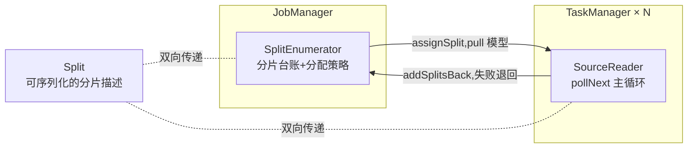
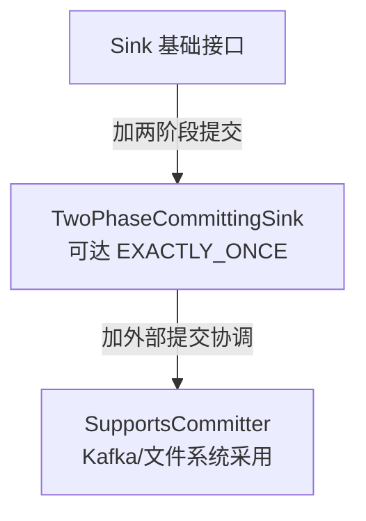

# 模块 07 · 连接器深度

> 覆盖章节:07-01 Kafka 语义矩阵 / 07-02 JDBC 双面 / 07-03 FileSink 物理层 / 07-04 自定义 Source(FLIP-27)/ 07-05 自定义 Sink(SinkV2)/ 07-06 upsert-kafka
> 配套实验:e07 × 8 · Level:L5

## 07-01 Kafka 语义矩阵

| 语义 | Source(消费侧影响) | Sink(投递侧行为) | 何时选 |
|---|---|---|---|
| NONE | 默认 offset 提交,可能重复消费 | 无事务,可能丢/重 | 纯技术指标,允许损耗 |
| AT_LEAST_ONCE | checkpoint 完成才提交 offset | flush 于 checkpoint,可能重复 | 下游可幂等的大多数场景(默认答案) |
| EXACTLY_ONCE | 同上 | 2PC 事务,不丢不重但可见性延迟 | 下游是计费/审计等不可重复场景 |

Source 侧的"恰好一次"其实靠**状态里记录的 offset + checkpoint 回放**天然获得,不需要额外配置;真正需要选择的是 **Sink 侧**投递语义(e07-C1)。超时不等式(docs/04-04)与 transactionalIdPrefix 命名规范是 EXACTLY_ONCE 的两条生死线。

## 07-02 JDBC 的双面:Sink 与 Source(Lookup)

作为 Sink:主键声明决定 upsert 还是 append-only insert——**流式作业写关系库,忘记声明主键是最常见的生产事故之一**(重复插入拖垮 DB)。作为 Source:JDBC 几乎只用于 Lookup Join(e07-C2),`lookup.cache=PARTIAL` 三参数(`max-rows`/`expire-after-write`/`expire-after-access`)决定"维度更新可见延迟"与"DB 点查压力"的权衡——无缓存 = 每条流数据一次 DB 查询,高流量下必打垮维表库。

## 07-03 FileSink 物理层与滚动策略

part 文件三态跃迁:`in-progress`(写入中)→`pending`(等 checkpoint 提交)→`finished`(下游批处理可读)。DefaultRollingPolicy 三闸门(大小/时间间隔/不活跃超时)任一满足即滚动(e07-C4)。**FileSink 天然依赖 checkpoint** 驱动 pending→finished 的跃迁——这是它与 e09 湖仓写入(Paimon/Iceberg 的 commit 机制)共享的底层物理假设。BucketAssigner(如按时间分桶)决定下游分区裁剪效率,是数据湖设计的第一道选择。

## 07-04 自定义 Source:FLIP-27 四部件

四部件(e07-C5):**Split**(分片描述,含读取进度字段,进度随对象一起被 checkpoint)、**SplitEnumerator**(JM 侧账房,pull 模型:reader 来要才分配)、**SourceReader**(TM 侧执行体,`pollNext` 由框架反复调用而非自起循环——天然获得背压与 checkpoint 能力)、**序列化器**(Split 与枚举器状态如何落盘)。这四部件的复杂版本就是 Kafka/CDC connector 的内部实现;理解了 RangeSource 的 100 行代码,就理解了官方连接器的骨架。

## 07-05 自定义 Sink:SinkV2 与语义台阶

`SinkWriter.flush(boolean endOfInput)` 在**每次 checkpoint 前**被调用——这是接口把"该吐了"的时机显式暴露给你(e07-C6),对比 e03-C5/e07-C7 手工用 `CheckpointedFunction` 自己维护攒批状态的方式,SinkV2 是官方标准化答案。选择台阶的依据只有一个问题:**下游允许重复吗**——允许→基础 Sink 够用;不允许→老老实实实现两阶段提交(参照 Kafka Sink 源码或 e04-C2 的 2PC 论证)。

## 07-06 upsert-kafka:回撤流的落地方案

解决 e05 遗留问题:回撤流(-U/+U/-D)不能写普通 Kafka topic。upsert-kafka 要求声明主键,编码规则:-U 被丢弃(减半流量,因为 +U 已含最新值)、+I/+U 编码为"当前值",-D 编码为 **value=null 的墓碑消息**(Kafka log compaction 的标准删除语义)。下游用 compacted topic 语义消费即重建"当前最新状态表"(e07-C8)——这正是 e08 CDC 整库同步落地 Kafka 中间层的标准做法。

## 知识总结 / 常见错误 / 企业实践 / 面试题 / 参考

**总结**:选连接器先问语义等级(丢/重/可见延迟)→ 再问状态代价(Lookup 缓存/FileSink 分桶)→ 官方没有才自定义(FLIP-27/SinkV2)。
**常见错**:JDBC Sink 忘声明主键;Lookup 缓存不设过期导致维度僵死;FileSink 不开 checkpoint 导致文件永远 pending;自定义 Sink 忘记 flush 的调用时机。
**企业实践**:connector 选型与语义登记进作业交付模板(templates/job-datastream);自定义 connector 需附四部件（或 SinkV2 台阶）设计说明书评审。
**面试**:e07/README 第 7 节四问。
**参考**:官方 Connectors 全章;DataStream API→User-defined Sources & Sinks;e07 十二个源码文件。
