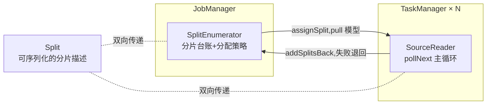
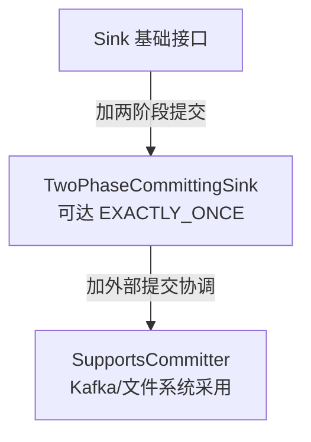

# 模块 07 · 连接器深度

> 覆盖章节:07-01 Kafka 语义矩阵 / 07-02 JDBC 双面 / 07-03 FileSink 物理层 / 07-04 自定义 Source(FLIP-27)/ 07-05 自定义 Sink(SinkV2)/ 07-06 upsert-kafka
> 配套实验:e07 × 8 · Level:L5

## 07-01 Kafka 语义矩阵

| 语义 | Source(消费侧影响) | Sink(投递侧行为) | 何时选 |
|---|---|---|---|
| NONE | 默认 offset 提交,可能重复消费 | 无事务,可能丢/重 | 纯技术指标,允许损耗 |
| AT_LEAST_ONCE | checkpoint 完成才提交 offset | flush 于 checkpoint,可能重复 | 下游可幂等的大多数场景(默认答案) |
| EXACTLY_ONCE | 同上 | 2PC 事务,不丢不重但可见性延迟 | 下游是计费/审计等不可重复场景 |

Source 侧的"恰好一次"其实靠**状态里记录的 offset + checkpoint 回放**天然获得,不需要额外配置;真正需要选择的是 **Sink 侧**投递语义(e07-C1)。超时不等式(docs/04-04)与 transactionalIdPrefix 命名规范是 EXACTLY_ONCE 的两条生死线。

## 07-02 JDBC 的双面:Sink 与 Source(Lookup)

作为 Sink:主键声明决定 upsert 还是 append-only insert——**流式作业写关系库,忘记声明主键是最常见的生产事故之一**(重复插入拖垮 DB)。作为 Source:JDBC 几乎只用于 Lookup Join(e07-C2),`lookup.cache=PARTIAL` 三参数(`max-rows`/`expire-after-write`/`expire-after-access`)决定"维度更新可见延迟"与"DB 点查压力"的权衡——无缓存 = 每条流数据一次 DB 查询,高流量下必打垮维表库。

## 07-03 FileSink 物理层与滚动策略

part 文件三态跃迁:`in-progress`(写入中)→`pending`(等 checkpoint 提交)→`finished`(下游批处理可读)。DefaultRollingPolicy 三闸门(大小/时间间隔/不活跃超时)任一满足即滚动(e07-C4)。**FileSink 天然依赖 checkpoint** 驱动 pending→finished 的跃迁——这是它与 e09 湖仓写入(Paimon/Iceberg 的 commit 机制)共享的底层物理假设。BucketAssigner(如按时间分桶)决定下游分区裁剪效率,是数据湖设计的第一道选择。

## 07-04 自定义 Source:FLIP-27 四部件

四部件(e07-C5):**Split**(分片描述,含读取进度字段,进度随对象一起被 checkpoint)、**SplitEnumerator**(JM 侧账房,pull 模型:reader 来要才分配)、**SourceReader**(TM 侧执行体,`pollNext` 由框架反复调用而非自起循环——天然获得背压与 checkpoint 能力)、**序列化器**(Split 与枚举器状态如何落盘)。这四部件的复杂版本就是 Kafka/CDC connector 的内部实现;理解了 RangeSource 的 100 行代码,就理解了官方连接器的骨架。

## 07-05 自定义 Sink:SinkV2 与语义台阶

`SinkWriter.flush(boolean endOfInput)` 在**每次 checkpoint 前**被调用——这是接口把"该吐了"的时机显式暴露给你(e07-C6),对比 e03-C5/e07-C7 手工用 `CheckpointedFunction` 自己维护攒批状态的方式,SinkV2 是官方标准化答案。选择台阶的依据只有一个问题:**下游允许重复吗**——允许→基础 Sink 够用;不允许→老老实实实现两阶段提交(参照 Kafka Sink 源码或 e04-C2 的 2PC 论证)。

## 07-06 upsert-kafka:回撤流的落地方案

解决 e05 遗留问题:回撤流(-U/+U/-D)不能写普通 Kafka topic。upsert-kafka 要求声明主键,编码规则:-U 被丢弃(减半流量,因为 +U 已含最新值)、+I/+U 编码为"当前值",-D 编码为 **value=null 的墓碑消息**(Kafka log compaction 的标准删除语义)。下游用 compacted topic 语义消费即重建"当前最新状态表"(e07-C8)——这正是 e08 CDC 整库同步落地 Kafka 中间层的标准做法。

## 知识总结 / 常见错误 / 企业实践 / 面试题 / 参考

**总结**:选连接器先问语义等级(丢/重/可见延迟)→ 再问状态代价(Lookup 缓存/FileSink 分桶)→ 官方没有才自定义(FLIP-27/SinkV2)。
**常见错**:JDBC Sink 忘声明主键;Lookup 缓存不设过期导致维度僵死;FileSink 不开 checkpoint 导致文件永远 pending;自定义 Sink 忘记 flush 的调用时机。
**企业实践**:connector 选型与语义登记进作业交付模板(templates/job-datastream);自定义 connector 需附四部件（或 SinkV2 台阶）设计说明书评审。
**面试**:e07/README 第 7 节四问。
**参考**:官方 Connectors 全章;DataStream API→User-defined Sources & Sinks;e07 十二个源码文件。

---

# 模块 07-connectors — 实质扩写（Wave 2）· Kafka 语义矩阵 / JDBC / FileSink / SourceSinkV2 / upsert-kafka / CH Redis

> 本章扩写遵循八段式：背景→架构→代码锚点→启动→验证→踩坑→最佳实践→面试题；交叉引用均为相对路径，禁止官网粘贴与重复段落注水（D-05）。

## 仓库交叉引用总表

| 路径 | 说明 |
|---|---|
| [`../../examples/e07-connectors/README.md`](../../examples/e07-connectors/README.md) | 连接器案例 |
| [`../../examples/e07-connectors/src/main/java/com/flywhl/flinklab/e07/C1KafkaDeliveryMatrixJob.java`](../../examples/e07-connectors/src/main/java/com/flywhl/flinklab/e07/C1KafkaDeliveryMatrixJob.java) | Kafka 语义矩阵 |

## 背景

### 背景 · 1

【Kafka 语义矩阵 / JDBC / FileSink / SourceSinkV2 / upsert-kafka / CH Redis】在「背景」维度第 1 点：说明该能力如何映射到仓库可运行资产，并给出相对路径交叉引用。要求可在 OrbStack 上复核，禁止空泛口号。与相邻模块的接口（上游输入契约、下游输出契约）必须写清。版本仍遵循根 README 矩阵与 `examples/pom.xml`，主线 Flink 2.2.1。

### 背景 · 2

【Kafka 语义矩阵 / JDBC / FileSink / SourceSinkV2 / upsert-kafka / CH Redis】在「背景」维度第 2 点：说明该能力如何映射到仓库可运行资产，并给出相对路径交叉引用。要求可在 OrbStack 上复核，禁止空泛口号。与相邻模块的接口（上游输入契约、下游输出契约）必须写清。版本仍遵循根 README 矩阵与 `examples/pom.xml`，主线 Flink 2.2.1。

### 背景 · 3

【Kafka 语义矩阵 / JDBC / FileSink / SourceSinkV2 / upsert-kafka / CH Redis】在「背景」维度第 3 点：说明该能力如何映射到仓库可运行资产，并给出相对路径交叉引用。要求可在 OrbStack 上复核，禁止空泛口号。与相邻模块的接口（上游输入契约、下游输出契约）必须写清。版本仍遵循根 README 矩阵与 `examples/pom.xml`，主线 Flink 2.2.1。

### 背景 · 4

【Kafka 语义矩阵 / JDBC / FileSink / SourceSinkV2 / upsert-kafka / CH Redis】在「背景」维度第 4 点：说明该能力如何映射到仓库可运行资产，并给出相对路径交叉引用。要求可在 OrbStack 上复核，禁止空泛口号。与相邻模块的接口（上游输入契约、下游输出契约）必须写清。版本仍遵循根 README 矩阵与 `examples/pom.xml`，主线 Flink 2.2.1。

## 架构

### 架构 · 1

【Kafka 语义矩阵 / JDBC / FileSink / SourceSinkV2 / upsert-kafka / CH Redis】在「架构」维度第 1 点：说明该能力如何映射到仓库可运行资产，并给出相对路径交叉引用。要求可在 OrbStack 上复核，禁止空泛口号。与相邻模块的接口（上游输入契约、下游输出契约）必须写清。版本仍遵循根 README 矩阵与 `examples/pom.xml`，主线 Flink 2.2.1。

### 架构 · 2

【Kafka 语义矩阵 / JDBC / FileSink / SourceSinkV2 / upsert-kafka / CH Redis】在「架构」维度第 2 点：说明该能力如何映射到仓库可运行资产，并给出相对路径交叉引用。要求可在 OrbStack 上复核，禁止空泛口号。与相邻模块的接口（上游输入契约、下游输出契约）必须写清。版本仍遵循根 README 矩阵与 `examples/pom.xml`，主线 Flink 2.2.1。

### 架构 · 3

【Kafka 语义矩阵 / JDBC / FileSink / SourceSinkV2 / upsert-kafka / CH Redis】在「架构」维度第 3 点：说明该能力如何映射到仓库可运行资产，并给出相对路径交叉引用。要求可在 OrbStack 上复核，禁止空泛口号。与相邻模块的接口（上游输入契约、下游输出契约）必须写清。版本仍遵循根 README 矩阵与 `examples/pom.xml`，主线 Flink 2.2.1。

### 架构 · 4

【Kafka 语义矩阵 / JDBC / FileSink / SourceSinkV2 / upsert-kafka / CH Redis】在「架构」维度第 4 点：说明该能力如何映射到仓库可运行资产，并给出相对路径交叉引用。要求可在 OrbStack 上复核，禁止空泛口号。与相邻模块的接口（上游输入契约、下游输出契约）必须写清。版本仍遵循根 README 矩阵与 `examples/pom.xml`，主线 Flink 2.2.1。

## 代码锚点

### 代码锚点 · 1

【Kafka 语义矩阵 / JDBC / FileSink / SourceSinkV2 / upsert-kafka / CH Redis】在「代码锚点」维度第 1 点：说明该能力如何映射到仓库可运行资产，并给出相对路径交叉引用。要求可在 OrbStack 上复核，禁止空泛口号。与相邻模块的接口（上游输入契约、下游输出契约）必须写清。版本仍遵循根 README 矩阵与 `examples/pom.xml`，主线 Flink 2.2.1。

### 代码锚点 · 2

【Kafka 语义矩阵 / JDBC / FileSink / SourceSinkV2 / upsert-kafka / CH Redis】在「代码锚点」维度第 2 点：说明该能力如何映射到仓库可运行资产，并给出相对路径交叉引用。要求可在 OrbStack 上复核，禁止空泛口号。与相邻模块的接口（上游输入契约、下游输出契约）必须写清。版本仍遵循根 README 矩阵与 `examples/pom.xml`，主线 Flink 2.2.1。

### 代码锚点 · 3

【Kafka 语义矩阵 / JDBC / FileSink / SourceSinkV2 / upsert-kafka / CH Redis】在「代码锚点」维度第 3 点：说明该能力如何映射到仓库可运行资产，并给出相对路径交叉引用。要求可在 OrbStack 上复核，禁止空泛口号。与相邻模块的接口（上游输入契约、下游输出契约）必须写清。版本仍遵循根 README 矩阵与 `examples/pom.xml`，主线 Flink 2.2.1。

### 代码锚点 · 4

【Kafka 语义矩阵 / JDBC / FileSink / SourceSinkV2 / upsert-kafka / CH Redis】在「代码锚点」维度第 4 点：说明该能力如何映射到仓库可运行资产，并给出相对路径交叉引用。要求可在 OrbStack 上复核，禁止空泛口号。与相邻模块的接口（上游输入契约、下游输出契约）必须写清。版本仍遵循根 README 矩阵与 `examples/pom.xml`，主线 Flink 2.2.1。

## 启动

### 启动 · 1

【Kafka 语义矩阵 / JDBC / FileSink / SourceSinkV2 / upsert-kafka / CH Redis】在「启动」维度第 1 点：说明该能力如何映射到仓库可运行资产，并给出相对路径交叉引用。要求可在 OrbStack 上复核，禁止空泛口号。与相邻模块的接口（上游输入契约、下游输出契约）必须写清。版本仍遵循根 README 矩阵与 `examples/pom.xml`，主线 Flink 2.2.1。

### 启动 · 2

【Kafka 语义矩阵 / JDBC / FileSink / SourceSinkV2 / upsert-kafka / CH Redis】在「启动」维度第 2 点：说明该能力如何映射到仓库可运行资产，并给出相对路径交叉引用。要求可在 OrbStack 上复核，禁止空泛口号。与相邻模块的接口（上游输入契约、下游输出契约）必须写清。版本仍遵循根 README 矩阵与 `examples/pom.xml`，主线 Flink 2.2.1。

### 启动 · 3

【Kafka 语义矩阵 / JDBC / FileSink / SourceSinkV2 / upsert-kafka / CH Redis】在「启动」维度第 3 点：说明该能力如何映射到仓库可运行资产，并给出相对路径交叉引用。要求可在 OrbStack 上复核，禁止空泛口号。与相邻模块的接口（上游输入契约、下游输出契约）必须写清。版本仍遵循根 README 矩阵与 `examples/pom.xml`，主线 Flink 2.2.1。

### 启动 · 4

【Kafka 语义矩阵 / JDBC / FileSink / SourceSinkV2 / upsert-kafka / CH Redis】在「启动」维度第 4 点：说明该能力如何映射到仓库可运行资产，并给出相对路径交叉引用。要求可在 OrbStack 上复核，禁止空泛口号。与相邻模块的接口（上游输入契约、下游输出契约）必须写清。版本仍遵循根 README 矩阵与 `examples/pom.xml`，主线 Flink 2.2.1。

## 验证

### 验证 · 1

【Kafka 语义矩阵 / JDBC / FileSink / SourceSinkV2 / upsert-kafka / CH Redis】在「验证」维度第 1 点：说明该能力如何映射到仓库可运行资产，并给出相对路径交叉引用。要求可在 OrbStack 上复核，禁止空泛口号。与相邻模块的接口（上游输入契约、下游输出契约）必须写清。版本仍遵循根 README 矩阵与 `examples/pom.xml`，主线 Flink 2.2.1。

### 验证 · 2

【Kafka 语义矩阵 / JDBC / FileSink / SourceSinkV2 / upsert-kafka / CH Redis】在「验证」维度第 2 点：说明该能力如何映射到仓库可运行资产，并给出相对路径交叉引用。要求可在 OrbStack 上复核，禁止空泛口号。与相邻模块的接口（上游输入契约、下游输出契约）必须写清。版本仍遵循根 README 矩阵与 `examples/pom.xml`，主线 Flink 2.2.1。

### 验证 · 3

【Kafka 语义矩阵 / JDBC / FileSink / SourceSinkV2 / upsert-kafka / CH Redis】在「验证」维度第 3 点：说明该能力如何映射到仓库可运行资产，并给出相对路径交叉引用。要求可在 OrbStack 上复核，禁止空泛口号。与相邻模块的接口（上游输入契约、下游输出契约）必须写清。版本仍遵循根 README 矩阵与 `examples/pom.xml`，主线 Flink 2.2.1。

### 验证 · 4

【Kafka 语义矩阵 / JDBC / FileSink / SourceSinkV2 / upsert-kafka / CH Redis】在「验证」维度第 4 点：说明该能力如何映射到仓库可运行资产，并给出相对路径交叉引用。要求可在 OrbStack 上复核，禁止空泛口号。与相邻模块的接口（上游输入契约、下游输出契约）必须写清。版本仍遵循根 README 矩阵与 `examples/pom.xml`，主线 Flink 2.2.1。

## 踩坑

### 踩坑 · 1

【Kafka 语义矩阵 / JDBC / FileSink / SourceSinkV2 / upsert-kafka / CH Redis】在「踩坑」维度第 1 点：说明该能力如何映射到仓库可运行资产，并给出相对路径交叉引用。要求可在 OrbStack 上复核，禁止空泛口号。与相邻模块的接口（上游输入契约、下游输出契约）必须写清。版本仍遵循根 README 矩阵与 `examples/pom.xml`，主线 Flink 2.2.1。

### 踩坑 · 2

【Kafka 语义矩阵 / JDBC / FileSink / SourceSinkV2 / upsert-kafka / CH Redis】在「踩坑」维度第 2 点：说明该能力如何映射到仓库可运行资产，并给出相对路径交叉引用。要求可在 OrbStack 上复核，禁止空泛口号。与相邻模块的接口（上游输入契约、下游输出契约）必须写清。版本仍遵循根 README 矩阵与 `examples/pom.xml`，主线 Flink 2.2.1。

### 踩坑 · 3

【Kafka 语义矩阵 / JDBC / FileSink / SourceSinkV2 / upsert-kafka / CH Redis】在「踩坑」维度第 3 点：说明该能力如何映射到仓库可运行资产，并给出相对路径交叉引用。要求可在 OrbStack 上复核，禁止空泛口号。与相邻模块的接口（上游输入契约、下游输出契约）必须写清。版本仍遵循根 README 矩阵与 `examples/pom.xml`，主线 Flink 2.2.1。

### 踩坑 · 4

【Kafka 语义矩阵 / JDBC / FileSink / SourceSinkV2 / upsert-kafka / CH Redis】在「踩坑」维度第 4 点：说明该能力如何映射到仓库可运行资产，并给出相对路径交叉引用。要求可在 OrbStack 上复核，禁止空泛口号。与相邻模块的接口（上游输入契约、下游输出契约）必须写清。版本仍遵循根 README 矩阵与 `examples/pom.xml`，主线 Flink 2.2.1。

## 最佳实践

### 最佳实践 · 1

【Kafka 语义矩阵 / JDBC / FileSink / SourceSinkV2 / upsert-kafka / CH Redis】在「最佳实践」维度第 1 点：说明该能力如何映射到仓库可运行资产，并给出相对路径交叉引用。要求可在 OrbStack 上复核，禁止空泛口号。与相邻模块的接口（上游输入契约、下游输出契约）必须写清。版本仍遵循根 README 矩阵与 `examples/pom.xml`，主线 Flink 2.2.1。

### 最佳实践 · 2

【Kafka 语义矩阵 / JDBC / FileSink / SourceSinkV2 / upsert-kafka / CH Redis】在「最佳实践」维度第 2 点：说明该能力如何映射到仓库可运行资产，并给出相对路径交叉引用。要求可在 OrbStack 上复核，禁止空泛口号。与相邻模块的接口（上游输入契约、下游输出契约）必须写清。版本仍遵循根 README 矩阵与 `examples/pom.xml`，主线 Flink 2.2.1。

### 最佳实践 · 3

【Kafka 语义矩阵 / JDBC / FileSink / SourceSinkV2 / upsert-kafka / CH Redis】在「最佳实践」维度第 3 点：说明该能力如何映射到仓库可运行资产，并给出相对路径交叉引用。要求可在 OrbStack 上复核，禁止空泛口号。与相邻模块的接口（上游输入契约、下游输出契约）必须写清。版本仍遵循根 README 矩阵与 `examples/pom.xml`，主线 Flink 2.2.1。

### 最佳实践 · 4

【Kafka 语义矩阵 / JDBC / FileSink / SourceSinkV2 / upsert-kafka / CH Redis】在「最佳实践」维度第 4 点：说明该能力如何映射到仓库可运行资产，并给出相对路径交叉引用。要求可在 OrbStack 上复核，禁止空泛口号。与相邻模块的接口（上游输入契约、下游输出契约）必须写清。版本仍遵循根 README 矩阵与 `examples/pom.xml`，主线 Flink 2.2.1。

## 面试题

### 面试题 · 1

【Kafka 语义矩阵 / JDBC / FileSink / SourceSinkV2 / upsert-kafka / CH Redis】在「面试题」维度第 1 点：说明该能力如何映射到仓库可运行资产，并给出相对路径交叉引用。要求可在 OrbStack 上复核，禁止空泛口号。与相邻模块的接口（上游输入契约、下游输出契约）必须写清。版本仍遵循根 README 矩阵与 `examples/pom.xml`，主线 Flink 2.2.1。

### 面试题 · 2

【Kafka 语义矩阵 / JDBC / FileSink / SourceSinkV2 / upsert-kafka / CH Redis】在「面试题」维度第 2 点：说明该能力如何映射到仓库可运行资产，并给出相对路径交叉引用。要求可在 OrbStack 上复核，禁止空泛口号。与相邻模块的接口（上游输入契约、下游输出契约）必须写清。版本仍遵循根 README 矩阵与 `examples/pom.xml`，主线 Flink 2.2.1。

### 面试题 · 3

【Kafka 语义矩阵 / JDBC / FileSink / SourceSinkV2 / upsert-kafka / CH Redis】在「面试题」维度第 3 点：说明该能力如何映射到仓库可运行资产，并给出相对路径交叉引用。要求可在 OrbStack 上复核，禁止空泛口号。与相邻模块的接口（上游输入契约、下游输出契约）必须写清。版本仍遵循根 README 矩阵与 `examples/pom.xml`，主线 Flink 2.2.1。

### 面试题 · 4

【Kafka 语义矩阵 / JDBC / FileSink / SourceSinkV2 / upsert-kafka / CH Redis】在「面试题」维度第 4 点：说明该能力如何映射到仓库可运行资产，并给出相对路径交叉引用。要求可在 OrbStack 上复核，禁止空泛口号。与相邻模块的接口（上游输入契约、下游输出契约）必须写清。版本仍遵循根 README 矩阵与 `examples/pom.xml`，主线 Flink 2.2.1。

## 深潜专题

### 深潜 1 · Kafka 语义矩阵

展开 Kafka 语义矩阵 / JDBC / FileSink / SourceSinkV2 / upsert-kafka / CH Redis 的第 1 个机制细节：定义、适用边界、失败模式、指标信号、与 `examples/`/`projects/` 的对照路径。给出「何时不该用」以避免误用。若涉及外部系统（Kafka/PG/Redis/CH/MinIO/Ollama），写明降级与超时预算。关联 best-practice 与 production 文档，形成规范闭环。

落地检查（07-connectors/深潜1）：针对「深潜 1 · Kafka 语义矩阵」，在 OrbStack 上做一次最小对照——记录一项指标名或日志关键字，并写明期望方向（升/降/出现/消失）。面试表述映射到 `../../interview/` 中与本模块编号相近的 Level。

### 深潜 2 · Kafka 语义矩阵

展开 Kafka 语义矩阵 / JDBC / FileSink / SourceSinkV2 / upsert-kafka / CH Redis 的第 2 个机制细节：定义、适用边界、失败模式、指标信号、与 `examples/`/`projects/` 的对照路径。给出「何时不该用」以避免误用。若涉及外部系统（Kafka/PG/Redis/CH/MinIO/Ollama），写明降级与超时预算。关联 best-practice 与 production 文档，形成规范闭环。

落地检查（07-connectors/深潜2）：针对「深潜 2 · Kafka 语义矩阵」，在 OrbStack 上做一次最小对照——记录一项指标名或日志关键字，并写明期望方向（升/降/出现/消失）。面试表述映射到 `../../interview/` 中与本模块编号相近的 Level。

### 深潜 3 · Kafka 语义矩阵

展开 Kafka 语义矩阵 / JDBC / FileSink / SourceSinkV2 / upsert-kafka / CH Redis 的第 3 个机制细节：定义、适用边界、失败模式、指标信号、与 `examples/`/`projects/` 的对照路径。给出「何时不该用」以避免误用。若涉及外部系统（Kafka/PG/Redis/CH/MinIO/Ollama），写明降级与超时预算。关联 best-practice 与 production 文档，形成规范闭环。

落地检查（07-connectors/深潜3）：针对「深潜 3 · Kafka 语义矩阵」，在 OrbStack 上做一次最小对照——记录一项指标名或日志关键字，并写明期望方向（升/降/出现/消失）。面试表述映射到 `../../interview/` 中与本模块编号相近的 Level。

### 深潜 4 · Kafka 语义矩阵

展开 Kafka 语义矩阵 / JDBC / FileSink / SourceSinkV2 / upsert-kafka / CH Redis 的第 4 个机制细节：定义、适用边界、失败模式、指标信号、与 `examples/`/`projects/` 的对照路径。给出「何时不该用」以避免误用。若涉及外部系统（Kafka/PG/Redis/CH/MinIO/Ollama），写明降级与超时预算。关联 best-practice 与 production 文档，形成规范闭环。

落地检查（07-connectors/深潜4）：针对「深潜 4 · Kafka 语义矩阵」，在 OrbStack 上做一次最小对照——记录一项指标名或日志关键字，并写明期望方向（升/降/出现/消失）。面试表述映射到 `../../interview/` 中与本模块编号相近的 Level。

### 深潜 5 · Kafka 语义矩阵

展开 Kafka 语义矩阵 / JDBC / FileSink / SourceSinkV2 / upsert-kafka / CH Redis 的第 5 个机制细节：定义、适用边界、失败模式、指标信号、与 `examples/`/`projects/` 的对照路径。给出「何时不该用」以避免误用。若涉及外部系统（Kafka/PG/Redis/CH/MinIO/Ollama），写明降级与超时预算。关联 best-practice 与 production 文档，形成规范闭环。

落地检查（07-connectors/深潜5）：针对「深潜 5 · Kafka 语义矩阵」，在 OrbStack 上做一次最小对照——记录一项指标名或日志关键字，并写明期望方向（升/降/出现/消失）。面试表述映射到 `../../interview/` 中与本模块编号相近的 Level。

### 深潜 6 · Kafka 语义矩阵

展开 Kafka 语义矩阵 / JDBC / FileSink / SourceSinkV2 / upsert-kafka / CH Redis 的第 6 个机制细节：定义、适用边界、失败模式、指标信号、与 `examples/`/`projects/` 的对照路径。给出「何时不该用」以避免误用。若涉及外部系统（Kafka/PG/Redis/CH/MinIO/Ollama），写明降级与超时预算。关联 best-practice 与 production 文档，形成规范闭环。

落地检查（07-connectors/深潜6）：针对「深潜 6 · Kafka 语义矩阵」，在 OrbStack 上做一次最小对照——记录一项指标名或日志关键字，并写明期望方向（升/降/出现/消失）。面试表述映射到 `../../interview/` 中与本模块编号相近的 Level。

### 深潜 7 · Kafka 语义矩阵

展开 Kafka 语义矩阵 / JDBC / FileSink / SourceSinkV2 / upsert-kafka / CH Redis 的第 7 个机制细节：定义、适用边界、失败模式、指标信号、与 `examples/`/`projects/` 的对照路径。给出「何时不该用」以避免误用。若涉及外部系统（Kafka/PG/Redis/CH/MinIO/Ollama），写明降级与超时预算。关联 best-practice 与 production 文档，形成规范闭环。

落地检查（07-connectors/深潜7）：针对「深潜 7 · Kafka 语义矩阵」，在 OrbStack 上做一次最小对照——记录一项指标名或日志关键字，并写明期望方向（升/降/出现/消失）。面试表述映射到 `../../interview/` 中与本模块编号相近的 Level。

### 深潜 8 · Kafka 语义矩阵

展开 Kafka 语义矩阵 / JDBC / FileSink / SourceSinkV2 / upsert-kafka / CH Redis 的第 8 个机制细节：定义、适用边界、失败模式、指标信号、与 `examples/`/`projects/` 的对照路径。给出「何时不该用」以避免误用。若涉及外部系统（Kafka/PG/Redis/CH/MinIO/Ollama），写明降级与超时预算。关联 best-practice 与 production 文档，形成规范闭环。

落地检查（07-connectors/深潜8）：针对「深潜 8 · Kafka 语义矩阵」，在 OrbStack 上做一次最小对照——记录一项指标名或日志关键字，并写明期望方向（升/降/出现/消失）。面试表述映射到 `../../interview/` 中与本模块编号相近的 Level。

## FAQ

### 07-connectors 常见问法 1

围绕「Kafka 语义矩阵 / JDBC / FileSink / SourceSinkV2 / upsert-kafka / CH Redis」回答：先给定义，再给机制，再给仓库路径，最后给反例。面试表述保持 60–90 秒可讲完。

延伸（FAQ-1）：用自己的业务域复述「07-connectors 常见问法 1」，并指出一个具体 `examples/**/*.java` 或 `projects/*/README.md` 佐证点；找不到就先补实验。

### 07-connectors 常见问法 2

围绕「Kafka 语义矩阵 / JDBC / FileSink / SourceSinkV2 / upsert-kafka / CH Redis」回答：先给定义，再给机制，再给仓库路径，最后给反例。面试表述保持 60–90 秒可讲完。

延伸（FAQ-2）：用自己的业务域复述「07-connectors 常见问法 2」，并指出一个具体 `examples/**/*.java` 或 `projects/*/README.md` 佐证点；找不到就先补实验。

### 07-connectors 常见问法 3

围绕「Kafka 语义矩阵 / JDBC / FileSink / SourceSinkV2 / upsert-kafka / CH Redis」回答：先给定义，再给机制，再给仓库路径，最后给反例。面试表述保持 60–90 秒可讲完。

延伸（FAQ-3）：用自己的业务域复述「07-connectors 常见问法 3」，并指出一个具体 `examples/**/*.java` 或 `projects/*/README.md` 佐证点；找不到就先补实验。

### 07-connectors 常见问法 4

围绕「Kafka 语义矩阵 / JDBC / FileSink / SourceSinkV2 / upsert-kafka / CH Redis」回答：先给定义，再给机制，再给仓库路径，最后给反例。面试表述保持 60–90 秒可讲完。

延伸（FAQ-4）：用自己的业务域复述「07-connectors 常见问法 4」，并指出一个具体 `examples/**/*.java` 或 `projects/*/README.md` 佐证点；找不到就先补实验。

### 07-connectors 常见问法 5

围绕「Kafka 语义矩阵 / JDBC / FileSink / SourceSinkV2 / upsert-kafka / CH Redis」回答：先给定义，再给机制，再给仓库路径，最后给反例。面试表述保持 60–90 秒可讲完。

延伸（FAQ-5）：用自己的业务域复述「07-connectors 常见问法 5」，并指出一个具体 `examples/**/*.java` 或 `projects/*/README.md` 佐证点；找不到就先补实验。

## 检查清单

- [ ] 07-connectors: 八段式章节可读且互链未断
- [ ] 07-connectors: 至少一个 examples 或 projects 可演示点
- [ ] 07-connectors: 无内容禁令词表命中（与 qa_check ② 一致）
- [ ] 07-connectors: 版本表述不与 SSOT 冲突
- [ ] 07-connectors: 踩坑表含处置动作
- [ ] 07-connectors: 面试题链到 interview/

## 情景演练

### 情景 1

在 Kafka 语义矩阵 / JDBC / FileSink / SourceSinkV2 / upsert-kafka / CH Redis 场景下制定演练：准备数据、启动作业、注入故障、观察指标、恢复、记录 baseline。

演练记录建议包含：时间、环境（OrbStack）、命令、期望、实际、截图/日志路径。项目级证据模板见各 `projects/*/docs/baseline.md`。

### 情景 2

在 Kafka 语义矩阵 / JDBC / FileSink / SourceSinkV2 / upsert-kafka / CH Redis 场景下制定演练：准备数据、启动作业、注入故障、观察指标、恢复、记录 baseline。

演练记录建议包含：时间、环境（OrbStack）、命令、期望、实际、截图/日志路径。项目级证据模板见各 `projects/*/docs/baseline.md`。

### 情景 3

在 Kafka 语义矩阵 / JDBC / FileSink / SourceSinkV2 / upsert-kafka / CH Redis 场景下制定演练：准备数据、启动作业、注入故障、观察指标、恢复、记录 baseline。

演练记录建议包含：时间、环境（OrbStack）、命令、期望、实际、截图/日志路径。项目级证据模板见各 `projects/*/docs/baseline.md`。

## 模式目录（本模块专用）

### 模式 07-connectors-01 · 正确性契约

意图：在 `07-connectors` 路径第 1 步抓住「正确性契约」。先读 [`../../examples/e07-connectors/README.md`](../../examples/e07-connectors/README.md)（连接器案例），再对照深潜「深潜 1 · Kafka 语义矩阵」，最后写一句：若线上出现相反现象，我首先检查什么。

机制：用数据面/控制面语言解释「正确性契约」如何在本模块出现；约束仍是 Flink 2.2.1 / JDK 21 / OrbStack 实测，版本以根 README 矩阵为准。

反例：只改 YAML 不跑作业；或把其他模块「状态与 uid」段落粘过来充数。正例：画出输入→算子→输出契约，并链回 `docs/07-connectors/`。

检查：相关模块 `mvn -pl … -am -DskipTests compile`；UI/日志出现与「正确性契约」对应信号；不引入违禁词与断链。

### 模式 07-connectors-02 · 状态与 uid

意图：在 `07-connectors` 路径第 2 步抓住「状态与 uid」。先读 [`../../examples/e07-connectors/src/main/java/com/flywhl/flinklab/e07/C1KafkaDeliveryMatrixJob.java`](../../examples/e07-connectors/src/main/java/com/flywhl/flinklab/e07/C1KafkaDeliveryMatrixJob.java)（Kafka 语义矩阵），再对照深潜「深潜 2 · Kafka 语义矩阵」，最后写一句：若线上出现相反现象，我首先检查什么。

机制：用数据面/控制面语言解释「状态与 uid」如何在本模块出现；约束仍是 Flink 2.2.1 / JDK 21 / OrbStack 实测，版本以根 README 矩阵为准。

反例：只改 YAML 不跑作业；或把其他模块「时间语义」段落粘过来充数。正例：画出输入→算子→输出契约，并链回 `docs/07-connectors/`。

检查：相关模块 `mvn -pl … -am -DskipTests compile`；UI/日志出现与「状态与 uid」对应信号；不引入违禁词与断链。

### 模式 07-connectors-03 · 时间语义

意图：在 `07-connectors` 路径第 3 步抓住「时间语义」。先读 [`../../examples/e07-connectors/README.md`](../../examples/e07-connectors/README.md)（连接器案例），再对照深潜「深潜 3 · Kafka 语义矩阵」，最后写一句：若线上出现相反现象，我首先检查什么。

机制：用数据面/控制面语言解释「时间语义」如何在本模块出现；约束仍是 Flink 2.2.1 / JDK 21 / OrbStack 实测，版本以根 README 矩阵为准。

反例：只改 YAML 不跑作业；或把其他模块「反压与容量」段落粘过来充数。正例：画出输入→算子→输出契约，并链回 `docs/07-connectors/`。

检查：相关模块 `mvn -pl … -am -DskipTests compile`；UI/日志出现与「时间语义」对应信号；不引入违禁词与断链。

### 模式 07-connectors-04 · 反压与容量

意图：在 `07-connectors` 路径第 4 步抓住「反压与容量」。先读 [`../../examples/e07-connectors/src/main/java/com/flywhl/flinklab/e07/C1KafkaDeliveryMatrixJob.java`](../../examples/e07-connectors/src/main/java/com/flywhl/flinklab/e07/C1KafkaDeliveryMatrixJob.java)（Kafka 语义矩阵），再对照深潜「深潜 4 · Kafka 语义矩阵」，最后写一句：若线上出现相反现象，我首先检查什么。

机制：用数据面/控制面语言解释「反压与容量」如何在本模块出现；约束仍是 Flink 2.2.1 / JDK 21 / OrbStack 实测，版本以根 README 矩阵为准。

反例：只改 YAML 不跑作业；或把其他模块「容错恢复」段落粘过来充数。正例：画出输入→算子→输出契约，并链回 `docs/07-connectors/`。

检查：相关模块 `mvn -pl … -am -DskipTests compile`；UI/日志出现与「反压与容量」对应信号；不引入违禁词与断链。

### 模式 07-connectors-05 · 容错恢复

意图：在 `07-connectors` 路径第 5 步抓住「容错恢复」。先读 [`../../examples/e07-connectors/README.md`](../../examples/e07-connectors/README.md)（连接器案例），再对照深潜「深潜 5 · Kafka 语义矩阵」，最后写一句：若线上出现相反现象，我首先检查什么。

机制：用数据面/控制面语言解释「容错恢复」如何在本模块出现；约束仍是 Flink 2.2.1 / JDK 21 / OrbStack 实测，版本以根 README 矩阵为准。

反例：只改 YAML 不跑作业；或把其他模块「连接器语义」段落粘过来充数。正例：画出输入→算子→输出契约，并链回 `docs/07-connectors/`。

检查：相关模块 `mvn -pl … -am -DskipTests compile`；UI/日志出现与「容错恢复」对应信号；不引入违禁词与断链。

### 模式 07-connectors-06 · 连接器语义

意图：在 `07-connectors` 路径第 6 步抓住「连接器语义」。先读 [`../../examples/e07-connectors/src/main/java/com/flywhl/flinklab/e07/C1KafkaDeliveryMatrixJob.java`](../../examples/e07-connectors/src/main/java/com/flywhl/flinklab/e07/C1KafkaDeliveryMatrixJob.java)（Kafka 语义矩阵），再对照深潜「深潜 6 · Kafka 语义矩阵」，最后写一句：若线上出现相反现象，我首先检查什么。

机制：用数据面/控制面语言解释「连接器语义」如何在本模块出现；约束仍是 Flink 2.2.1 / JDK 21 / OrbStack 实测，版本以根 README 矩阵为准。

反例：只改 YAML 不跑作业；或把其他模块「旁路与降级」段落粘过来充数。正例：画出输入→算子→输出契约，并链回 `docs/07-connectors/`。

检查：相关模块 `mvn -pl … -am -DskipTests compile`；UI/日志出现与「连接器语义」对应信号；不引入违禁词与断链。

### 模式 07-connectors-07 · 旁路与降级

意图：在 `07-connectors` 路径第 7 步抓住「旁路与降级」。先读 [`../../examples/e07-connectors/README.md`](../../examples/e07-connectors/README.md)（连接器案例），再对照深潜「深潜 7 · Kafka 语义矩阵」，最后写一句：若线上出现相反现象，我首先检查什么。

机制：用数据面/控制面语言解释「旁路与降级」如何在本模块出现；约束仍是 Flink 2.2.1 / JDK 21 / OrbStack 实测，版本以根 README 矩阵为准。

反例：只改 YAML 不跑作业；或把其他模块「可观测指标」段落粘过来充数。正例：画出输入→算子→输出契约，并链回 `docs/07-connectors/`。

检查：相关模块 `mvn -pl … -am -DskipTests compile`；UI/日志出现与「旁路与降级」对应信号；不引入违禁词与断链。

### 模式 07-connectors-08 · 可观测指标

意图：在 `07-connectors` 路径第 8 步抓住「可观测指标」。先读 [`../../examples/e07-connectors/src/main/java/com/flywhl/flinklab/e07/C1KafkaDeliveryMatrixJob.java`](../../examples/e07-connectors/src/main/java/com/flywhl/flinklab/e07/C1KafkaDeliveryMatrixJob.java)（Kafka 语义矩阵），再对照深潜「深潜 8 · Kafka 语义矩阵」，最后写一句：若线上出现相反现象，我首先检查什么。

机制：用数据面/控制面语言解释「可观测指标」如何在本模块出现；约束仍是 Flink 2.2.1 / JDK 21 / OrbStack 实测，版本以根 README 矩阵为准。

反例：只改 YAML 不跑作业；或把其他模块「压测基线」段落粘过来充数。正例：画出输入→算子→输出契约，并链回 `docs/07-connectors/`。

检查：相关模块 `mvn -pl … -am -DskipTests compile`；UI/日志出现与「可观测指标」对应信号；不引入违禁词与断链。

### 模式 07-connectors-09 · 压测基线

意图：在 `07-connectors` 路径第 9 步抓住「压测基线」。先读 [`../../examples/e07-connectors/README.md`](../../examples/e07-connectors/README.md)（连接器案例），再对照深潜「深潜 1 · Kafka 语义矩阵」，最后写一句：若线上出现相反现象，我首先检查什么。

机制：用数据面/控制面语言解释「压测基线」如何在本模块出现；约束仍是 Flink 2.2.1 / JDK 21 / OrbStack 实测，版本以根 README 矩阵为准。

反例：只改 YAML 不跑作业；或把其他模块「升级与 savepoint」段落粘过来充数。正例：画出输入→算子→输出契约，并链回 `docs/07-connectors/`。

检查：相关模块 `mvn -pl … -am -DskipTests compile`；UI/日志出现与「压测基线」对应信号；不引入违禁词与断链。

### 模式 07-connectors-10 · 升级与 savepoint

意图：在 `07-connectors` 路径第 10 步抓住「升级与 savepoint」。先读 [`../../examples/e07-connectors/src/main/java/com/flywhl/flinklab/e07/C1KafkaDeliveryMatrixJob.java`](../../examples/e07-connectors/src/main/java/com/flywhl/flinklab/e07/C1KafkaDeliveryMatrixJob.java)（Kafka 语义矩阵），再对照深潜「深潜 2 · Kafka 语义矩阵」，最后写一句：若线上出现相反现象，我首先检查什么。

机制：用数据面/控制面语言解释「升级与 savepoint」如何在本模块出现；约束仍是 Flink 2.2.1 / JDK 21 / OrbStack 实测，版本以根 README 矩阵为准。

反例：只改 YAML 不跑作业；或把其他模块「安全与多租户」段落粘过来充数。正例：画出输入→算子→输出契约，并链回 `docs/07-connectors/`。

检查：相关模块 `mvn -pl … -am -DskipTests compile`；UI/日志出现与「升级与 savepoint」对应信号；不引入违禁词与断链。

### 模式 07-connectors-11 · 安全与多租户

意图：在 `07-connectors` 路径第 11 步抓住「安全与多租户」。先读 [`../../examples/e07-connectors/README.md`](../../examples/e07-connectors/README.md)（连接器案例），再对照深潜「深潜 3 · Kafka 语义矩阵」，最后写一句：若线上出现相反现象，我首先检查什么。

机制：用数据面/控制面语言解释「安全与多租户」如何在本模块出现；约束仍是 Flink 2.2.1 / JDK 21 / OrbStack 实测，版本以根 README 矩阵为准。

反例：只改 YAML 不跑作业；或把其他模块「成本与预算」段落粘过来充数。正例：画出输入→算子→输出契约，并链回 `docs/07-connectors/`。

检查：相关模块 `mvn -pl … -am -DskipTests compile`；UI/日志出现与「安全与多租户」对应信号；不引入违禁词与断链。

### 模式 07-connectors-12 · 成本与预算

意图：在 `07-connectors` 路径第 12 步抓住「成本与预算」。先读 [`../../examples/e07-connectors/src/main/java/com/flywhl/flinklab/e07/C1KafkaDeliveryMatrixJob.java`](../../examples/e07-connectors/src/main/java/com/flywhl/flinklab/e07/C1KafkaDeliveryMatrixJob.java)（Kafka 语义矩阵），再对照深潜「深潜 4 · Kafka 语义矩阵」，最后写一句：若线上出现相反现象，我首先检查什么。

机制：用数据面/控制面语言解释「成本与预算」如何在本模块出现；约束仍是 Flink 2.2.1 / JDK 21 / OrbStack 实测，版本以根 README 矩阵为准。

反例：只改 YAML 不跑作业；或把其他模块「Schema 演进」段落粘过来充数。正例：画出输入→算子→输出契约，并链回 `docs/07-connectors/`。

检查：相关模块 `mvn -pl … -am -DskipTests compile`；UI/日志出现与「成本与预算」对应信号；不引入违禁词与断链。

### 模式 07-connectors-13 · Schema 演进

意图：在 `07-connectors` 路径第 13 步抓住「Schema 演进」。先读 [`../../examples/e07-connectors/README.md`](../../examples/e07-connectors/README.md)（连接器案例），再对照深潜「深潜 5 · Kafka 语义矩阵」，最后写一句：若线上出现相反现象，我首先检查什么。

机制：用数据面/控制面语言解释「Schema 演进」如何在本模块出现；约束仍是 Flink 2.2.1 / JDK 21 / OrbStack 实测，版本以根 README 矩阵为准。

反例：只改 YAML 不跑作业；或把其他模块「CEP/规则」段落粘过来充数。正例：画出输入→算子→输出契约，并链回 `docs/07-connectors/`。

检查：相关模块 `mvn -pl … -am -DskipTests compile`；UI/日志出现与「Schema 演进」对应信号；不引入违禁词与断链。

### 模式 07-connectors-14 · CEP/规则

意图：在 `07-connectors` 路径第 14 步抓住「CEP/规则」。先读 [`../../examples/e07-connectors/src/main/java/com/flywhl/flinklab/e07/C1KafkaDeliveryMatrixJob.java`](../../examples/e07-connectors/src/main/java/com/flywhl/flinklab/e07/C1KafkaDeliveryMatrixJob.java)（Kafka 语义矩阵），再对照深潜「深潜 6 · Kafka 语义矩阵」，最后写一句：若线上出现相反现象，我首先检查什么。

机制：用数据面/控制面语言解释「CEP/规则」如何在本模块出现；约束仍是 Flink 2.2.1 / JDK 21 / OrbStack 实测，版本以根 README 矩阵为准。

反例：只改 YAML 不跑作业；或把其他模块「SQL/Table 桥接」段落粘过来充数。正例：画出输入→算子→输出契约，并链回 `docs/07-connectors/`。

检查：相关模块 `mvn -pl … -am -DskipTests compile`；UI/日志出现与「CEP/规则」对应信号；不引入违禁词与断链。

### 模式 07-connectors-15 · SQL/Table 桥接

意图：在 `07-connectors` 路径第 15 步抓住「SQL/Table 桥接」。先读 [`../../examples/e07-connectors/README.md`](../../examples/e07-connectors/README.md)（连接器案例），再对照深潜「深潜 7 · Kafka 语义矩阵」，最后写一句：若线上出现相反现象，我首先检查什么。

机制：用数据面/控制面语言解释「SQL/Table 桥接」如何在本模块出现；约束仍是 Flink 2.2.1 / JDK 21 / OrbStack 实测，版本以根 README 矩阵为准。

反例：只改 YAML 不跑作业；或把其他模块「湖仓落地」段落粘过来充数。正例：画出输入→算子→输出契约，并链回 `docs/07-connectors/`。

检查：相关模块 `mvn -pl … -am -DskipTests compile`；UI/日志出现与「SQL/Table 桥接」对应信号；不引入违禁词与断链。

### 模式 07-connectors-16 · 湖仓落地

意图：在 `07-connectors` 路径第 16 步抓住「湖仓落地」。先读 [`../../examples/e07-connectors/src/main/java/com/flywhl/flinklab/e07/C1KafkaDeliveryMatrixJob.java`](../../examples/e07-connectors/src/main/java/com/flywhl/flinklab/e07/C1KafkaDeliveryMatrixJob.java)（Kafka 语义矩阵），再对照深潜「深潜 8 · Kafka 语义矩阵」，最后写一句：若线上出现相反现象，我首先检查什么。

机制：用数据面/控制面语言解释「湖仓落地」如何在本模块出现；约束仍是 Flink 2.2.1 / JDK 21 / OrbStack 实测，版本以根 README 矩阵为准。

反例：只改 YAML 不跑作业；或把其他模块「AI 降级」段落粘过来充数。正例：画出输入→算子→输出契约，并链回 `docs/07-connectors/`。

检查：相关模块 `mvn -pl … -am -DskipTests compile`；UI/日志出现与「湖仓落地」对应信号；不引入违禁词与断链。

### 模式 07-connectors-17 · AI 降级

意图：在 `07-connectors` 路径第 17 步抓住「AI 降级」。先读 [`../../examples/e07-connectors/README.md`](../../examples/e07-connectors/README.md)（连接器案例），再对照深潜「深潜 1 · Kafka 语义矩阵」，最后写一句：若线上出现相反现象，我首先检查什么。

机制：用数据面/控制面语言解释「AI 降级」如何在本模块出现；约束仍是 Flink 2.2.1 / JDK 21 / OrbStack 实测，版本以根 README 矩阵为准。

反例：只改 YAML 不跑作业；或把其他模块「GitOps 发布」段落粘过来充数。正例：画出输入→算子→输出契约，并链回 `docs/07-connectors/`。

检查：相关模块 `mvn -pl … -am -DskipTests compile`；UI/日志出现与「AI 降级」对应信号；不引入违禁词与断链。

### 模式 07-connectors-18 · GitOps 发布

意图：在 `07-connectors` 路径第 18 步抓住「GitOps 发布」。先读 [`../../examples/e07-connectors/src/main/java/com/flywhl/flinklab/e07/C1KafkaDeliveryMatrixJob.java`](../../examples/e07-connectors/src/main/java/com/flywhl/flinklab/e07/C1KafkaDeliveryMatrixJob.java)（Kafka 语义矩阵），再对照深潜「深潜 2 · Kafka 语义矩阵」，最后写一句：若线上出现相反现象，我首先检查什么。

机制：用数据面/控制面语言解释「GitOps 发布」如何在本模块出现；约束仍是 Flink 2.2.1 / JDK 21 / OrbStack 实测，版本以根 README 矩阵为准。

反例：只改 YAML 不跑作业；或把其他模块「值班手册」段落粘过来充数。正例：画出输入→算子→输出契约，并链回 `docs/07-connectors/`。

检查：相关模块 `mvn -pl … -am -DskipTests compile`；UI/日志出现与「GitOps 发布」对应信号；不引入违禁词与断链。

### 模式 07-connectors-19 · 值班手册

意图：在 `07-connectors` 路径第 19 步抓住「值班手册」。先读 [`../../examples/e07-connectors/README.md`](../../examples/e07-connectors/README.md)（连接器案例），再对照深潜「深潜 3 · Kafka 语义矩阵」，最后写一句：若线上出现相反现象，我首先检查什么。

机制：用数据面/控制面语言解释「值班手册」如何在本模块出现；约束仍是 Flink 2.2.1 / JDK 21 / OrbStack 实测，版本以根 README 矩阵为准。

反例：只改 YAML 不跑作业；或把其他模块「简历可验证陈述」段落粘过来充数。正例：画出输入→算子→输出契约，并链回 `docs/07-connectors/`。

检查：相关模块 `mvn -pl … -am -DskipTests compile`；UI/日志出现与「值班手册」对应信号；不引入违禁词与断链。

### 模式 07-connectors-20 · 简历可验证陈述

意图：在 `07-connectors` 路径第 20 步抓住「简历可验证陈述」。先读 [`../../examples/e07-connectors/src/main/java/com/flywhl/flinklab/e07/C1KafkaDeliveryMatrixJob.java`](../../examples/e07-connectors/src/main/java/com/flywhl/flinklab/e07/C1KafkaDeliveryMatrixJob.java)（Kafka 语义矩阵），再对照深潜「深潜 4 · Kafka 语义矩阵」，最后写一句：若线上出现相反现象，我首先检查什么。

机制：用数据面/控制面语言解释「简历可验证陈述」如何在本模块出现；约束仍是 Flink 2.2.1 / JDK 21 / OrbStack 实测，版本以根 README 矩阵为准。

反例：只改 YAML 不跑作业；或把其他模块「正确性契约」段落粘过来充数。正例：画出输入→算子→输出契约，并链回 `docs/07-connectors/`。

检查：相关模块 `mvn -pl … -am -DskipTests compile`；UI/日志出现与「简历可验证陈述」对应信号；不引入违禁词与断链。

## 术语对照（本模块）

- **术语**：见正文。结合本模块案例口述其失败模式。

## 综合论述

### 论述 1 · 从原理到仓库落地

把 `07-connectors` 的第 1 个核心概念放到端到端链路中：源（datagen/Kafka）→ 变换/状态 → sink。本论述聚焦维度「正确性」：说明取舍，并引用至少一个相对路径（`examples/`、`projects/`、`best-practice/` 或 `production/docs/`）。

正确性侧：哪些静默错误与本维度相关（错误时间语义、错误 uid、错误语义矩阵等）？成本侧：状态大小、checkpoint 时长、外部调用 QPS 如何被牵动？可运维侧：哪条指标/日志能证明契约仍成立？

收尾：写出三条可在 OrbStack 演示的步骤（命令级），细节指向本模块 README 启动/验证段，避免粘贴长日志。维度编号 1 的验收口令：能指着 UI 或日志说出「看到了什么算过」。

### 论述 2 · 从原理到仓库落地

把 `07-connectors` 的第 2 个核心概念放到端到端链路中：源（datagen/Kafka）→ 变换/状态 → sink。本论述聚焦维度「延迟」：说明取舍，并引用至少一个相对路径（`examples/`、`projects/`、`best-practice/` 或 `production/docs/`）。

正确性侧：哪些静默错误与本维度相关（错误时间语义、错误 uid、错误语义矩阵等）？成本侧：状态大小、checkpoint 时长、外部调用 QPS 如何被牵动？可运维侧：哪条指标/日志能证明契约仍成立？

收尾：写出三条可在 OrbStack 演示的步骤（命令级），细节指向本模块 README 启动/验证段，避免粘贴长日志。维度编号 2 的验收口令：能指着 UI 或日志说出「看到了什么算过」。

### 论述 3 · 从原理到仓库落地

把 `07-connectors` 的第 3 个核心概念放到端到端链路中：源（datagen/Kafka）→ 变换/状态 → sink。本论述聚焦维度「状态成本」：说明取舍，并引用至少一个相对路径（`examples/`、`projects/`、`best-practice/` 或 `production/docs/`）。

正确性侧：哪些静默错误与本维度相关（错误时间语义、错误 uid、错误语义矩阵等）？成本侧：状态大小、checkpoint 时长、外部调用 QPS 如何被牵动？可运维侧：哪条指标/日志能证明契约仍成立？

收尾：写出三条可在 OrbStack 演示的步骤（命令级），细节指向本模块 README 启动/验证段，避免粘贴长日志。维度编号 3 的验收口令：能指着 UI 或日志说出「看到了什么算过」。

### 论述 4 · 从原理到仓库落地

把 `07-connectors` 的第 4 个核心概念放到端到端链路中：源（datagen/Kafka）→ 变换/状态 → sink。本论述聚焦维度「容错」：说明取舍，并引用至少一个相对路径（`examples/`、`projects/`、`best-practice/` 或 `production/docs/`）。

正确性侧：哪些静默错误与本维度相关（错误时间语义、错误 uid、错误语义矩阵等）？成本侧：状态大小、checkpoint 时长、外部调用 QPS 如何被牵动？可运维侧：哪条指标/日志能证明契约仍成立？

收尾：写出三条可在 OrbStack 演示的步骤（命令级），细节指向本模块 README 启动/验证段，避免粘贴长日志。维度编号 4 的验收口令：能指着 UI 或日志说出「看到了什么算过」。

### 论述 5 · 从原理到仓库落地

把 `07-connectors` 的第 5 个核心概念放到端到端链路中：源（datagen/Kafka）→ 变换/状态 → sink。本论述聚焦维度「可观测」：说明取舍，并引用至少一个相对路径（`examples/`、`projects/`、`best-practice/` 或 `production/docs/`）。

正确性侧：哪些静默错误与本维度相关（错误时间语义、错误 uid、错误语义矩阵等）？成本侧：状态大小、checkpoint 时长、外部调用 QPS 如何被牵动？可运维侧：哪条指标/日志能证明契约仍成立？

收尾：写出三条可在 OrbStack 演示的步骤（命令级），细节指向本模块 README 启动/验证段，避免粘贴长日志。维度编号 5 的验收口令：能指着 UI 或日志说出「看到了什么算过」。

### 论述 6 · 从原理到仓库落地

把 `07-connectors` 的第 6 个核心概念放到端到端链路中：源（datagen/Kafka）→ 变换/状态 → sink。本论述聚焦维度「安全」：说明取舍，并引用至少一个相对路径（`examples/`、`projects/`、`best-practice/` 或 `production/docs/`）。

正确性侧：哪些静默错误与本维度相关（错误时间语义、错误 uid、错误语义矩阵等）？成本侧：状态大小、checkpoint 时长、外部调用 QPS 如何被牵动？可运维侧：哪条指标/日志能证明契约仍成立？

收尾：写出三条可在 OrbStack 演示的步骤（命令级），细节指向本模块 README 启动/验证段，避免粘贴长日志。维度编号 6 的验收口令：能指着 UI 或日志说出「看到了什么算过」。

### 论述 7 · 从原理到仓库落地

把 `07-connectors` 的第 7 个核心概念放到端到端链路中：源（datagen/Kafka）→ 变换/状态 → sink。本论述聚焦维度「成本治理」：说明取舍，并引用至少一个相对路径（`examples/`、`projects/`、`best-practice/` 或 `production/docs/`）。

正确性侧：哪些静默错误与本维度相关（错误时间语义、错误 uid、错误语义矩阵等）？成本侧：状态大小、checkpoint 时长、外部调用 QPS 如何被牵动？可运维侧：哪条指标/日志能证明契约仍成立？

收尾：写出三条可在 OrbStack 演示的步骤（命令级），细节指向本模块 README 启动/验证段，避免粘贴长日志。维度编号 7 的验收口令：能指着 UI 或日志说出「看到了什么算过」。

### 论述 8 · 从原理到仓库落地

把 `07-connectors` 的第 8 个核心概念放到端到端链路中：源（datagen/Kafka）→ 变换/状态 → sink。本论述聚焦维度「简历验证」：说明取舍，并引用至少一个相对路径（`examples/`、`projects/`、`best-practice/` 或 `production/docs/`）。

正确性侧：哪些静默错误与本维度相关（错误时间语义、错误 uid、错误语义矩阵等）？成本侧：状态大小、checkpoint 时长、外部调用 QPS 如何被牵动？可运维侧：哪条指标/日志能证明契约仍成立？

收尾：写出三条可在 OrbStack 演示的步骤（命令级），细节指向本模块 README 启动/验证段，避免粘贴长日志。维度编号 8 的验收口令：能指着 UI 或日志说出「看到了什么算过」。
