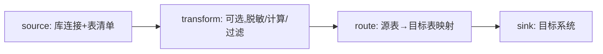

# 模块 08 · Flink CDC

> 覆盖章节:08-01 CDC 心智模型 / 08-02 增量快照框架 / 08-03 YAML Pipeline / 08-04 Schema 演进与治理
> 配套实验:e08 × 4(p01-p03 YAML + C4 DataStream)· Level:L5

## 08-01 CDC 心智模型:从"抽取"到"整库同步治理"

CDC(Change Data Capture)捕获数据库的变更事件流(insert/update/delete),本质是把"数据库的 WAL/binlog"变成"Flink 可消费的一等公民流"。Flink CDC 3.x 的定位从"connector 库"升级为"整库同步产品":一份 YAML 描述源、目标、路由、转换,不再是一表一作业。

## 08-02 增量快照框架(核心机制)

传统 CDC 方案(如原生 Debezium)做首次全量导出时需要对源表加锁保证一致性,大表长期锁表是生产大忌。Flink CDC 的增量快照框架(Incremental Snapshot Framework)把全量数据按主键范围切成多个 **chunk**,每个 chunk 可并行读取、可独立 checkpoint,并通过"低水位/高水位"标记与并发的增量变更流做归并去重——全程**无需锁表**。这是 Flink CDC 相对 Debezium 原生连接器的核心工程贡献,也是 e08-C4 javadoc 强调的关键点。

## 08-03 YAML Pipeline 三段式

- **source**:数据库连接 + 表清单 + slot/复制槽名(每个 pipeline 独立命名,e08 踩坑表)。
- **transform**(可选,p03):声明式表达式做脱敏/计算/过滤,免开发介入即可改治理规则。
- **route**:多表到多目标的映射(p01/p02 均演示),一份 YAML 管住整库。
- **sink**:目标系统适配器(Kafka/Paimon/Doris 等生态持续扩展)。

## 08-04 Schema 演进与数据治理红线

源表加列/改类型时,YAML Pipeline 自动将 Schema 变更事件透传下游(目标建表/加列),无需人工介入——这是"整库同步"叙事的关键承诺。治理红线:① `REPLICA IDENTITY FULL`(PG)是获取 UPDATE/DELETE 完整 before 镜像的前提,否则审计字段大量缺失;② PII 字段必须在 transform 层脱敏后才能落地下游(p03),不能依赖下游"手动处理";③ 每条同步链路的 slot/复制槽是有状态资源,作业下线必须清理,否则源库 WAL 无限增长撑爆磁盘。

## 知识总结 / 常见错误 / 企业实践 / 面试题 / 参考

**总结**:CDC = WAL/binlog 变一等公民流;增量快照框架=无锁全量+增量归并;YAML 三段式(source/transform/route+sink)=声明式整库同步治理。
**常见错**:忘记 REPLICA IDENTITY FULL;slot 名跨作业复用或作业下线不清理;Publication 未包含新增表(静默失效)。
**企业实践**:CDC 链路五元组登记(源库/表清单/slot名/下游格式/脱敏规则)进变更审批;下线流程强制清理复制槽。
**面试**:e08/README 第 8 节三问。
**参考**:官方 Flink CDC 3.x 文档;PostgreSQL Logical Replication;Debezium 概念文档(WAL/binlog 通用心智)。
