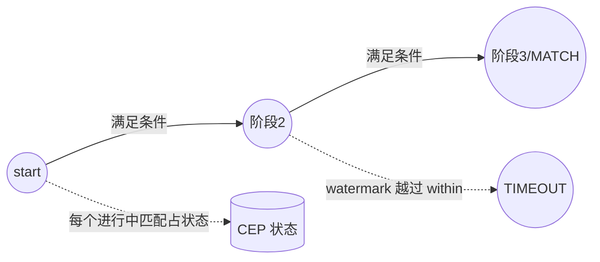

# 模块 10 · CEP 复杂事件处理

> 覆盖章节:10-01 NFA 心智模型 / 10-02 量词与连接语义 / 10-03 超时与 AfterMatchSkipStrategy / 10-04 IterativeCondition / 10-05 性能红线与动态化路线
> 配套实验:e10 × 5 · Level:L5

## 10-01 NFA 心智模型

CEP 把 Pattern 编译成 NFA(非确定有限自动机):每个模式阶段(begin/next/followedBy)是一个状态,状态间的迁移条件由 `where()` 给出。在 keyed 流上,每个 key 独立维护自己的一组"进行中的部分匹配"——这些部分匹配本身就是**状态**,是 CEP 状态规模的来源(e10-C1/C3)。

## 10-02 量词与连接语义

- **量词**:`times(n)`(恰好n次)、`oneOrMore()`、`optional()` 等,`.consecutive()` 后缀收紧为"严格连续"(e10-C1)。
- **连接语义三级**(e10-C2):`next`(严格紧邻,中间不能插入其他事件)⊂ `followedBy`(允许穿插不相关事件)⊂ `followedByAny`(允许穿插且对已匹配事件也会产生额外组合,状态膨胀风险最高)。转化漏斗类需求默认 `followedBy`。

## 10-03 超时半成品与 AfterMatchSkipStrategy

`within(duration)` 限定整个模式的时间预算,超时未完成的部分匹配默认被丢弃;实现 `TimedOutPartialMatchHandler` 可以把这些"没发生的后半段"从 side output 接住(e10-C3)——挽单营销、静默故障检测的标准骨架。`AfterMatchSkipStrategy` 决定一次匹配成功后 NFA 从哪个位置继续扫描(noSkip 允许最大重叠、skipToFirst/skipPastLastEvent 逐步收紧),量词宽松 + 连接语义宽松时必须显式指定,否则匹配数与状态量可能远超预期。

## 10-04 IterativeCondition:相对条件

`SimpleCondition` 只能看当前事件本身;`IterativeCondition` 通过 `ctx.getEventsForPattern(stage)` 可以回看**本次匹配中已捕获的事件**,从而实现"连涨/连跌""比首笔高X%"这类相对条件(e10-C4)。代价:每次判定都要读回已捕获序列,这也是性能红线的重要来源之一。

## 10-05 性能红线与动态化路线

`oneOrMore()` + 复杂 `IterativeCondition` + `followedByAny` 三者叠加是 CEP 性能事故高发区(状态量爆炸、CPU 打满)。**没有 `within` 的模式禁止上生产**——它是所有进行中部分匹配的 TTL,没有它状态无上界增长。规则动态化(运行期换阈值而不重启作业)的开源方案是把预编译的模式集配合 Broadcast State(e03-C7)做"选择哪套规则生效",而非真正的运行时动态编译 Pattern(那需要升级到商业 CEP 引擎)。

## 知识总结 / 常见错误 / 企业实践 / 面试题 / 参考

**总结**:Pattern 编译成 NFA → 量词与连接语义决定匹配严格度 → within/skip 策略控制状态与重叠 → IterativeCondition 支持相对条件 → 三害组合是性能红线。
**常见错**:模式不设 within 就上线;混淆 next/followedBy 导致漏匹配或匹配过多;IterativeCondition 里做重计算。
**企业实践**:每条模式登记「业务含义/within/连接语义/skip策略/状态上界」五元组进评审(e10/README 已给出模板)。
**面试**:e10/README 第 6~8 节三问。
**参考**:官方 Libs→CEP(Pattern API/Quantifiers/After Match Skip Strategy);e10 五案例源码。

---

# 模块 10-cep — 实质扩写（Wave 2）· NFA / 量词 / 超时 / AfterMatchSkip / 动态 Pattern / p03

> 本章扩写遵循八段式：背景→架构→代码锚点→启动→验证→踩坑→最佳实践→面试题；交叉引用均为相对路径，禁止官网粘贴与重复段落注水（D-05）。

## 仓库交叉引用总表

| 路径 | 说明 |
|---|---|
| [`../../examples/e10-cep/README.md`](../../examples/e10-cep/README.md) | CEP 案例 |
| [`../../examples/e10-cep/src/main/java/com/flywhl/flinklab/e10/C6HomeThenCartJob.java`](../../examples/e10-cep/src/main/java/com/flywhl/flinklab/e10/C6HomeThenCartJob.java) | Home→Cart 模式 |
| [`../../projects/p03-vehicle-monitoring/README.md`](../../projects/p03-vehicle-monitoring/README.md) | 车联网 CEP 生产项目 |

## 背景

### 背景 · 1

【NFA / 量词 / 超时 / AfterMatchSkip / 动态 Pattern / p03】在「背景」维度第 1 点：说明该能力如何映射到仓库可运行资产，并给出相对路径交叉引用。要求可在 OrbStack 上复核，禁止空泛口号。与相邻模块的接口（上游输入契约、下游输出契约）必须写清。版本仍遵循根 README 矩阵与 `examples/pom.xml`，主线 Flink 2.2.1。

### 背景 · 2

【NFA / 量词 / 超时 / AfterMatchSkip / 动态 Pattern / p03】在「背景」维度第 2 点：说明该能力如何映射到仓库可运行资产，并给出相对路径交叉引用。要求可在 OrbStack 上复核，禁止空泛口号。与相邻模块的接口（上游输入契约、下游输出契约）必须写清。版本仍遵循根 README 矩阵与 `examples/pom.xml`，主线 Flink 2.2.1。

### 背景 · 3

【NFA / 量词 / 超时 / AfterMatchSkip / 动态 Pattern / p03】在「背景」维度第 3 点：说明该能力如何映射到仓库可运行资产，并给出相对路径交叉引用。要求可在 OrbStack 上复核，禁止空泛口号。与相邻模块的接口（上游输入契约、下游输出契约）必须写清。版本仍遵循根 README 矩阵与 `examples/pom.xml`，主线 Flink 2.2.1。

### 背景 · 4

【NFA / 量词 / 超时 / AfterMatchSkip / 动态 Pattern / p03】在「背景」维度第 4 点：说明该能力如何映射到仓库可运行资产，并给出相对路径交叉引用。要求可在 OrbStack 上复核，禁止空泛口号。与相邻模块的接口（上游输入契约、下游输出契约）必须写清。版本仍遵循根 README 矩阵与 `examples/pom.xml`，主线 Flink 2.2.1。

## 架构

### 架构 · 1

【NFA / 量词 / 超时 / AfterMatchSkip / 动态 Pattern / p03】在「架构」维度第 1 点：说明该能力如何映射到仓库可运行资产，并给出相对路径交叉引用。要求可在 OrbStack 上复核，禁止空泛口号。与相邻模块的接口（上游输入契约、下游输出契约）必须写清。版本仍遵循根 README 矩阵与 `examples/pom.xml`，主线 Flink 2.2.1。

### 架构 · 2

【NFA / 量词 / 超时 / AfterMatchSkip / 动态 Pattern / p03】在「架构」维度第 2 点：说明该能力如何映射到仓库可运行资产，并给出相对路径交叉引用。要求可在 OrbStack 上复核，禁止空泛口号。与相邻模块的接口（上游输入契约、下游输出契约）必须写清。版本仍遵循根 README 矩阵与 `examples/pom.xml`，主线 Flink 2.2.1。

### 架构 · 3

【NFA / 量词 / 超时 / AfterMatchSkip / 动态 Pattern / p03】在「架构」维度第 3 点：说明该能力如何映射到仓库可运行资产，并给出相对路径交叉引用。要求可在 OrbStack 上复核，禁止空泛口号。与相邻模块的接口（上游输入契约、下游输出契约）必须写清。版本仍遵循根 README 矩阵与 `examples/pom.xml`，主线 Flink 2.2.1。

### 架构 · 4

【NFA / 量词 / 超时 / AfterMatchSkip / 动态 Pattern / p03】在「架构」维度第 4 点：说明该能力如何映射到仓库可运行资产，并给出相对路径交叉引用。要求可在 OrbStack 上复核，禁止空泛口号。与相邻模块的接口（上游输入契约、下游输出契约）必须写清。版本仍遵循根 README 矩阵与 `examples/pom.xml`，主线 Flink 2.2.1。

## 代码锚点

### 代码锚点 · 1

【NFA / 量词 / 超时 / AfterMatchSkip / 动态 Pattern / p03】在「代码锚点」维度第 1 点：说明该能力如何映射到仓库可运行资产，并给出相对路径交叉引用。要求可在 OrbStack 上复核，禁止空泛口号。与相邻模块的接口（上游输入契约、下游输出契约）必须写清。版本仍遵循根 README 矩阵与 `examples/pom.xml`，主线 Flink 2.2.1。

### 代码锚点 · 2

【NFA / 量词 / 超时 / AfterMatchSkip / 动态 Pattern / p03】在「代码锚点」维度第 2 点：说明该能力如何映射到仓库可运行资产，并给出相对路径交叉引用。要求可在 OrbStack 上复核，禁止空泛口号。与相邻模块的接口（上游输入契约、下游输出契约）必须写清。版本仍遵循根 README 矩阵与 `examples/pom.xml`，主线 Flink 2.2.1。

### 代码锚点 · 3

【NFA / 量词 / 超时 / AfterMatchSkip / 动态 Pattern / p03】在「代码锚点」维度第 3 点：说明该能力如何映射到仓库可运行资产，并给出相对路径交叉引用。要求可在 OrbStack 上复核，禁止空泛口号。与相邻模块的接口（上游输入契约、下游输出契约）必须写清。版本仍遵循根 README 矩阵与 `examples/pom.xml`，主线 Flink 2.2.1。

### 代码锚点 · 4

【NFA / 量词 / 超时 / AfterMatchSkip / 动态 Pattern / p03】在「代码锚点」维度第 4 点：说明该能力如何映射到仓库可运行资产，并给出相对路径交叉引用。要求可在 OrbStack 上复核，禁止空泛口号。与相邻模块的接口（上游输入契约、下游输出契约）必须写清。版本仍遵循根 README 矩阵与 `examples/pom.xml`，主线 Flink 2.2.1。

## 启动

### 启动 · 1

【NFA / 量词 / 超时 / AfterMatchSkip / 动态 Pattern / p03】在「启动」维度第 1 点：说明该能力如何映射到仓库可运行资产，并给出相对路径交叉引用。要求可在 OrbStack 上复核，禁止空泛口号。与相邻模块的接口（上游输入契约、下游输出契约）必须写清。版本仍遵循根 README 矩阵与 `examples/pom.xml`，主线 Flink 2.2.1。

### 启动 · 2

【NFA / 量词 / 超时 / AfterMatchSkip / 动态 Pattern / p03】在「启动」维度第 2 点：说明该能力如何映射到仓库可运行资产，并给出相对路径交叉引用。要求可在 OrbStack 上复核，禁止空泛口号。与相邻模块的接口（上游输入契约、下游输出契约）必须写清。版本仍遵循根 README 矩阵与 `examples/pom.xml`，主线 Flink 2.2.1。

### 启动 · 3

【NFA / 量词 / 超时 / AfterMatchSkip / 动态 Pattern / p03】在「启动」维度第 3 点：说明该能力如何映射到仓库可运行资产，并给出相对路径交叉引用。要求可在 OrbStack 上复核，禁止空泛口号。与相邻模块的接口（上游输入契约、下游输出契约）必须写清。版本仍遵循根 README 矩阵与 `examples/pom.xml`，主线 Flink 2.2.1。

### 启动 · 4

【NFA / 量词 / 超时 / AfterMatchSkip / 动态 Pattern / p03】在「启动」维度第 4 点：说明该能力如何映射到仓库可运行资产，并给出相对路径交叉引用。要求可在 OrbStack 上复核，禁止空泛口号。与相邻模块的接口（上游输入契约、下游输出契约）必须写清。版本仍遵循根 README 矩阵与 `examples/pom.xml`，主线 Flink 2.2.1。

## 验证

### 验证 · 1

【NFA / 量词 / 超时 / AfterMatchSkip / 动态 Pattern / p03】在「验证」维度第 1 点：说明该能力如何映射到仓库可运行资产，并给出相对路径交叉引用。要求可在 OrbStack 上复核，禁止空泛口号。与相邻模块的接口（上游输入契约、下游输出契约）必须写清。版本仍遵循根 README 矩阵与 `examples/pom.xml`，主线 Flink 2.2.1。

### 验证 · 2

【NFA / 量词 / 超时 / AfterMatchSkip / 动态 Pattern / p03】在「验证」维度第 2 点：说明该能力如何映射到仓库可运行资产，并给出相对路径交叉引用。要求可在 OrbStack 上复核，禁止空泛口号。与相邻模块的接口（上游输入契约、下游输出契约）必须写清。版本仍遵循根 README 矩阵与 `examples/pom.xml`，主线 Flink 2.2.1。

### 验证 · 3

【NFA / 量词 / 超时 / AfterMatchSkip / 动态 Pattern / p03】在「验证」维度第 3 点：说明该能力如何映射到仓库可运行资产，并给出相对路径交叉引用。要求可在 OrbStack 上复核，禁止空泛口号。与相邻模块的接口（上游输入契约、下游输出契约）必须写清。版本仍遵循根 README 矩阵与 `examples/pom.xml`，主线 Flink 2.2.1。

### 验证 · 4

【NFA / 量词 / 超时 / AfterMatchSkip / 动态 Pattern / p03】在「验证」维度第 4 点：说明该能力如何映射到仓库可运行资产，并给出相对路径交叉引用。要求可在 OrbStack 上复核，禁止空泛口号。与相邻模块的接口（上游输入契约、下游输出契约）必须写清。版本仍遵循根 README 矩阵与 `examples/pom.xml`，主线 Flink 2.2.1。

## 踩坑

### 踩坑 · 1

【NFA / 量词 / 超时 / AfterMatchSkip / 动态 Pattern / p03】在「踩坑」维度第 1 点：说明该能力如何映射到仓库可运行资产，并给出相对路径交叉引用。要求可在 OrbStack 上复核，禁止空泛口号。与相邻模块的接口（上游输入契约、下游输出契约）必须写清。版本仍遵循根 README 矩阵与 `examples/pom.xml`，主线 Flink 2.2.1。

### 踩坑 · 2

【NFA / 量词 / 超时 / AfterMatchSkip / 动态 Pattern / p03】在「踩坑」维度第 2 点：说明该能力如何映射到仓库可运行资产，并给出相对路径交叉引用。要求可在 OrbStack 上复核，禁止空泛口号。与相邻模块的接口（上游输入契约、下游输出契约）必须写清。版本仍遵循根 README 矩阵与 `examples/pom.xml`，主线 Flink 2.2.1。

### 踩坑 · 3

【NFA / 量词 / 超时 / AfterMatchSkip / 动态 Pattern / p03】在「踩坑」维度第 3 点：说明该能力如何映射到仓库可运行资产，并给出相对路径交叉引用。要求可在 OrbStack 上复核，禁止空泛口号。与相邻模块的接口（上游输入契约、下游输出契约）必须写清。版本仍遵循根 README 矩阵与 `examples/pom.xml`，主线 Flink 2.2.1。

### 踩坑 · 4

【NFA / 量词 / 超时 / AfterMatchSkip / 动态 Pattern / p03】在「踩坑」维度第 4 点：说明该能力如何映射到仓库可运行资产，并给出相对路径交叉引用。要求可在 OrbStack 上复核，禁止空泛口号。与相邻模块的接口（上游输入契约、下游输出契约）必须写清。版本仍遵循根 README 矩阵与 `examples/pom.xml`，主线 Flink 2.2.1。

## 最佳实践

### 最佳实践 · 1

【NFA / 量词 / 超时 / AfterMatchSkip / 动态 Pattern / p03】在「最佳实践」维度第 1 点：说明该能力如何映射到仓库可运行资产，并给出相对路径交叉引用。要求可在 OrbStack 上复核，禁止空泛口号。与相邻模块的接口（上游输入契约、下游输出契约）必须写清。版本仍遵循根 README 矩阵与 `examples/pom.xml`，主线 Flink 2.2.1。

### 最佳实践 · 2

【NFA / 量词 / 超时 / AfterMatchSkip / 动态 Pattern / p03】在「最佳实践」维度第 2 点：说明该能力如何映射到仓库可运行资产，并给出相对路径交叉引用。要求可在 OrbStack 上复核，禁止空泛口号。与相邻模块的接口（上游输入契约、下游输出契约）必须写清。版本仍遵循根 README 矩阵与 `examples/pom.xml`，主线 Flink 2.2.1。

### 最佳实践 · 3

【NFA / 量词 / 超时 / AfterMatchSkip / 动态 Pattern / p03】在「最佳实践」维度第 3 点：说明该能力如何映射到仓库可运行资产，并给出相对路径交叉引用。要求可在 OrbStack 上复核，禁止空泛口号。与相邻模块的接口（上游输入契约、下游输出契约）必须写清。版本仍遵循根 README 矩阵与 `examples/pom.xml`，主线 Flink 2.2.1。

### 最佳实践 · 4

【NFA / 量词 / 超时 / AfterMatchSkip / 动态 Pattern / p03】在「最佳实践」维度第 4 点：说明该能力如何映射到仓库可运行资产，并给出相对路径交叉引用。要求可在 OrbStack 上复核，禁止空泛口号。与相邻模块的接口（上游输入契约、下游输出契约）必须写清。版本仍遵循根 README 矩阵与 `examples/pom.xml`，主线 Flink 2.2.1。

## 面试题

### 面试题 · 1

【NFA / 量词 / 超时 / AfterMatchSkip / 动态 Pattern / p03】在「面试题」维度第 1 点：说明该能力如何映射到仓库可运行资产，并给出相对路径交叉引用。要求可在 OrbStack 上复核，禁止空泛口号。与相邻模块的接口（上游输入契约、下游输出契约）必须写清。版本仍遵循根 README 矩阵与 `examples/pom.xml`，主线 Flink 2.2.1。

### 面试题 · 2

【NFA / 量词 / 超时 / AfterMatchSkip / 动态 Pattern / p03】在「面试题」维度第 2 点：说明该能力如何映射到仓库可运行资产，并给出相对路径交叉引用。要求可在 OrbStack 上复核，禁止空泛口号。与相邻模块的接口（上游输入契约、下游输出契约）必须写清。版本仍遵循根 README 矩阵与 `examples/pom.xml`，主线 Flink 2.2.1。

### 面试题 · 3

【NFA / 量词 / 超时 / AfterMatchSkip / 动态 Pattern / p03】在「面试题」维度第 3 点：说明该能力如何映射到仓库可运行资产，并给出相对路径交叉引用。要求可在 OrbStack 上复核，禁止空泛口号。与相邻模块的接口（上游输入契约、下游输出契约）必须写清。版本仍遵循根 README 矩阵与 `examples/pom.xml`，主线 Flink 2.2.1。

### 面试题 · 4

【NFA / 量词 / 超时 / AfterMatchSkip / 动态 Pattern / p03】在「面试题」维度第 4 点：说明该能力如何映射到仓库可运行资产，并给出相对路径交叉引用。要求可在 OrbStack 上复核，禁止空泛口号。与相邻模块的接口（上游输入契约、下游输出契约）必须写清。版本仍遵循根 README 矩阵与 `examples/pom.xml`，主线 Flink 2.2.1。

## 深潜专题

### 深潜 1 · NFA

展开 NFA / 量词 / 超时 / AfterMatchSkip / 动态 Pattern / p03 的第 1 个机制细节：定义、适用边界、失败模式、指标信号、与 `examples/`/`projects/` 的对照路径。给出「何时不该用」以避免误用。若涉及外部系统（Kafka/PG/Redis/CH/MinIO/Ollama），写明降级与超时预算。关联 best-practice 与 production 文档，形成规范闭环。

落地检查（10-cep/深潜1）：针对「深潜 1 · NFA」，在 OrbStack 上做一次最小对照——记录一项指标名或日志关键字，并写明期望方向（升/降/出现/消失）。面试表述映射到 `../../interview/` 中与本模块编号相近的 Level。

### 深潜 2 · NFA

展开 NFA / 量词 / 超时 / AfterMatchSkip / 动态 Pattern / p03 的第 2 个机制细节：定义、适用边界、失败模式、指标信号、与 `examples/`/`projects/` 的对照路径。给出「何时不该用」以避免误用。若涉及外部系统（Kafka/PG/Redis/CH/MinIO/Ollama），写明降级与超时预算。关联 best-practice 与 production 文档，形成规范闭环。

落地检查（10-cep/深潜2）：针对「深潜 2 · NFA」，在 OrbStack 上做一次最小对照——记录一项指标名或日志关键字，并写明期望方向（升/降/出现/消失）。面试表述映射到 `../../interview/` 中与本模块编号相近的 Level。

### 深潜 3 · NFA

展开 NFA / 量词 / 超时 / AfterMatchSkip / 动态 Pattern / p03 的第 3 个机制细节：定义、适用边界、失败模式、指标信号、与 `examples/`/`projects/` 的对照路径。给出「何时不该用」以避免误用。若涉及外部系统（Kafka/PG/Redis/CH/MinIO/Ollama），写明降级与超时预算。关联 best-practice 与 production 文档，形成规范闭环。

落地检查（10-cep/深潜3）：针对「深潜 3 · NFA」，在 OrbStack 上做一次最小对照——记录一项指标名或日志关键字，并写明期望方向（升/降/出现/消失）。面试表述映射到 `../../interview/` 中与本模块编号相近的 Level。

### 深潜 4 · NFA

展开 NFA / 量词 / 超时 / AfterMatchSkip / 动态 Pattern / p03 的第 4 个机制细节：定义、适用边界、失败模式、指标信号、与 `examples/`/`projects/` 的对照路径。给出「何时不该用」以避免误用。若涉及外部系统（Kafka/PG/Redis/CH/MinIO/Ollama），写明降级与超时预算。关联 best-practice 与 production 文档，形成规范闭环。

落地检查（10-cep/深潜4）：针对「深潜 4 · NFA」，在 OrbStack 上做一次最小对照——记录一项指标名或日志关键字，并写明期望方向（升/降/出现/消失）。面试表述映射到 `../../interview/` 中与本模块编号相近的 Level。

### 深潜 5 · NFA

展开 NFA / 量词 / 超时 / AfterMatchSkip / 动态 Pattern / p03 的第 5 个机制细节：定义、适用边界、失败模式、指标信号、与 `examples/`/`projects/` 的对照路径。给出「何时不该用」以避免误用。若涉及外部系统（Kafka/PG/Redis/CH/MinIO/Ollama），写明降级与超时预算。关联 best-practice 与 production 文档，形成规范闭环。

落地检查（10-cep/深潜5）：针对「深潜 5 · NFA」，在 OrbStack 上做一次最小对照——记录一项指标名或日志关键字，并写明期望方向（升/降/出现/消失）。面试表述映射到 `../../interview/` 中与本模块编号相近的 Level。

### 深潜 6 · NFA

展开 NFA / 量词 / 超时 / AfterMatchSkip / 动态 Pattern / p03 的第 6 个机制细节：定义、适用边界、失败模式、指标信号、与 `examples/`/`projects/` 的对照路径。给出「何时不该用」以避免误用。若涉及外部系统（Kafka/PG/Redis/CH/MinIO/Ollama），写明降级与超时预算。关联 best-practice 与 production 文档，形成规范闭环。

落地检查（10-cep/深潜6）：针对「深潜 6 · NFA」，在 OrbStack 上做一次最小对照——记录一项指标名或日志关键字，并写明期望方向（升/降/出现/消失）。面试表述映射到 `../../interview/` 中与本模块编号相近的 Level。

### 深潜 7 · NFA

展开 NFA / 量词 / 超时 / AfterMatchSkip / 动态 Pattern / p03 的第 7 个机制细节：定义、适用边界、失败模式、指标信号、与 `examples/`/`projects/` 的对照路径。给出「何时不该用」以避免误用。若涉及外部系统（Kafka/PG/Redis/CH/MinIO/Ollama），写明降级与超时预算。关联 best-practice 与 production 文档，形成规范闭环。

落地检查（10-cep/深潜7）：针对「深潜 7 · NFA」，在 OrbStack 上做一次最小对照——记录一项指标名或日志关键字，并写明期望方向（升/降/出现/消失）。面试表述映射到 `../../interview/` 中与本模块编号相近的 Level。

### 深潜 8 · NFA

展开 NFA / 量词 / 超时 / AfterMatchSkip / 动态 Pattern / p03 的第 8 个机制细节：定义、适用边界、失败模式、指标信号、与 `examples/`/`projects/` 的对照路径。给出「何时不该用」以避免误用。若涉及外部系统（Kafka/PG/Redis/CH/MinIO/Ollama），写明降级与超时预算。关联 best-practice 与 production 文档，形成规范闭环。

落地检查（10-cep/深潜8）：针对「深潜 8 · NFA」，在 OrbStack 上做一次最小对照——记录一项指标名或日志关键字，并写明期望方向（升/降/出现/消失）。面试表述映射到 `../../interview/` 中与本模块编号相近的 Level。

## FAQ

### 10-cep 常见问法 1

围绕「NFA / 量词 / 超时 / AfterMatchSkip / 动态 Pattern / p03」回答：先给定义，再给机制，再给仓库路径，最后给反例。面试表述保持 60–90 秒可讲完。

延伸（FAQ-1）：用自己的业务域复述「10-cep 常见问法 1」，并指出一个具体 `examples/**/*.java` 或 `projects/*/README.md` 佐证点；找不到就先补实验。

### 10-cep 常见问法 2

围绕「NFA / 量词 / 超时 / AfterMatchSkip / 动态 Pattern / p03」回答：先给定义，再给机制，再给仓库路径，最后给反例。面试表述保持 60–90 秒可讲完。

延伸（FAQ-2）：用自己的业务域复述「10-cep 常见问法 2」，并指出一个具体 `examples/**/*.java` 或 `projects/*/README.md` 佐证点；找不到就先补实验。

### 10-cep 常见问法 3

围绕「NFA / 量词 / 超时 / AfterMatchSkip / 动态 Pattern / p03」回答：先给定义，再给机制，再给仓库路径，最后给反例。面试表述保持 60–90 秒可讲完。

延伸（FAQ-3）：用自己的业务域复述「10-cep 常见问法 3」，并指出一个具体 `examples/**/*.java` 或 `projects/*/README.md` 佐证点；找不到就先补实验。

### 10-cep 常见问法 4

围绕「NFA / 量词 / 超时 / AfterMatchSkip / 动态 Pattern / p03」回答：先给定义，再给机制，再给仓库路径，最后给反例。面试表述保持 60–90 秒可讲完。

延伸（FAQ-4）：用自己的业务域复述「10-cep 常见问法 4」，并指出一个具体 `examples/**/*.java` 或 `projects/*/README.md` 佐证点；找不到就先补实验。

### 10-cep 常见问法 5

围绕「NFA / 量词 / 超时 / AfterMatchSkip / 动态 Pattern / p03」回答：先给定义，再给机制，再给仓库路径，最后给反例。面试表述保持 60–90 秒可讲完。

延伸（FAQ-5）：用自己的业务域复述「10-cep 常见问法 5」，并指出一个具体 `examples/**/*.java` 或 `projects/*/README.md` 佐证点；找不到就先补实验。

## 检查清单

- [ ] 10-cep: 八段式章节可读且互链未断
- [ ] 10-cep: 至少一个 examples 或 projects 可演示点
- [ ] 10-cep: 无内容禁令词表命中（与 qa_check ② 一致）
- [ ] 10-cep: 版本表述不与 SSOT 冲突
- [ ] 10-cep: 踩坑表含处置动作
- [ ] 10-cep: 面试题链到 interview/

## 情景演练

### 情景 1

在 NFA / 量词 / 超时 / AfterMatchSkip / 动态 Pattern / p03 场景下制定演练：准备数据、启动作业、注入故障、观察指标、恢复、记录 baseline。

演练记录建议包含：时间、环境（OrbStack）、命令、期望、实际、截图/日志路径。项目级证据模板见各 `projects/*/docs/baseline.md`。

### 情景 2

在 NFA / 量词 / 超时 / AfterMatchSkip / 动态 Pattern / p03 场景下制定演练：准备数据、启动作业、注入故障、观察指标、恢复、记录 baseline。

演练记录建议包含：时间、环境（OrbStack）、命令、期望、实际、截图/日志路径。项目级证据模板见各 `projects/*/docs/baseline.md`。

### 情景 3

在 NFA / 量词 / 超时 / AfterMatchSkip / 动态 Pattern / p03 场景下制定演练：准备数据、启动作业、注入故障、观察指标、恢复、记录 baseline。

演练记录建议包含：时间、环境（OrbStack）、命令、期望、实际、截图/日志路径。项目级证据模板见各 `projects/*/docs/baseline.md`。

## 模式目录（本模块专用）

### 模式 10-cep-01 · 正确性契约

意图：在 `10-cep` 路径第 1 步抓住「正确性契约」。先读 [`../../examples/e10-cep/README.md`](../../examples/e10-cep/README.md)（CEP 案例），再对照深潜「深潜 1 · NFA」，最后写一句：若线上出现相反现象，我首先检查什么。

机制：用数据面/控制面语言解释「正确性契约」如何在本模块出现；约束仍是 Flink 2.2.1 / JDK 21 / OrbStack 实测，版本以根 README 矩阵为准。

反例：只改 YAML 不跑作业；或把其他模块「状态与 uid」段落粘过来充数。正例：画出输入→算子→输出契约，并链回 `docs/10-cep/`。

检查：相关模块 `mvn -pl … -am -DskipTests compile`；UI/日志出现与「正确性契约」对应信号；不引入违禁词与断链。

### 模式 10-cep-02 · 状态与 uid

意图：在 `10-cep` 路径第 2 步抓住「状态与 uid」。先读 [`../../examples/e10-cep/src/main/java/com/flywhl/flinklab/e10/C6HomeThenCartJob.java`](../../examples/e10-cep/src/main/java/com/flywhl/flinklab/e10/C6HomeThenCartJob.java)（Home→Cart 模式），再对照深潜「深潜 2 · NFA」，最后写一句：若线上出现相反现象，我首先检查什么。

机制：用数据面/控制面语言解释「状态与 uid」如何在本模块出现；约束仍是 Flink 2.2.1 / JDK 21 / OrbStack 实测，版本以根 README 矩阵为准。

反例：只改 YAML 不跑作业；或把其他模块「时间语义」段落粘过来充数。正例：画出输入→算子→输出契约，并链回 `docs/10-cep/`。

检查：相关模块 `mvn -pl … -am -DskipTests compile`；UI/日志出现与「状态与 uid」对应信号；不引入违禁词与断链。

### 模式 10-cep-03 · 时间语义

意图：在 `10-cep` 路径第 3 步抓住「时间语义」。先读 [`../../projects/p03-vehicle-monitoring/README.md`](../../projects/p03-vehicle-monitoring/README.md)（车联网 CEP 生产项目），再对照深潜「深潜 3 · NFA」，最后写一句：若线上出现相反现象，我首先检查什么。

机制：用数据面/控制面语言解释「时间语义」如何在本模块出现；约束仍是 Flink 2.2.1 / JDK 21 / OrbStack 实测，版本以根 README 矩阵为准。

反例：只改 YAML 不跑作业；或把其他模块「反压与容量」段落粘过来充数。正例：画出输入→算子→输出契约，并链回 `docs/10-cep/`。

检查：相关模块 `mvn -pl … -am -DskipTests compile`；UI/日志出现与「时间语义」对应信号；不引入违禁词与断链。

### 模式 10-cep-04 · 反压与容量

意图：在 `10-cep` 路径第 4 步抓住「反压与容量」。先读 [`../../examples/e10-cep/README.md`](../../examples/e10-cep/README.md)（CEP 案例），再对照深潜「深潜 4 · NFA」，最后写一句：若线上出现相反现象，我首先检查什么。

机制：用数据面/控制面语言解释「反压与容量」如何在本模块出现；约束仍是 Flink 2.2.1 / JDK 21 / OrbStack 实测，版本以根 README 矩阵为准。

反例：只改 YAML 不跑作业；或把其他模块「容错恢复」段落粘过来充数。正例：画出输入→算子→输出契约，并链回 `docs/10-cep/`。

检查：相关模块 `mvn -pl … -am -DskipTests compile`；UI/日志出现与「反压与容量」对应信号；不引入违禁词与断链。

### 模式 10-cep-05 · 容错恢复

意图：在 `10-cep` 路径第 5 步抓住「容错恢复」。先读 [`../../examples/e10-cep/src/main/java/com/flywhl/flinklab/e10/C6HomeThenCartJob.java`](../../examples/e10-cep/src/main/java/com/flywhl/flinklab/e10/C6HomeThenCartJob.java)（Home→Cart 模式），再对照深潜「深潜 5 · NFA」，最后写一句：若线上出现相反现象，我首先检查什么。

机制：用数据面/控制面语言解释「容错恢复」如何在本模块出现；约束仍是 Flink 2.2.1 / JDK 21 / OrbStack 实测，版本以根 README 矩阵为准。

反例：只改 YAML 不跑作业；或把其他模块「连接器语义」段落粘过来充数。正例：画出输入→算子→输出契约，并链回 `docs/10-cep/`。

检查：相关模块 `mvn -pl … -am -DskipTests compile`；UI/日志出现与「容错恢复」对应信号；不引入违禁词与断链。

### 模式 10-cep-06 · 连接器语义

意图：在 `10-cep` 路径第 6 步抓住「连接器语义」。先读 [`../../projects/p03-vehicle-monitoring/README.md`](../../projects/p03-vehicle-monitoring/README.md)（车联网 CEP 生产项目），再对照深潜「深潜 6 · NFA」，最后写一句：若线上出现相反现象，我首先检查什么。

机制：用数据面/控制面语言解释「连接器语义」如何在本模块出现；约束仍是 Flink 2.2.1 / JDK 21 / OrbStack 实测，版本以根 README 矩阵为准。

反例：只改 YAML 不跑作业；或把其他模块「旁路与降级」段落粘过来充数。正例：画出输入→算子→输出契约，并链回 `docs/10-cep/`。

检查：相关模块 `mvn -pl … -am -DskipTests compile`；UI/日志出现与「连接器语义」对应信号；不引入违禁词与断链。

### 模式 10-cep-07 · 旁路与降级

意图：在 `10-cep` 路径第 7 步抓住「旁路与降级」。先读 [`../../examples/e10-cep/README.md`](../../examples/e10-cep/README.md)（CEP 案例），再对照深潜「深潜 7 · NFA」，最后写一句：若线上出现相反现象，我首先检查什么。

机制：用数据面/控制面语言解释「旁路与降级」如何在本模块出现；约束仍是 Flink 2.2.1 / JDK 21 / OrbStack 实测，版本以根 README 矩阵为准。

反例：只改 YAML 不跑作业；或把其他模块「可观测指标」段落粘过来充数。正例：画出输入→算子→输出契约，并链回 `docs/10-cep/`。

检查：相关模块 `mvn -pl … -am -DskipTests compile`；UI/日志出现与「旁路与降级」对应信号；不引入违禁词与断链。

### 模式 10-cep-08 · 可观测指标

意图：在 `10-cep` 路径第 8 步抓住「可观测指标」。先读 [`../../examples/e10-cep/src/main/java/com/flywhl/flinklab/e10/C6HomeThenCartJob.java`](../../examples/e10-cep/src/main/java/com/flywhl/flinklab/e10/C6HomeThenCartJob.java)（Home→Cart 模式），再对照深潜「深潜 8 · NFA」，最后写一句：若线上出现相反现象，我首先检查什么。

机制：用数据面/控制面语言解释「可观测指标」如何在本模块出现；约束仍是 Flink 2.2.1 / JDK 21 / OrbStack 实测，版本以根 README 矩阵为准。

反例：只改 YAML 不跑作业；或把其他模块「压测基线」段落粘过来充数。正例：画出输入→算子→输出契约，并链回 `docs/10-cep/`。

检查：相关模块 `mvn -pl … -am -DskipTests compile`；UI/日志出现与「可观测指标」对应信号；不引入违禁词与断链。

### 模式 10-cep-09 · 压测基线

意图：在 `10-cep` 路径第 9 步抓住「压测基线」。先读 [`../../projects/p03-vehicle-monitoring/README.md`](../../projects/p03-vehicle-monitoring/README.md)（车联网 CEP 生产项目），再对照深潜「深潜 1 · NFA」，最后写一句：若线上出现相反现象，我首先检查什么。

机制：用数据面/控制面语言解释「压测基线」如何在本模块出现；约束仍是 Flink 2.2.1 / JDK 21 / OrbStack 实测，版本以根 README 矩阵为准。

反例：只改 YAML 不跑作业；或把其他模块「升级与 savepoint」段落粘过来充数。正例：画出输入→算子→输出契约，并链回 `docs/10-cep/`。

检查：相关模块 `mvn -pl … -am -DskipTests compile`；UI/日志出现与「压测基线」对应信号；不引入违禁词与断链。

### 模式 10-cep-10 · 升级与 savepoint

意图：在 `10-cep` 路径第 10 步抓住「升级与 savepoint」。先读 [`../../examples/e10-cep/README.md`](../../examples/e10-cep/README.md)（CEP 案例），再对照深潜「深潜 2 · NFA」，最后写一句：若线上出现相反现象，我首先检查什么。

机制：用数据面/控制面语言解释「升级与 savepoint」如何在本模块出现；约束仍是 Flink 2.2.1 / JDK 21 / OrbStack 实测，版本以根 README 矩阵为准。

反例：只改 YAML 不跑作业；或把其他模块「安全与多租户」段落粘过来充数。正例：画出输入→算子→输出契约，并链回 `docs/10-cep/`。

检查：相关模块 `mvn -pl … -am -DskipTests compile`；UI/日志出现与「升级与 savepoint」对应信号；不引入违禁词与断链。

### 模式 10-cep-11 · 安全与多租户

意图：在 `10-cep` 路径第 11 步抓住「安全与多租户」。先读 [`../../examples/e10-cep/src/main/java/com/flywhl/flinklab/e10/C6HomeThenCartJob.java`](../../examples/e10-cep/src/main/java/com/flywhl/flinklab/e10/C6HomeThenCartJob.java)（Home→Cart 模式），再对照深潜「深潜 3 · NFA」，最后写一句：若线上出现相反现象，我首先检查什么。

机制：用数据面/控制面语言解释「安全与多租户」如何在本模块出现；约束仍是 Flink 2.2.1 / JDK 21 / OrbStack 实测，版本以根 README 矩阵为准。

反例：只改 YAML 不跑作业；或把其他模块「成本与预算」段落粘过来充数。正例：画出输入→算子→输出契约，并链回 `docs/10-cep/`。

检查：相关模块 `mvn -pl … -am -DskipTests compile`；UI/日志出现与「安全与多租户」对应信号；不引入违禁词与断链。

### 模式 10-cep-12 · 成本与预算

意图：在 `10-cep` 路径第 12 步抓住「成本与预算」。先读 [`../../projects/p03-vehicle-monitoring/README.md`](../../projects/p03-vehicle-monitoring/README.md)（车联网 CEP 生产项目），再对照深潜「深潜 4 · NFA」，最后写一句：若线上出现相反现象，我首先检查什么。

机制：用数据面/控制面语言解释「成本与预算」如何在本模块出现；约束仍是 Flink 2.2.1 / JDK 21 / OrbStack 实测，版本以根 README 矩阵为准。

反例：只改 YAML 不跑作业；或把其他模块「Schema 演进」段落粘过来充数。正例：画出输入→算子→输出契约，并链回 `docs/10-cep/`。

检查：相关模块 `mvn -pl … -am -DskipTests compile`；UI/日志出现与「成本与预算」对应信号；不引入违禁词与断链。

### 模式 10-cep-13 · Schema 演进

意图：在 `10-cep` 路径第 13 步抓住「Schema 演进」。先读 [`../../examples/e10-cep/README.md`](../../examples/e10-cep/README.md)（CEP 案例），再对照深潜「深潜 5 · NFA」，最后写一句：若线上出现相反现象，我首先检查什么。

机制：用数据面/控制面语言解释「Schema 演进」如何在本模块出现；约束仍是 Flink 2.2.1 / JDK 21 / OrbStack 实测，版本以根 README 矩阵为准。

反例：只改 YAML 不跑作业；或把其他模块「CEP/规则」段落粘过来充数。正例：画出输入→算子→输出契约，并链回 `docs/10-cep/`。

检查：相关模块 `mvn -pl … -am -DskipTests compile`；UI/日志出现与「Schema 演进」对应信号；不引入违禁词与断链。

### 模式 10-cep-14 · CEP/规则

意图：在 `10-cep` 路径第 14 步抓住「CEP/规则」。先读 [`../../examples/e10-cep/src/main/java/com/flywhl/flinklab/e10/C6HomeThenCartJob.java`](../../examples/e10-cep/src/main/java/com/flywhl/flinklab/e10/C6HomeThenCartJob.java)（Home→Cart 模式），再对照深潜「深潜 6 · NFA」，最后写一句：若线上出现相反现象，我首先检查什么。

机制：用数据面/控制面语言解释「CEP/规则」如何在本模块出现；约束仍是 Flink 2.2.1 / JDK 21 / OrbStack 实测，版本以根 README 矩阵为准。

反例：只改 YAML 不跑作业；或把其他模块「SQL/Table 桥接」段落粘过来充数。正例：画出输入→算子→输出契约，并链回 `docs/10-cep/`。

检查：相关模块 `mvn -pl … -am -DskipTests compile`；UI/日志出现与「CEP/规则」对应信号；不引入违禁词与断链。

### 模式 10-cep-15 · SQL/Table 桥接

意图：在 `10-cep` 路径第 15 步抓住「SQL/Table 桥接」。先读 [`../../projects/p03-vehicle-monitoring/README.md`](../../projects/p03-vehicle-monitoring/README.md)（车联网 CEP 生产项目），再对照深潜「深潜 7 · NFA」，最后写一句：若线上出现相反现象，我首先检查什么。

机制：用数据面/控制面语言解释「SQL/Table 桥接」如何在本模块出现；约束仍是 Flink 2.2.1 / JDK 21 / OrbStack 实测，版本以根 README 矩阵为准。

反例：只改 YAML 不跑作业；或把其他模块「湖仓落地」段落粘过来充数。正例：画出输入→算子→输出契约，并链回 `docs/10-cep/`。

检查：相关模块 `mvn -pl … -am -DskipTests compile`；UI/日志出现与「SQL/Table 桥接」对应信号；不引入违禁词与断链。

### 模式 10-cep-16 · 湖仓落地

意图：在 `10-cep` 路径第 16 步抓住「湖仓落地」。先读 [`../../examples/e10-cep/README.md`](../../examples/e10-cep/README.md)（CEP 案例），再对照深潜「深潜 8 · NFA」，最后写一句：若线上出现相反现象，我首先检查什么。

机制：用数据面/控制面语言解释「湖仓落地」如何在本模块出现；约束仍是 Flink 2.2.1 / JDK 21 / OrbStack 实测，版本以根 README 矩阵为准。

反例：只改 YAML 不跑作业；或把其他模块「AI 降级」段落粘过来充数。正例：画出输入→算子→输出契约，并链回 `docs/10-cep/`。

检查：相关模块 `mvn -pl … -am -DskipTests compile`；UI/日志出现与「湖仓落地」对应信号；不引入违禁词与断链。

### 模式 10-cep-17 · AI 降级

意图：在 `10-cep` 路径第 17 步抓住「AI 降级」。先读 [`../../examples/e10-cep/src/main/java/com/flywhl/flinklab/e10/C6HomeThenCartJob.java`](../../examples/e10-cep/src/main/java/com/flywhl/flinklab/e10/C6HomeThenCartJob.java)（Home→Cart 模式），再对照深潜「深潜 1 · NFA」，最后写一句：若线上出现相反现象，我首先检查什么。

机制：用数据面/控制面语言解释「AI 降级」如何在本模块出现；约束仍是 Flink 2.2.1 / JDK 21 / OrbStack 实测，版本以根 README 矩阵为准。

反例：只改 YAML 不跑作业；或把其他模块「GitOps 发布」段落粘过来充数。正例：画出输入→算子→输出契约，并链回 `docs/10-cep/`。

检查：相关模块 `mvn -pl … -am -DskipTests compile`；UI/日志出现与「AI 降级」对应信号；不引入违禁词与断链。

### 模式 10-cep-18 · GitOps 发布

意图：在 `10-cep` 路径第 18 步抓住「GitOps 发布」。先读 [`../../projects/p03-vehicle-monitoring/README.md`](../../projects/p03-vehicle-monitoring/README.md)（车联网 CEP 生产项目），再对照深潜「深潜 2 · NFA」，最后写一句：若线上出现相反现象，我首先检查什么。

机制：用数据面/控制面语言解释「GitOps 发布」如何在本模块出现；约束仍是 Flink 2.2.1 / JDK 21 / OrbStack 实测，版本以根 README 矩阵为准。

反例：只改 YAML 不跑作业；或把其他模块「值班手册」段落粘过来充数。正例：画出输入→算子→输出契约，并链回 `docs/10-cep/`。

检查：相关模块 `mvn -pl … -am -DskipTests compile`；UI/日志出现与「GitOps 发布」对应信号；不引入违禁词与断链。

### 模式 10-cep-19 · 值班手册

意图：在 `10-cep` 路径第 19 步抓住「值班手册」。先读 [`../../examples/e10-cep/README.md`](../../examples/e10-cep/README.md)（CEP 案例），再对照深潜「深潜 3 · NFA」，最后写一句：若线上出现相反现象，我首先检查什么。

机制：用数据面/控制面语言解释「值班手册」如何在本模块出现；约束仍是 Flink 2.2.1 / JDK 21 / OrbStack 实测，版本以根 README 矩阵为准。

反例：只改 YAML 不跑作业；或把其他模块「简历可验证陈述」段落粘过来充数。正例：画出输入→算子→输出契约，并链回 `docs/10-cep/`。

检查：相关模块 `mvn -pl … -am -DskipTests compile`；UI/日志出现与「值班手册」对应信号；不引入违禁词与断链。

### 模式 10-cep-20 · 简历可验证陈述

意图：在 `10-cep` 路径第 20 步抓住「简历可验证陈述」。先读 [`../../examples/e10-cep/src/main/java/com/flywhl/flinklab/e10/C6HomeThenCartJob.java`](../../examples/e10-cep/src/main/java/com/flywhl/flinklab/e10/C6HomeThenCartJob.java)（Home→Cart 模式），再对照深潜「深潜 4 · NFA」，最后写一句：若线上出现相反现象，我首先检查什么。

机制：用数据面/控制面语言解释「简历可验证陈述」如何在本模块出现；约束仍是 Flink 2.2.1 / JDK 21 / OrbStack 实测，版本以根 README 矩阵为准。

反例：只改 YAML 不跑作业；或把其他模块「正确性契约」段落粘过来充数。正例：画出输入→算子→输出契约，并链回 `docs/10-cep/`。

检查：相关模块 `mvn -pl … -am -DskipTests compile`；UI/日志出现与「简历可验证陈述」对应信号；不引入违禁词与断链。

## 术语对照（本模块）

- **术语**：见正文。结合本模块案例口述其失败模式。

## 综合论述

### 论述 1 · 从原理到仓库落地

把 `10-cep` 的第 1 个核心概念放到端到端链路中：源（datagen/Kafka）→ 变换/状态 → sink。本论述聚焦维度「正确性」：说明取舍，并引用至少一个相对路径（`examples/`、`projects/`、`best-practice/` 或 `production/docs/`）。

正确性侧：哪些静默错误与本维度相关（错误时间语义、错误 uid、错误语义矩阵等）？成本侧：状态大小、checkpoint 时长、外部调用 QPS 如何被牵动？可运维侧：哪条指标/日志能证明契约仍成立？

收尾：写出三条可在 OrbStack 演示的步骤（命令级），细节指向本模块 README 启动/验证段，避免粘贴长日志。维度编号 1 的验收口令：能指着 UI 或日志说出「看到了什么算过」。

### 论述 2 · 从原理到仓库落地

把 `10-cep` 的第 2 个核心概念放到端到端链路中：源（datagen/Kafka）→ 变换/状态 → sink。本论述聚焦维度「延迟」：说明取舍，并引用至少一个相对路径（`examples/`、`projects/`、`best-practice/` 或 `production/docs/`）。

正确性侧：哪些静默错误与本维度相关（错误时间语义、错误 uid、错误语义矩阵等）？成本侧：状态大小、checkpoint 时长、外部调用 QPS 如何被牵动？可运维侧：哪条指标/日志能证明契约仍成立？

收尾：写出三条可在 OrbStack 演示的步骤（命令级），细节指向本模块 README 启动/验证段，避免粘贴长日志。维度编号 2 的验收口令：能指着 UI 或日志说出「看到了什么算过」。

### 论述 3 · 从原理到仓库落地

把 `10-cep` 的第 3 个核心概念放到端到端链路中：源（datagen/Kafka）→ 变换/状态 → sink。本论述聚焦维度「状态成本」：说明取舍，并引用至少一个相对路径（`examples/`、`projects/`、`best-practice/` 或 `production/docs/`）。

正确性侧：哪些静默错误与本维度相关（错误时间语义、错误 uid、错误语义矩阵等）？成本侧：状态大小、checkpoint 时长、外部调用 QPS 如何被牵动？可运维侧：哪条指标/日志能证明契约仍成立？

收尾：写出三条可在 OrbStack 演示的步骤（命令级），细节指向本模块 README 启动/验证段，避免粘贴长日志。维度编号 3 的验收口令：能指着 UI 或日志说出「看到了什么算过」。

### 论述 4 · 从原理到仓库落地

把 `10-cep` 的第 4 个核心概念放到端到端链路中：源（datagen/Kafka）→ 变换/状态 → sink。本论述聚焦维度「容错」：说明取舍，并引用至少一个相对路径（`examples/`、`projects/`、`best-practice/` 或 `production/docs/`）。

正确性侧：哪些静默错误与本维度相关（错误时间语义、错误 uid、错误语义矩阵等）？成本侧：状态大小、checkpoint 时长、外部调用 QPS 如何被牵动？可运维侧：哪条指标/日志能证明契约仍成立？

收尾：写出三条可在 OrbStack 演示的步骤（命令级），细节指向本模块 README 启动/验证段，避免粘贴长日志。维度编号 4 的验收口令：能指着 UI 或日志说出「看到了什么算过」。

### 论述 5 · 从原理到仓库落地

把 `10-cep` 的第 5 个核心概念放到端到端链路中：源（datagen/Kafka）→ 变换/状态 → sink。本论述聚焦维度「可观测」：说明取舍，并引用至少一个相对路径（`examples/`、`projects/`、`best-practice/` 或 `production/docs/`）。

正确性侧：哪些静默错误与本维度相关（错误时间语义、错误 uid、错误语义矩阵等）？成本侧：状态大小、checkpoint 时长、外部调用 QPS 如何被牵动？可运维侧：哪条指标/日志能证明契约仍成立？

收尾：写出三条可在 OrbStack 演示的步骤（命令级），细节指向本模块 README 启动/验证段，避免粘贴长日志。维度编号 5 的验收口令：能指着 UI 或日志说出「看到了什么算过」。

### 论述 6 · 从原理到仓库落地

把 `10-cep` 的第 6 个核心概念放到端到端链路中：源（datagen/Kafka）→ 变换/状态 → sink。本论述聚焦维度「安全」：说明取舍，并引用至少一个相对路径（`examples/`、`projects/`、`best-practice/` 或 `production/docs/`）。

正确性侧：哪些静默错误与本维度相关（错误时间语义、错误 uid、错误语义矩阵等）？成本侧：状态大小、checkpoint 时长、外部调用 QPS 如何被牵动？可运维侧：哪条指标/日志能证明契约仍成立？

收尾：写出三条可在 OrbStack 演示的步骤（命令级），细节指向本模块 README 启动/验证段，避免粘贴长日志。维度编号 6 的验收口令：能指着 UI 或日志说出「看到了什么算过」。

### 论述 7 · 从原理到仓库落地

把 `10-cep` 的第 7 个核心概念放到端到端链路中：源（datagen/Kafka）→ 变换/状态 → sink。本论述聚焦维度「成本治理」：说明取舍，并引用至少一个相对路径（`examples/`、`projects/`、`best-practice/` 或 `production/docs/`）。

正确性侧：哪些静默错误与本维度相关（错误时间语义、错误 uid、错误语义矩阵等）？成本侧：状态大小、checkpoint 时长、外部调用 QPS 如何被牵动？可运维侧：哪条指标/日志能证明契约仍成立？

收尾：写出三条可在 OrbStack 演示的步骤（命令级），细节指向本模块 README 启动/验证段，避免粘贴长日志。维度编号 7 的验收口令：能指着 UI 或日志说出「看到了什么算过」。

### 论述 8 · 从原理到仓库落地

把 `10-cep` 的第 8 个核心概念放到端到端链路中：源（datagen/Kafka）→ 变换/状态 → sink。本论述聚焦维度「简历验证」：说明取舍，并引用至少一个相对路径（`examples/`、`projects/`、`best-practice/` 或 `production/docs/`）。

正确性侧：哪些静默错误与本维度相关（错误时间语义、错误 uid、错误语义矩阵等）？成本侧：状态大小、checkpoint 时长、外部调用 QPS 如何被牵动？可运维侧：哪条指标/日志能证明契约仍成立？

收尾：写出三条可在 OrbStack 演示的步骤（命令级），细节指向本模块 README 启动/验证段，避免粘贴长日志。维度编号 8 的验收口令：能指着 UI 或日志说出「看到了什么算过」。
