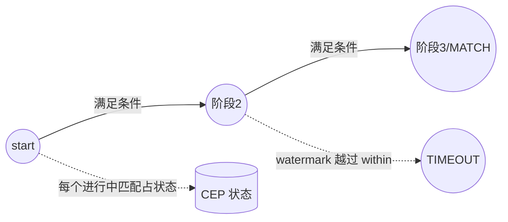

# 模块 10 · CEP 复杂事件处理

> 覆盖章节:10-01 NFA 心智模型 / 10-02 量词与连接语义 / 10-03 超时与 AfterMatchSkipStrategy / 10-04 IterativeCondition / 10-05 性能红线与动态化路线
> 配套实验:e10 × 5 · Level:L5

## 10-01 NFA 心智模型

CEP 把 Pattern 编译成 NFA(非确定有限自动机):每个模式阶段(begin/next/followedBy)是一个状态,状态间的迁移条件由 `where()` 给出。在 keyed 流上,每个 key 独立维护自己的一组"进行中的部分匹配"——这些部分匹配本身就是**状态**,是 CEP 状态规模的来源(e10-C1/C3)。

## 10-02 量词与连接语义

- **量词**:`times(n)`(恰好n次)、`oneOrMore()`、`optional()` 等,`.consecutive()` 后缀收紧为"严格连续"(e10-C1)。
- **连接语义三级**(e10-C2):`next`(严格紧邻,中间不能插入其他事件)⊂ `followedBy`(允许穿插不相关事件)⊂ `followedByAny`(允许穿插且对已匹配事件也会产生额外组合,状态膨胀风险最高)。转化漏斗类需求默认 `followedBy`。

## 10-03 超时半成品与 AfterMatchSkipStrategy

`within(duration)` 限定整个模式的时间预算,超时未完成的部分匹配默认被丢弃;实现 `TimedOutPartialMatchHandler` 可以把这些"没发生的后半段"从 side output 接住(e10-C3)——挽单营销、静默故障检测的标准骨架。`AfterMatchSkipStrategy` 决定一次匹配成功后 NFA 从哪个位置继续扫描(noSkip 允许最大重叠、skipToFirst/skipPastLastEvent 逐步收紧),量词宽松 + 连接语义宽松时必须显式指定,否则匹配数与状态量可能远超预期。

## 10-04 IterativeCondition:相对条件

`SimpleCondition` 只能看当前事件本身;`IterativeCondition` 通过 `ctx.getEventsForPattern(stage)` 可以回看**本次匹配中已捕获的事件**,从而实现"连涨/连跌""比首笔高X%"这类相对条件(e10-C4)。代价:每次判定都要读回已捕获序列,这也是性能红线的重要来源之一。

## 10-05 性能红线与动态化路线

`oneOrMore()` + 复杂 `IterativeCondition` + `followedByAny` 三者叠加是 CEP 性能事故高发区(状态量爆炸、CPU 打满)。**没有 `within` 的模式禁止上生产**——它是所有进行中部分匹配的 TTL,没有它状态无上界增长。规则动态化(运行期换阈值而不重启作业)的开源方案是把预编译的模式集配合 Broadcast State(e03-C7)做"选择哪套规则生效",而非真正的运行时动态编译 Pattern(那需要升级到商业 CEP 引擎)。

## 知识总结 / 常见错误 / 企业实践 / 面试题 / 参考

**总结**:Pattern 编译成 NFA → 量词与连接语义决定匹配严格度 → within/skip 策略控制状态与重叠 → IterativeCondition 支持相对条件 → 三害组合是性能红线。
**常见错**:模式不设 within 就上线;混淆 next/followedBy 导致漏匹配或匹配过多;IterativeCondition 里做重计算。
**企业实践**:每条模式登记「业务含义/within/连接语义/skip策略/状态上界」五元组进评审(e10/README 已给出模板)。
**面试**:e10/README 第 6~8 节三问。
**参考**:官方 Libs→CEP(Pattern API/Quantifiers/After Match Skip Strategy);e10 五案例源码。
