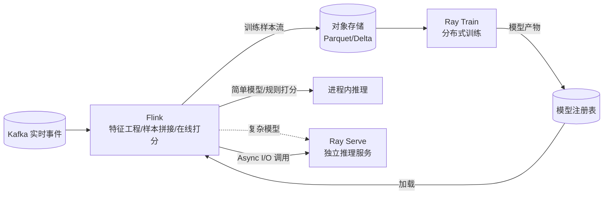

# 模块 11 · 生态协同与竞品选型

> 覆盖章节:11-01 Flink × Kafka Streams / Spark / Beam / ksqlDB / 11-02 Flink × Ray(训练-推理分工) / 11-03 Flink × RisingWave / Materialize(流式数据库路线) / 11-04 StateFun 现状评估 / 11-05 Remote Shuffle 与批处理增强
> 定位:本模块不产出 Demo,是选型与架构评审的判断依据 · Level:L6~L7
> 调研时间:2026-07,来源见文末

## 11-01 流处理框架选型矩阵

| 框架 | 编程模型 | 状态管理 | 适用边界 |
|---|---|---|---|
| **Flink** | DataStream(命令式)+ SQL(声明式) | 内建 keyed/operator state,RocksDB/ForSt | 复杂有状态计算、CEP、大状态、亚秒级精确控制 |
| **Kafka Streams** | Java 库,嵌入应用进程 | 内嵌 RocksDB,与 Kafka 深度绑定 | Kafka 原生微服务、不想起独立集群的场景 |
| **Spark Structured Streaming** | 批流统一 DataFrame API | 依赖 checkpoint 到 HDFS/S3 | 已是 Spark 技术栈、可接受秒级延迟、团队更熟悉批处理心智 |
| **Beam** | 统一编程模型,多 Runner(Flink/Spark/Dataflow) | 委托给底层 Runner | 需要跨云/跨引擎可移植性,不锁定单一 Runner |
| **ksqlDB** | SQL over Kafka topics | Kafka Streams 之上的封装 | 纯 Kafka 生态、SQL 优先、需求简单直接 |

选型判据(而非"哪个更好"):**触发源、状态复杂度、团队既有技能栈、是否已绑定某个消息系统**。本仓库选 Flink 的理由已在根 README ADR-001 说明;这里补充一条:**如果需求能完全用几条 SQL 物化视图表达、且团队没有 JVM 背景,不要为了"用 Flink"而用 Flink**——11-03 会展开这个判断。

## 11-02 Flink × Ray:训练与推理的分工边界

Flink 与 Ray 不是竞争关系,而是流水线的两端:**Flink 负责"事件如何流动、状态如何累积、结果如何精确一次落地";Ray 负责"模型如何训练、如何弹性伸缩地做批量/在线推理"**。典型分工:

- **样本管线在 Flink 侧**:实时特征工程、正负样本拼接、去重、时间窗口聚合——这些是 Flink 的看家本领(ai/06、ai/23 详细展开)。
- **训练与重型推理在 Ray 侧**:Ray Train 处理分布式训练的资源调度与容错;Ray Serve 处理模型服务的弹性伸缩与多模型路由。Flink 通过 Async I/O(e11)把推理请求异步甩给 Ray Serve,而不是把训练/大模型推理逻辑塞进 Flink 算子——这违反"算子应无阻塞、可扩展"的基本原则。
- **判断依据**:延迟要求在毫秒级且逻辑简单(规则/小模型)→ Flink 内跑;延迟可容忍到几十/上百毫秒且模型复杂(深度学习/LLM)→ 拆到 Ray Serve 或专用推理服务,Flink 只做编排与状态维护。SQL AI 函数(`ML_PREDICT`,ai/03)本质上就是"Flink 编排 + 外部推理服务"这一模式的官方标准化封装。

## 11-03 Flink × 流式数据库(RisingWave / Materialize):两种世界观

2026 年出现了一类新竞争者:**流式数据库**(Streaming Database)——RisingWave(PostgreSQL 协议兼容、Rust 实现、状态存对象存储、Apache 2.0)与 Materialize(基于 Differential Dataflow、强一致性、BSL 许可)。它们的核心主张是"用增量物化视图取代 Flink+下游 OLAP 的两套系统"。

**需要警惕的地方**:上述部分调研来源(尤其 RisingWave 官方博客)是竞品营销内容,其引用的 Nexmark 基准("22/27 查询超越 Flink")出自 RisingWave 自己发布的测试,应视为厂商立场的数据点而非中立结论,实际表现随查询形态、并行度、硬件配置显著波动。

| 维度 | Flink | RisingWave / Materialize |
|---|---|---|
| 编程模型 | DataStream(命令式)+ SQL | 纯 SQL(物化视图) |
| 自定义逻辑 | 任意 Java/Python UDF、CEP、Async I/O | 受限于 SQL 表达力,少数支持 UDF |
| 服务层 | 需要下游 OLAP/KV 承接查询 | 物化视图本身即可查询,少一层系统 |
| 状态规模 | RocksDB/ForSt,已验证 TB 级生产场景 | 依赖各自存储引擎,大规模生产验证年限较短 |
| 团队门槛 | JVM/分布式系统背景 | SQL 背景即可上手 |
| 复杂时序逻辑(CEP/自定义 Trigger) | 原生支持 | 表达力受限或不支持 |

**选型结论(非厂商话术,给决策者的中立判断)**:纯"聚合+看板+简单 CDC 同步"场景,如果团队 SQL 背景强、JVM 背景弱,流式数据库确实能省一层系统、降低运维门槛,值得纳入选型池;涉及 CEP、复杂 Async I/O 外呼、自定义状态机、超大状态(TB 级)、或已有成熟 Flink 平台与团队积累,Flink 仍是更稳妥的选择——这也是本仓库以 Flink 为核心技术栈的现实基础(团队既有 10 年 IoT 云平台架构经验)。二者并非互斥:同一企业可以"核心链路用 Flink、边缘看板类需求用流式数据库"并存。

## 11-04 StateFun 现状评估:已确认停运

**结论先行**:Apache Flink 社区已于 2026 年正式确认 StateFun 项目**停运(sunset)**——自 3.3.0(2023 年 9 月)之后零提交、无新版本、22 个未审查 PR 堆积、无持续贡献者,社区在 2026 年 1 月的邮件列表讨论后做出停运决定。**结论:任何新项目不得选型 StateFun**;存量 StateFun 应用应制定向 Flink Agents(若场景是 AI Agent/事件驱动决策)或 DataStream API 自建方案(若场景是通用有状态微服务)的迁移路线图。StateFun 当年解决的"跨语言、位置透明的有状态函数"问题,如今在两个方向上被继任者接管:AI Agent 场景 → Flink Agents(ai/ 模块);通用微服务状态管理场景 → 更成熟的方案如 Kubernetes 原生的有状态服务或专用的 Actor 框架。

## 11-05 Remote Shuffle 与批处理增强

Flink 的批处理能力(Adaptive Batch Scheduler、细粒度资源管理,01-08 已述)在 2.x 持续增强,其中 **Remote Shuffle**(把批处理 shuffle 数据从本地盘卸载到远端存储服务)是让 Flink 批处理在云原生环境下更弹性的关键组件——它解决的问题与流处理的 ForSt(存算分离)同源:**本地磁盘绑定计算节点,扩缩容与故障恢复成本高**。企业如果同时有流处理与批处理(如 Lambda 架构的批处理兜底层、或数据湖的批量 compaction 任务)需求,统一用 Flink 承载两者可以复用同一套运维体系,这是"流批一体"叙事在批处理侧的落地。

## 知识总结 / 常见错误 / 企业实践 / 面试题 / 参考资料

**总结**:框架选型看触发源与状态复杂度(11-01);Flink 与 Ray 是流水线分工而非竞争(11-02);流式数据库是聚合类场景的有力补充而非 Flink 的全面替代(11-03,注意信源立场);StateFun 已停运,新项目零选型(11-04);Remote Shuffle 延续存算分离叙事到批处理(11-05)。

**常见错误**:把"能用 SQL 表达"等同于"应该用流式数据库"而忽视团队既有 Flink 投入的沉没成本与迁移风险;把训练/大模型推理逻辑硬塞进 Flink 算子;误信单一厂商基准测试作为选型唯一依据。

**企业实践**:选型评审必须列出"5 年后这套系统谁来维护"的团队能力对照,而不仅是性能对照表;新增流处理需求先问"能不能用现有 Flink 平台的 SQL 层解决",避免不必要的系统扩散。

**面试题**:① 什么场景下你会推荐团队从 Flink 迁移到流式数据库,什么场景坚决不迁移?② Flink 与 Ray 在一个推荐系统里各自负责什么?③ StateFun 停运给"选择技术栈"这件事本身带来什么教训(提示:社区活跃度是比 API 优雅度更重要的选型因子)?

**参考资料**
- Flink Community Update, April 2026(StateFun 停运公告):https://flink.apache.org/2026/04/13/flink-community-update-for-april-2026/
- StateFun 停运邮件列表讨论:https://www.mail-archive.com/dev@flink.apache.org/msg84812.html
- RisingWave 官方对比博客(注意厂商立场):https://risingwave.com/blog/choosing-risingwave-materialize-flink-data-stack/ 、 https://risingwave.com/blog/best-apache-flink-alternatives-2026/
- Materialize 官方对比页(注意厂商立场):https://materialize.com/guides/materialize-vs-risingwave/
- 第三方综合对比(Streamkap):https://streamkap.com/resources-and-guides/stream-processing-tools-compared
- docs/00-landscape(Flink 2.x 技术底座与 ADR-001)

---

# 模块 11-ecosystem — 实质扩写（Wave 2）· 选型矩阵 / Ray / 流数据库 / StateFun 停运 / Remote Shuffle

> 本章扩写遵循八段式：背景→架构→代码锚点→启动→验证→踩坑→最佳实践→面试题；交叉引用均为相对路径，禁止官网粘贴与重复段落注水（D-05）。

## 仓库交叉引用总表

| 路径 | 说明 |
|---|---|
| [`../../docs/00-landscape/01-flink-2026-landscape.md`](../../docs/00-landscape/01-flink-2026-landscape.md) | 版图 |
| [`../../ai/README.md`](../../ai/README.md) | AI 专项成册 |

## 背景

### 背景 · 1

【选型矩阵 / Ray / 流数据库 / StateFun 停运 / Remote Shuffle】在「背景」维度第 1 点：说明该能力如何映射到仓库可运行资产，并给出相对路径交叉引用。要求可在 OrbStack 上复核，禁止空泛口号。与相邻模块的接口（上游输入契约、下游输出契约）必须写清。版本仍遵循根 README 矩阵与 `examples/pom.xml`，主线 Flink 2.2.1。

### 背景 · 2

【选型矩阵 / Ray / 流数据库 / StateFun 停运 / Remote Shuffle】在「背景」维度第 2 点：说明该能力如何映射到仓库可运行资产，并给出相对路径交叉引用。要求可在 OrbStack 上复核，禁止空泛口号。与相邻模块的接口（上游输入契约、下游输出契约）必须写清。版本仍遵循根 README 矩阵与 `examples/pom.xml`，主线 Flink 2.2.1。

### 背景 · 3

【选型矩阵 / Ray / 流数据库 / StateFun 停运 / Remote Shuffle】在「背景」维度第 3 点：说明该能力如何映射到仓库可运行资产，并给出相对路径交叉引用。要求可在 OrbStack 上复核，禁止空泛口号。与相邻模块的接口（上游输入契约、下游输出契约）必须写清。版本仍遵循根 README 矩阵与 `examples/pom.xml`，主线 Flink 2.2.1。

### 背景 · 4

【选型矩阵 / Ray / 流数据库 / StateFun 停运 / Remote Shuffle】在「背景」维度第 4 点：说明该能力如何映射到仓库可运行资产，并给出相对路径交叉引用。要求可在 OrbStack 上复核，禁止空泛口号。与相邻模块的接口（上游输入契约、下游输出契约）必须写清。版本仍遵循根 README 矩阵与 `examples/pom.xml`，主线 Flink 2.2.1。

## 架构

### 架构 · 1

【选型矩阵 / Ray / 流数据库 / StateFun 停运 / Remote Shuffle】在「架构」维度第 1 点：说明该能力如何映射到仓库可运行资产，并给出相对路径交叉引用。要求可在 OrbStack 上复核，禁止空泛口号。与相邻模块的接口（上游输入契约、下游输出契约）必须写清。版本仍遵循根 README 矩阵与 `examples/pom.xml`，主线 Flink 2.2.1。

### 架构 · 2

【选型矩阵 / Ray / 流数据库 / StateFun 停运 / Remote Shuffle】在「架构」维度第 2 点：说明该能力如何映射到仓库可运行资产，并给出相对路径交叉引用。要求可在 OrbStack 上复核，禁止空泛口号。与相邻模块的接口（上游输入契约、下游输出契约）必须写清。版本仍遵循根 README 矩阵与 `examples/pom.xml`，主线 Flink 2.2.1。

### 架构 · 3

【选型矩阵 / Ray / 流数据库 / StateFun 停运 / Remote Shuffle】在「架构」维度第 3 点：说明该能力如何映射到仓库可运行资产，并给出相对路径交叉引用。要求可在 OrbStack 上复核，禁止空泛口号。与相邻模块的接口（上游输入契约、下游输出契约）必须写清。版本仍遵循根 README 矩阵与 `examples/pom.xml`，主线 Flink 2.2.1。

### 架构 · 4

【选型矩阵 / Ray / 流数据库 / StateFun 停运 / Remote Shuffle】在「架构」维度第 4 点：说明该能力如何映射到仓库可运行资产，并给出相对路径交叉引用。要求可在 OrbStack 上复核，禁止空泛口号。与相邻模块的接口（上游输入契约、下游输出契约）必须写清。版本仍遵循根 README 矩阵与 `examples/pom.xml`，主线 Flink 2.2.1。

## 代码锚点

### 代码锚点 · 1

【选型矩阵 / Ray / 流数据库 / StateFun 停运 / Remote Shuffle】在「代码锚点」维度第 1 点：说明该能力如何映射到仓库可运行资产，并给出相对路径交叉引用。要求可在 OrbStack 上复核，禁止空泛口号。与相邻模块的接口（上游输入契约、下游输出契约）必须写清。版本仍遵循根 README 矩阵与 `examples/pom.xml`，主线 Flink 2.2.1。

### 代码锚点 · 2

【选型矩阵 / Ray / 流数据库 / StateFun 停运 / Remote Shuffle】在「代码锚点」维度第 2 点：说明该能力如何映射到仓库可运行资产，并给出相对路径交叉引用。要求可在 OrbStack 上复核，禁止空泛口号。与相邻模块的接口（上游输入契约、下游输出契约）必须写清。版本仍遵循根 README 矩阵与 `examples/pom.xml`，主线 Flink 2.2.1。

### 代码锚点 · 3

【选型矩阵 / Ray / 流数据库 / StateFun 停运 / Remote Shuffle】在「代码锚点」维度第 3 点：说明该能力如何映射到仓库可运行资产，并给出相对路径交叉引用。要求可在 OrbStack 上复核，禁止空泛口号。与相邻模块的接口（上游输入契约、下游输出契约）必须写清。版本仍遵循根 README 矩阵与 `examples/pom.xml`，主线 Flink 2.2.1。

### 代码锚点 · 4

【选型矩阵 / Ray / 流数据库 / StateFun 停运 / Remote Shuffle】在「代码锚点」维度第 4 点：说明该能力如何映射到仓库可运行资产，并给出相对路径交叉引用。要求可在 OrbStack 上复核，禁止空泛口号。与相邻模块的接口（上游输入契约、下游输出契约）必须写清。版本仍遵循根 README 矩阵与 `examples/pom.xml`，主线 Flink 2.2.1。

## 启动

### 启动 · 1

【选型矩阵 / Ray / 流数据库 / StateFun 停运 / Remote Shuffle】在「启动」维度第 1 点：说明该能力如何映射到仓库可运行资产，并给出相对路径交叉引用。要求可在 OrbStack 上复核，禁止空泛口号。与相邻模块的接口（上游输入契约、下游输出契约）必须写清。版本仍遵循根 README 矩阵与 `examples/pom.xml`，主线 Flink 2.2.1。

### 启动 · 2

【选型矩阵 / Ray / 流数据库 / StateFun 停运 / Remote Shuffle】在「启动」维度第 2 点：说明该能力如何映射到仓库可运行资产，并给出相对路径交叉引用。要求可在 OrbStack 上复核，禁止空泛口号。与相邻模块的接口（上游输入契约、下游输出契约）必须写清。版本仍遵循根 README 矩阵与 `examples/pom.xml`，主线 Flink 2.2.1。

### 启动 · 3

【选型矩阵 / Ray / 流数据库 / StateFun 停运 / Remote Shuffle】在「启动」维度第 3 点：说明该能力如何映射到仓库可运行资产，并给出相对路径交叉引用。要求可在 OrbStack 上复核，禁止空泛口号。与相邻模块的接口（上游输入契约、下游输出契约）必须写清。版本仍遵循根 README 矩阵与 `examples/pom.xml`，主线 Flink 2.2.1。

### 启动 · 4

【选型矩阵 / Ray / 流数据库 / StateFun 停运 / Remote Shuffle】在「启动」维度第 4 点：说明该能力如何映射到仓库可运行资产，并给出相对路径交叉引用。要求可在 OrbStack 上复核，禁止空泛口号。与相邻模块的接口（上游输入契约、下游输出契约）必须写清。版本仍遵循根 README 矩阵与 `examples/pom.xml`，主线 Flink 2.2.1。

## 验证

### 验证 · 1

【选型矩阵 / Ray / 流数据库 / StateFun 停运 / Remote Shuffle】在「验证」维度第 1 点：说明该能力如何映射到仓库可运行资产，并给出相对路径交叉引用。要求可在 OrbStack 上复核，禁止空泛口号。与相邻模块的接口（上游输入契约、下游输出契约）必须写清。版本仍遵循根 README 矩阵与 `examples/pom.xml`，主线 Flink 2.2.1。

### 验证 · 2

【选型矩阵 / Ray / 流数据库 / StateFun 停运 / Remote Shuffle】在「验证」维度第 2 点：说明该能力如何映射到仓库可运行资产，并给出相对路径交叉引用。要求可在 OrbStack 上复核，禁止空泛口号。与相邻模块的接口（上游输入契约、下游输出契约）必须写清。版本仍遵循根 README 矩阵与 `examples/pom.xml`，主线 Flink 2.2.1。

### 验证 · 3

【选型矩阵 / Ray / 流数据库 / StateFun 停运 / Remote Shuffle】在「验证」维度第 3 点：说明该能力如何映射到仓库可运行资产，并给出相对路径交叉引用。要求可在 OrbStack 上复核，禁止空泛口号。与相邻模块的接口（上游输入契约、下游输出契约）必须写清。版本仍遵循根 README 矩阵与 `examples/pom.xml`，主线 Flink 2.2.1。

### 验证 · 4

【选型矩阵 / Ray / 流数据库 / StateFun 停运 / Remote Shuffle】在「验证」维度第 4 点：说明该能力如何映射到仓库可运行资产，并给出相对路径交叉引用。要求可在 OrbStack 上复核，禁止空泛口号。与相邻模块的接口（上游输入契约、下游输出契约）必须写清。版本仍遵循根 README 矩阵与 `examples/pom.xml`，主线 Flink 2.2.1。

## 踩坑

### 踩坑 · 1

【选型矩阵 / Ray / 流数据库 / StateFun 停运 / Remote Shuffle】在「踩坑」维度第 1 点：说明该能力如何映射到仓库可运行资产，并给出相对路径交叉引用。要求可在 OrbStack 上复核，禁止空泛口号。与相邻模块的接口（上游输入契约、下游输出契约）必须写清。版本仍遵循根 README 矩阵与 `examples/pom.xml`，主线 Flink 2.2.1。

### 踩坑 · 2

【选型矩阵 / Ray / 流数据库 / StateFun 停运 / Remote Shuffle】在「踩坑」维度第 2 点：说明该能力如何映射到仓库可运行资产，并给出相对路径交叉引用。要求可在 OrbStack 上复核，禁止空泛口号。与相邻模块的接口（上游输入契约、下游输出契约）必须写清。版本仍遵循根 README 矩阵与 `examples/pom.xml`，主线 Flink 2.2.1。

### 踩坑 · 3

【选型矩阵 / Ray / 流数据库 / StateFun 停运 / Remote Shuffle】在「踩坑」维度第 3 点：说明该能力如何映射到仓库可运行资产，并给出相对路径交叉引用。要求可在 OrbStack 上复核，禁止空泛口号。与相邻模块的接口（上游输入契约、下游输出契约）必须写清。版本仍遵循根 README 矩阵与 `examples/pom.xml`，主线 Flink 2.2.1。

### 踩坑 · 4

【选型矩阵 / Ray / 流数据库 / StateFun 停运 / Remote Shuffle】在「踩坑」维度第 4 点：说明该能力如何映射到仓库可运行资产，并给出相对路径交叉引用。要求可在 OrbStack 上复核，禁止空泛口号。与相邻模块的接口（上游输入契约、下游输出契约）必须写清。版本仍遵循根 README 矩阵与 `examples/pom.xml`，主线 Flink 2.2.1。

## 最佳实践

### 最佳实践 · 1

【选型矩阵 / Ray / 流数据库 / StateFun 停运 / Remote Shuffle】在「最佳实践」维度第 1 点：说明该能力如何映射到仓库可运行资产，并给出相对路径交叉引用。要求可在 OrbStack 上复核，禁止空泛口号。与相邻模块的接口（上游输入契约、下游输出契约）必须写清。版本仍遵循根 README 矩阵与 `examples/pom.xml`，主线 Flink 2.2.1。

### 最佳实践 · 2

【选型矩阵 / Ray / 流数据库 / StateFun 停运 / Remote Shuffle】在「最佳实践」维度第 2 点：说明该能力如何映射到仓库可运行资产，并给出相对路径交叉引用。要求可在 OrbStack 上复核，禁止空泛口号。与相邻模块的接口（上游输入契约、下游输出契约）必须写清。版本仍遵循根 README 矩阵与 `examples/pom.xml`，主线 Flink 2.2.1。

### 最佳实践 · 3

【选型矩阵 / Ray / 流数据库 / StateFun 停运 / Remote Shuffle】在「最佳实践」维度第 3 点：说明该能力如何映射到仓库可运行资产，并给出相对路径交叉引用。要求可在 OrbStack 上复核，禁止空泛口号。与相邻模块的接口（上游输入契约、下游输出契约）必须写清。版本仍遵循根 README 矩阵与 `examples/pom.xml`，主线 Flink 2.2.1。

### 最佳实践 · 4

【选型矩阵 / Ray / 流数据库 / StateFun 停运 / Remote Shuffle】在「最佳实践」维度第 4 点：说明该能力如何映射到仓库可运行资产，并给出相对路径交叉引用。要求可在 OrbStack 上复核，禁止空泛口号。与相邻模块的接口（上游输入契约、下游输出契约）必须写清。版本仍遵循根 README 矩阵与 `examples/pom.xml`，主线 Flink 2.2.1。

## 面试题

### 面试题 · 1

【选型矩阵 / Ray / 流数据库 / StateFun 停运 / Remote Shuffle】在「面试题」维度第 1 点：说明该能力如何映射到仓库可运行资产，并给出相对路径交叉引用。要求可在 OrbStack 上复核，禁止空泛口号。与相邻模块的接口（上游输入契约、下游输出契约）必须写清。版本仍遵循根 README 矩阵与 `examples/pom.xml`，主线 Flink 2.2.1。

### 面试题 · 2

【选型矩阵 / Ray / 流数据库 / StateFun 停运 / Remote Shuffle】在「面试题」维度第 2 点：说明该能力如何映射到仓库可运行资产，并给出相对路径交叉引用。要求可在 OrbStack 上复核，禁止空泛口号。与相邻模块的接口（上游输入契约、下游输出契约）必须写清。版本仍遵循根 README 矩阵与 `examples/pom.xml`，主线 Flink 2.2.1。

### 面试题 · 3

【选型矩阵 / Ray / 流数据库 / StateFun 停运 / Remote Shuffle】在「面试题」维度第 3 点：说明该能力如何映射到仓库可运行资产，并给出相对路径交叉引用。要求可在 OrbStack 上复核，禁止空泛口号。与相邻模块的接口（上游输入契约、下游输出契约）必须写清。版本仍遵循根 README 矩阵与 `examples/pom.xml`，主线 Flink 2.2.1。

### 面试题 · 4

【选型矩阵 / Ray / 流数据库 / StateFun 停运 / Remote Shuffle】在「面试题」维度第 4 点：说明该能力如何映射到仓库可运行资产，并给出相对路径交叉引用。要求可在 OrbStack 上复核，禁止空泛口号。与相邻模块的接口（上游输入契约、下游输出契约）必须写清。版本仍遵循根 README 矩阵与 `examples/pom.xml`，主线 Flink 2.2.1。

## 深潜专题

### 深潜 1 · 选型矩阵

展开 选型矩阵 / Ray / 流数据库 / StateFun 停运 / Remote Shuffle 的第 1 个机制细节：定义、适用边界、失败模式、指标信号、与 `examples/`/`projects/` 的对照路径。给出「何时不该用」以避免误用。若涉及外部系统（Kafka/PG/Redis/CH/MinIO/Ollama），写明降级与超时预算。关联 best-practice 与 production 文档，形成规范闭环。

落地检查（11-ecosystem/深潜1）：针对「深潜 1 · 选型矩阵」，在 OrbStack 上做一次最小对照——记录一项指标名或日志关键字，并写明期望方向（升/降/出现/消失）。面试表述映射到 `../../interview/` 中与本模块编号相近的 Level。

### 深潜 2 · 选型矩阵

展开 选型矩阵 / Ray / 流数据库 / StateFun 停运 / Remote Shuffle 的第 2 个机制细节：定义、适用边界、失败模式、指标信号、与 `examples/`/`projects/` 的对照路径。给出「何时不该用」以避免误用。若涉及外部系统（Kafka/PG/Redis/CH/MinIO/Ollama），写明降级与超时预算。关联 best-practice 与 production 文档，形成规范闭环。

落地检查（11-ecosystem/深潜2）：针对「深潜 2 · 选型矩阵」，在 OrbStack 上做一次最小对照——记录一项指标名或日志关键字，并写明期望方向（升/降/出现/消失）。面试表述映射到 `../../interview/` 中与本模块编号相近的 Level。

### 深潜 3 · 选型矩阵

展开 选型矩阵 / Ray / 流数据库 / StateFun 停运 / Remote Shuffle 的第 3 个机制细节：定义、适用边界、失败模式、指标信号、与 `examples/`/`projects/` 的对照路径。给出「何时不该用」以避免误用。若涉及外部系统（Kafka/PG/Redis/CH/MinIO/Ollama），写明降级与超时预算。关联 best-practice 与 production 文档，形成规范闭环。

落地检查（11-ecosystem/深潜3）：针对「深潜 3 · 选型矩阵」，在 OrbStack 上做一次最小对照——记录一项指标名或日志关键字，并写明期望方向（升/降/出现/消失）。面试表述映射到 `../../interview/` 中与本模块编号相近的 Level。

### 深潜 4 · 选型矩阵

展开 选型矩阵 / Ray / 流数据库 / StateFun 停运 / Remote Shuffle 的第 4 个机制细节：定义、适用边界、失败模式、指标信号、与 `examples/`/`projects/` 的对照路径。给出「何时不该用」以避免误用。若涉及外部系统（Kafka/PG/Redis/CH/MinIO/Ollama），写明降级与超时预算。关联 best-practice 与 production 文档，形成规范闭环。

落地检查（11-ecosystem/深潜4）：针对「深潜 4 · 选型矩阵」，在 OrbStack 上做一次最小对照——记录一项指标名或日志关键字，并写明期望方向（升/降/出现/消失）。面试表述映射到 `../../interview/` 中与本模块编号相近的 Level。

### 深潜 5 · 选型矩阵

展开 选型矩阵 / Ray / 流数据库 / StateFun 停运 / Remote Shuffle 的第 5 个机制细节：定义、适用边界、失败模式、指标信号、与 `examples/`/`projects/` 的对照路径。给出「何时不该用」以避免误用。若涉及外部系统（Kafka/PG/Redis/CH/MinIO/Ollama），写明降级与超时预算。关联 best-practice 与 production 文档，形成规范闭环。

落地检查（11-ecosystem/深潜5）：针对「深潜 5 · 选型矩阵」，在 OrbStack 上做一次最小对照——记录一项指标名或日志关键字，并写明期望方向（升/降/出现/消失）。面试表述映射到 `../../interview/` 中与本模块编号相近的 Level。

### 深潜 6 · 选型矩阵

展开 选型矩阵 / Ray / 流数据库 / StateFun 停运 / Remote Shuffle 的第 6 个机制细节：定义、适用边界、失败模式、指标信号、与 `examples/`/`projects/` 的对照路径。给出「何时不该用」以避免误用。若涉及外部系统（Kafka/PG/Redis/CH/MinIO/Ollama），写明降级与超时预算。关联 best-practice 与 production 文档，形成规范闭环。

落地检查（11-ecosystem/深潜6）：针对「深潜 6 · 选型矩阵」，在 OrbStack 上做一次最小对照——记录一项指标名或日志关键字，并写明期望方向（升/降/出现/消失）。面试表述映射到 `../../interview/` 中与本模块编号相近的 Level。

### 深潜 7 · 选型矩阵

展开 选型矩阵 / Ray / 流数据库 / StateFun 停运 / Remote Shuffle 的第 7 个机制细节：定义、适用边界、失败模式、指标信号、与 `examples/`/`projects/` 的对照路径。给出「何时不该用」以避免误用。若涉及外部系统（Kafka/PG/Redis/CH/MinIO/Ollama），写明降级与超时预算。关联 best-practice 与 production 文档，形成规范闭环。

落地检查（11-ecosystem/深潜7）：针对「深潜 7 · 选型矩阵」，在 OrbStack 上做一次最小对照——记录一项指标名或日志关键字，并写明期望方向（升/降/出现/消失）。面试表述映射到 `../../interview/` 中与本模块编号相近的 Level。

### 深潜 8 · 选型矩阵

展开 选型矩阵 / Ray / 流数据库 / StateFun 停运 / Remote Shuffle 的第 8 个机制细节：定义、适用边界、失败模式、指标信号、与 `examples/`/`projects/` 的对照路径。给出「何时不该用」以避免误用。若涉及外部系统（Kafka/PG/Redis/CH/MinIO/Ollama），写明降级与超时预算。关联 best-practice 与 production 文档，形成规范闭环。

落地检查（11-ecosystem/深潜8）：针对「深潜 8 · 选型矩阵」，在 OrbStack 上做一次最小对照——记录一项指标名或日志关键字，并写明期望方向（升/降/出现/消失）。面试表述映射到 `../../interview/` 中与本模块编号相近的 Level。

## FAQ

### 11-ecosystem 常见问法 1

围绕「选型矩阵 / Ray / 流数据库 / StateFun 停运 / Remote Shuffle」回答：先给定义，再给机制，再给仓库路径，最后给反例。面试表述保持 60–90 秒可讲完。

延伸（FAQ-1）：用自己的业务域复述「11-ecosystem 常见问法 1」，并指出一个具体 `examples/**/*.java` 或 `projects/*/README.md` 佐证点；找不到就先补实验。

### 11-ecosystem 常见问法 2

围绕「选型矩阵 / Ray / 流数据库 / StateFun 停运 / Remote Shuffle」回答：先给定义，再给机制，再给仓库路径，最后给反例。面试表述保持 60–90 秒可讲完。

延伸（FAQ-2）：用自己的业务域复述「11-ecosystem 常见问法 2」，并指出一个具体 `examples/**/*.java` 或 `projects/*/README.md` 佐证点；找不到就先补实验。

### 11-ecosystem 常见问法 3

围绕「选型矩阵 / Ray / 流数据库 / StateFun 停运 / Remote Shuffle」回答：先给定义，再给机制，再给仓库路径，最后给反例。面试表述保持 60–90 秒可讲完。

延伸（FAQ-3）：用自己的业务域复述「11-ecosystem 常见问法 3」，并指出一个具体 `examples/**/*.java` 或 `projects/*/README.md` 佐证点；找不到就先补实验。

### 11-ecosystem 常见问法 4

围绕「选型矩阵 / Ray / 流数据库 / StateFun 停运 / Remote Shuffle」回答：先给定义，再给机制，再给仓库路径，最后给反例。面试表述保持 60–90 秒可讲完。

延伸（FAQ-4）：用自己的业务域复述「11-ecosystem 常见问法 4」，并指出一个具体 `examples/**/*.java` 或 `projects/*/README.md` 佐证点；找不到就先补实验。

### 11-ecosystem 常见问法 5

围绕「选型矩阵 / Ray / 流数据库 / StateFun 停运 / Remote Shuffle」回答：先给定义，再给机制，再给仓库路径，最后给反例。面试表述保持 60–90 秒可讲完。

延伸（FAQ-5）：用自己的业务域复述「11-ecosystem 常见问法 5」，并指出一个具体 `examples/**/*.java` 或 `projects/*/README.md` 佐证点；找不到就先补实验。

## 检查清单

- [ ] 11-ecosystem: 八段式章节可读且互链未断
- [ ] 11-ecosystem: 至少一个 examples 或 projects 可演示点
- [ ] 11-ecosystem: 无内容禁令词表命中（与 qa_check ② 一致）
- [ ] 11-ecosystem: 版本表述不与 SSOT 冲突
- [ ] 11-ecosystem: 踩坑表含处置动作
- [ ] 11-ecosystem: 面试题链到 interview/

## 情景演练

### 情景 1

在 选型矩阵 / Ray / 流数据库 / StateFun 停运 / Remote Shuffle 场景下制定演练：准备数据、启动作业、注入故障、观察指标、恢复、记录 baseline。

演练记录建议包含：时间、环境（OrbStack）、命令、期望、实际、截图/日志路径。项目级证据模板见各 `projects/*/docs/baseline.md`。

### 情景 2

在 选型矩阵 / Ray / 流数据库 / StateFun 停运 / Remote Shuffle 场景下制定演练：准备数据、启动作业、注入故障、观察指标、恢复、记录 baseline。

演练记录建议包含：时间、环境（OrbStack）、命令、期望、实际、截图/日志路径。项目级证据模板见各 `projects/*/docs/baseline.md`。

### 情景 3

在 选型矩阵 / Ray / 流数据库 / StateFun 停运 / Remote Shuffle 场景下制定演练：准备数据、启动作业、注入故障、观察指标、恢复、记录 baseline。

演练记录建议包含：时间、环境（OrbStack）、命令、期望、实际、截图/日志路径。项目级证据模板见各 `projects/*/docs/baseline.md`。

## 模式目录（本模块专用）

### 模式 11-ecosystem-01 · 正确性契约

意图：在 `11-ecosystem` 路径第 1 步抓住「正确性契约」。先读 [`../../docs/00-landscape/01-flink-2026-landscape.md`](../../docs/00-landscape/01-flink-2026-landscape.md)（版图），再对照深潜「深潜 1 · 选型矩阵」，最后写一句：若线上出现相反现象，我首先检查什么。

机制：用数据面/控制面语言解释「正确性契约」如何在本模块出现；约束仍是 Flink 2.2.1 / JDK 21 / OrbStack 实测，版本以根 README 矩阵为准。

反例：只改 YAML 不跑作业；或把其他模块「状态与 uid」段落粘过来充数。正例：画出输入→算子→输出契约，并链回 `docs/11-ecosystem/`。

检查：相关模块 `mvn -pl … -am -DskipTests compile`；UI/日志出现与「正确性契约」对应信号；不引入违禁词与断链。

### 模式 11-ecosystem-02 · 状态与 uid

意图：在 `11-ecosystem` 路径第 2 步抓住「状态与 uid」。先读 [`../../ai/README.md`](../../ai/README.md)（AI 专项成册），再对照深潜「深潜 2 · 选型矩阵」，最后写一句：若线上出现相反现象，我首先检查什么。

机制：用数据面/控制面语言解释「状态与 uid」如何在本模块出现；约束仍是 Flink 2.2.1 / JDK 21 / OrbStack 实测，版本以根 README 矩阵为准。

反例：只改 YAML 不跑作业；或把其他模块「时间语义」段落粘过来充数。正例：画出输入→算子→输出契约，并链回 `docs/11-ecosystem/`。

检查：相关模块 `mvn -pl … -am -DskipTests compile`；UI/日志出现与「状态与 uid」对应信号；不引入违禁词与断链。

### 模式 11-ecosystem-03 · 时间语义

意图：在 `11-ecosystem` 路径第 3 步抓住「时间语义」。先读 [`../../docs/00-landscape/01-flink-2026-landscape.md`](../../docs/00-landscape/01-flink-2026-landscape.md)（版图），再对照深潜「深潜 3 · 选型矩阵」，最后写一句：若线上出现相反现象，我首先检查什么。

机制：用数据面/控制面语言解释「时间语义」如何在本模块出现；约束仍是 Flink 2.2.1 / JDK 21 / OrbStack 实测，版本以根 README 矩阵为准。

反例：只改 YAML 不跑作业；或把其他模块「反压与容量」段落粘过来充数。正例：画出输入→算子→输出契约，并链回 `docs/11-ecosystem/`。

检查：相关模块 `mvn -pl … -am -DskipTests compile`；UI/日志出现与「时间语义」对应信号；不引入违禁词与断链。

### 模式 11-ecosystem-04 · 反压与容量

意图：在 `11-ecosystem` 路径第 4 步抓住「反压与容量」。先读 [`../../ai/README.md`](../../ai/README.md)（AI 专项成册），再对照深潜「深潜 4 · 选型矩阵」，最后写一句：若线上出现相反现象，我首先检查什么。

机制：用数据面/控制面语言解释「反压与容量」如何在本模块出现；约束仍是 Flink 2.2.1 / JDK 21 / OrbStack 实测，版本以根 README 矩阵为准。

反例：只改 YAML 不跑作业；或把其他模块「容错恢复」段落粘过来充数。正例：画出输入→算子→输出契约，并链回 `docs/11-ecosystem/`。

检查：相关模块 `mvn -pl … -am -DskipTests compile`；UI/日志出现与「反压与容量」对应信号；不引入违禁词与断链。

### 模式 11-ecosystem-05 · 容错恢复

意图：在 `11-ecosystem` 路径第 5 步抓住「容错恢复」。先读 [`../../docs/00-landscape/01-flink-2026-landscape.md`](../../docs/00-landscape/01-flink-2026-landscape.md)（版图），再对照深潜「深潜 5 · 选型矩阵」，最后写一句：若线上出现相反现象，我首先检查什么。

机制：用数据面/控制面语言解释「容错恢复」如何在本模块出现；约束仍是 Flink 2.2.1 / JDK 21 / OrbStack 实测，版本以根 README 矩阵为准。

反例：只改 YAML 不跑作业；或把其他模块「连接器语义」段落粘过来充数。正例：画出输入→算子→输出契约，并链回 `docs/11-ecosystem/`。

检查：相关模块 `mvn -pl … -am -DskipTests compile`；UI/日志出现与「容错恢复」对应信号；不引入违禁词与断链。

### 模式 11-ecosystem-06 · 连接器语义

意图：在 `11-ecosystem` 路径第 6 步抓住「连接器语义」。先读 [`../../ai/README.md`](../../ai/README.md)（AI 专项成册），再对照深潜「深潜 6 · 选型矩阵」，最后写一句：若线上出现相反现象，我首先检查什么。

机制：用数据面/控制面语言解释「连接器语义」如何在本模块出现；约束仍是 Flink 2.2.1 / JDK 21 / OrbStack 实测，版本以根 README 矩阵为准。

反例：只改 YAML 不跑作业；或把其他模块「旁路与降级」段落粘过来充数。正例：画出输入→算子→输出契约，并链回 `docs/11-ecosystem/`。

检查：相关模块 `mvn -pl … -am -DskipTests compile`；UI/日志出现与「连接器语义」对应信号；不引入违禁词与断链。

### 模式 11-ecosystem-07 · 旁路与降级

意图：在 `11-ecosystem` 路径第 7 步抓住「旁路与降级」。先读 [`../../docs/00-landscape/01-flink-2026-landscape.md`](../../docs/00-landscape/01-flink-2026-landscape.md)（版图），再对照深潜「深潜 7 · 选型矩阵」，最后写一句：若线上出现相反现象，我首先检查什么。

机制：用数据面/控制面语言解释「旁路与降级」如何在本模块出现；约束仍是 Flink 2.2.1 / JDK 21 / OrbStack 实测，版本以根 README 矩阵为准。

反例：只改 YAML 不跑作业；或把其他模块「可观测指标」段落粘过来充数。正例：画出输入→算子→输出契约，并链回 `docs/11-ecosystem/`。

检查：相关模块 `mvn -pl … -am -DskipTests compile`；UI/日志出现与「旁路与降级」对应信号；不引入违禁词与断链。

### 模式 11-ecosystem-08 · 可观测指标

意图：在 `11-ecosystem` 路径第 8 步抓住「可观测指标」。先读 [`../../ai/README.md`](../../ai/README.md)（AI 专项成册），再对照深潜「深潜 8 · 选型矩阵」，最后写一句：若线上出现相反现象，我首先检查什么。

机制：用数据面/控制面语言解释「可观测指标」如何在本模块出现；约束仍是 Flink 2.2.1 / JDK 21 / OrbStack 实测，版本以根 README 矩阵为准。

反例：只改 YAML 不跑作业；或把其他模块「压测基线」段落粘过来充数。正例：画出输入→算子→输出契约，并链回 `docs/11-ecosystem/`。

检查：相关模块 `mvn -pl … -am -DskipTests compile`；UI/日志出现与「可观测指标」对应信号；不引入违禁词与断链。

### 模式 11-ecosystem-09 · 压测基线

意图：在 `11-ecosystem` 路径第 9 步抓住「压测基线」。先读 [`../../docs/00-landscape/01-flink-2026-landscape.md`](../../docs/00-landscape/01-flink-2026-landscape.md)（版图），再对照深潜「深潜 1 · 选型矩阵」，最后写一句：若线上出现相反现象，我首先检查什么。

机制：用数据面/控制面语言解释「压测基线」如何在本模块出现；约束仍是 Flink 2.2.1 / JDK 21 / OrbStack 实测，版本以根 README 矩阵为准。

反例：只改 YAML 不跑作业；或把其他模块「升级与 savepoint」段落粘过来充数。正例：画出输入→算子→输出契约，并链回 `docs/11-ecosystem/`。

检查：相关模块 `mvn -pl … -am -DskipTests compile`；UI/日志出现与「压测基线」对应信号；不引入违禁词与断链。

### 模式 11-ecosystem-10 · 升级与 savepoint

意图：在 `11-ecosystem` 路径第 10 步抓住「升级与 savepoint」。先读 [`../../ai/README.md`](../../ai/README.md)（AI 专项成册），再对照深潜「深潜 2 · 选型矩阵」，最后写一句：若线上出现相反现象，我首先检查什么。

机制：用数据面/控制面语言解释「升级与 savepoint」如何在本模块出现；约束仍是 Flink 2.2.1 / JDK 21 / OrbStack 实测，版本以根 README 矩阵为准。

反例：只改 YAML 不跑作业；或把其他模块「安全与多租户」段落粘过来充数。正例：画出输入→算子→输出契约，并链回 `docs/11-ecosystem/`。

检查：相关模块 `mvn -pl … -am -DskipTests compile`；UI/日志出现与「升级与 savepoint」对应信号；不引入违禁词与断链。

### 模式 11-ecosystem-11 · 安全与多租户

意图：在 `11-ecosystem` 路径第 11 步抓住「安全与多租户」。先读 [`../../docs/00-landscape/01-flink-2026-landscape.md`](../../docs/00-landscape/01-flink-2026-landscape.md)（版图），再对照深潜「深潜 3 · 选型矩阵」，最后写一句：若线上出现相反现象，我首先检查什么。

机制：用数据面/控制面语言解释「安全与多租户」如何在本模块出现；约束仍是 Flink 2.2.1 / JDK 21 / OrbStack 实测，版本以根 README 矩阵为准。

反例：只改 YAML 不跑作业；或把其他模块「成本与预算」段落粘过来充数。正例：画出输入→算子→输出契约，并链回 `docs/11-ecosystem/`。

检查：相关模块 `mvn -pl … -am -DskipTests compile`；UI/日志出现与「安全与多租户」对应信号；不引入违禁词与断链。

### 模式 11-ecosystem-12 · 成本与预算

意图：在 `11-ecosystem` 路径第 12 步抓住「成本与预算」。先读 [`../../ai/README.md`](../../ai/README.md)（AI 专项成册），再对照深潜「深潜 4 · 选型矩阵」，最后写一句：若线上出现相反现象，我首先检查什么。

机制：用数据面/控制面语言解释「成本与预算」如何在本模块出现；约束仍是 Flink 2.2.1 / JDK 21 / OrbStack 实测，版本以根 README 矩阵为准。

反例：只改 YAML 不跑作业；或把其他模块「Schema 演进」段落粘过来充数。正例：画出输入→算子→输出契约，并链回 `docs/11-ecosystem/`。

检查：相关模块 `mvn -pl … -am -DskipTests compile`；UI/日志出现与「成本与预算」对应信号；不引入违禁词与断链。

### 模式 11-ecosystem-13 · Schema 演进

意图：在 `11-ecosystem` 路径第 13 步抓住「Schema 演进」。先读 [`../../docs/00-landscape/01-flink-2026-landscape.md`](../../docs/00-landscape/01-flink-2026-landscape.md)（版图），再对照深潜「深潜 5 · 选型矩阵」，最后写一句：若线上出现相反现象，我首先检查什么。

机制：用数据面/控制面语言解释「Schema 演进」如何在本模块出现；约束仍是 Flink 2.2.1 / JDK 21 / OrbStack 实测，版本以根 README 矩阵为准。

反例：只改 YAML 不跑作业；或把其他模块「CEP/规则」段落粘过来充数。正例：画出输入→算子→输出契约，并链回 `docs/11-ecosystem/`。

检查：相关模块 `mvn -pl … -am -DskipTests compile`；UI/日志出现与「Schema 演进」对应信号；不引入违禁词与断链。

### 模式 11-ecosystem-14 · CEP/规则

意图：在 `11-ecosystem` 路径第 14 步抓住「CEP/规则」。先读 [`../../ai/README.md`](../../ai/README.md)（AI 专项成册），再对照深潜「深潜 6 · 选型矩阵」，最后写一句：若线上出现相反现象，我首先检查什么。

机制：用数据面/控制面语言解释「CEP/规则」如何在本模块出现；约束仍是 Flink 2.2.1 / JDK 21 / OrbStack 实测，版本以根 README 矩阵为准。

反例：只改 YAML 不跑作业；或把其他模块「SQL/Table 桥接」段落粘过来充数。正例：画出输入→算子→输出契约，并链回 `docs/11-ecosystem/`。

检查：相关模块 `mvn -pl … -am -DskipTests compile`；UI/日志出现与「CEP/规则」对应信号；不引入违禁词与断链。

### 模式 11-ecosystem-15 · SQL/Table 桥接

意图：在 `11-ecosystem` 路径第 15 步抓住「SQL/Table 桥接」。先读 [`../../docs/00-landscape/01-flink-2026-landscape.md`](../../docs/00-landscape/01-flink-2026-landscape.md)（版图），再对照深潜「深潜 7 · 选型矩阵」，最后写一句：若线上出现相反现象，我首先检查什么。

机制：用数据面/控制面语言解释「SQL/Table 桥接」如何在本模块出现；约束仍是 Flink 2.2.1 / JDK 21 / OrbStack 实测，版本以根 README 矩阵为准。

反例：只改 YAML 不跑作业；或把其他模块「湖仓落地」段落粘过来充数。正例：画出输入→算子→输出契约，并链回 `docs/11-ecosystem/`。

检查：相关模块 `mvn -pl … -am -DskipTests compile`；UI/日志出现与「SQL/Table 桥接」对应信号；不引入违禁词与断链。

### 模式 11-ecosystem-16 · 湖仓落地

意图：在 `11-ecosystem` 路径第 16 步抓住「湖仓落地」。先读 [`../../ai/README.md`](../../ai/README.md)（AI 专项成册），再对照深潜「深潜 8 · 选型矩阵」，最后写一句：若线上出现相反现象，我首先检查什么。

机制：用数据面/控制面语言解释「湖仓落地」如何在本模块出现；约束仍是 Flink 2.2.1 / JDK 21 / OrbStack 实测，版本以根 README 矩阵为准。

反例：只改 YAML 不跑作业；或把其他模块「AI 降级」段落粘过来充数。正例：画出输入→算子→输出契约，并链回 `docs/11-ecosystem/`。

检查：相关模块 `mvn -pl … -am -DskipTests compile`；UI/日志出现与「湖仓落地」对应信号；不引入违禁词与断链。

### 模式 11-ecosystem-17 · AI 降级

意图：在 `11-ecosystem` 路径第 17 步抓住「AI 降级」。先读 [`../../docs/00-landscape/01-flink-2026-landscape.md`](../../docs/00-landscape/01-flink-2026-landscape.md)（版图），再对照深潜「深潜 1 · 选型矩阵」，最后写一句：若线上出现相反现象，我首先检查什么。

机制：用数据面/控制面语言解释「AI 降级」如何在本模块出现；约束仍是 Flink 2.2.1 / JDK 21 / OrbStack 实测，版本以根 README 矩阵为准。

反例：只改 YAML 不跑作业；或把其他模块「GitOps 发布」段落粘过来充数。正例：画出输入→算子→输出契约，并链回 `docs/11-ecosystem/`。

检查：相关模块 `mvn -pl … -am -DskipTests compile`；UI/日志出现与「AI 降级」对应信号；不引入违禁词与断链。

### 模式 11-ecosystem-18 · GitOps 发布

意图：在 `11-ecosystem` 路径第 18 步抓住「GitOps 发布」。先读 [`../../ai/README.md`](../../ai/README.md)（AI 专项成册），再对照深潜「深潜 2 · 选型矩阵」，最后写一句：若线上出现相反现象，我首先检查什么。

机制：用数据面/控制面语言解释「GitOps 发布」如何在本模块出现；约束仍是 Flink 2.2.1 / JDK 21 / OrbStack 实测，版本以根 README 矩阵为准。

反例：只改 YAML 不跑作业；或把其他模块「值班手册」段落粘过来充数。正例：画出输入→算子→输出契约，并链回 `docs/11-ecosystem/`。

检查：相关模块 `mvn -pl … -am -DskipTests compile`；UI/日志出现与「GitOps 发布」对应信号；不引入违禁词与断链。

### 模式 11-ecosystem-19 · 值班手册

意图：在 `11-ecosystem` 路径第 19 步抓住「值班手册」。先读 [`../../docs/00-landscape/01-flink-2026-landscape.md`](../../docs/00-landscape/01-flink-2026-landscape.md)（版图），再对照深潜「深潜 3 · 选型矩阵」，最后写一句：若线上出现相反现象，我首先检查什么。

机制：用数据面/控制面语言解释「值班手册」如何在本模块出现；约束仍是 Flink 2.2.1 / JDK 21 / OrbStack 实测，版本以根 README 矩阵为准。

反例：只改 YAML 不跑作业；或把其他模块「简历可验证陈述」段落粘过来充数。正例：画出输入→算子→输出契约，并链回 `docs/11-ecosystem/`。

检查：相关模块 `mvn -pl … -am -DskipTests compile`；UI/日志出现与「值班手册」对应信号；不引入违禁词与断链。

### 模式 11-ecosystem-20 · 简历可验证陈述

意图：在 `11-ecosystem` 路径第 20 步抓住「简历可验证陈述」。先读 [`../../ai/README.md`](../../ai/README.md)（AI 专项成册），再对照深潜「深潜 4 · 选型矩阵」，最后写一句：若线上出现相反现象，我首先检查什么。

机制：用数据面/控制面语言解释「简历可验证陈述」如何在本模块出现；约束仍是 Flink 2.2.1 / JDK 21 / OrbStack 实测，版本以根 README 矩阵为准。

反例：只改 YAML 不跑作业；或把其他模块「正确性契约」段落粘过来充数。正例：画出输入→算子→输出契约，并链回 `docs/11-ecosystem/`。

检查：相关模块 `mvn -pl … -am -DskipTests compile`；UI/日志出现与「简历可验证陈述」对应信号；不引入违禁词与断链。

## 术语对照（本模块）

- **术语**：见正文。结合本模块案例口述其失败模式。

## 综合论述

### 论述 1 · 从原理到仓库落地

把 `11-ecosystem` 的第 1 个核心概念放到端到端链路中：源（datagen/Kafka）→ 变换/状态 → sink。本论述聚焦维度「正确性」：说明取舍，并引用至少一个相对路径（`examples/`、`projects/`、`best-practice/` 或 `production/docs/`）。

正确性侧：哪些静默错误与本维度相关（错误时间语义、错误 uid、错误语义矩阵等）？成本侧：状态大小、checkpoint 时长、外部调用 QPS 如何被牵动？可运维侧：哪条指标/日志能证明契约仍成立？

收尾：写出三条可在 OrbStack 演示的步骤（命令级），细节指向本模块 README 启动/验证段，避免粘贴长日志。维度编号 1 的验收口令：能指着 UI 或日志说出「看到了什么算过」。

### 论述 2 · 从原理到仓库落地

把 `11-ecosystem` 的第 2 个核心概念放到端到端链路中：源（datagen/Kafka）→ 变换/状态 → sink。本论述聚焦维度「延迟」：说明取舍，并引用至少一个相对路径（`examples/`、`projects/`、`best-practice/` 或 `production/docs/`）。

正确性侧：哪些静默错误与本维度相关（错误时间语义、错误 uid、错误语义矩阵等）？成本侧：状态大小、checkpoint 时长、外部调用 QPS 如何被牵动？可运维侧：哪条指标/日志能证明契约仍成立？

收尾：写出三条可在 OrbStack 演示的步骤（命令级），细节指向本模块 README 启动/验证段，避免粘贴长日志。维度编号 2 的验收口令：能指着 UI 或日志说出「看到了什么算过」。

### 论述 3 · 从原理到仓库落地

把 `11-ecosystem` 的第 3 个核心概念放到端到端链路中：源（datagen/Kafka）→ 变换/状态 → sink。本论述聚焦维度「状态成本」：说明取舍，并引用至少一个相对路径（`examples/`、`projects/`、`best-practice/` 或 `production/docs/`）。

正确性侧：哪些静默错误与本维度相关（错误时间语义、错误 uid、错误语义矩阵等）？成本侧：状态大小、checkpoint 时长、外部调用 QPS 如何被牵动？可运维侧：哪条指标/日志能证明契约仍成立？

收尾：写出三条可在 OrbStack 演示的步骤（命令级），细节指向本模块 README 启动/验证段，避免粘贴长日志。维度编号 3 的验收口令：能指着 UI 或日志说出「看到了什么算过」。

### 论述 4 · 从原理到仓库落地

把 `11-ecosystem` 的第 4 个核心概念放到端到端链路中：源（datagen/Kafka）→ 变换/状态 → sink。本论述聚焦维度「容错」：说明取舍，并引用至少一个相对路径（`examples/`、`projects/`、`best-practice/` 或 `production/docs/`）。

正确性侧：哪些静默错误与本维度相关（错误时间语义、错误 uid、错误语义矩阵等）？成本侧：状态大小、checkpoint 时长、外部调用 QPS 如何被牵动？可运维侧：哪条指标/日志能证明契约仍成立？

收尾：写出三条可在 OrbStack 演示的步骤（命令级），细节指向本模块 README 启动/验证段，避免粘贴长日志。维度编号 4 的验收口令：能指着 UI 或日志说出「看到了什么算过」。

### 论述 5 · 从原理到仓库落地

把 `11-ecosystem` 的第 5 个核心概念放到端到端链路中：源（datagen/Kafka）→ 变换/状态 → sink。本论述聚焦维度「可观测」：说明取舍，并引用至少一个相对路径（`examples/`、`projects/`、`best-practice/` 或 `production/docs/`）。

正确性侧：哪些静默错误与本维度相关（错误时间语义、错误 uid、错误语义矩阵等）？成本侧：状态大小、checkpoint 时长、外部调用 QPS 如何被牵动？可运维侧：哪条指标/日志能证明契约仍成立？

收尾：写出三条可在 OrbStack 演示的步骤（命令级），细节指向本模块 README 启动/验证段，避免粘贴长日志。维度编号 5 的验收口令：能指着 UI 或日志说出「看到了什么算过」。

### 论述 6 · 从原理到仓库落地

把 `11-ecosystem` 的第 6 个核心概念放到端到端链路中：源（datagen/Kafka）→ 变换/状态 → sink。本论述聚焦维度「安全」：说明取舍，并引用至少一个相对路径（`examples/`、`projects/`、`best-practice/` 或 `production/docs/`）。

正确性侧：哪些静默错误与本维度相关（错误时间语义、错误 uid、错误语义矩阵等）？成本侧：状态大小、checkpoint 时长、外部调用 QPS 如何被牵动？可运维侧：哪条指标/日志能证明契约仍成立？

收尾：写出三条可在 OrbStack 演示的步骤（命令级），细节指向本模块 README 启动/验证段，避免粘贴长日志。维度编号 6 的验收口令：能指着 UI 或日志说出「看到了什么算过」。

### 论述 7 · 从原理到仓库落地

把 `11-ecosystem` 的第 7 个核心概念放到端到端链路中：源（datagen/Kafka）→ 变换/状态 → sink。本论述聚焦维度「成本治理」：说明取舍，并引用至少一个相对路径（`examples/`、`projects/`、`best-practice/` 或 `production/docs/`）。

正确性侧：哪些静默错误与本维度相关（错误时间语义、错误 uid、错误语义矩阵等）？成本侧：状态大小、checkpoint 时长、外部调用 QPS 如何被牵动？可运维侧：哪条指标/日志能证明契约仍成立？

收尾：写出三条可在 OrbStack 演示的步骤（命令级），细节指向本模块 README 启动/验证段，避免粘贴长日志。维度编号 7 的验收口令：能指着 UI 或日志说出「看到了什么算过」。

### 论述 8 · 从原理到仓库落地

把 `11-ecosystem` 的第 8 个核心概念放到端到端链路中：源（datagen/Kafka）→ 变换/状态 → sink。本论述聚焦维度「简历验证」：说明取舍，并引用至少一个相对路径（`examples/`、`projects/`、`best-practice/` 或 `production/docs/`）。

正确性侧：哪些静默错误与本维度相关（错误时间语义、错误 uid、错误语义矩阵等）？成本侧：状态大小、checkpoint 时长、外部调用 QPS 如何被牵动？可运维侧：哪条指标/日志能证明契约仍成立？

收尾：写出三条可在 OrbStack 演示的步骤（命令级），细节指向本模块 README 启动/验证段，避免粘贴长日志。维度编号 8 的验收口令：能指着 UI 或日志说出「看到了什么算过」。
