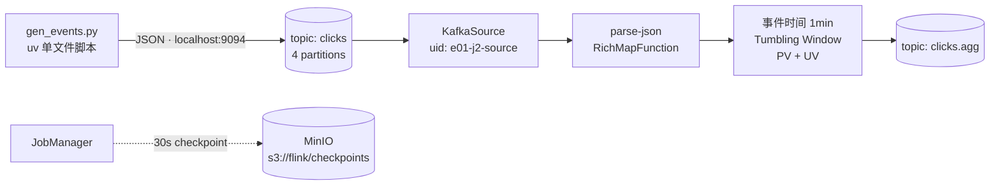
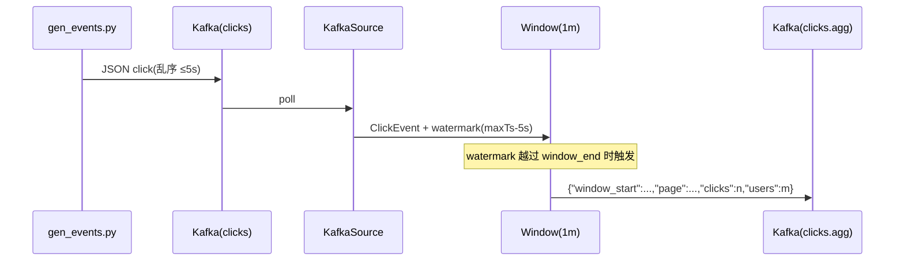

# e01 · Hello Flink:运行时、事件时间与 Kafka 端到端

> 对应教材:docs/01-runtime、docs/02-time-window(入门部分) · 对应 Level:L1
> 本模块 5 个作业:J1 本地事件时间窗口 / J2 Kafka 端到端 PV-UV / J3 纯 SQL 版本

## 1. 背景

任何 Flink 学习工程的第一步都不该是 WordCount,而应该是一条**带事件时间语义、带 checkpoint、进出都是 Kafka 的最小生产链路**——因为这才是你在企业里 Day 1 会接手的东西。本模块用同一个"页面点击统计"需求,分别以 DataStream(J1 本地版 / J2 集群版)和 SQL(J3)实现,建立三个 API 层的对照心智。


## Phase 7 追加案例

| 类 | 主题 |
|---|---|
| ProcessingTimeCountJob | 处理时间滚动窗口计数(对照 J1 事件时间) |
| KeyedRunningStatsJob | 按用户 running min/max/avg |

## 2. 架构



## 3. 流程(J2 时序)



## 4. 启动命令

```bash
# 前置:docker/ 下已 make up && make init
cd examples && mvn -q clean package

# J1(本地,10 秒内跑完)
mvn -q -Plocal compile exec:java -pl e01-hello-flink \
    -Dexec.mainClass=com.flywhl.flinklab.e01.HelloEventTimeWindowJob

# J2(提交到 Docker 集群)
cd ../docker && make submit-e01
uv run ../scripts/gen_events.py --topic clicks --eps 200

# J3(本地 SQL)
cd ../examples && mvn -q -Plocal compile exec:java -pl e01-hello-flink \
    -Dexec.mainClass=com.flywhl.flinklab.e01.SqlDatagenWindowJob
```

## 5. 验证方式与预期输出

- **J1**:控制台输出 3 个窗口,`/home` 在 `[00:00:00~00:00:10)` 窗口内计数 **3**(含乱序回填的 u3 事件)——这就是事件时间语义的意义。
- **J2**:Flink UI(:8081)作业 RUNNING;Kafka UI(:8080)中 `clicks.agg` 每分钟出现一批形如 `{"window_start":...,"page":"/cart","clicks":37,"users":21}` 的消息;Checkpoints 页 30s 一次成功,存储路径为 `s3://flink/checkpoints/...`;MinIO Console 里能看到对应对象。
- **J3**:控制台每 10 秒打印 `+I[2026-07-04T..., 2026-07-04T..., ab, 200, 173]` 形式的窗口结果。

## 6. 源码讲解要点

1. **增量聚合 + 全窗口函数组合**(`aggregate(agg, processWindowFn)`):窗口状态只存累加器而非全部元素,是窗口作业的默认写法;`ProcessWindowFunction` 仅用于贴窗口元数据。
2. **watermark 在解析之后分配**:`fromSource(..., noWatermarks())` + 下游 `assignTimestampsAndWatermarks`,因为时间戳来自业务字段而非 Kafka record timestamp;`withIdleness(30s)` 防止某分区无流量拖死全局 watermark(4 分区默认并行度下必踩的坑)。
3. **每个有状态算子显式 `.uid()`**:savepoint 恢复按 uid 匹配算子,不设 uid 的作业改一行代码就可能丢状态 —— 这是从 Day 1 就要养成的习惯。
4. **Checkpoint 语义 ≠ 端到端语义**:`enableCheckpointing(EXACTLY_ONCE)` 只保证状态一致性;端到端还取决于 Sink 的 `DeliveryGuarantee`(J2 用 AT_LEAST_ONCE,升级路径见代码注释与 docs/07)。
5. **Flink 2.x API 变化点**:`CheckpointingMode` 移到 `org.apache.flink.core.execution`;`RichFunction#open` 参数从 `Configuration` 换成 `OpenContext`;窗口大小用 `java.time.Duration`(`Time` 类已移除);`fromElements` 由 `fromData` 取代。

## 7. 踩坑记录

| 坑 | 现象 | 解法 |
|---|---|---|
| bootstrap 地址混用 | 本地脚本连 `kafka:9092` 报 DNS 失败;作业连 `localhost:9094` 连不上 | 容器内用 `kafka:9092`,宿主机用 `localhost:9094`(见 docker/README 架构图) |
| 窗口不触发 | clicks.agg 一直没数据 | 十有八九是 watermark 没推进:检查 ①生成器在跑吗 ②`--eps` 太低+分区空闲(idleness 已配) ③事件 ts 字段单位是不是毫秒 |
| UV 累加器走 Kryo | 日志出现 generic type 警告 | 教学版接受;生产改 HLL(见代码注释与 e03) |
| 本地 `exec:java` 报 NoClassDefFoundError | Flink 核心是 provided | 忘加 `-Plocal` profile |
| shade 后 jar 提交报 signature 错误 | `SecurityException: Invalid signature` | 父 pom 已统一 exclude `META-INF/*.SF` 等,自建模块别删这段 |

## 8. 最佳实践与延伸

- 窗口作业三件套:**增量聚合、显式 uid、迟到策略**(本例迟到默认丢弃,e02 补全 sideOutput + 死信)。
- 性能基线:该作业在本机 2 TM × 4 slots、`--eps 5000` 下应轻松稳态运行,checkpoint 耗时 <1s;把它作为你环境的"健康基准作业"。
- 面试题(自测):① watermark 在多输入算子上如何合并?② 为什么 `withIdleness` 不能解决"所有分区都没数据"的场景?③ AT_LEAST_ONCE Sink 在故障恢复后会发生什么,下游如何幂等?(答案见 interview/README L1-L2 段)

**参考资料**:Flink 官方文档 Concepts→Timely Stream Processing;DataStream API→Event Time;Connectors→Kafka(语义与事务章节)。
