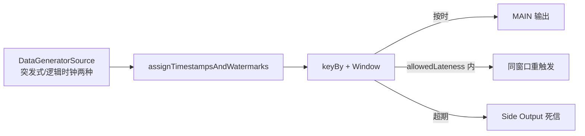

# e02 · 窗口专题(7 案例)

> 对应教材:[docs/02-time-window](../../docs/02-time-window/README.md) · Level:L2
> 案例:C1–C5 既有 + C6 滑动事件时间 / C7 计数批伪窗口(Phase 7)

## 1. 背景

窗口是流处理里"把无界变有界"的唯一手段,而窗口的一切疑难杂症最终都归结为一个问题:**watermark 现在在哪,为什么**。本模块 5 个案例全部围绕这个问题展开,且全部本地可跑(基于 FLIP-27 datagen 源,不依赖 docker)。

## 2. 架构与数据流



## 3. 启动命令(统一模式)

```bash
cd examples
mvn -q -Plocal compile exec:java -pl e02-time-window \
    -Dexec.mainClass=com.flywhl.flinklab.e02.<C1|C2|C3|C4|C5><JobName>
# 类名见 src 目录,如 C1OutOfOrderCompensationJob;Ctrl+C 停止
```

## 4. 各案例验证方式与预期

| 案例 | 观察什么 | 预期现象 |
|---|---|---|
| C1 乱序补偿 | 两个前缀 `[bound=0s]` / `[bound=5s]` 的同窗口计数 | bound=5s 恒 ≥ bound=0s;差值即被丢的迟到数据;bound=5s 的窗口输出晚 5s 出现(延迟换正确性) |
| C2 会话窗口 | `session user=uN [...] events=M` | 每用户周期性产出会话;events≈15(生成器突发长度);沉默 >5s 即切分 |
| C3 迟到三分层 | `MAIN`/`LATE` 前缀 | 同一 window+page 的 MAIN 行出现多次且 count 递增(重触发);LATE 行为超 8s 宽限的弃儿 |
| C4 提前触发 | 同窗口 running-count | 每 ~10s 刷新一次且单调递增,窗口结束出终值;下游语义=幂等覆盖 |
| C5 对齐 | `全局wm落后墙钟≈Ns` | ALIGN=true 时 drift 被压在 ~30s;改 false 重跑,drift 随时间线性扩大(fast 数据在算子里积压) |

## 5. 源码讲解要点

1. **C1**:同一个源可以挂多套 watermark 策略(fan-out 后各自独立)——这也是做"参数对照实验"的标准手法。
2. **C3**:`allowedLateness` 触发的是**同窗口再次输出**,不是修正;下游若是 append-only 存储必须按 `(window_start, key)` 做 upsert,否则重复。`sideOutputLateData` 的 OutputTag 必须用匿名子类保泛型。
3. **C4**:自定义 Trigger 的三条纪律——① 周期定时器的"下次触发时间"存 partitioned state(作业恢复后仍能续上);② `clear()` 必须删掉自己注册的所有 timer,否则窗口销毁后 timer 变"幽灵";③ FIRE 与 FIRE_AND_PURGE 决定下游拿到的是累计还是增量,必须写进接口契约。
4. **C5**:多输入 watermark = min(各输入);`withWatermarkAlignment(组, 最大漂移, 更新周期)` 是 FLIP-182 的源级流控,只对 FLIP-27 源生效。它解决的是"快源撑爆状态",解决不了"慢源本身太慢"。
5. **Flink 2.x 注意**:`SourceFunction` 已移除,本模块的无界源全部走 datagen 连接器(`common/Labs`),这就是 2.x 本地实验的标准姿势。

## 6. 踩坑记录

| 坑 | 现象 | 解法 |
|---|---|---|
| OutputTag 不带 `{}` | 运行期 `InvalidTypesException` | `new OutputTag<Event>("late"){}` 匿名子类固定写法 |
| C4 忘记 clear 定时器 | 长跑后 processing-time timer 堆积、CPU 空转 | `clear()` 对称删除;code review 检查项 |
| C5 关对齐后内存上涨 | fast 分支窗口状态积压 | 正是实验目的;生产上多源速度差 >数量级时必开对齐 |
| 会话窗口"永不关闭" | 某 key 一直有零星流量 | gap 判定基于事件时间间隔;业务上考虑 `ProcessFunction`+超时兜底(e03-C9 同款手法) |
| 本地跑 C1 输出交错难读 | 两分支并发打印 | 已设 parallelism=1;要严格分离可各接独立 sink |

## 7. 最佳实践

- 乱序上界不是拍脑袋:先用 C1 的手法对**真实数据**做迟到分布统计(P99 迟到多少秒),再定 bound 与 allowedLateness 的组合。
- 看板类需求一律"大窗口 + 提前触发"(C4),而不是把窗口切碎到 10s——后者状态碎、下游聚合难。
- 任何多源 union/join 作业上线前,必须回答:"最慢的源慢多少?对齐开不开?"(C5)。

## 8. 面试题与参考资料

自测:① allowedLateness 与乱序上界的职责边界?② Trigger 的 FIRE/PURGE 四种组合各适用什么?③ 对齐把快源"暂停"了,exactly-once 会受影响吗(提示:不会,为什么)?——展开见 [docs/02-time-window](../../docs/02-time-window/README.md) 与 interview/ L1-L2 段。
参考:官方 Concepts→Timely Stream Processing;FLIP-182(Watermark Alignment);DataStream→Windows(Trigger/Evictor 章)。

---

## Wave 2 模块加固 · e02-time-window

### 加固 1

对应教材 `docs/` 同编号模块；列出本模块第 1 个可运行 main 的验证点、uid 纪律与常见失败。交叉 `best-practice/` 与 `interview/` 相关 Level。

### 加固 2

对应教材 `docs/` 同编号模块；列出本模块第 2 个可运行 main 的验证点、uid 纪律与常见失败。交叉 `best-practice/` 与 `interview/` 相关 Level。

### 加固 3

对应教材 `docs/` 同编号模块；列出本模块第 3 个可运行 main 的验证点、uid 纪律与常见失败。交叉 `best-practice/` 与 `interview/` 相关 Level。

### 加固 4

对应教材 `docs/` 同编号模块；列出本模块第 4 个可运行 main 的验证点、uid 纪律与常见失败。交叉 `best-practice/` 与 `interview/` 相关 Level。

### 加固 5

对应教材 `docs/` 同编号模块；列出本模块第 5 个可运行 main 的验证点、uid 纪律与常见失败。交叉 `best-practice/` 与 `interview/` 相关 Level。

### 加固 6

对应教材 `docs/` 同编号模块；列出本模块第 6 个可运行 main 的验证点、uid 纪律与常见失败。交叉 `best-practice/` 与 `interview/` 相关 Level。

### 加固 7

对应教材 `docs/` 同编号模块；列出本模块第 7 个可运行 main 的验证点、uid 纪律与常见失败。交叉 `best-practice/` 与 `interview/` 相关 Level。

### 加固 8

对应教材 `docs/` 同编号模块；列出本模块第 8 个可运行 main 的验证点、uid 纪律与常见失败。交叉 `best-practice/` 与 `interview/` 相关 Level。

### 加固 9

对应教材 `docs/` 同编号模块；列出本模块第 9 个可运行 main 的验证点、uid 纪律与常见失败。交叉 `best-practice/` 与 `interview/` 相关 Level。

