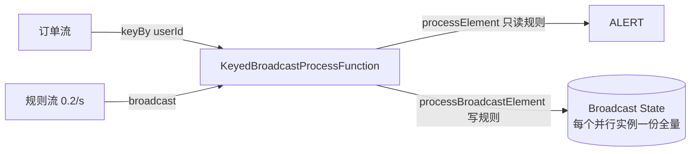

# e03 · 状态专题(10 案例)

> 对应教材:[docs/03-state](../../docs/03-state/README.md) · Level:L3(深水区起点)
> 全部案例本地可跑:`mvn -q -Plocal compile exec:java -pl e03-state -Dexec.mainClass=com.flywhl.flinklab.e03.<类名>`

## 1. 背景

状态是 Flink 与"无状态流转发器"(如裸 Kafka consumer)的分界线,也是一切容错、扩缩容、升级问题的根源。本模块把状态的**类型选择、生命周期、后端行为**拆成 10 个可独立运行的实验。

## 2. 案例矩阵

| # | 类 | 主题 | 关键观察点 |
|---|---|---|---|
| C1 | C1ValueStateBalanceJob | ValueState 累计余额 | 同一 key 恒定落同一 subtask(输出中 subtask 编号不变) |
| C2 | C2ListStateRecentPagesJob | ListState 最近 5 页轨迹 | 截断逻辑自管;大 list 的 RocksDB 全量读代价(见 §5) |
| C3 | C3MapStatePerPageCounterJob | MapState 嵌套维度 | 与 `ValueState<HashMap>` 的本质差:entry 级点读写 |
| C4 | C4AggregatingStateAvgJob | AggregatingState 滚动平均 | 状态里只落累加器;Reducing 是 IN=OUT 特例 |
| C5 | C5OperatorStateBufferingJob | Operator State 攒批 | snapshotState/initializeState 时序;even-split 重分发 |
| C6 | C6StateTtlCacheJob | State TTL 画像缓存 | HIT→(沉默>8s)→MISS 循环;TTL 是处理时间、惰性清理 |
| C7 | C7BroadcastRuleJob | Broadcast 动态规则 | RULE-UPDATED 后 ALERT 阈值即时变化,不重启 |
| C8 | C8SideOutputRouterJob | Side Output 分流+死信 | MAIN/ALERT/DIRTY 三路一次遍历;军规 6 落地 |
| C9 | C9TimerInactivityJob | Timer 超时检测 | IDLE 输出滞后于用户静默 ≈10s+watermark 余量 |
| C10 | C10RocksDbBackendLabJob | RocksDB+增量 ckpt | `du -sh /tmp/flink-lab/e03-ckpt/...`:chk-N 小、shared/ 大 |

## 3. 架构(以 C7 为例,生产最常被问)

## 4. 验证方式

每个案例的 javadoc 首段即验收口径;C10 需第二个终端跑 `watch du`。全部案例 Ctrl+C 可停,checkpoint 目录位于 `/tmp/flink-lab/`(可整体删除)。

## 5. 源码讲解要点(超越 API 的部分)

1. **状态句柄的获取时机**:一律 `open()`;descriptor 可以静态常量(C7),句柄不行(绑定 runtime)。
2. **ListState 的规模红线**:RocksDB 下 `add` 是追加、`get` 反序列化全量。轨迹类需求超过 ~百级元素改 `MapState<index,T>` 环形缓冲,index 用 ValueState 维护 —— C2 的 javadoc 已标注该演进路径。
3. **Operator State 的重分发语义**(C5):even-split 意味着扩容后每个 subtask 拿到原 buffer 的一个子集 —— 对"攒批"无所谓(谁 flush 都行),对"必须整体恢复"的语义(如广播配置)是错的,那是 Broadcast State 的活。
4. **TTL 不是定时器**(C6):容量按"过期后仍占用一段时间"估;需要"到点必删+触发动作"的语义,用 C9 的 Timer 模式。
5. **Broadcast 两入口的纪律**(C7):`processBroadcastElement` 在每个并行实例各执行一次,写入内容**必须确定性一致**(禁止在里面用随机数/本地时钟做值),否则扩缩容后规则分裂 —— 这是 Broadcast State 最隐蔽的坑。
6. **Timer 双保险**(C9):事件时间定时器靠 watermark 驱动,全流静默即停摆;SLA 严格的超时检测叠加处理时间定时器兜底。
7. **增量 checkpoint 的空间账**(C10):`chk-N` 只是清单+新增 SST,`shared/` 才是共享数据体;引用计数决定删除旧 checkpoint 能否真正回收空间。

## 6. 踩坑记录

| 坑 | 现象 | 解法 |
|---|---|---|
| descriptor 每条消息 new | 性能劣化(缓存击穿) | descriptor 常量化/open 中创建一次 |
| `ValueState<HashMap>` | RocksDB 下每次读写全量序列化,状态越大越慢 | 换 MapState(C3 对照) |
| Broadcast 里写非确定值 | 扩容后各实例规则不一致,告警"随机" | 广播内容只来自广播流本身 |
| TTL 后仍 OOM | 误以为到点即删 | 开启 `cleanupFullSnapshot`/增量清理并按驻留时间做容量 |
| Timer 忘删旧的 | 一个 key 多次触发 | 状态里记 timer 时间,先删后注册(C9 模板) |

## 7. 最佳实践

- 状态类型选择口诀:**单值 Value、序列 List(小)、字典 Map、聚合 Agg、非 key 维度 Operator、全实例同份 Broadcast**。
- 每个有状态算子:显式 uid + 在设计文档写明"状态构成、增长趋势、上界论证"(军规 5/11 的工程化)。
- 本模块所有模式在后续复用:C7→e10 动态 CEP 与 ai/17 护栏热更;C9→案例三 DTC 超时告警;C5→自定义 SinkV2 前置知识。

## 8. 面试题与参考资料

自测:① Keyed 与 Operator State 在扩缩容时各如何重分发?② TTL 三种可见性语义差异?③ 为什么 Broadcast State 不支持 keyed 访问?④ 增量 checkpoint 下"删除旧 checkpoint"何时真正释放空间?——展开见 docs/03-state 与 interview/ L3-L4 段。
参考:官方 DataStream→State;State TTL 文档;RocksDB Wiki(MemTable/SST/Compaction);FLIP-428(ForSt 存算分离,docs/03-03 详述)。

---

## Wave 2 模块加固 · e03-state

### 加固 1

对应教材 `docs/` 同编号模块；列出本模块第 1 个可运行 main 的验证点、uid 纪律与常见失败。交叉 `best-practice/` 与 `interview/` 相关 Level。

### 加固 2

对应教材 `docs/` 同编号模块；列出本模块第 2 个可运行 main 的验证点、uid 纪律与常见失败。交叉 `best-practice/` 与 `interview/` 相关 Level。

### 加固 3

对应教材 `docs/` 同编号模块；列出本模块第 3 个可运行 main 的验证点、uid 纪律与常见失败。交叉 `best-practice/` 与 `interview/` 相关 Level。

### 加固 4

对应教材 `docs/` 同编号模块；列出本模块第 4 个可运行 main 的验证点、uid 纪律与常见失败。交叉 `best-practice/` 与 `interview/` 相关 Level。

### 加固 5

对应教材 `docs/` 同编号模块；列出本模块第 5 个可运行 main 的验证点、uid 纪律与常见失败。交叉 `best-practice/` 与 `interview/` 相关 Level。

### 加固 6

对应教材 `docs/` 同编号模块；列出本模块第 6 个可运行 main 的验证点、uid 纪律与常见失败。交叉 `best-practice/` 与 `interview/` 相关 Level。

### 加固 7

对应教材 `docs/` 同编号模块；列出本模块第 7 个可运行 main 的验证点、uid 纪律与常见失败。交叉 `best-practice/` 与 `interview/` 相关 Level。

### 加固 8

对应教材 `docs/` 同编号模块；列出本模块第 8 个可运行 main 的验证点、uid 纪律与常见失败。交叉 `best-practice/` 与 `interview/` 相关 Level。

### 加固 9

对应教材 `docs/` 同编号模块；列出本模块第 9 个可运行 main 的验证点、uid 纪律与常见失败。交叉 `best-practice/` 与 `interview/` 相关 Level。

