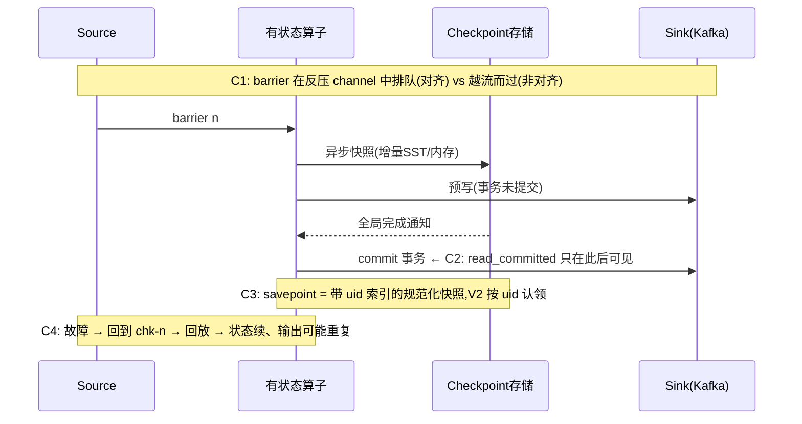

# e04 · Checkpoint / Savepoint 专题(6 案例)

> 对应教材:[docs/04-checkpoint](../../docs/04-checkpoint/README.md) · Level:L3
> C1–C4 既有 + C5 checkpointed 计数 / C6 uid 契约演示(Phase 7)

## 1. 背景

容错是 Flink 的招牌,也是最多"以为懂了"的领域。本模块用四个实验把四个关键论断变成亲眼所见:① 反压会拖垮对齐 checkpoint,非对齐用存储换时效;② 状态一致 ≠ 输出一致,端到端要靠 Sink 事务;③ 升级不丢状态的全部秘密是 uid + 状态名契约;④ 恢复 = 回到最近 checkpoint 并**回放**其后的数据。

## 2. 实验总图

## 3. 启动与验证

| 案例 | 命令 | 验证口径 |
|---|---|---|
| C1 | `mvn -q -Plocal compile exec:java -pl e04-checkpoint -Dexec.mainClass=...C1AlignedVsUnalignedJob`(第二轮加 `-Dexec.args="--unaligned"`) | WebUI :8082 → Checkpoints:对齐轮 E2E Duration 明显更长;非对齐轮 Duration 回落、Checkpointed Data Size 变大 |
| C2 | javadoc 中的完整集群命令序列 | read_committed 消费端输出按 30s 节拍成批出现;read_uncommitted 连续流出 —— 事务边界肉眼可见 |
| C3 | javadoc 中的 stop→run -s 序列 | V2 输出 `v2 user=... total=N` 中 N 延续 V1 的值;把 uid 改掉重试恢复失败,即反向验证 |
| C4 | `... -Dexec.mainClass=...C4RestartRecoveryChaosJob` | 输出中 `state-cnt` 跨 attempt 延续、`local` 每次归零;WebUI :8083 可见重启与退避间隔;print 端少量重复行为预期(见 §5.3) |

## 4. 源码讲解要点

1. **C1 的 rebalance 不是装饰**:barrier 对齐只发生在多输入 channel 汇聚处;全链 chain 在一起的作业没有对齐问题(也观察不到差异)。
2. **C2 的超时不等式**是 2PC 的生死线:`checkpoint 间隔 < transaction.timeout.ms ≤ broker transaction.max.timeout.ms`。事务的生命周期必须覆盖"本轮 checkpoint 完成 + 可能的故障恢复",否则 broker 主动 abort,预写数据蒸发 —— 这是 Kafka exactly-once 最著名的静默丢数事故,军规 2 的出处。
3. **C4 揭示的语义分层**:checkpoint 保证的是"状态视角的 exactly-once"(state-cnt 不多不少);输出端 print 无事务,回放段产生重复 —— 把 C4 的 print 换成 C2 的事务 Kafka Sink,重复即消失。这两个实验合起来就是"端到端一致性"的完整论证。
4. **C3 的升级契约**:savepoint 按 `uid → 状态名` 二级索引恢复;V2 改逻辑、加无状态算子都自由,唯独契约字段不可动。删除有状态算子需 `--allowNonRestoredState` 显式弃状态。

## 5. 踩坑记录

| 坑 | 现象 | 解法 |
|---|---|---|
| transactionalIdPrefix 撞名 | 新旧作业互相 fence,`ProducerFencedException` | prefix 纳入命名规范:`<系统>-<作业>-<环境>` |
| 事务超时 < checkpoint 间隔 | 低流量时段静默丢数 | 军规 2;上线检查单硬卡 |
| 非对齐当默认开 | checkpoint 体积暴涨、恢复变慢 | 只在反压常态化的作业开;先治反压 |
| stop 用成 cancel | 无 savepoint,回滚只能退到 checkpoint(若未外部化则全丢) | 发布 SOP 固定 `stop --savepointPath` |
| C4 本地重跑发现"续上了上次实验" | file:// checkpoint 目录残留 | 实验间 `rm -rf /tmp/flink-lab/e04-*` |

## 6. 最佳实践

- 每个生产作业的《容错档案》四要素:checkpoint 间隔与超时、backend 与增量开关、Sink 语义等级与依据、savepoint 留存策略 —— 模板将随 templates/job-datastream 交付。
- 演练制度化:C3(升级)与 C4(故障)就是季度演练脚本的雏形,案例一~三会内置演练剧本。

## 7. 面试题

① 对齐 checkpoint 在反压下慢在哪一段(sync/async/alignment)?② 非对齐 checkpoint 为什么恢复更慢?③ 2PC 的 pre-commit 发生在什么时刻、commit 又在什么时刻?④ savepoint 与 retained checkpoint 各自适合什么恢复场景?——展开见 docs/04-checkpoint 与 interview/ L3-L4 段。

## 8. 参考资料

官方 Ops→State & Fault Tolerance(Checkpointing / Savepoints / Unaligned Checkpoints);Kafka connector 文档 Fault Tolerance 章;FLIP-76(Unaligned Checkpoint)。

---

## Wave 2 模块加固 · e04-checkpoint

### 加固 1

对应教材 `docs/` 同编号模块；列出本模块第 1 个可运行 main 的验证点、uid 纪律与常见失败。交叉 `best-practice/` 与 `interview/` 相关 Level。

### 加固 2

对应教材 `docs/` 同编号模块；列出本模块第 2 个可运行 main 的验证点、uid 纪律与常见失败。交叉 `best-practice/` 与 `interview/` 相关 Level。

### 加固 3

对应教材 `docs/` 同编号模块；列出本模块第 3 个可运行 main 的验证点、uid 纪律与常见失败。交叉 `best-practice/` 与 `interview/` 相关 Level。

### 加固 4

对应教材 `docs/` 同编号模块；列出本模块第 4 个可运行 main 的验证点、uid 纪律与常见失败。交叉 `best-practice/` 与 `interview/` 相关 Level。

### 加固 5

对应教材 `docs/` 同编号模块；列出本模块第 5 个可运行 main 的验证点、uid 纪律与常见失败。交叉 `best-practice/` 与 `interview/` 相关 Level。

### 加固 6

对应教材 `docs/` 同编号模块；列出本模块第 6 个可运行 main 的验证点、uid 纪律与常见失败。交叉 `best-practice/` 与 `interview/` 相关 Level。

### 加固 7

对应教材 `docs/` 同编号模块；列出本模块第 7 个可运行 main 的验证点、uid 纪律与常见失败。交叉 `best-practice/` 与 `interview/` 相关 Level。

### 加固 8

对应教材 `docs/` 同编号模块；列出本模块第 8 个可运行 main 的验证点、uid 纪律与常见失败。交叉 `best-practice/` 与 `interview/` 相关 Level。

### 加固 9

对应教材 `docs/` 同编号模块；列出本模块第 9 个可运行 main 的验证点、uid 纪律与常见失败。交叉 `best-practice/` 与 `interview/` 相关 Level。

