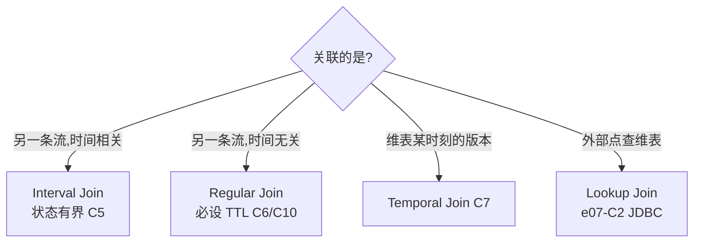

# e05 · Flink SQL 专题(10 案例)

> 对应教材:[docs/05-sql](../../docs/05-sql/README.md) · Level:L4
> 全部本地可跑:`mvn -q -Plocal compile exec:java -pl e05-sql -Dexec.mainClass=com.flywhl.flinklab.e05.<类名>`;同款 SQL 可整段贴进 SQL Client(`make sql`)。

## 1. 背景

企业 70% 的流处理需求应优先用 SQL 承载(L4 核心论点)。本模块按"语义地基 → 窗口 → 排序去重 → Join 家族 → 优化与可解释性"的顺序给出 10 个最小闭环。

## 2. 案例矩阵与预期

| # | 类 | 主题 | 关键观察 |
|---|---|---|---|
| C1 | C1ChangelogBasicsJob | changelog 地基 | op 列 +I 与 -U/+U 交替,理解回撤即理解一切 |
| C2 | C2WindowTvfTrioJob | TUMBLE/HOP/CUMULATE | 三种节奏并行输出;HOP 输出量 ×(size/slide);StatementSet 单作业多 insert |
| C3 | C3TopNJob | Top-N | 榜单变化时 -U/+U 成对;窗口 Top-N 才是仅追加形态 |
| C4 | C4DedupLatestJob | 去重 rn=1 | keep-last(回撤)vs keep-first(可仅追加) |
| C5 | C5IntervalJoinJob | Interval Join | 时间带 ⇒ 状态可清理,长跑内存平稳 |
| C6 | C6RegularJoinTtlJob | Regular Join + TTL | 双侧状态默认永存;TTL=1min 的正确性代价要评审 |
| C7 | C7TemporalJoinJob | Temporal Join | FOR SYSTEM_TIME AS OF:按事发时刻的版本关联,可复现 |
| C8 | C8MiniBatchLocalGlobalJob | 聚合优化 | EXPLAIN 出现 Local/GlobalGroupAggregate 两级 |
| C9 | C9UdfJob | UDF/UDTF | 注解式类型;LATERAL TABLE 炸裂;UDF 禁外呼 |
| C10 | C10ExplainAndHintsJob | EXPLAIN/Hints | OPTIONS 查询级覆盖;STATE_TTL 按表设 TTL |

## 3. Join 家族选型图(本模块的主线)

## 4. 启动与验证

各案例 javadoc 首段即验收口径;C8/C10 先看控制台的 EXPLAIN 再看数据流。全部 Ctrl+C 停止。

## 5. 源码讲解要点

1. **回撤是常态不是异常**(C1/C3/C4):下游是 append-only 存储(Kafka 普通 topic、日志文件)就必须消灭回撤 —— 换窗口化写法、或 upsert-kafka(e07-C8)、或下游幂等表。
2. **StatementSet**(C2):多条 INSERT 共享源与优化,一次提交成单作业 —— 平台化提交的标准形态。
3. **TTL 的三层粒度**(C6/C10):全局 `table.exec.state.ttl` < 查询级 STATE_TTL hint < 语义自带清理(Interval/窗口)。能用语义清理就别靠 TTL。
4. **Temporal vs Lookup**(C7):Temporal 关联"历史版本"(可复现、走状态);Lookup 关联"当下值"(点查外部、不可复现)。两者常被混用,面试与评审高频。
5. **UDF 纪律**(C9):无状态、确定性、禁外呼;需要外部数据 → Lookup Join 或 Async I/O。

## 6. 踩坑记录

| 坑 | 现象 | 解法 |
|---|---|---|
| Top-N 写进普通 Kafka topic | 下游读到成对 -U/+U"重复" | 窗口 Top-N / upsert-kafka / 幂等 |
| Regular Join 不设 TTL | 状态无限涨,数周后 checkpoint 超时 | C6/C10 两种设法;军规 11 |
| rn 条件写成 `rn = 2` | planner 不识别为 Top-N,退化全排序 | 固定形态 `rn <= N`(或 =1 去重) |
| 版本视图少了事件时间/主键语义 | Temporal Join 报不支持 | 去重视图必须 ORDER BY 事件时间且 PARTITION BY 即主键 |
| datagen 字段想要枚举值 | datagen 只有随机/序列 | 计算列 + CASE/CONCAT 映射(C7/C9 手法) |

## 7. 最佳实践

- SQL 作业上线三件套:EXPLAIN 存档、TTL 声明与论证、回撤去向说明(templates/job-sql 模板字段)。
- 大屏累计一律 CUMULATE,不用 HOP 模拟(C2)。

## 8. 面试题与参考资料

interview/README 16~20 全部对应本模块;进阶:*同一去重需求 keep-first 与 keep-last 的状态与输出形态差异?* 参考:官方 Table/SQL→Queries(Window TVF/Joins/Top-N/Deduplication)、Performance Tuning(mini-batch/two-phase)、Hints。
