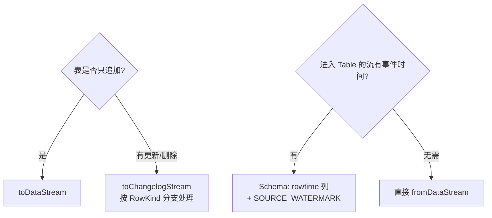

# e06 · Table API 与 DataStream 桥接(8 案例)

> 对应教材:[docs/06-table-api](../../docs/06-table-api/README.md) · Level:L4
> 运行:`mvn -q -Plocal compile exec:java -pl e06-table-api -Dexec.mainClass=com.flywhl.flinklab.e06.<类名>`

## 1. 背景与案例矩阵

Table API 的价值不在"替代 SQL",而在**可编排**(平台动态拼装逻辑防注入)与**桥接**(与 DataStream 双向穿梭而时间语义不断链)。

| # | 类 | 主题 | 关键观察 |
|---|---|---|---|
| C1 | C1FromDataStreamJob | DataStream→Table 带事件时间 | TO_TIMESTAMP_LTZ + SOURCE_WATERMARK(),窗口正常触发 |
| C2 | C2ToChangelogStreamJob | Table→ChangelogStream | row.getKind() 得 +I/-U/+U;更新表禁用 toDataStream |
| C3 | C3ExpressionDslJob | 表达式 DSL 窗口聚合 | 与 e05-C2 同计划;列名错=编译期失败 |
| C4 | C4MixedSqlTableJob | SQL/Table 混编 | 视图互引用,优化器统一打平,无性能税 |
| C5 | C5RowAndDataTypesJob | fromChangelogStream | 手工 -U/+U 被当真实更新:balance=250 而非 350 |
| C6 | C6CatalogApiJob | Catalog 编程接口 | 三级命名空间;平台元数据服务原型 |
| C7 | C7CallFunctionJob | call() 调 UDF | SQL/Table 共享同一函数栈 |
| C8 | C8BridgeRoundTripJob | 往返桥接 | SQL 窗口后回 DataStream,下游 wm 仍推进 |

## 2. 桥接决策图

## 3~5. 验证 / 讲解 / 踩坑(合并要点)

- **时间断链**是桥接第一事故:C1/C8 的 Schema 两行是标准药方;症状=Table 侧窗口不触发或回流后 wm 恒为 MIN。
- **出口选错**是第二事故:更新表走 toDataStream 直接抛 `doesn't support consuming update changes`;按 C2 分支。
- fromChangelogStream(C5)是自定义 changelog 源(内部 binlog 网关/自研格式)接入 SQL 的钥匙;主键可在 Schema 里声明以启用 upsert 语义。
- Catalog(C6):`useCatalog/useDatabase` 影响后续未限定名解析;平台代码永远用全限定名 `catalog.db.table` 防串环境。
- DSL(C3/C7)适合动态拼装;人读的业务逻辑仍首选 SQL 文本(可评审)。

## 6~8. 最佳实践 / 面试题 / 参考

实践:桥接点(from/to)必须显式注释时间与 changelog 语义,作为 code review 检查项。
面试:① toDataStream 与 toChangelogStream 的选择依据?② SOURCE_WATERMARK() 与在 Schema 里重新声明 watermark 表达式的差异?③ 混编会引入 shuffle 或性能损耗吗?
参考:官方 Table API & SQL→DataStream API 集成(fromDataStream/toChangelogStream 全节)、Catalogs。
