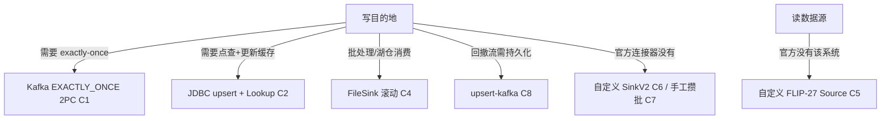

# e07 · 连接器与自定义 Source/Sink(8 案例)

> 对应教材:[docs/07-connectors](../../docs/07-connectors/README.md) · Level:L5
> C1/C3~C8 需集群(Kafka/PG/ClickHouse/Redis/MinIO,见各 javadoc 提交命令);C2/C8 为纯 SQL,C5 本地可跑。

## 1. 背景与案例矩阵

连接器是 Flink 与外部世界的边界,也是"投递语义、状态代价、可运维性"三类事故的高发地。本模块从"用好官方连接器"(C1-C4/C8)推进到"自己写一个"(C5/C6),再补齐"手工攒批写非连接器系统"(C7)。

| # | 类 | 主题 | 关键观察 |
|---|---|---|---|
| C1 | C1KafkaDeliveryMatrixJob | Kafka 三级语义 | `--mode` 切换 + kill TM 实验,亲手数丢/重 |
| C2 | C2JdbcPostgresJob | JDBC upsert + Lookup Join | 主键声明⇒INSERT..ON CONFLICT;lookup.cache 与更新可见性 |
| C3 | C3KafkaKeyHeaderPartitionJob | key/headers/自定义分区器 | key 稳定落分区;headers 携带 trace-id |
| C4 | C4FileSinkRollingPolicyJob | FileSink→MinIO 滚动策略 | 大小/时间/不活跃三闸门任一触发滚动 |
| C5 | C5CustomFlip27SourceJob | 自定义 FLIP-27 Source | 四部件解剖:Split/Enumerator/Reader/Source 装配 |
| C6 | C6ClickHouseHttpSinkJob | 自定义 SinkV2 | flush(boolean) 与 checkpoint 的关系;at-least-once |
| C7 | C7RedisBatchWriteJob | jedis Pipeline 攒批 | e03-C5 模式的生产复刻;pipeline 省网络往返 |
| C8 | C8UpsertKafkaJob | upsert-kafka | 回撤流安全落 Kafka;-D→墓碑消息;e08 CDC 中间层同构 |

## 2. 语义与选型全景

## 3. 验证方式

C1/C3/C4/C6/C7 需要 `mvn clean package` 后 `cp` 到 `docker/jobs/` 并 `flink run` 提交;各 javadoc 首段给出完整前置 SQL/命令。C2/C5/C8 可本地跑(C2/C8 用 `mvn -q -Plocal compile exec:java`,注意 C2 需要 PG 可达,若无集群仅看 SQL 结构)。

## 4~6. 源码讲解 / 踩坑 / 实践(合并要点)

1. **投递语义没有免费午餐**(C1):EXACTLY_ONCE 用可见性延迟(≈checkpoint 间隔)换正确性;NONE 只配"丢一条无所谓"的指标流。
2. **JDBC 的两副面孔**(C2):做 Sink 时看主键(有=upsert,无=append insert,大流量下几乎必错);做 Source 时几乎总是 Lookup Join,只在小维表/低频点查时用,量大改 Broadcast(e03-C7)。
3. **FileSink 依赖 checkpoint**(C4):part 文件从 in-progress→pending→finished 三态跃迁,finished 恰在 checkpoint 完成时刻——不开 checkpoint 的作业文件永远停在 pending,下游批处理读不到。
4. **自定义 Source 的核心心智**(C5):Enumerator 是"pull 模型"的账房(reader 来要才给),Reader 是"框架牵引"而非"自己起循环"——这两点决定了背压与 checkpoint 天然自洽,不用像老 SourceFunction 时代手写限流。
5. **SinkV2 的语义台阶**(C6):`Sink`(至多 at-least-once)→ `TwoPhaseCommittingSink`(可 exactly-once,Kafka Sink 内部即此实现)→ `SupportsCommitter`(带外部提交协调)。选台阶前先回答"这个下游允许重复吗"。
6. **攒批写非连接器系统**(C7)与自定义 Sink(C6)的分界:量小、逻辑简单、不想抽象成连接器 → 直接在 RichFunction 里实现 CheckpointedFunction(C7);要复用、要更强语义保证 → 走 SinkV2(C6)。
7. **upsert-kafka 是承前启后的桥**(C8):e05 的回撤流问题在这里第一次给出"落地"方案,e08 的 CDC 数据也会流经同款 upsert 语义。

## 7. 面试题

① EXACTLY_ONCE 的可见性延迟从何而来?② Lookup Join 缓存过期后请求打到 DB,如何防止缓存击穿(提示:请求合并/singleflight)?③ upsert-kafka 的 -D 语义与普通 kafka sink 有什么本质不同?④ 自定义 Source 如何保证"恰好一次"分片分配(提示:pull 模型+ addSplitsBack)?

## 8. 参考资料

官方 Connectors 全章(Kafka/JDBC/FileSystem/upsert-kafka);DataStream API→User-defined Sources & Sinks(FLIP-27/SinkV2);e07 源码。
