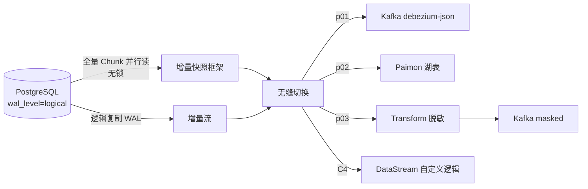

# e08 · Flink CDC 整库同步(YAML×3 + DataStream×4)

> 对应教材:[docs/08-cdc](../../docs/08-cdc/README.md) · Level:L5
> p01~p03 是 YAML Pipeline(需 Flink CDC CLI,随发行版单独下载);C4 是 DataStream 编程接口(`mvn -q -Plocal compile exec:java -pl e08-cdc -Dexec.mainClass=com.flywhl.flinklab.e08.C4PostgresCdcDataStreamJob`)。全部需先执行 `sql/pg-init.sql`。

## 1. 背景

Flink CDC 3.x 最大的心智转变:从"写一个 DataStream 作业消费某张表的 binlog"升级为"用一份 YAML 声明整个库的同步策略",Schema 变更、多表路由、全量+增量切换均由引擎接管。

## 2. 案例矩阵

| # | 文件 | 主题 | 关键观察 |
|---|---|---|---|
| p01 | pipelines/p01-pg-to-kafka.yaml | 整库→Kafka | 两表路由到两个 topic,debezium-json 保留 before/after |
| p02 | pipelines/p02-pg-to-paimon.yaml | 整库→Paimon 湖表 | 免手工建表,自动 upsert;为 e09 做铺垫 |
| p03 | pipelines/p03-transform-route.yaml | 声明式脱敏+分流 | YAML transform 块=免编译版 UDF 脱敏 + Side Output |
| C4 | C4PostgresCdcDataStreamJob.java | DataStream 编程接口 | 与 p01 同源不同壳;增量快照框架无锁读全量 |
| C5 | C5ChangelogReplaySimulatorJob.java | changelog 语义模拟(零 PG) | INSERT/UPDATE 前缀 |
| C6 | C6SoftDeleteTombstoneJob.java | 软删除 tombstone | amount 低阈触发 -D |
| C7 | C7PrimaryKeyCompactionJob.java | 主键压缩 flush | BUFFER→FLUSH |

## 3. 前置(一次性)

```bash
docker compose exec postgres psql -U flinklab -d flinklab -f /path/to/e08-cdc/sql/pg-init.sql
```
该脚本建表、设 `REPLICA IDENTITY FULL`、建 `flink_cdc_pub` 发布,并灌入 100 条初始数据。

## 4. 整体架构



## 5. 源码/配置讲解要点

1. **增量快照框架**(C4 javadoc 展开)是 Flink CDC 相对原生 Debezium 的核心改进:把全量导出切成可并行、可 checkpoint 的 chunk,不需要对源表加全局锁,这解决了传统方案"全量导出期间锁表"的生产大忌。
2. **REPLICA IDENTITY FULL**(sql/pg-init.sql):没有它,UPDATE/DELETE 的 WAL 记录只含主键,before 镜像里业务列全为 null——下游审计/对账会发现"更新前的值"缺失。
3. **route 块**(p01/p02/p03)是多表到多目标的映射层,一份 YAML 管住整库,不必为每张表写一个作业。
4. **transform 块**(p03)把 e05-C9 的 UDF 脱敏与 e03-C8 的分流,平移成运维可读的声明式配置——治理规则变更不再需要开发介入重新编译部署。
5. **value.format=debezium-json**(p01):保留 before/after/op 三元组,这是下游做"变更历史回放/审计"的关键;若只需要"当前最新值",e07-C8 的 upsert-kafka 格式更省流量。

## 6. 踩坑记录

| 坑 | 现象 | 解法 |
|---|---|---|
| 忘记 REPLICA IDENTITY FULL | UPDATE 事件 before 镜像大量 null | sql/pg-init.sql 已固化;新增表务必同步执行 |
| slot.name 跨作业复用 | 新作业启动时旧 slot 被占用报错 | 每个 pipeline/作业使用独立 slot 名(本模块 p01/p02/p03/C4 均不同) |
| Publication 未包含新增表 | 该表变更不会被捕获,且无报错(静默) | ALTER PUBLICATION ... ADD TABLE,新增表清单要走变更流程 |
| YAML Pipeline 与 flink run 混淆 | 用 flink run 提交 YAML 报错 | YAML 走独立的 `flink-cdc.sh` CLI,不是 Flink 主程序的 run 命令 |

## 7. 最佳实践

- 每条 CDC 链路登记「源库/表清单/slot 名/下游格式/脱敏规则」五元组,变更须走审批(数据安全红线)。
- 全量阶段的 chunk 并行度与源库当前负载挂钩,大表首次接入建议在低峰期启动。

## 8. 面试题与参考资料

① 增量快照框架如何避免全量导出期间锁表?② REPLICA IDENTITY 的四种模式分别提供什么信息量?③ upsert-kafka 与 debezium-json 两种落地格式的选择依据?
参考:官方 Flink CDC 3.x 文档(YAML Pipeline / Postgres CDC Connector);PostgreSQL Logical Replication 文档;e08 源码与 YAML。

---

## Wave 2 模块加固 · e08-cdc

### 加固 1

对应教材 `docs/` 同编号模块；列出本模块第 1 个可运行 main 的验证点、uid 纪律与常见失败。交叉 `best-practice/` 与 `interview/` 相关 Level。

### 加固 2

对应教材 `docs/` 同编号模块；列出本模块第 2 个可运行 main 的验证点、uid 纪律与常见失败。交叉 `best-practice/` 与 `interview/` 相关 Level。

### 加固 3

对应教材 `docs/` 同编号模块；列出本模块第 3 个可运行 main 的验证点、uid 纪律与常见失败。交叉 `best-practice/` 与 `interview/` 相关 Level。

### 加固 4

对应教材 `docs/` 同编号模块；列出本模块第 4 个可运行 main 的验证点、uid 纪律与常见失败。交叉 `best-practice/` 与 `interview/` 相关 Level。

### 加固 5

对应教材 `docs/` 同编号模块；列出本模块第 5 个可运行 main 的验证点、uid 纪律与常见失败。交叉 `best-practice/` 与 `interview/` 相关 Level。

### 加固 6

对应教材 `docs/` 同编号模块；列出本模块第 6 个可运行 main 的验证点、uid 纪律与常见失败。交叉 `best-practice/` 与 `interview/` 相关 Level。

### 加固 7

对应教材 `docs/` 同编号模块；列出本模块第 7 个可运行 main 的验证点、uid 纪律与常见失败。交叉 `best-practice/` 与 `interview/` 相关 Level。

### 加固 8

对应教材 `docs/` 同编号模块；列出本模块第 8 个可运行 main 的验证点、uid 纪律与常见失败。交叉 `best-practice/` 与 `interview/` 相关 Level。

### 加固 9

对应教材 `docs/` 同编号模块；列出本模块第 9 个可运行 main 的验证点、uid 纪律与常见失败。交叉 `best-practice/` 与 `interview/` 相关 Level。

